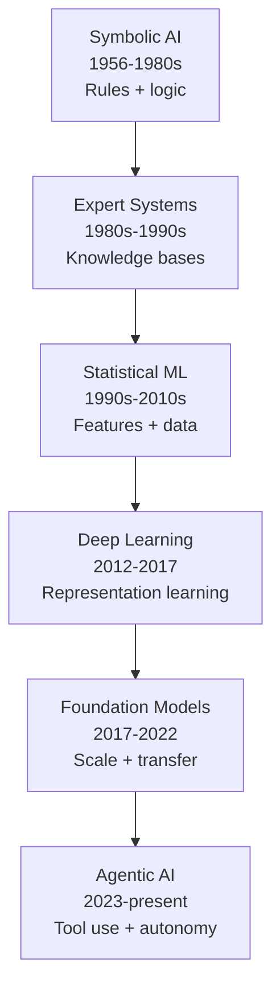

## The Evolution of Artificial Intelligence

> Chapter of [[ai-foundations/readme#00 — Foundations of Modern AI|Foundations of Modern AI]], part
> of [[ai-foundations/readme|AI & LLM Foundations]].

## What you will understand at the end

- Why AI progress has moved in eras, each defined by a different bottleneck (knowledge authoring,
  feature engineering, compute + data), not a single continuous improvement curve
- Why symbolic AI's failure mode (the knowledge acquisition bottleneck) is structurally different
  from deep learning's failure mode (data and compute hunger), and why that distinction still shows
  up in how agent systems fail today
- Why agentic AI is a **capability threshold crossed**, not a new research field — and what that
  implies for how durable the skills in this book are

---

## The four eras, at a glance



Each transition happened because the previous paradigm hit a wall that more of the same approach
could not push through. That pattern — wall, then paradigm shift, not smooth improvement — is the
single most useful fact in this chapter, because it is also how to read where agentic AI itself is
headed.

---

## Era 1 — Symbolic AI (1956–1980s)

The founding bet of AI, formalized at the 1956 Dartmouth workshop, was that intelligence is **symbol
manipulation**: represent knowledge as logical statements, and reason over them with explicit rules.
This produced real results — theorem provers, the General Problem Solver, early natural language
systems like SHRDLU that could reason about a simplified blocks world with genuine logical rigor.

**The bottleneck:** every piece of knowledge had to be hand-authored as a rule by a human expert.
This is the **knowledge acquisition bottleneck**, and it doesn't scale — the real world has too much
implicit, fuzzy, exception-laden knowledge to encode as clean logical statements. A system that
reasons perfectly over 500 hand-coded rules still cannot recognize a cat in a photo, because
"cat-ness" was never something anyone could write down as a rule set.

This bottleneck had a direct funding consequence. The 1973 Lighthill Report in the UK concluded that
symbolic AI's grand promises hadn't materialized outside toy domains, and DARPA sharply cut US AI
research funding through the mid-to-late 1970s once machine translation and general problem-solving
failed to deliver. This is the **first AI winter** (~1974–1980) — worth naming precisely, because
it's often conflated with a second, later collapse (Era 2, below) that had a different proximate
cause.

## Era 2 — Expert Systems (1980s–1990s)

Expert systems (MYCIN for medical diagnosis, XCON for computer configuration) tried to industrialize
symbolic AI by separating a **knowledge base** (facts + rules elicited from domain experts) from an
**inference engine** (a generic reasoning loop that applied those rules). This was a genuine
engineering advance — it made rule-based reasoning reusable across domains — and it briefly created
a real commercial AI industry.

**The bottleneck was the same one, just relabeled:** knowledge engineers still had to manually
interview experts and encode their judgment as rules, and those rules were brittle outside the
narrow slice of the world they were written for. This mismatch between investment and generality,
compounded by the collapse of the specialized Lisp-machine hardware market once cheaper general-
purpose workstations matched their performance, is what caused the **second AI winter** (~1987–1993)
— the field had, for the second time, over-promised on a paradigm that could not generalize past its
authored rules.

## Era 3 — Statistical Machine Learning (1990s–2010s)

The paradigm shift here was profound: instead of hand-coding rules, **learn a function from labeled
data**. Support vector machines, decision trees/random forests, and hidden Markov models turned
"what should the system do" from an authoring problem into an optimization problem. This is the era
that made statistical spam filtering, early recommendation systems, and speech recognition
practical.

**The bottleneck:** performance was gated by **feature engineering** — a human still had to decide
which properties of the raw input (word frequencies, pixel edges, phoneme boundaries) the model was
allowed to look at. A brilliant model over badly-chosen features underperforms a mediocre model over
well-chosen ones, so most of the actual engineering effort went into feature design, not modeling.
See [[02-machine-learning-fundamentals|Machine Learning Fundamentals]] for the
supervised/unsupervised/RL framing and the bias-variance tradeoff this era formalized.

## Era 4 — Deep Learning (2012–2017)

The 2012 ImageNet result (AlexNet, a convolutional neural network, cutting top-5 error from ~26% to
~15%) was the trigger, not the whole story — the ingredients (backpropagation, convolutional
architectures) had existed since the 1980s–1990s. What changed was that GPUs made large networks
trainable in practical time, and internet-scale labeled datasets (ImageNet itself) finally existed
to train them on.

**The paradigm shift:** deep networks learn their own features directly from raw data —
**representation learning** replaced feature engineering. A convolutional network discovers edge
detectors, then textures, then object parts, then whole objects, as successive layers, without a
human ever specifying what an "edge" is. See
[[03-deep-learning-essentials|Deep Learning Essentials]] for the layer/activation/backprop/optimizer
mechanics that make this possible.

**The bottleneck:** deep learning is extremely data- and compute-hungry, and every model was still
trained from scratch for one task — a translation model couldn't answer questions, and vice versa.
There was no transfer.

## Era 5 — The Transformer and Foundation Models (2017–2022)

Two things landed close together and compounded. First, "Attention Is All You Need" (Vaswani et
al., 2017) introduced the **transformer** — an architecture built entirely on attention, with no
recurrence, that parallelizes across the full sequence length instead of processing tokens one at a
time. See [[04-transformer-architecture|Transformer Architecture]] for the mechanics. Second,
empirical **scaling laws** (Kaplan et al., 2020; Hoffmann et al., 2022 — "Chinchilla") showed that
loss decreases as a smooth, predictable power law in model size, data size, and compute, with no
wall in sight at the scales tested.

**The scaling laws are precise enough to write down and use as a design constraint.** Training
compute for a dense transformer is well-approximated by:

```
C ≈ 6 · N · D
```

where `N` is parameter count, `D` is training tokens, and `C` is total training FLOPs — roughly `2N`
FLOPs per token for the forward pass plus `4N` for the backward pass, summed over `D` tokens (see
[[03-deep-learning-essentials#FLOPs and memory — what a forward and backward pass actually cost|Deep Learning Essentials]]
for where that `2N`/`4N` split comes from). This formula is what let Hoffmann et al. run a genuinely
controlled experiment: hold `C` fixed and ask what split of `N` and `D` minimizes loss, instead of
just "make the model bigger." Their answer overturned the field's default assumption. DeepMind's
Gopher (280B parameters, ~300B training tokens) and its follow-up Chinchilla (70B parameters, ~1.4T
training tokens) were trained at approximately the same compute budget — `C ≈ 5.76×10²³` FLOPs for
both — yet Chinchilla, a 4x-_smaller_ model trained on 4.7x _more_ tokens, beat Gopher on every
downstream benchmark reported. GPT-3 (175B parameters, ~300B tokens, ≈1.7 tokens/parameter) sat even
further from compute-optimal than Gopher. The ratio Hoffmann et al. derived as compute-optimal is
close to **20 training tokens per parameter** — meaning most of the field's headline 2020–2022
models were, in retrospect, undertrained for their parameter count rather than correctly scaled.


The shape is the real finding, not the specific numbers: loss doesn't fall in jumps, it falls as a
smooth curve that flattens toward an irreducible floor (roughly the entropy of natural language
itself, which no amount of compute removes). At a _given_ compute budget, where that curve sits
depends on the `N`/`D` split — the chart's two curves are why Gopher and Chinchilla, trained on the
same compute, land on visibly different points. This same smooth-loss-curve finding has an
easy-to-miss subtlety: loss can improve smoothly while task-level _capability_ appears to jump
discontinuously — see
[[07-foundation-models#Emergent capabilities — why scale surprises you|Foundation Models]] for why
that's often a measurement artifact of how "capability" gets scored, not a break in the underlying
scaling law.

Compute at each era's characteristic scale makes the "wall" concrete rather than asserted:

| Era               | Typical compute at the time                                                                                                                |
| ----------------- | ------------------------------------------------------------------------------------------------------------------------------------------ |
| Symbolic AI       | Negligible — reasoning over hand-written rules on a single workstation                                                                     |
| Expert Systems    | Negligible — rule-base lookups; the constraint was human authoring time, not machine cycles                                                |
| Statistical ML    | ~10⁹–10¹² FLOPs — CPU-scale, minutes to hours on one machine                                                                               |
| Deep Learning     | ~10¹⁷–10¹⁹ FLOPs — GPU-days on a handful of GPUs (AlexNet: 2 GPUs, about a week)                                                           |
| Foundation Models | ~10²³–10²⁴ FLOPs — thousands of GPU-years, multi-million-dollar training runs                                                              |
| Agentic AI        | Reuses a pretrained foundation model's compute; the new cost center is inference-time compute spent per task — see [[09-reasoning-models]] |

**The paradigm shift:** train one enormous model on broad, unlabeled internet-scale text via
self-supervised pretraining, then adapt it — via fine-tuning or, increasingly, just prompting — to
many downstream tasks. This is what "foundation model" names: transfer, not from-scratch training,
becomes the default. See [[07-foundation-models|Foundation Models]] and
[[08-large-language-models|Large Language Models]] for what pretraining → alignment actually looks
like end to end.

**The bottleneck this era is still working through:** scale predictably buys capability, but it does
not reliably buy controllability, factual grounding, or the ability to act in the world beyond
generating text. A GPT-3-class model in 2022 could write fluent prose but had no way to check a
fact, call an API, or execute code — it was a very capable autocomplete with no hands.

## Era 6 — Agentic AI (2023–present)

The inflection is narrower than it sounds: **giving a foundation model tools, memory, and an
iteration loop turns "generate text" into "take actions toward a goal."** Reliable function/tool
calling (rolled out broadly across model providers starting in 2023) was the unlock — not a new
model architecture, but a new way of wrapping an existing one. Reasoning models (o1, then o3,
Claude's extended thinking) add a further capability: spending more inference-time compute on harder
problems, trading latency for accuracy on multi-step tasks. See
[[09-reasoning-models|Reasoning Models]].

**Why this is a threshold, not a new field:** every idea in this book — tool calling, memory,
planning, multi-agent coordination — is built by wrapping engineering discipline (state machines,
retries, observability, security boundaries) around a foundation model's existing capabilities. The
research substrate is Era 5's; the discipline being applied to it is decades-old distributed-systems
engineering. That is also why the skills in this book don't expire the way a specific model
generation does — the SRE instincts (idempotency, retries, circuit breakers, blast-radius limits)
transfer across model versions, providers, and even the next paradigm shift, whatever it turns out
to be.

---

## Why the "wall, then shift" pattern matters for agent design

Every era above ended the same way: the current paradigm didn't get worse, it hit a bottleneck that
more investment in the same direction couldn't remove — knowledge authoring, feature engineering,
data/compute at from-scratch scale, generality without transfer, and now, action without hands. That
framing is directly useful when debugging or designing an agentic system: when an agent
underperforms, first ask **which bottleneck this actually is** — is it a capability gap in the
underlying model (a Foundation Models / LLM problem, next era down), or is it an engineering gap in
how the agent is wrapped around the model (a this-book problem)? Confusing the two is the most
common design mistake in production agent systems: throwing a bigger model at a broken tool-retry
policy, or adding more guardrail prompting to compensate for a model that's actually undertrained
for the task.

## Metadata

|        |                |
| ------ | -------------- |
| Author | Amit Singh     |
| Scope  | ai-foundations |
