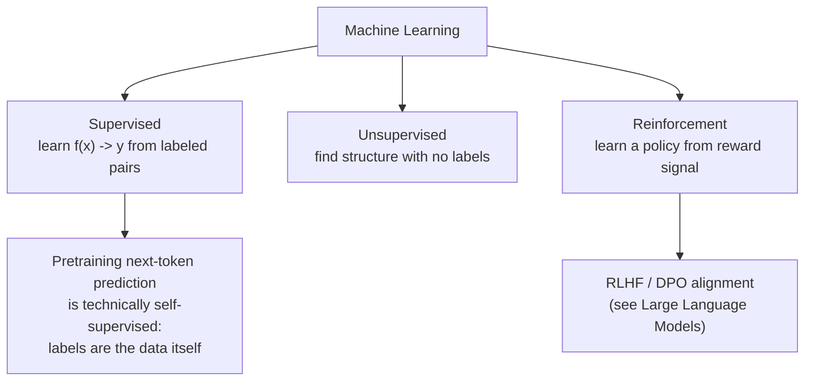
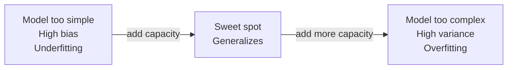
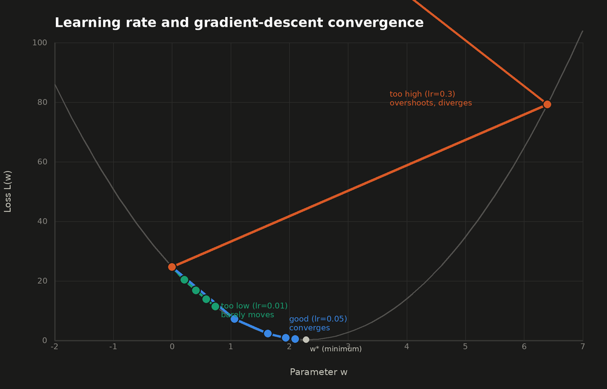

## Machine Learning Fundamentals

> Chapter of [[ai-foundations/readme#00 — Foundations of Modern AI|Foundations of Modern AI]], part
> of [[ai-foundations/readme|AI & LLM Foundations]].

## What you will understand at the end

- The three learning paradigms (supervised, unsupervised, reinforcement) and which one trains which
  part of a modern LLM
- Why the bias-variance tradeoff is really an underfitting-vs-overfitting knob, and how it shows up
  as a training/validation loss gap
- How a loss function and gradient descent turn "learn from data" into a concrete, differentiable
  optimization problem

---

## The three learning paradigms



| Paradigm        | Learns from                                | Where it shows up in LLMs                                                 |
| --------------- | ------------------------------------------ | ------------------------------------------------------------------------- |
| Supervised      | Labeled `(x, y)` pairs                     | Supervised fine-tuning (SFT) on instruction/response pairs                |
| Unsupervised    | Unlabeled data, structure only             | Clustering embeddings, topic discovery over a document corpus             |
| Self-supervised | Labels derived automatically from the data | Pretraining — "predict the next token" turns raw text into its own labels |
| Reinforcement   | Reward signal, no fixed correct answer     | RLHF/DPO alignment — reward a response humans preferred over another      |

The subtlety worth internalizing: LLM pretraining is technically **self-supervised**, not
unsupervised — every training example already contains its own label (the next token), so no human
ever has to annotate it. This is precisely why pretraining scales to internet-sized corpora in a way
that supervised learning, gated by expensive human labeling, never could. See
[[08-large-language-models|Large Language Models]] for how pretraining, SFT, and RLHF/DPO chain
together into the full training pipeline.

### Reinforcement learning intuition, applied to LLM training

"Learn a policy from a reward signal" stays abstract until you see what's actually different about
it versus the supervised loss described above. In SFT, every training example carries a known target
token, so the loss — `-log P(actual_next_token)` — is differentiable end to end: you can compute
exactly how much to nudge every parameter to make that one token more likely. RL removes the known
target. What gets scored is a full generated response, not a single token, and the score is a scalar
**reward** — one number, produced by a reward model or a preference judgment, saying how good that
response was. There is no correct token to backpropagate through, because the reward model (or the
human rater behind it) is not a differentiable piece of your computation graph at all.

Policy-gradient methods solve that with a mechanism worth holding as a real mental model, not just a
name: sample a response from the current model (the "policy"), score it, and if the reward beats
some baseline, nudge every parameter that contributed to producing that response so it becomes more
likely next time — nudge the opposite way for reward below baseline. The gradient here isn't "reduce
mismatch to a known target" (supervised); it's "increase the log-probability of the tokens that
turned out to earn a high reward" (the policy-gradient identity underneath REINFORCE and PPO). You
never differentiate through the reward model itself — only through the policy's own probability of
tokens it already emitted. That's the fact that makes RL usable when the reward signal is
non-differentiable, delayed, or produced by an entirely separate model or human — exactly the
situation LLM alignment is in.

This is precisely the mechanism underneath RLHF: a reward model scores full responses, and policy
gradient (PPO, in the original RLHF recipe) nudges the LLM's parameters toward generating more of
whatever the reward model scores highly. See
[[08-large-language-models#Stage 3 — RLHF / DPO alignment|Stage 3 — RLHF / DPO alignment]] for the
full pipeline, including why DPO sidesteps the reward model and the PPO rollout loop entirely by
reformulating the same optimum as a direct classification loss over preference pairs — same target
policy, cheaper path there.

One failure mode is built into this mechanism from the start: nothing about "maximize reward" stops
the policy from drifting into outputs that game the reward model — fluent, high-scoring text that's
no longer a faithful, on-distribution response (reward hacking). Every practical RLHF/DPO objective
guards against this with a penalty term that constrains the updated policy to stay close to a frozen
reference policy (usually the SFT checkpoint RL started from), measured with KL divergence. See
[[11-probability-sampling-and-decoding#5. KL divergence — the distance metric underneath alignment|Probability, Sampling & Decoding]]
for that distance metric worked by hand — read it alongside this section if "KL penalty" has ever
been a phrase you nodded along to rather than actually unpacked.

---

## The bias-variance tradeoff

Every model's error decomposes into three terms:

```
Total Error = Bias² + Variance + Irreducible Noise
```

- **Bias** — error from a model too simple to capture the real pattern (**underfitting**). A linear
  model trying to fit a curved relationship has high bias — it's wrong in the same way no matter how
  much data you give it.
- **Variance** — error from a model so flexible it fits noise in the training set as if it were
  signal (**overfitting**). It scores near-perfectly on training data and falls apart on anything
  new.
- **Irreducible noise** — error no model can remove, because the data itself is noisy or the labels
  are inconsistent.



**The diagnostic signal in practice:** compare training loss to validation loss.

| Pattern                                        | Diagnosis     | Typical fix                                  |
| ---------------------------------------------- | ------------- | -------------------------------------------- |
| Both losses high, close together               | High bias     | Bigger model, more capacity, better features |
| Training loss low, validation loss much higher | High variance | Regularization, more data, early stopping    |
| Both losses low and close                      | Good fit      | Ship it                                      |

This same diagnostic — training-vs-validation loss gap — is exactly what you watch during LLM
fine-tuning and what "overfitting to the eval set" means in an
[[04-offline-evaluation|Offline Evaluation]] gate: a fine-tune that memorizes its training examples
instead of generalizing the underlying instruction-following behavior.

---

## Loss functions — turning "wrong" into a number

A loss function quantifies how far a model's prediction is from the truth, in a form that's
differentiable so gradient descent can improve it.

| Task type                    | Common loss                       | What it penalizes                                                                                                     |
| ---------------------------- | --------------------------------- | --------------------------------------------------------------------------------------------------------------------- |
| Regression                   | Mean Squared Error (MSE)          | Squared distance between predicted and true value                                                                     |
| Binary classification        | Binary cross-entropy              | Confidently wrong predictions, more than mildly wrong ones                                                            |
| Multi-class classification   | Categorical cross-entropy         | Same idea, generalized across many classes                                                                            |
| Next-token prediction (LLMs) | Cross-entropy over the vocabulary | The model's assigned probability to the _actual_ next token — this is literally what "training loss" means for an LLM |

For an LLM, cross-entropy loss at a given position is `-log(P(actual_next_token))` — the model is
penalized in proportion to how much probability mass it _failed_ to put on the token that actually
came next. A well-trained model isn't one that never makes mistakes; it's one whose probability
distribution consistently puts high mass on the tokens that turn out to be correct.

---

## Gradient descent — how the loss actually gets minimized

Gradient descent is the optimization loop that adjusts model parameters to reduce loss:

1. Compute the loss on a batch of examples using current parameters.
2. Compute the **gradient** — the direction of steepest loss increase, for every parameter (via
   backpropagation; see [[03-deep-learning-essentials|Deep Learning Essentials]]).
3. Update each parameter by stepping a small amount in the _opposite_ direction of its gradient.
4. Repeat over many batches until loss stops meaningfully decreasing.

```
new_parameter = old_parameter - learning_rate × gradient
```

The **learning rate** is the single highest-leverage hyperparameter in this loop: too high and
training diverges or oscillates; too low and training is needlessly slow or gets stuck in a poor
local region. Production training runs almost never use a fixed learning rate — they use a
**schedule** (warmup, then decay) precisely because the right step size early in training (when
parameters are far from any good solution) is not the right step size late in training (when fine
adjustments matter more than large jumps).

### A concrete pass, worked by hand

Take a 1-parameter linear regression through the origin — `ŷ = w·x` — fit to three points: `(1, 3)`,
`(2, 4)`, `(3, 7)`. Mean squared error over these three points is a plain quadratic in `w` once you
expand it:

```
L(w) = (1/3) · Σ (w·xᵢ − yᵢ)²  =  (14w² − 64w + 74) / 3
```

Differentiating term by term (the chain rule applied to each squared residual — see
[[03-deep-learning-essentials#Backpropagation — the algorithm that makes this trainable|Deep Learning Essentials]]
for the same rule applied to a full network instead of one parameter):

```
dL/dw = (2/3) · Σ xᵢ · (w·xᵢ − yᵢ)  =  (28w − 64) / 3
```

Setting this to zero gives the closed-form optimum directly, `w* = 64/28 ≈ 2.286` — but the point of
running gradient descent by hand here is watching it _find_ that optimum iteratively, the way it has
to for any model too large to solve in closed form.

**Learning rate 0.05, starting from `w=0`:**

| Step | `w`   | `L(w)` |
| ---- | ----- | ------ |
| 0    | 0     | 24.667 |
| 1    | 1.067 | 7.221  |
| 2    | 1.636 | 2.258  |
| 3    | 1.939 | 0.847  |
| 4    | 2.101 | 0.445  |

Four steps in, `w` has moved most of the way from `0` toward `w* ≈ 2.286`, and loss has dropped by
~98%. This is the ordinary, boring case — the one production training runs are tuned to land in.

### Learning-rate divergence, worked the same way

Same three points, same starting `w = 0`, only the learning rate changes — now `0.3`:

| Step | `w`   | `L(w)` |
| ---- | ----- | ------ |
| 0    | 0     | 24.667 |
| 1    | 6.4   | 79.28  |
| 2    | −5.12 | 256.23 |

Each step now overshoots the minimum by _more_ than the previous step did, so `w` oscillates with
growing amplitude and loss climbs instead of falls — **learning-rate divergence**. In production
this shows up as a training-loss curve that looks fine for a few steps, then spikes toward infinity
or `NaN`. The fix is almost never "the model is broken" — it's cut the learning rate (or fix the
warmup schedule) and restart from the last good checkpoint.



The chart adds a third case, too-low (`lr = 0.01`) alongside the same two: after four steps it's
only crept from `w=0` to `w≈0.74`, technically converging but far too slowly to be practical at
scale. All three failure signatures — barely moves, converges cleanly, oscillates and explodes — are
exactly what a training-loss dashboard shows for each case, which is why "is the learning rate too
high, too low, or fine" is one of the first diagnostic questions to ask when a training run looks
wrong.

### Batch size — the variance/throughput tradeoff

Every gradient above was computed over all three data points at once — a full **batch** gradient. In
practice, datasets are far too large for that, so there's a real choice about how many examples to
average per step:

| Method                 | Batch size                  | Gradient variance                                                | Compute per step                                             |
| ---------------------- | --------------------------- | ---------------------------------------------------------------- | ------------------------------------------------------------ |
| Batch gradient descent | Full dataset (`N` examples) | Lowest — exact gradient, no noise                                | `O(N × params)` per step — one full pass                     |
| Mini-batch             | Fixed `B` (e.g. 32–4096)    | Moderate — unbiased estimate, variance shrinks ∝ `1/B`           | `O(B × params)` per step                                     |
| SGD                    | 1 example                   | Highest — a single noisy example stands in for the whole dataset | `O(params)` per step, but many more steps needed to converge |

Mini-batch is the default for virtually all deep learning, including LLM pretraining, for a reason
that's easy to miss: modern GPUs/TPUs parallelize the batch dimension, so "compute per step" isn't
the real bottleneck — wall-clock throughput actually _favors_ large batches, up to the point where
the gradient's variance is already low enough that averaging in more examples stops meaningfully
improving the direction of the step. This is exactly why LLM pretraining batch sizes are reported in
millions of tokens, not dozens of examples — at that scale, the constraint is GPU memory and
interconnect bandwidth, not gradient noise.

### Two failure modes worth naming before you ship

**Silent class imbalance.** A binary classifier trained on data that's 99% negative examples can hit
99% accuracy — and 0% recall on the positive class — by learning to always predict negative. Average
cross-entropy loss looks fine because it's dominated by the majority class; the model is, in a very
real sense, silently useless for the class that actually matters. The fix is never "drive the loss
lower" — it's a class-weighted loss, minority-class oversampling, or reporting precision/recall/F1
on the minority class specifically instead of aggregate accuracy.

**Benchmark/eval contamination.** A foundation model's training corpus (scraped at internet scale)
can contain the literal text of a benchmark's test questions — sometimes verbatim, sometimes
paraphrased in a forum post discussing the benchmark. A model that has memorized the eval set
doesn't generalize any better; it just scores better on that one number. This is the same
[training/validation loss-gap diagnostic](#the-bias-variance-tradeoff) from earlier in this chapter,
but the fix isn't architectural — it's decontaminating the corpus (n-gram overlap filtering against
known eval sets before training) or, more reliably, evaluating on benchmarks released _after_ the
model's training cutoff. See [[04-offline-evaluation|Offline Evaluation]] for how this is caught in
practice.

---

## Why this still matters once you're only doing agent engineering, not model training

Every fine-tuned model you might route to, every embedding model you pick for
[[02-embeddings|Embeddings]], and every claim a vendor makes about "improved reasoning" traces back
to a loss curve like the ones worked out above. Being able to read a training/eval loss chart and
ask "is this overfit, undertrained, undertrained on purpose (a too-low learning rate), or actually
fine" is a real interview signal at the L6/L7 bar, not academic trivia — it's the same diagnostic
reflex this chapter's failure modes require, just aimed at someone else's training run instead of
your own.

## Metadata

|        |                |
| ------ | -------------- |
| Author | Amit Singh     |
| Scope  | ai-foundations |
