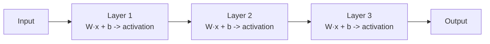
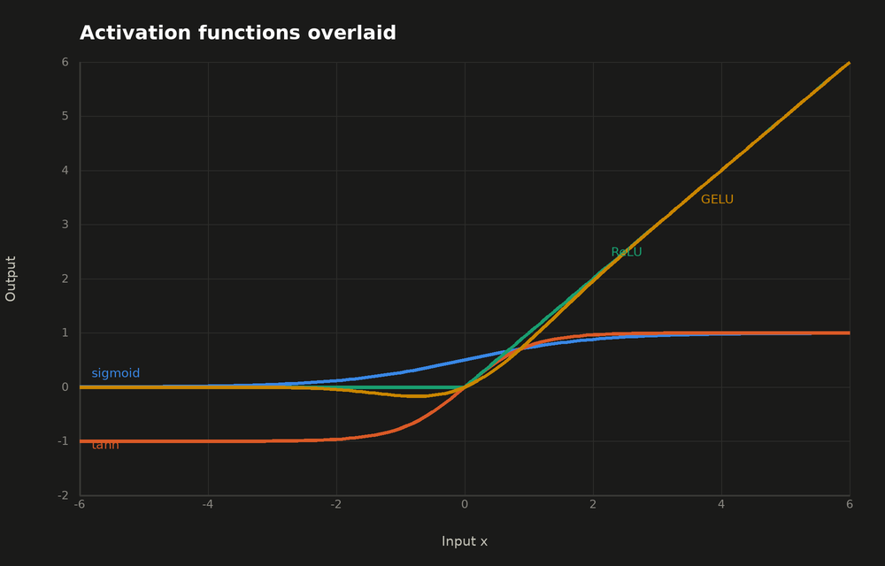
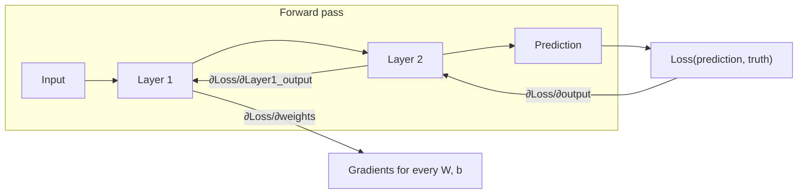
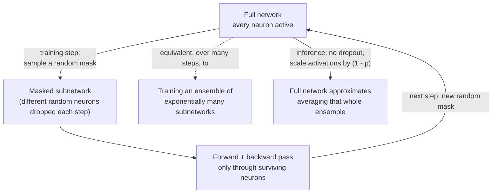
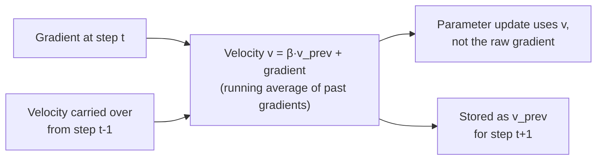

## Deep Learning Essentials

> Chapter of [[ai-foundations/readme#00 — Foundations of Modern AI|Foundations of Modern AI]], part
> of [[ai-foundations/readme|AI & LLM Foundations]].

## What you will understand at the end

- What a layer, an activation function, and a forward pass actually compute
- Why backpropagation is just the chain rule applied systematically, and why that's the thing that
  makes deep networks trainable at all
- Why regularization and optimizer choice are both, at bottom, ways of controlling the bias-variance
  tradeoff from [[02-machine-learning-fundamentals|Machine Learning Fundamentals]]

---

## The building block: a layer

A neural network layer is a linear transformation followed by a nonlinearity:

```
output = activation(W · input + b)
```

`W` (weights) and `b` (bias) are the learned parameters. Stack layers and you get a **deep** network
— "deep" just means more than one hidden layer between input and output. Each layer receives the
previous layer's output as its input, so a forward pass is literally function composition:
`layer_n(...layer_2(layer_1(input))...)`.



## Activation functions — why the nonlinearity matters

Without a nonlinear activation function between layers, stacking any number of linear layers
collapses mathematically into a _single_ linear layer — depth would buy nothing. The activation
function is what lets a deep network represent nonlinear, real-world relationships.

| Activation | Shape                        | Where it's used                                                                                     |
| ---------- | ---------------------------- | --------------------------------------------------------------------------------------------------- |
| Sigmoid    | Squashes to (0, 1)           | Output layer for binary probabilities; rarely used in hidden layers now (vanishing gradients)       |
| Tanh       | Squashes to (-1, 1)          | Older RNN hidden layers                                                                             |
| ReLU       | `max(0, x)`                  | The deep learning default for hidden layers — cheap, avoids vanishing gradients for positive inputs |
| GELU       | Smooth approximation of ReLU | Standard in transformer feed-forward blocks (GPT, BERT) — smoother gradient near zero               |



Reading the shapes side by side makes the table's claims concrete: sigmoid and tanh visibly flatten
(saturate) once `|x|` gets past ~3, which is exactly where their gradient collapses toward zero.
ReLU is a hard hinge at zero with constant slope 1 everywhere positive. GELU tracks ReLU closely for
large `x` but dips slightly _negative_ just below zero instead of hard-clamping to exactly zero —
that small dip is the "smoothness" the table refers to, and it's a real, measurable
training-dynamics difference, not a cosmetic one.

**Why ReLU won for years:** sigmoid and tanh saturate — for large positive or negative inputs their
gradient approaches zero, so backpropagated gradients shrink toward nothing as they pass through
many layers (the **vanishing gradient problem**). ReLU's gradient is a constant 1 for any positive
input, so gradients don't shrink just from passing through a ReLU layer. GELU is now the default
inside transformer feed-forward blocks specifically because its smoothness near zero empirically
trains better than ReLU's hard cutoff at that scale — see
[[04-transformer-architecture|Transformer Architecture]].

**The failure mode ReLU trades in for:** a ReLU unit whose pre-activation (`W·x + b`) lands negative
for _every_ example in the training set has gradient exactly zero for all of them — `ReLU'(z) = 0`
for `z < 0` — so no gradient ever flows back through it, its incoming weights never update again,
and it stays negative forever. This is a **dead ReLU unit**: not a slowdown, a permanent zero. It's
typically caused by an unlucky initialization or a learning-rate spike (see the exploding-gradient
case later in this chapter) that pushes a unit's bias sharply negative in one step. The production
diagnostic is literal: log the fraction of units in each layer whose activation is exactly zero
across a batch. A small fraction is normal (ReLU is supposed to gate off some units); a large or
growing fraction means part of the network has permanently stopped learning, and the fix is almost
always a lower learning rate, better initialization, or switching that layer to GELU/Leaky ReLU,
neither of which has an exact-zero-gradient region.

## Backpropagation — the algorithm that makes this trainable

Backpropagation computes the gradient of the loss with respect to _every_ parameter in the network,
efficiently, using the chain rule from calculus. The insight: instead of computing each parameter's
gradient independently from scratch, compute the network's error at the output, then propagate it
backward layer by layer, reusing each layer's partial derivative in the computation for the layer
before it.



This is why depth was practically impossible before backprop's systematic formulation (popularized
1986 by Rumelhart, Hinton, and Williams) — computing gradients any other way for a network with
millions of parameters simply doesn't scale. Every weight update described in
[[02-machine-learning-fundamentals#Gradient descent — how the loss actually gets minimized|Machine Learning Fundamentals]]
depends on a gradient that backprop is what actually computes for a deep network.

### A full numeric pass, worked by hand

The diagram above shows the _shape_ of backprop; here is the actual arithmetic, on the smallest
network that still has every piece — one input, one hidden unit (sigmoid), one linear output unit:

```
x = 1.0            (input)
w1 = 0.5, b1 = 0.0  (hidden-layer parameters)
w2 = 0.8, b2 = 0.1  (output-layer parameters)
y  = 1.0            (target)
```

**Forward pass:**

1. Hidden pre-activation: `z1 = w1·x + b1 = 0.5·1.0 + 0.0 = 0.5`
2. Hidden activation: `h = sigmoid(z1) = 1/(1+e^-0.5) = 0.6225`
3. Output (linear): `ŷ = w2·h + b2 = 0.8·0.6225 + 0.1 = 0.5980`
4. Loss (squared error): `L = ½(ŷ − y)² = ½(0.5980 − 1.0)² = 0.0808`

**Backward pass — the chain rule, one factor at a time:**

5. `∂L/∂ŷ = ŷ − y = 0.5980 − 1.0 = −0.4020`
6. `∂L/∂z2 = ∂L/∂ŷ · ∂ŷ/∂z2 = −0.4020 · 1 = −0.4020` (output is linear, so this factor is 1)
7. `∂L/∂w2 = ∂L/∂z2 · ∂z2/∂w2 = −0.4020 · h = −0.4020 · 0.6225 = −0.2502`
8. `∂L/∂b2 = ∂L/∂z2 · ∂z2/∂b2 = −0.4020 · 1 = −0.4020`
9. `∂L/∂h = ∂L/∂z2 · ∂z2/∂h = −0.4020 · w2 = −0.4020 · 0.8 = −0.3216` — the error, now attributed
   back to the hidden unit's _output_
10. `∂h/∂z1 = h·(1−h) = 0.6225 · 0.3775 = 0.2350` — the sigmoid's own local derivative, evaluated at
    the value computed in step 2
11. `∂L/∂z1 = ∂L/∂h · ∂h/∂z1 = −0.3216 · 0.2350 = −0.0756` — the error, now attributed back through
    the nonlinearity
12. `∂L/∂w1 = ∂L/∂z1 · ∂z1/∂w1 = −0.0756 · x = −0.0756 · 1.0 = −0.0756`
13. `∂L/∂b1 = ∂L/∂z1 · ∂z1/∂b1 = −0.0756 · 1 = −0.0756`

Every one of steps 6–13 reuses a value computed at an earlier step (`h` from step 2, `∂L/∂z2` from
step 6, `∂h/∂z1` from step 10) — this reuse, not any deeper mathematical trick, is _the entire
efficiency argument_ for backprop over recomputing every parameter's gradient from scratch.

**Applying the update** (`new = old − lr·gradient`, `lr = 0.1`, from
[[02-machine-learning-fundamentals#Gradient descent — how the loss actually gets minimized|Machine Learning Fundamentals]]):

| Parameter | Old | Gradient | New (`old − 0.1·grad`) |
| --------- | --- | -------- | ---------------------- |
| `w1`      | 0.5 | −0.0756  | 0.5076                 |
| `b1`      | 0.0 | −0.0756  | 0.0076                 |
| `w2`      | 0.8 | −0.2502  | 0.8250                 |
| `b2`      | 0.1 | −0.4020  | 0.1402                 |

Re-running the forward pass with these updated parameters gives `ŷ = 0.6567` and `L = 0.0589` — down
from `0.0808` in a single step, confirming the gradient pointed the right direction.

### Exploding gradients — vanishing's mirror image

The chain rule _multiplies_ local derivatives across layers (steps 6→9→11 above chain three factors
together for just two layers). Vanishing gradients is what happens when those factors are
consistently `<1` (sigmoid/tanh saturation, see the previous section) — the product shrinks toward
zero with depth. **Exploding gradients** is the same compounding effect with factors consistently
`>1`: a per-layer gradient multiplier of just 1.5, compounded over 20 layers, is `1.5²⁰ ≈ 3,325×` —
small per-layer amplification becomes a massive one over depth, in either direction. In practice
this shows up as a training loss that is falling normally and then, over one or two steps, spikes
toward infinity or `NaN` — the update step became so large it threw the parameters into a region
where the loss is undefined or numerically unstable.

**The standard production fix is gradient clipping**: compute the global norm of the gradient across
every parameter, and if it exceeds a threshold (a common default is `1.0`), rescale the entire
gradient vector down to that norm before applying the update — this preserves the gradient's
_direction_ while capping its _magnitude_. Virtually every LLM pretraining run clips gradients as a
matter of course, not as a response to an observed problem; the standard operational practice is to
log the gradient norm every step and treat a sudden spike (even one that gets clipped away) as an
early-warning signal worth correlating with a learning-rate schedule change, a bad batch, or a
numerical-precision issue, before it becomes a `NaN` loss that kills the run.

## FLOPs and memory — what a forward and backward pass actually cost

A dense layer's forward pass is a matrix multiply: an `in_dim × out_dim` weight matrix applied to a
batch of inputs costs approximately `2 × batch × in_dim × out_dim` FLOPs (each output element is a
dot product of length `in_dim` — `in_dim` multiplications plus `in_dim` additions, hence the factor
of 2). The backward pass needs two more matrix multiplies of the same size — one to get the gradient
with respect to the _weights_ (needed for the update), one to get the gradient with respect to the
_input_ (needed to keep propagating backward into earlier layers) — so backward costs roughly `2×`
the forward pass. Forward plus backward together: **`~6 × batch × in_dim × out_dim` FLOPs per dense
layer** — and summed over every parameter and every training token, that `6` is exactly where
[[01-the-evolution-of-artificial-intelligence#Era 5 — The Transformer and Foundation Models (2017–2022)|the C ≈ 6·N·D scaling-law formula]]
comes from: `2N` for the forward pass, `4N` for the backward pass, per token.

**Worked example:** a dense layer with `in_dim = out_dim = 4096` (a typical transformer hidden size
— see [[04-transformer-architecture|Transformer Architecture]]), processing one token:

- Forward: `2 × 4096 × 4096 ≈ 33.6M` FLOPs
- Forward + backward: `6 × 4096 × 4096 ≈ 100.7M` FLOPs
- Across a 12-layer feed-forward stack: `~1.21B` FLOPs per token — and this is _before_ counting
  attention's own cost, which has a different scaling story entirely (see
  [[06-context-windows-and-tokenization#Why context windows are finite: the quadratic cost problem|Context Windows & Tokenization]]).

**Memory has its own, separate story.** Every activation computed during the forward pass (`z1`,
`h`, `z2` in the toy example above) has to be _kept in memory_ until the backward pass reaches it —
step 10 above needed `h` from step 2, so `h` couldn't be discarded after computing it. For the
4096-wide, 12-layer stack above, storing one hidden activation per layer per token in 2-byte (bf16)
precision is `4096 × 2 bytes × 12 layers = 96 KiB` per token — and for one 4096-token sequence,
that's `96 KiB × 4096 ≈ 384 MiB`, just for this one piece, for a single sequence, before attention's
own activations or the optimizer's state are counted. Multiply by even a modest training batch of 8
sequences and this single line item is already ~3 GiB. This is precisely the memory pressure that
**gradient checkpointing** (also called activation recomputation) trades away: instead of storing
every activation, store only a subset and _recompute_ the rest during the backward pass — spending
extra forward-pass FLOPs to buy back memory. See Part 01 of Production Agent Systems's
performance-and-cost-engineering track for where this tradeoff gets made in a real training or
fine-tuning budget.

## Regularization — controlling variance deliberately

Regularization techniques deliberately constrain a model's flexibility to fight overfitting (the
high-variance failure mode):

| Technique                 | Mechanism                                                                                                                                |
| ------------------------- | ---------------------------------------------------------------------------------------------------------------------------------------- |
| L2 weight decay           | Penalizes large weight values in the loss — discourages the model from relying too heavily on any single feature                         |
| Dropout                   | Randomly zeroes a fraction of neurons during training — forces the network to not depend on any single neuron, approximating an ensemble |
| Early stopping            | Stops training once validation loss starts rising even as training loss keeps falling                                                    |
| Batch/layer normalization | Normalizes activations between layers — stabilizes training and has a mild regularizing side effect                                      |

Layer normalization specifically (not batch normalization) is the variant used throughout
transformer architectures, because it normalizes per-token rather than across a batch — a natural
fit for variable-length sequences.



Dropout's mechanism is worth being precise about because the training-time and inference-time
behavior are deliberately different: every training step zeroes a _different_ random subset of
neurons (probability `p` each), so no unit can become co-dependent on any other specific unit being
present. At inference there's no dropout at all — the full network runs, with activations scaled by
`(1 − p)` to compensate for the fact that training, on average, only ever saw `(1 − p)` of the units
active at once. Skipping that rescaling is a real, easy-to-make bug: it silently shifts every
downstream activation's scale and degrades accuracy without throwing an error.

**Regularization and catastrophic forgetting are the same failure mode, at different times.**
Everything above frames overfitting as a random-initialization model memorizing its training set. A
_pretrained_ model being fine-tuned has the identical capacity-vs-constraint problem, just applied
to weights that already encode general capability instead of random noise — fine-tune too hard on a
narrow dataset and the model overfits it while forgetting what pretraining taught it. See
[[07-foundation-models#Transfer learning — why one pretraining run pays for many tasks|Foundation Models]]
and [[08-large-language-models#Stage 2 — Supervised Fine-Tuning (SFT)|Large Language Models]] for
where this shows up concretely in an actual training pipeline.

## Optimizers — smarter parameter update rules

Plain gradient descent uses the same learning rate for every parameter, every step. Modern
optimizers adapt the step size per-parameter based on the history of past gradients:

| Optimizer      | Idea                                                                                                                   |
| -------------- | ---------------------------------------------------------------------------------------------------------------------- |
| SGD + Momentum | Accumulates a moving average of past gradients so updates keep moving in a consistent direction instead of oscillating |
| RMSProp        | Divides the learning rate by a running average of recent gradient magnitudes — adapts per-parameter                    |
| Adam           | Combines momentum and RMSProp's per-parameter adaptive scaling — the default optimizer for training transformers       |
| AdamW          | Adam with weight decay applied correctly (decoupled from the gradient update) — the standard for LLM pretraining       |

AdamW is the near-universal choice for training modern LLMs specifically because it combines
adaptive per-parameter learning rates (which matters enormously at billion-parameter scale, where
different parameters have wildly different gradient statistics) with correctly-implemented weight
decay for regularization.



The diagram is the mechanical difference between plain SGD and everything below it in the table:
plain SGD's update depends only on the _current_ gradient; momentum, RMSProp, Adam, and AdamW all
carry state (`v`, and for Adam a second moment too) forward from every previous step, which is
exactly what lets them smooth out a noisy or badly-shaped loss surface instead of reacting to only
the most recent gradient.


This is precisely the shape of loss surface where the table's differences stop being academic. A
ravine — steep in one direction, nearly flat in another — is common in real networks whenever
different parameters have very different gradient scales. Plain SGD, forced to use one learning rate
for both directions, either oscillates in the steep direction or crawls in the shallow one (often
both, at different points in training). Momentum's running average damps the oscillation because
consistent-direction gradients reinforce each other while alternating-direction ones partially
cancel. Adam goes further: its per-parameter adaptive scaling (RMSProp's contribution) means the
steep and shallow directions effectively get _different_ learning rates automatically, which is why
its path above cuts across the ravine instead of zig-zagging along it.

---

## Why this substrate still matters once you're building agents, not training models

You will not train a foundation model. But this vocabulary — layer, activation, gradient,
overfitting, regularization, optimizer — is the substrate every downstream concept in this book
assumes without re-deriving: why [[04-transformer-architecture|Transformer Architecture]] uses layer
norm and GELU specifically, why a fine-tuned model can overfit its training set the same way any
deep network can, and why "the model is undertrained" versus "the agent's prompt is wrong" are
genuinely different failure modes that require different fixes — the distinction this whole Part
exists to make precise. See
[The Evolution of Artificial Intelligence](../01-the-evolution-of-artificial-intelligence/01-the-evolution-of-artificial-intelligence.md#why-the-wall-then-shift-pattern-matters-for-agent-design)
for that framing applied at the system level.

## Metadata

|        |                |
| ------ | -------------- |
| Author | Amit Singh     |
| Scope  | ai-foundations |
