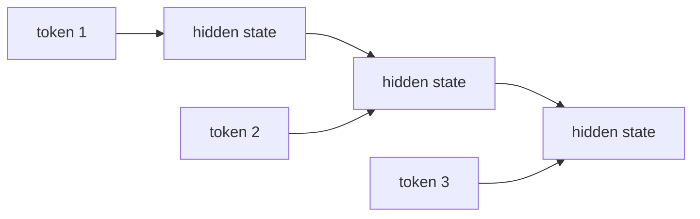
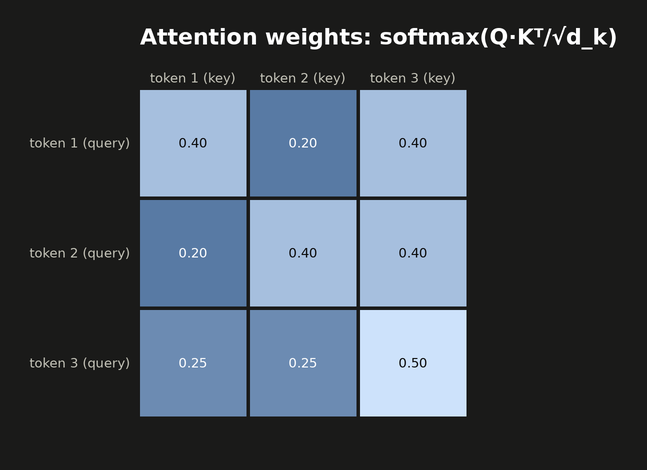
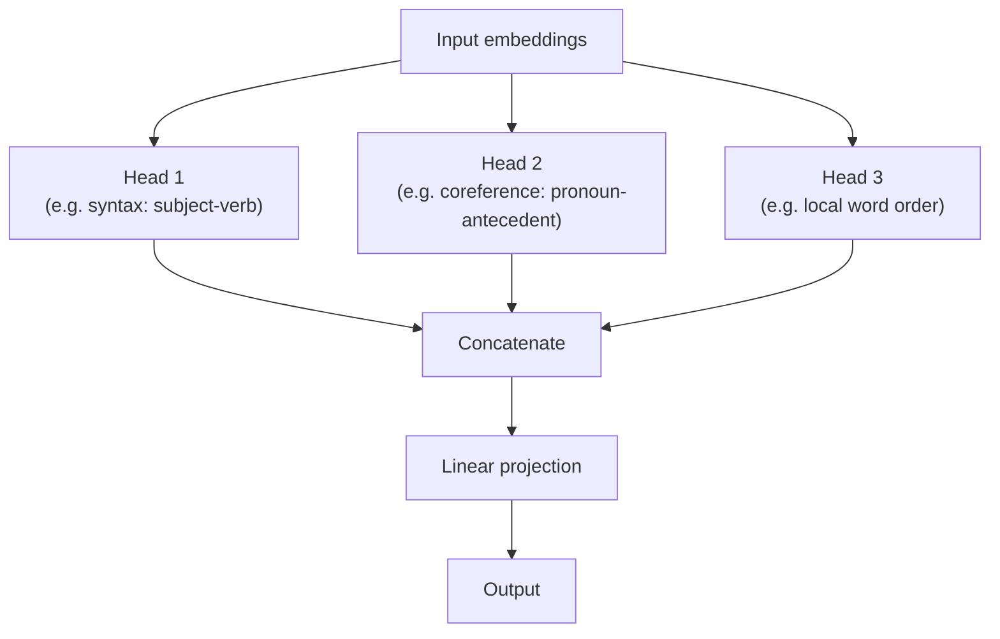
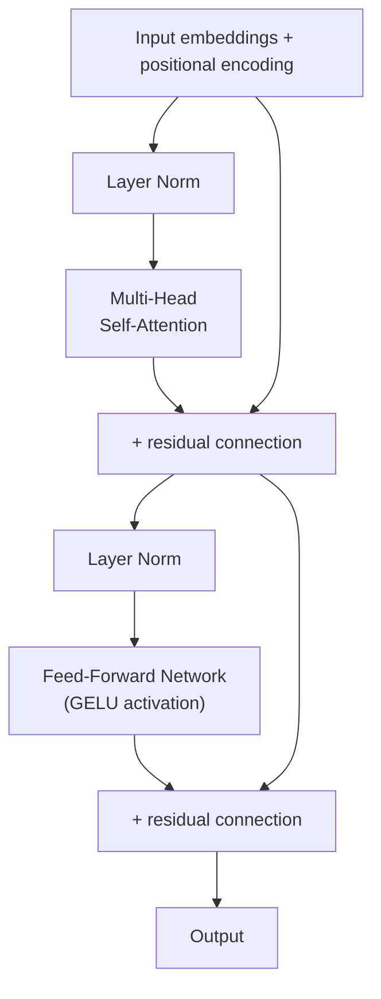

## Transformer Architecture

> Chapter of [[ai-foundations/readme#00 — Foundations of Modern AI|Foundations of Modern AI]], part
> of [[ai-foundations/readme|AI & LLM Foundations]].

## What you will understand at the end

- Why RNNs/LSTMs process sequences one step at a time and why that made them slow and prone to
  losing long-range context — the exact problem the transformer was designed to solve
- The mechanics of self-attention and why multiple attention heads see different things
- Why decoder-only transformers, not the original encoder-decoder design, became the default
  architecture for LLMs

---

## What came before, and why it hit a wall

Before 2017, sequence modeling meant **recurrent neural networks** (RNNs) and their better-behaved
variant, **LSTMs**. Both process a sequence one token at a time, carrying a hidden state forward:



This has two structural problems. First, it's **inherently sequential** — you cannot compute the
hidden state at position 5 before you've computed it at positions 1 through 4, so training cannot
parallelize across the sequence length, only across separate examples. Second, **information from
early tokens has to survive being compressed through every subsequent hidden state update** — by the
time you reach token 500, whatever mattered from token 3 has usually been diluted or overwritten, no
matter how good the LSTM's gating mechanism is. This is the **long-range dependency problem**, and
it's the direct reason attention was invented as an add-on to RNNs before the 2017 paper realized
attention alone, without any recurrence, was sufficient.

## Self-attention — the core mechanism

Self-attention lets every position in a sequence directly look at every other position, in one step,
weighted by relevance — no sequential bottleneck, no compression through a chain of hidden states.

Mechanically, each token's embedding is projected into three vectors:

- **Query (Q)** — "what am I looking for?"
- **Key (K)** — "what do I contain, that something else might be looking for?"
- **Value (V)** — "what information do I actually contribute if I'm attended to?"

```
Attention(Q, K, V) = softmax(Q·Kᵀ / √d_k) · V
```

Step by step:

1. Compute `Q·Kᵀ` — a similarity score between every query and every key (how relevant is token `j`
   to token `i`).
2. Divide by `√d_k` — scales the scores down so the softmax doesn't saturate into a near-one-hot
   distribution when `d_k` (the key dimension) is large. This is literally why it's called _scaled_
   dot-product attention.
3. Apply softmax across each row — turns raw scores into a probability distribution: how much
   attention token `i` pays to every other token, summing to 1.
4. Multiply by `V` — take a weighted average of every token's value vector, weighted by that
   attention distribution.

The output at position `i` is a blend of every other token's value, weighted by how relevant each
one is _to that specific query_ — computed for all positions simultaneously as matrix
multiplications, which is exactly what makes this fully parallelizable on a GPU, unlike an RNN.

### A full numeric pass, worked by hand

Three tokens, `d_k = 2` (small on purpose, so every number is checkable by hand). Say the learned
projections have already produced:

```
Q1=[1,0]  Q2=[0,1]  Q3=[1,1]
K1=[1,0]  K2=[0,1]  K3=[1,1]
V1=[1,0]  V2=[0,2]  V3=[1,1]
```

**Step 1 — raw scores `Qi·Kj`** (every query against every key):

| Q\K | K1  | K2  | K3  |
| --- | --- | --- | --- |
| Q1  | 1   | 0   | 1   |
| Q2  | 0   | 1   | 1   |
| Q3  | 1   | 1   | 2   |

**Step 2 — scale by `1/√d_k = 1/√2 ≈ 0.7071`:** row 1 becomes `[0.7071, 0, 0.7071]`, row 2 becomes
`[0, 0.7071, 0.7071]`, row 3 becomes `[0.7071, 0.7071, 1.4142]`.

**Step 3 — softmax each row** (exponentiate, normalize to sum to 1):

| Query | → token 1 | → token 2 | → token 3 |
| ----- | --------- | --------- | --------- |
| Q1    | 0.4011    | 0.1978    | 0.4011    |
| Q2    | 0.1978    | 0.4011    | 0.4011    |
| Q3    | 0.2482    | 0.2482    | 0.5035    |



**Step 4 — weighted sum of `V`, one query at a time:**

```
Output1 = 0.4011·V1 + 0.1978·V2 + 0.4011·V3 = [0.8022, 0.7967]
Output2 = 0.1978·V1 + 0.4011·V2 + 0.4011·V3 = [0.5989, 1.2033]
Output3 = 0.2482·V1 + 0.2482·V2 + 0.5035·V3 = [0.7517, 1.0000]
```

Notice token 3's query (`Q3=[1,1]`) is the only one that isn't closer to one key than the others —
its raw scores are `[1, 1, 2]`, roughly "equally similar to keys 1 and 2, more similar to key 3" —
and that's visible directly in its output: it blends all three values more evenly (weights
`0.25/0.25/0.50`) than tokens 1 and 2, whose queries exactly match one specific key and pull that
key's weight up to `0.40` against `0.20` for the mismatched one.

**Why the `√d_k` divisor matters — a quick illustration with numbers picked to make the effect
obvious.** At `d_k = 2` above, unscaled and scaled softmax aren't dramatically different, because
the scores are small. Real attention heads run at `d_k = 64` or larger, where random Q·K dot
products routinely land in the range of `±8` before scaling. Take three hypothetical raw scores
`[2, 8, 7]`:

```
softmax([2, 8, 7])              ≈ [0.2%,  73.0%, 26.9%]   (unscaled)
softmax([2, 8, 7] / √64)        ≈ [20.1%, 42.5%, 37.5%]   (scaled by 1/8)
```

Unscaled, softmax has already collapsed to nearly one-hot — one token gets 73% of the weight,
another gets a rounding error, and the model has effectively lost the ability to blend information
from multiple positions at all. Scaled, the same relative ordering survives but the distribution
stays informative. This is also a **numerical stability** issue, not just a quality one: every real
implementation additionally subtracts each row's max score before exponentiating
(`softmax(x) = exp(x − max(x)) / Σexp(x − max(x))`, mathematically identical since the max cancels
in the ratio) specifically because unscaled scores in the dozens or hundreds overflow a float16
accumulator — the `√d_k` scaling reduces how often that safety net is needed, it doesn't replace it.

### How expensive is this, and what dominates

Three separate matrix multiplications happen per attention layer, and they scale differently:

- **Projecting into Q, K, V** (and the output projection after multi-head concatenation): `n` token
  vectors of dimension `d`, each multiplied by a `d×d` weight matrix — `O(n·d²)` total.
- **`Q·Kᵀ`**: an `n×d` matrix times a `d×n` matrix — `O(n²·d)`.
- **`softmax·V`**: an `n×n` matrix times an `n×d` matrix — also `O(n²·d)`.

Combined: **`O(n·d² + n²·d)`**. Which term dominates depends entirely on whether sequence length `n`
or model dimension `d` is larger — short sequences with a wide model (`n=512, d=4096`) are dominated
by the `n·d²` projection cost; long sequences (`n=128,000, d=4096`) are dominated by the `n²·d`
attention cost, overwhelmingly. This crossover, worked out with actual numbers, is exactly what
[[06-context-windows-and-tokenization#Why context windows are finite: the quadratic cost problem|Context Windows & Tokenization]]
uses to explain why context length has a real compute ceiling.

### Three failure modes that live specifically in attention

**Attention sink.** Trained decoder-only models reliably spend a disproportionate share of attention
weight on the _first_ token — often far more than its content would justify — across many heads and
layers (documented in Xiao et al., 2023, the StreamingLLM paper). The working explanation: softmax
must distribute 100% of its weight every time, even when a head has found nothing genuinely relevant
to attend to, and the first token is always present and always in the same position (thanks to
causal masking), making it a convenient default "dump" for otherwise-unneeded attention mass. This
has a direct production consequence: a naive KV-cache eviction scheme that drops the oldest tokens
under memory pressure will evict the sink token first — and quality degrades sharply when it does —
which is why streaming-inference schemes special-case keeping the first few tokens pinned in cache
regardless of recency (see [[06-context-windows-and-tokenization|Context Windows & Tokenization]]).

**RoPE extrapolation failure.** RoPE encodes relative position by rotating Q/K vectors by an angle
proportional to position. That generalizes cleanly for position deltas the model saw during
training, but degrades sharply for deltas beyond the trained context length — the rotation
frequencies simply never occurred in training data at those magnitudes, and the model has no basis
for interpreting them. Production mitigations rescale the rotation frequencies at inference time to
effectively compress a longer context into the range the model was trained on — NTK-aware scaling,
position interpolation, and YaRN are the named techniques for this, and they're why some models
advertise a context length well beyond their original training window without retraining.

## Multi-head attention — why one attention pattern isn't enough

A single attention computation can only learn one notion of "relevance" at a time. Multi-head
attention runs several attention computations in parallel, each with its own learned Q/K/V
projections, then concatenates the results:



Empirically (and this is a common interview probe), different heads specialize — some track
syntactic relationships like subject-verb agreement, others track long-range coreference (which noun
a pronoun refers to many tokens back), others attend mostly to nearby tokens. No head is told what
to specialize in; this emerges purely from gradient descent optimizing the overall loss.

## Positional encoding — attention has no sense of order

Self-attention treats its input as a **set**, not a sequence — swap two tokens' positions and the
raw attention computation above is unaffected, because it only depends on Q/K/V content, never on
position. That's a problem for language, where word order carries meaning ("dog bites man" ≠ "man
bites dog"). Positional encoding injects order back in, by adding a position-dependent signal to
each token's embedding before it enters the attention layers.

| Approach                         | How it works                                                                                                                                                                |
| -------------------------------- | --------------------------------------------------------------------------------------------------------------------------------------------------------------------------- |
| Sinusoidal (original 2017 paper) | Fixed sine/cosine functions of position, added to the embedding — not learned                                                                                               |
| Learned positional embeddings    | A trainable embedding per position, learned like any other parameter                                                                                                        |
| RoPE (Rotary Position Embedding) | Rotates Q/K vectors by an angle proportional to position — encodes _relative_ position directly into the attention score, the modern default (LLaMA, GPT-NeoX-style models) |

RoPE's advantage is that it encodes **relative** position (how far apart two tokens are) directly
into the attention math, rather than absolute position added to the embedding — which generalizes
better to sequence lengths longer than anything seen during training, a direct lever on the
context-window question covered in
[[06-context-windows-and-tokenization|Context Windows & Tokenization]].

## The full transformer block



A transformer stacks dozens of these blocks. Two details matter beyond the attention mechanism
itself:

- **Residual connections** (the "+ input" arrows) let gradients flow directly around each sub-layer
  during backpropagation — the same fix for vanishing gradients across depth discussed in
  [[03-deep-learning-essentials|Deep Learning Essentials]], applied at the scale of dozens of
  stacked blocks rather than a handful of layers.
- **The feed-forward network** (two linear layers with a GELU activation in between) processes each
  position independently _after_ attention has already mixed information across positions —
  attention is where tokens exchange information; the FFN is where each token's representation gets
  nonlinearly transformed.

## Encoder-decoder vs. decoder-only

The original 2017 transformer was **encoder-decoder**: an encoder stack builds a representation of
the full input sequence (bidirectional — every token can attend to every other token, forward and
backward), and a decoder stack generates output tokens one at a time, attending to both the
encoder's output and its own previously generated tokens. This shape fits sequence-to-sequence tasks
like translation, where the whole source sentence is known upfront.

Modern LLMs (GPT-family, Claude, LLaMA) are **decoder-only**: there is no separate encoder — the
same stack both "reads" the prompt and generates the completion, one token at a time, with **causal
masking** ensuring each position can only attend to itself and earlier positions, never later ones.
This matches next-token prediction (see
[[02-machine-learning-fundamentals|Machine Learning Fundamentals]]) directly: at generation time
there _is_ no "later" sequence to attend to yet, so training the model under that same constraint
from the start is the architecturally honest choice. This is why decoder-only, not the original
encoder-decoder design, became the default for the general-purpose, open-ended generation that
[[08-large-language-models|Large Language Models]] are built around.

---

## Why this matters once you're building agents, not training models

Every "why is my agent slow / expensive / losing context" question eventually traces back to one of
this chapter's mechanics: the `O(n²·d)` attention term is why long conversation histories get slow
and expensive (see [[06-context-windows-and-tokenization|Context Windows & Tokenization]] for the
exact numbers), attention sink is why naive KV-cache trimming silently degrades quality, and RoPE
extrapolation is why a model advertised at a huge context length can still degrade past some
quieter, unadvertised threshold. None of this requires training a transformer to reason about — it
requires knowing precisely which mechanism is load-bearing for the symptom in front of you.

## Metadata

|        |                |
| ------ | -------------- |
| Author | Amit Singh     |
| Scope  | ai-foundations |
