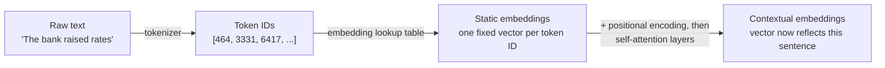
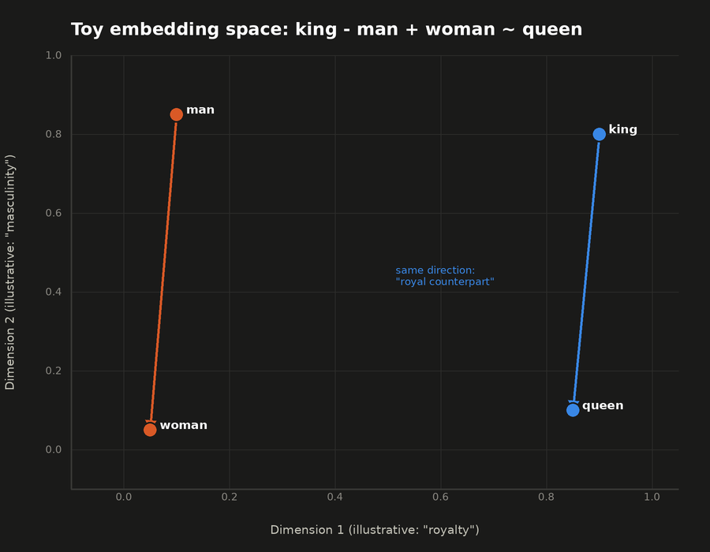
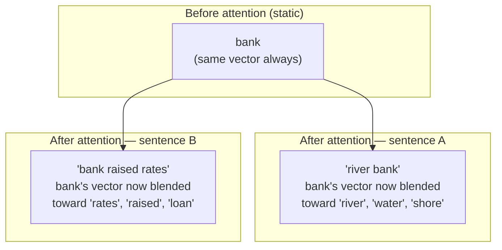

## Tokens, Embeddings & Attention

> Chapter of [[ai-foundations/readme#00 — Foundations of Modern AI|Foundations of Modern AI]], part
> of [[ai-foundations/readme|AI & LLM Foundations]].

## What you will understand at the end

- The exact pipeline from raw text to a number a model can compute on: text → tokens → embeddings →
  contextualized embeddings
- Why "embedding" means two related-but-different things depending on which stage of that pipeline
  you're talking about, and why conflating them is the single most common mistake in interview
  answers on this topic
- Why attention is what turns a static embedding into one that reflects the specific sentence it
  appears in

---

## The pipeline, end to end



Every concept in this chapter is one stage of that pipeline. Confusing "embedding" the lookup-table
vector with "embedding" the post-attention contextualized vector is the most common way this topic
gets muddled in an interview answer — they are genuinely different objects, produced at different
stages, and only the second one is what a transformer actually reasons over internally.

## Stage 1 — Tokenization

A tokenizer breaks raw text into **tokens** — not necessarily whole words. Modern tokenizers use
subword algorithms (byte-pair encoding, WordPiece, SentencePiece — covered in depth in
[[06-context-windows-and-tokenization|Context Windows & Tokenization]]) that split rare or long
words into smaller reusable pieces: `"tokenization"` might become `["token", "ization"]`, while
common short words stay whole. Each token maps to an integer ID from a fixed vocabulary — the only
thing a model ever actually receives as input is a sequence of these integers.

That integer ID is only meaningful relative to the exact vocabulary it was assigned from — a
mismatch between the tokenizer version used at request time and the one the embedding table (Stage
2, next) was trained against is a real, silent production failure mode, not a hypothetical one. See
[[06-context-windows-and-tokenization#Tokenizer algorithms|Context Windows & Tokenization]] for the
concrete failure mechanism.

## Stage 2 — Static embeddings

Each token ID indexes into an **embedding lookup table** — a matrix of shape
`[vocabulary_size, embedding_dimension]` — to retrieve a dense vector, typically several hundred to
a few thousand dimensions. This is the model's very first learned parameter matrix, and it's learned
the same way every other parameter is: via gradient descent during pretraining (see
[[02-machine-learning-fundamentals|Machine Learning Fundamentals]]).

At this stage the vector for `"bank"` is exactly the same whether the sentence is about a river bank
or a financial bank — **static** embeddings encode only "what this token typically means across all
the training data," with no awareness yet of the specific sentence it's in.

**This is the meaning of "embedding" that matters for retrieval systems** — the fixed-purpose
embedding models covered in [[02-embeddings|Embeddings]] produce a single static vector _per
document or query_, used purely for similarity search, and are architecturally distinct from the
token-level embedding table inside an LLM described here.

**A worked example of what these vectors actually encode.** Static embeddings are famous for
supporting vector arithmetic that lines up with human semantic intuition. Take toy 3-dimensional
vectors (real embeddings run to thousands of dimensions; these three axes are for illustration only,
not literal learned dimensions) for `king`, `man`, and `woman`:

```
king  = [0.90, 0.80, 0.20]
man   = [0.10, 0.85, 0.05]
woman = [0.05, 0.05, 0.05]

king - man + woman = [0.85, 0.00, 0.20]
```

Compare that result to the actual embedding for `queen = [0.85, 0.10, 0.15]` using cosine similarity
(`v1·v2 / (|v1|·|v2|)`):

```
similarity(king - man + woman, queen) = 0.7525 / (0.8732 × 0.8689) ≈ 0.992
similarity(king - man + woman, king)  = 0.805  / (0.8732 × 1.2207) ≈ 0.755
```

The arithmetic result is far closer to `queen` (0.992) than to `king` itself (0.755) — the offset
`man → woman` and the offset `king → queen` point in nearly the same direction in the embedding
space, which is exactly what "the space encodes relationships, not just individual meanings" means
concretely, rather than as a slogan.



**The embedding table's own memory footprint is a real cost, not an implementation detail.** For a
50,000-token vocabulary at `d_model = 4096` in bf16:
`50,000 × 4,096 × 2 bytes ≈ 410M parameters, ~780 MiB` — one matrix, before a single transformer
block runs. Many architectures **tie** this matrix to the final output projection (the layer that
turns the last hidden state back into vocabulary logits), reusing the same weights for both lookup
and prediction — a deliberate parameter- sharing choice, not a coincidence, since both directions
are fundamentally "map between a token identity and a vector." See
[[06-context-windows-and-tokenization#Vocabulary size is itself a tradeoff, not a free parameter|Context Windows & Tokenization]]
for how vocabulary size and this exact table size trade off against each other, and
[[02-embeddings|Embeddings]] for the separate cost story of a dedicated retrieval embedding model.

## Stage 3 — Contextual embeddings, via attention

Static embeddings alone can't resolve ambiguity — "bank" needs its neighboring words to know which
sense applies. This is exactly what **self-attention** does: it lets every token's vector be updated
by a weighted blend of every other token's vector in the same sequence, where the weights (computed
via the Query/Key/Value mechanism detailed in
[[04-transformer-architecture|Transformer Architecture]]) reflect how relevant each other token is.



After passing through a transformer's attention layers, `"bank"` in "river bank" and `"bank"` in
"the bank raised interest rates" end up as **different vectors**, even though they started from the
identical row of the static embedding table — attention is precisely the mechanism that injects
sentence-specific context into what started as a context-free lookup.

## Why this three-stage distinction is the actual interview signal

A common weak answer collapses all three stages into "the model turns words into vectors." A strong
answer distinguishes:

| Question                                                                     | Correct stage to point to                                                                   |
| ---------------------------------------------------------------------------- | ------------------------------------------------------------------------------------------- | -------------------------------- |
| "How does the model handle a word it's never seen before?"                   | Tokenization (subword splitting) — [[06-context-windows-and-tokenization                    | Context Windows & Tokenization]] |
| "Why does an embedding model group semantically similar documents together?" | Static embeddings, trained via a contrastive objective — [[02-embeddings                    | Embeddings]]                     |
| "How does the model know 'it' refers to 'the dog' three sentences back?"     | Contextual embeddings via attention — this chapter, and [[04-transformer-architecture       | Transformer Architecture]]       |
| "Why does doubling the sequence length roughly quadruple attention compute?" | The `Q·Kᵀ` step scales with sequence length squared — [[06-context-windows-and-tokenization | Context Windows & Tokenization]] |

Being able to route a question to the right stage of this pipeline — rather than gesturing at "the
model understands the word" — is what separates a Staff-level answer from a surface-level one.

## Metadata

|        |                |
| ------ | -------------- |
| Author | Amit Singh     |
| Scope  | ai-foundations |
