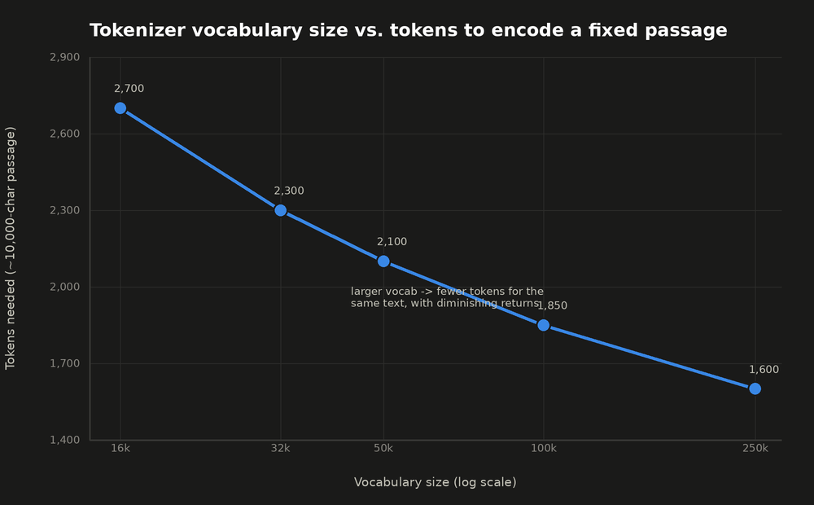
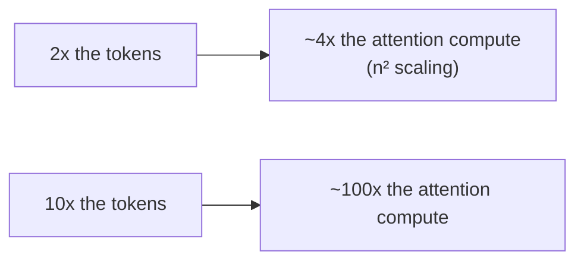
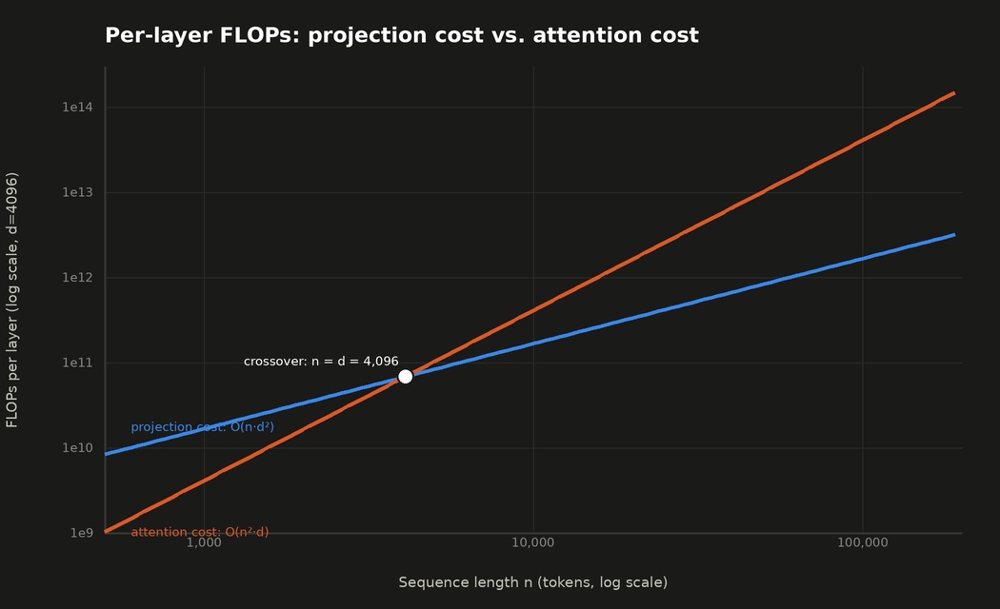

## Context Windows & Tokenization

> Chapter of [[ai-foundations/readme#00 — Foundations of Modern AI|Foundations of Modern AI]], part
> of [[ai-foundations/readme|AI & LLM Foundations]].

## What you will understand at the end

- How BPE, WordPiece, and SentencePiece actually differ, not just that they're "subword tokenizers"
- Why attention cost scales quadratically with sequence length, and why that single fact is the real
  reason context windows are finite and expensive to extend
- The concrete strategies (chunking, sliding windows, summarization) for operating inside a fixed
  token budget, and when each one is the right tool

This chapter covers the _mechanics_ of tokenization and the _cost model_ of context length. See
[[02-context-windows|Context Windows]] (Part 02 of Agentic AI Engineering) for the
memory-architecture question this leads to: when to stuff history into the prompt versus offload it
to external memory.

---

## Tokenizer algorithms

All three algorithms below solve the same problem — how to split text into a fixed, finite
vocabulary of subword pieces so the model never hits a truly "unknown" word — but they differ in
_how_ they decide where to split.

### Byte-Pair Encoding (BPE)

BPE starts from individual characters (or bytes) and greedily merges the most frequent adjacent
pair, repeated thousands of times, building up a vocabulary of increasingly long subword units.

```
Start:  ["l", "o", "w", "e", "r"]  ["n", "e", "w", "e", "s", "t"]
Merge most frequent pair "e"+"s" -> "es":  ["l", "o", "w", "e", "r"]  ["n", "e", "w", "es", "t"]
Merge "es"+"t" -> "est":  ...  ["n", "e", "w", "est"]
... repeat thousands of times until vocabulary size target is reached
```

The result: common words end up as single tokens (`"the"`, `"is"`), while rare or novel words
decompose into smaller, still-meaningful pieces (`"tokenization"` → `["token", "ization"]`). This is
exactly what guarantees a subword tokenizer never truly fails on unseen text — worst case, it falls
back to individual characters or bytes. GPT-family models use **byte-level BPE**, which operates on
raw UTF-8 bytes rather than Unicode characters, so it can represent _any_ text — emoji, any
language's script, malformed input — with zero out-of-vocabulary tokens, at the cost of using more
tokens for scripts underrepresented in the training merges.

### WordPiece

WordPiece (used by BERT) is similar to BPE but changes the merge criterion: instead of merging the
_most frequent_ adjacent pair, it merges the pair that most increases the **likelihood of the
training corpus** under a language-model objective. In practice this produces vocabularies similar
in spirit to BPE's, but the merge order is chosen to directly optimize a modeling objective rather
than raw frequency.

### SentencePiece

BPE and WordPiece both assume text is already split into words by whitespace before subword merging
begins — which breaks for languages without whitespace-delimited words (Japanese, Chinese, Thai).
SentencePiece treats the input as a raw character stream with no whitespace pre-tokenization step,
learning subword units (via BPE or a unigram language model, both supported) directly over that
stream, and encodes whitespace itself as an ordinary symbol. This makes it the standard choice for
multilingual models (T5, LLaMA, many Google models) where word boundaries can't be assumed.

| Algorithm     | Splits on whitespace first? | Merge criterion                    | Typical use                     |
| ------------- | --------------------------- | ---------------------------------- | ------------------------------- |
| BPE           | Yes (usually)               | Most frequent adjacent pair        | GPT-family (byte-level variant) |
| WordPiece     | Yes                         | Maximizes corpus likelihood        | BERT                            |
| SentencePiece | No — raw character stream   | BPE or unigram LM, over raw stream | Multilingual models (T5, LLaMA) |

### Vocabulary size is itself a tradeoff, not a free parameter

More merge steps produce a larger vocabulary, and a larger vocabulary means common multi-character
sequences get captured as single tokens more often — so the same text encodes into _fewer_ tokens.
That's valuable (it stretches a fixed context budget further and reduces per-request cost), but it
isn't free:



| Vocabulary size | Tokens for the reference passage | Embedding-table parameters (`vocab × d_model`, `d_model=4096`) |
| --------------- | -------------------------------- | -------------------------------------------------------------- |
| 16,000          | ~2,700                           | 65.5M                                                          |
| 32,000          | ~2,300                           | 131.1M                                                         |
| 50,000          | ~2,100                           | 204.8M                                                         |
| 100,000         | ~1,850                           | 409.6M                                                         |
| 250,000         | ~1,600                           | 1.024B                                                         |

Every step right on the chart is a step down that table: fewer tokens per request, but a larger
embedding table (and, if the output projection shares those weights, a larger output layer too) that
has to be trained, stored, and loaded — parameters spent on vocabulary coverage instead of model
capacity. This is a genuine capacity-allocation decision a model's designers make once, not
something an application engineer tunes per-request — but it's worth recognizing why GPT-family,
BERT, and LLaMA-family models all land in noticeably different vocab-size neighborhoods, and why
"just use a bigger vocabulary" has a real, non-obvious cost attached.

**Silent tokenizer/vocab mismatch** is a production failure mode that lives right here, at the
tokenizer/model boundary, and it's dangerous precisely because it doesn't throw an error. A model's
embedding table has one row per vocabulary entry; if a request is tokenized with the wrong tokenizer
version, a stale vocab file, or a fine-tune that added special tokens without resizing the embedding
matrix, token IDs still decode to _something_ — just not the token the model was trained to
associate with that ID. The output degrades (subtly, or not so subtly) with no exception raised
anywhere in the stack, which is what makes it worth naming explicitly rather than trusting "if the
code runs, the tokenizer must be right."

---

## Why context windows are finite: the quadratic cost problem

Self-attention (see
[[04-transformer-architecture#How expensive is this, and what dominates|Transformer Architecture]])
computes a relevance score between _every pair_ of tokens in the sequence. For a sequence of length
`n` and model dimension `d`, that chapter derives the full per-layer cost as `O(n·d² + n²·d)` —
projections scale linearly in sequence length, the attention score and weighted-value computations
scale quadratically. **O(n²)** is the shorthand for the term that matters once `n` gets large.



**Worked example, using that formula directly with `d = 4096`, 12 layers:**

| Sequence length `n`   | Projection cost `n·d²` | Attention cost `n²·d` | Which dominates                              |
| --------------------- | ---------------------- | --------------------- | -------------------------------------------- |
| 4,096 (= `d`)         | `6.87 × 10¹⁰`          | `6.87 × 10¹⁰`         | Equal — this is the crossover point, `n = d` |
| 32,768 (8× longer)    | `5.50 × 10¹¹`          | `4.40 × 10¹²`         | Attention, by 8×                             |
| 128,000 (~31× longer) | `2.15 × 10¹²`          | `6.71 × 10¹³`         | Attention, by ~31×                           |



This is _the_ reason context windows have a hard limit and why serving longer context costs
disproportionately more, not linearly more: doubling input length doesn't double the work, it
roughly quadruples the attention term specifically, and past the `n = d` crossover that term is what
the bill is actually made of. Production mitigations (sparse attention patterns, sliding-window
local attention, linear-attention approximations, FlashAttention's memory-efficient exact
computation) all exist specifically to soften this curve — but none of them make the underlying
tradeoff disappear, which is why "just increase the context window" is never a free engineering
decision.

**The practical consequence for cost:** input tokens, output tokens, and — where supported — cached
tokens are priced and billed differently by every major provider precisely because they have
different compute costs under this curve. Treating a 100k-token prompt as "just more input" ignores
that its marginal cost is not the same per-token cost as a 1k-token prompt.

### The KV cache: the memory side of the same story

Everything above is a _compute_ cost. Serving is usually constrained by a separate, _memory_ cost:
the **KV cache**. Autoregressive generation reuses every previous token's key and value vectors at
every subsequent step, rather than recomputing them — that's the entire point of caching — so they
have to be held in memory for the life of the request:

```
KV cache size ≈ 2 × n_layers × n_tokens × d_model × bytes_per_param
```

The leading `2` is for storing both K and V. **Worked example** at a realistic large-model scale
(`n_layers = 80`, `d_model = 8192`, bf16 → 2 bytes/param — roughly a 70B-class dense model):

```
per token: 2 × 80 × 8192 × 2 bytes = 2,621,440 bytes ≈ 2.5 MiB / token
```

| Context length | KV cache (plain multi-head attention) | KV cache (with 8× GQA) |
| -------------- | ------------------------------------- | ---------------------- |
| 4,096 tokens   | 10.0 GiB                              | 1.25 GiB               |
| 32,768 tokens  | 80.0 GiB                              | 10.0 GiB               |
| 128,000 tokens | 320.0 GiB                             | 40.0 GiB               |

That top-right cell is the concrete mechanism behind **"OOM from long context"**: a single
128k-token request, on a plain multi-head-attention model, needs 320 GiB just for its KV cache —
more than fits on any single accelerator, before the model's own weights are even loaded. This is
exactly why production long-context serving depends on **GQA (Grouped-Query Attention)** or **MQA
(Multi-Query Attention)** — sharing K/V projections across multiple query heads instead of giving
every head its own — which is what makes the right-hand column possible. Add this to the existing
mitigation list below: sparse/sliding-window attention and FlashAttention reduce _compute_; GQA/MQA
reduce _memory_ — a real production system usually needs both, because they solve different halves
of this chapter's cost story.

**"Lost in the middle"** (Liu et al., 2023) is a third, qualitatively different failure mode that
survives even when a prompt technically fits in context and the KV cache technically fits in memory:
models reliably recall information placed at the very start or very end of a long context more
reliably than information buried in the middle, regardless of the middle content's actual relevance.
"It fits in the context window" and "the model will actually use it well" are different claims. The
practical mitigation lives in retrieval, not in tokenization: reorder retrieved chunks so the most
relevant ones land at the edges of the prompt, not the middle — see [[06-reranking|Reranking]] and
[[03-chunking-strategies|Chunking Strategies]].

---

## Working within a fixed token budget

Given that context is finite and quadratically expensive, three practical strategies dominate
production systems:

### Chunking

Split a large document into smaller pieces _before_ it ever needs to occupy context — process or
retrieve chunks independently rather than loading the whole document at once. Chunk boundary choice
materially affects downstream quality: splitting mid-sentence or mid-table row loses coherence a
reader (or a retrieval system) depends on. See [[03-chunking-strategies|Chunking Strategies]] for
fixed-size vs. recursive vs. semantic chunking tradeoffs.

### Sliding windows

For a sequence that must be processed linearly (a very long conversation, a long document scanned
for a pattern) but doesn't fit in one context window, a sliding window processes overlapping
segments — position `[0, n]`, then `[n-overlap, 2n-overlap]`, and so on — carrying just enough
overlap forward that information spanning a window boundary isn't lost. The overlap size is a direct
tradeoff: more overlap protects against boundary information loss, at the cost of reprocessing the
same tokens (and paying for them) multiple times.

### Summarization-on-overflow

Once accumulated context (e.g. a long-running conversation or agent trajectory) exceeds budget,
compress the _older_ portion into a shorter summary and keep only the most recent turns verbatim.
This trades some fidelity (details in the summarized region are lossy) for indefinitely bounded
context size — the standard technique for [[04-short-term-memory|Short-Term Memory]]'s
sliding-window-with-summarization pattern in a multi-turn agent.

| Strategy                  | Best for                                                                 | Cost                                        |
| ------------------------- | ------------------------------------------------------------------------ | ------------------------------------------- |
| Chunking                  | Documents processed independently (retrieval corpora)                    | Loses cross-chunk context unless overlapped |
| Sliding window            | Linear scans over content too long for one window                        | Reprocesses overlapped tokens repeatedly    |
| Summarization-on-overflow | Long-running conversations/agent loops that must keep going indefinitely | Lossy compression of older context          |

The unifying principle: every one of these strategies is a deliberate, engineered tradeoff between
**fidelity** (keeping everything, verbatim) and **cost** (staying within a token budget that scales
quadratically) — there is no strategy that avoids making this tradeoff, only different ways of
choosing where to make it.

---

## Why this matters once you're building agents, not training models

Nearly every context-budget decision an agent system makes traces back to the two cost curves in
this chapter: the compute curve (`O(n·d² + n²·d)`, why cost isn't linear in prompt length) and the
memory curve (the KV cache, why long-context serving is capacity-constrained in a way short-context
serving isn't). "Why is this agent's long-running conversation suddenly slow and expensive" is
almost always one of these two curves showing up in production, not a bug in the agent's own logic —
and "why did retrieval put the right document in context but the model still missed it" is "lost in
the middle," not a retrieval failure. Reading which curve (or which failure mode) is actually in
play is the practical skill this chapter exists to build.

## Metadata

|        |                |
| ------ | -------------- |
| Author | Amit Singh     |
| Scope  | ai-foundations |
