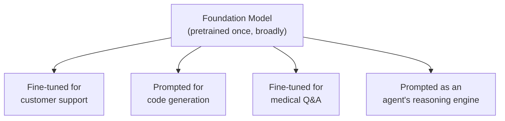
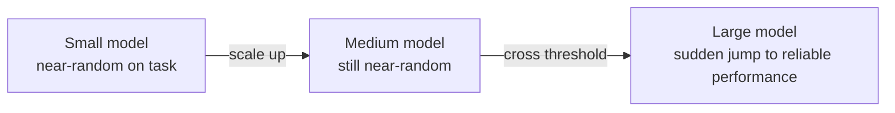
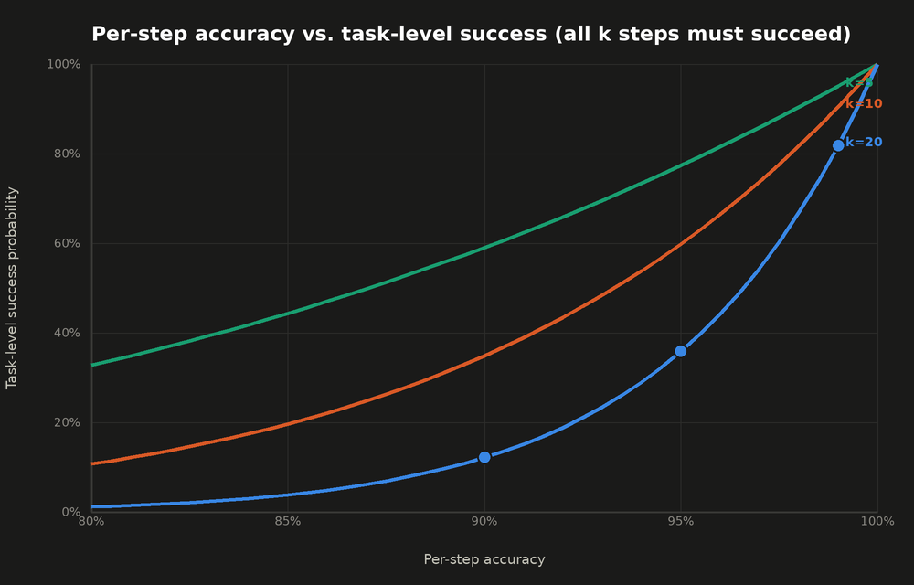

## Foundation Models

> Chapter of [[ai-foundations/readme#00 — Foundations of Modern AI|Foundations of Modern AI]], part
> of [[ai-foundations/readme|AI & LLM Foundations]].

## What you will understand at the end

- The precise definition of "foundation model" — it's about training methodology and downstream
  transfer, not raw parameter count
- Why capabilities can appear suddenly at scale (emergence) rather than improving smoothly, and why
  that makes foundation model behavior harder to predict than traditional software
- How to place the major model families on the dimensions that actually matter for choosing one:
  modality, openness, and context length

---

## What makes a model "foundational"

A foundation model is trained once, at large scale, on broad data via self-supervised objectives
(see [[02-machine-learning-fundamentals|Machine Learning Fundamentals]]), and then **adapted** — via
fine-tuning or, increasingly, just prompting — to many downstream tasks it was never explicitly
trained for. The term (popularized by Stanford's 2021 "On the Opportunities and Risks of Foundation
Models" paper) is deliberately about the training _methodology and transfer pattern_, not about
parameter count — a model becomes "foundational" the moment it's designed to be a reusable base for
many applications, not a one-off model trained for a single task.



This is the direct contrast with the pre-2017 default described in
[[01-the-evolution-of-artificial-intelligence#Era 4 — Deep Learning (2012–2017)|The Evolution of Artificial Intelligence]]:
a translation model trained from scratch could only translate; a foundation model trained once can
translate, summarize, answer questions, and write code, because none of those capabilities require
retraining from zero — they're elicited from the same underlying pretrained weights.

## Transfer learning — why one pretraining run pays for many tasks

Pretraining on broad data teaches a model general-purpose representations — of syntax, world facts,
reasoning patterns — that turn out to be useful substrate for almost any downstream language task.
**Transfer learning** is the practice of reusing those representations instead of learning them from
scratch per task:

| Adaptation method                                | How much of the model changes                                                | When to use it                                                                                                                                                              |
| ------------------------------------------------ | ---------------------------------------------------------------------------- | --------------------------------------------------------------------------------------------------------------------------------------------------------------------------- | ---------------------------------------------------------------------------------------------------------------------------------------- |
| Full fine-tuning                                 | All parameters updated on task-specific data                                 | Maximum task-specific quality, when you can afford the compute and have enough data — \*\*and the risk of [[08-large-language-models#Stage 2 — Supervised Fine-Tuning (SFT) | catastrophic forgetting]]\*\*, the pretrained model's general capability degrading while it overfits the narrow fine-tuning distribution |
| Parameter-efficient fine-tuning (LoRA, adapters) | A small number of added parameters updated; base weights frozen              | Cheap, fast iteration; the dominant approach for customizing an open-weight model today                                                                                     |
| Prompting only (zero-/few-shot)                  | No parameters updated at all — behavior is elicited purely through the input | Fastest to iterate, no training infrastructure needed; the default for most agentic-AI use cases in this book                                                               |

**The memory gap between the top two rows is real and large, not just "full fine-tuning is somewhat
more expensive."** Mixed-precision full fine-tuning with Adam needs, per parameter: fp16 weights (2
bytes) + fp16 gradients (2 bytes) + a full-precision master weight copy (4 bytes) + Adam's two
running-average moments in full precision (4 bytes each) — **~16 bytes/parameter** of resident
state, before counting activations. For a 7B-parameter model: `7 × 10⁹ × 16 bytes ≈ 112 GB`, just
for weights and optimizer state. LoRA freezes the base model (inference-only, ~2 bytes/parameter in
fp16 → `14 GB` for the same 7B base) and only carries the expensive 16-bytes/parameter optimizer
state for the small adapter matrices — at a typical 0.5% trainable fraction (35M parameters):
`35 × 10⁶ × 16 bytes ≈ 0.56 GB`. Total for LoRA: `~14.6 GB`, against full fine-tuning's `112 GB` —
**nearly an order of magnitude less**, which is the actual, quantified reason PEFT dominates
open-weight model customization today, not just a qualitative "it's cheaper" claim.

The trend visible across the industry is a steady shift down this table — from full fine-tuning
toward prompting-only — precisely because foundation models keep getting more capable at following
instructions purely from context, reducing how often the earlier, more expensive adaptation methods
are actually necessary. See [[01-prompt-engineering-fundamentals|Prompt Engineering Fundamentals]]
for what that looks like in practice.

## Emergent capabilities — why scale surprises you

Some capabilities don't improve smoothly with scale — they're near-absent below a certain model
size, then appear abruptly above it. Multi-step arithmetic, certain forms of chain-of-thought
reasoning, and instruction-following-from-few-examples have all been documented as **emergent**:
absent or near-random in smaller models in a family, then reliably present once a scale threshold is
crossed, in a way that extrapolating from smaller models' performance would not have predicted.



**Why this matters operationally, not just academically:** you cannot always reliably predict
whether a capability your agent depends on will hold at a smaller/cheaper model tier by
extrapolating from how a larger tier performs — an emergent capability can vanish entirely below its
threshold rather than degrading gracefully. This is the direct justification for the per-capability
evaluation gates covered in [[04-offline-evaluation|Offline Evaluation]] before routing any task to
a cheaper model tier — see [[07-model-selection-and-routing|Model Selection & Routing]].

**A sharper, interview-grade nuance: some "emergence" is a measurement artifact, not a break in the
underlying scaling law.** Schaeffer et al. (2023, "Are Emergent Abilities of Large Language Models a
Mirage?") make the point precisely: if a task is scored as "all-or-nothing correct" (every one of
`k` required sub-steps must succeed), a perfectly smooth improvement in _per-step_ accuracy can look
like a sudden jump in _task-level_ success, purely from how the metric is defined. For `k = 20`
sub-steps:

```
per-step accuracy 90% -> task success 0.90²⁰ ≈ 12%
per-step accuracy 95% -> task success 0.95²⁰ ≈ 36%
per-step accuracy 99% -> task success 0.99²⁰ ≈ 82%
```

Per-step accuracy improved smoothly (90 → 95 → 99, a 9-point total gain), but task-level success
jumped from 12% to 82% — a curve that _looks_ like a discontinuous threshold effect is entirely
explained by the underlying smooth improvement raised to the `k`-th power.



Notice all three curves are smooth — no discontinuity anywhere — but the higher-`k` curves visually
_read_ as if something suddenly switched on around 90-95% per-step accuracy. A benchmark built from
many chained sub-steps (a long tool-use trajectory, a multi-hop reasoning chain) will look like it
has a sharp emergence threshold for exactly this reason, even when nothing about the underlying
model capability changed discontinuously at all. This connects directly to
[[01-the-evolution-of-artificial-intelligence#Era 5 — The Transformer and Foundation Models (2017–2022)|the scaling-law chart in The Evolution of Artificial Intelligence]]:
loss decreases smoothly and predictably with compute; whether a specific _downstream task metric_
looks smooth or emergent depends heavily on how that metric is constructed, which is exactly the gap
between "the scaling law held" and "the capability I need showed up," and why routing to a cheaper
model tier on the strength of a smooth-looking benchmark curve is still a real risk.

## Surveying the major foundation model families

Rather than track version numbers (which turn over faster than this book can), the durable axes to
evaluate a foundation model family on are:

| Axis                  | What it determines                                                                                                                                                              |
| --------------------- | ------------------------------------------------------------------------------------------------------------------------------------------------------------------------------- | ----------------------------------------------------------------- |
| Modality              | Text-only vs. multimodal (vision, audio) input/output support                                                                                                                   |
| Openness              | Closed API-only (Claude, GPT, Gemini) vs. open-weight (LLaMA, Mistral, Qwen family) — determines whether you can self-host, fine-tune the base weights, or run fully air-gapped |
| Context length        | Directly gates how much [[06-context-windows-and-tokenization                                                                                                                   | Context Windows & Tokenization]] budget an application can assume |
| Reasoning mode        | Standard next-token generation vs. a reasoning variant that spends extra inference-time compute — see [[09-reasoning-models                                                     | Reasoning Models]]                                                |
| Tool-calling maturity | How reliably the model produces well-formed, schema-conformant tool calls — the load-bearing capability for everything in this book past Part 01                                |

Open-weight models matter architecturally beyond "cheaper": they're the only option when data
residency or air-gapped deployment is a hard constraint (a recurring theme in
[[09-compliance|Compliance]]), and they let a platform team fine-tune the base weights directly
rather than being limited to whatever adaptation surface a closed API exposes.

**The practical takeaway for an architect:** picking a foundation model family is rarely about which
one benchmarks highest this quarter — benchmark leadership rotates continuously across releases.
It's about which combination of these five axes matches the actual deployment constraint (data
residency, latency budget, tool-calling reliability, cost per token at your volume) that won't
change even after the next model release does.

---

## Why this matters once you're building agents, not training models

The two failure modes this chapter names — catastrophic forgetting from over-aggressive fine-tuning,
and emergent capability that can vanish below a scale threshold — are both versions of the same
warning: a foundation model's behavior at your chosen scale and adaptation method is not something
to assume from a benchmark table, it's something to verify for the specific capability your agent
actually depends on. See [[08-large-language-models|Large Language Models]] for the mechanism that
produces catastrophic forgetting during SFT specifically, and
[[04-offline-evaluation|Offline Evaluation]] for how that verification gets built into a production
pipeline instead of discovered in an incident.

## Metadata

|        |                |
| ------ | -------------- |
| Author | Amit Singh     |
| Scope  | ai-foundations |
