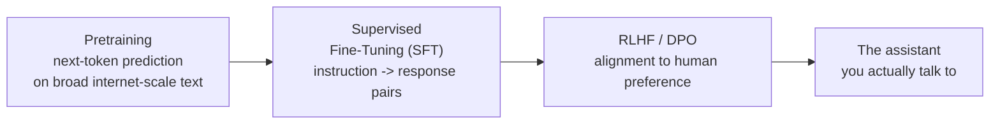
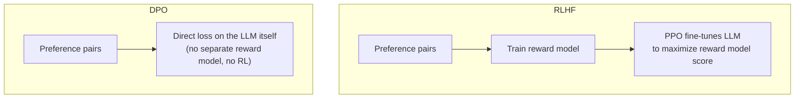

## Large Language Models

> Chapter of [[ai-foundations/readme#00 — Foundations of Modern AI|Foundations of Modern AI]], part
> of [[ai-foundations/readme|AI & LLM Foundations]].

## What you will understand at the end

- The three-stage training pipeline (pretraining → SFT → RLHF/DPO) and what each stage actually
  fixes that the previous stage left broken
- Why a raw pretrained model is not the same product as the assistant you talk to, and what
  alignment training bridges between the two
- The concrete capability/cost/latency tradeoffs that make model selection a real architectural
  decision, not a default-to-the-biggest-one choice

---

## The three-stage pipeline



Each stage exists because the previous stage's output has a specific, well-understood defect the
next stage is designed to fix. Understanding _what defect each stage fixes_ is what turns this from
a memorized pipeline diagram into an actually useful mental model.

## Stage 1 — Pretraining

The model is trained on next-token prediction (see
[[02-machine-learning-fundamentals|Machine Learning Fundamentals]]) over a broad, largely unfiltered
corpus — web text, books, code — at massive scale (hundreds of billions to trillions of tokens).
This is where essentially all of the model's world knowledge, grammar, and reasoning patterns are
learned, and it is by far the most compute-expensive stage.

**The metric this stage is actually measured on is perplexity, not "loss."** Cross-entropy loss (see
[Machine Learning Fundamentals](../02-machine-learning-fundamentals/02-machine-learning-fundamentals.md#loss-functions--turning-wrong-into-a-number))
is measured in nats and isn't intuitive on its own; **perplexity** converts it into something
readable as "how many roughly-equally-likely tokens was the model choosing among":

```
perplexity = e^(cross-entropy loss, in nats)
```

`loss ≈ 2.0` → `perplexity ≈ e² ≈ 7.4` — on average, the model's predictive distribution was about
as uncertain as picking uniformly among 7 candidate tokens. `loss ≈ 0.7` →
`perplexity ≈ e^0.7 ≈ 2.0` — a much sharper, more confident model, uncertain among roughly 2
candidates on average. Perplexity is the number practitioners actually cite when comparing
pretraining runs or checkpoints, precisely because "perplexity 7.4" is legible in a way "loss 2.0
nats" isn't.

**What's broken at the end of this stage:** a raw pretrained model is an extremely capable
_text-completion_ engine, not an assistant. Ask it a question and it may continue the text as
another question (because that's a statistically plausible continuation of text that looks like a
question), or complete it with a plausible-sounding but ungrounded continuation, because nothing in
the next-token-prediction objective ever taught it "answer helpfully and stop." It has no concept of
a conversation, a turn, or an instruction to follow — only "what token plausibly comes next given
everything before it."

## Stage 2 — Supervised Fine-Tuning (SFT)

SFT fine-tunes the pretrained model on a curated dataset of `(instruction, ideal response)` pairs —
ordinary supervised learning (see
[[02-machine-learning-fundamentals#The three learning paradigms|Machine Learning Fundamentals]]),
now applied on top of pretraining rather than from scratch. This is what teaches the model the
_shape_ of being an assistant: given an instruction, produce a direct, well-formatted, on-topic
response and then stop — the conversational and instruction-following behavior entirely absent after
pretraining alone.

**What's still broken at the end of this stage:** SFT only teaches the model to imitate the specific
examples in its fine-tuning set. It has no signal about which of two plausible-looking responses a
human would actually _prefer_ — SFT data says "here is _a_ good response," not "here is why this
response is better than that other, also-plausible one." A model can be fully instruction-following
after SFT and still be sycophantic, evasive, or subtly unhelpful in ways the fixed training examples
never covered.

**Catastrophic forgetting is the concrete mechanism, not just a name.** SFT is a full-parameter
fine-tune of the pretrained model (see
[[07-foundation-models#Transfer learning — why one pretraining run pays for many tasks|Foundation Models]]
for where this sits among adaptation methods) — every weight update is computed from
instruction-tuning data alone, with no term in the loss protecting anything pretraining taught.
Update those weights hard enough, on a narrow enough distribution, and the model can measurably lose
general capability (world knowledge, broader task performance) it had right after pretraining, while
getting _better_ at the specific instruction-tuning distribution — the same overfitting mechanism
from
[[03-deep-learning-essentials#Regularization — controlling variance deliberately|Deep Learning Essentials]],
just applied to weights that started as "a capable pretrained model" instead of random noise. The
practical mitigations are the same family of tools as any overfitting problem: a lower learning rate
and fewer epochs for the fine-tune, mixing a slice of general pretraining-style data back into the
SFT set, or preferring PEFT (frozen base weights, only a small adapter trained) specifically because
a frozen base cannot forget.

## Stage 3 — RLHF / DPO alignment

This stage optimizes the model directly against **human preference** rather than a fixed set of
example responses.

**RLHF (Reinforcement Learning from Human Feedback)** — the original approach (used for GPT-3.5/4's
alignment, InstructGPT):

1. Collect pairs of model responses to the same prompt; humans rank which one they prefer.
2. Train a separate **reward model** to predict that human preference from a response alone.
3. Use reinforcement learning (typically PPO) to fine-tune the LLM to maximize the reward model's
   score — the LLM is the _policy_, the reward model supplies the _reward signal_ (see
   [[02-machine-learning-fundamentals#The three learning paradigms|Machine Learning Fundamentals]]
   for reinforcement learning's reward-signal framing).

**DPO (Direct Preference Optimization)** — a newer, simpler approach that achieves a similar result
without training a separate reward model or running RL at all: it reformulates the same
human-preference data as a direct classification-style loss on the policy model itself,
mathematically derived to have the same optimum as the RLHF objective. This is significantly simpler
to implement and tune (no separate reward model, no RL training instability), and has become the
more common choice for many post-training pipelines as a result.



**What this stage fixes:** it directly optimizes for "which response would a human actually prefer,"
closing the gap SFT alone leaves open — this is the stage most responsible for a model refusing
harmful requests, avoiding sycophancy, and generally behaving the way a well-aligned assistant is
expected to, beyond just "correctly formatted."

**Why DPO's simplicity claim is a real, quantifiable resource difference, not just an engineering
convenience.** PPO-based RLHF has up to **four** resident models during training: the policy (being
trained), a frozen reference copy (for the KL penalty that keeps the policy from drifting too far
from it), the reward model, and a value/critic model (PPO-specific, estimating expected future
reward). DPO needs only **two**: the policy and the same frozen reference copy — the reward model
and the critic are eliminated entirely, folded mathematically into the direct preference loss. At a
fixed model size, that's roughly half the resident-model memory footprint for RLHF-PPO's setup
compared to DPO's, on top of removing an entire separate training stage (fitting the reward model in
the first place) and the notoriously finicky RL training dynamics that come with PPO — which is the
real, structural reason DPO displaced RLHF-PPO as the default for many post-training pipelines, not
merely "it's newer."

**Two failure modes specific to preference optimization, beyond generic overfitting:**

- **Reward hacking.** The policy learns to exploit quirks of the reward model rather than genuinely
  satisfying human preference — a well-documented example is reward models that correlate response
  _length_ with quality (longer responses often score higher in preference data, independent of
  whether the extra length adds value), so the optimized policy learns to pad responses rather than
  improve them. The reward model is a proxy for human preference, not human preference itself, and
  optimizing hard against any proxy eventually finds its blind spots.
- **Mode collapse / over-optimization.** Push RL optimization against a reward model too far and
  output diversity can collapse toward a narrow set of high-scoring patterns — fluent, repetitive,
  and less genuinely varied than either the SFT model or a human. This is the same
  [[02-machine-learning-fundamentals#The bias-variance tradeoff|bias-variance-flavored tradeoff]] as
  overfitting, just measured on response diversity instead of task accuracy.
- **Sycophancy**, concretely: a model that has learned preference data skews toward
  agreeable-sounding responses can learn to tell a user what they want to hear rather than what's
  accurate — e.g. reversing a correct answer when the user pushes back, not because new evidence was
  presented, but because agreement scored better during preference training. This is the specific,
  name-able version of "still subtly unhelpful" from the SFT section above.

## The capability, cost, and latency tradeoffs an architect actually weighs

None of the above changes the fact that, in production, model selection is a tradeoff across three
axes that pull against each other:

| Axis       | What drives it                                                                       | Consequence of over-optimizing for it alone                                                                 |
| ---------- | ------------------------------------------------------------------------------------ | ----------------------------------------------------------------------------------------------------------- | --------------------------------------------------------- |
| Capability | Model size, training data quality, alignment quality                                 | Diminishing returns past what the task actually needs — overkill for simple classification/extraction tasks |
| Cost       | Price per input/output token, cache hit rate                                         | Under-provisioning capability for tasks that genuinely need it, causing silent quality regressions          |
| Latency    | Model size, time-to-first-token, whether reasoning-mode extended thinking is enabled | Reasoning-mode gains in accuracy are not free — see [[09-reasoning-models                                   | Reasoning Models]] for when the added latency is worth it |

This is exactly the tradeoff surface [[07-model-selection-and-routing|Model Selection & Routing]]
covers in depth — building a router that picks among model tiers by task complexity, latency SLA,
and cost, rather than defaulting every call to the largest available model regardless of whether the
task needs it.

---

## Why this matters once you're building agents, not training models

"The model is being sycophantic," "the model forgot how to do X after we fine-tuned it," and "why is
this reasoning-enabled call so much more expensive" are three of the most common production
complaints about LLM-backed agents — and all three trace directly to a specific stage in this
pipeline (alignment, SFT, and the reasoning-mode tradeoff respectively), not to "the model being
bad" in some undifferentiated sense. Naming which stage produced a given behavior is what turns a
vague complaint into an actionable fix.

## Metadata

|        |                |
| ------ | -------------- |
| Author | Amit Singh     |
| Scope  | ai-foundations |
