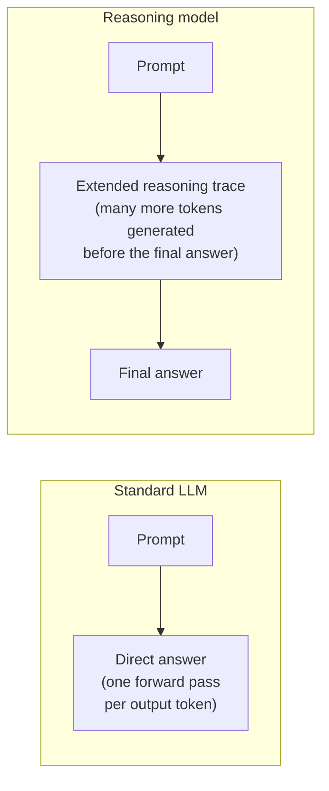
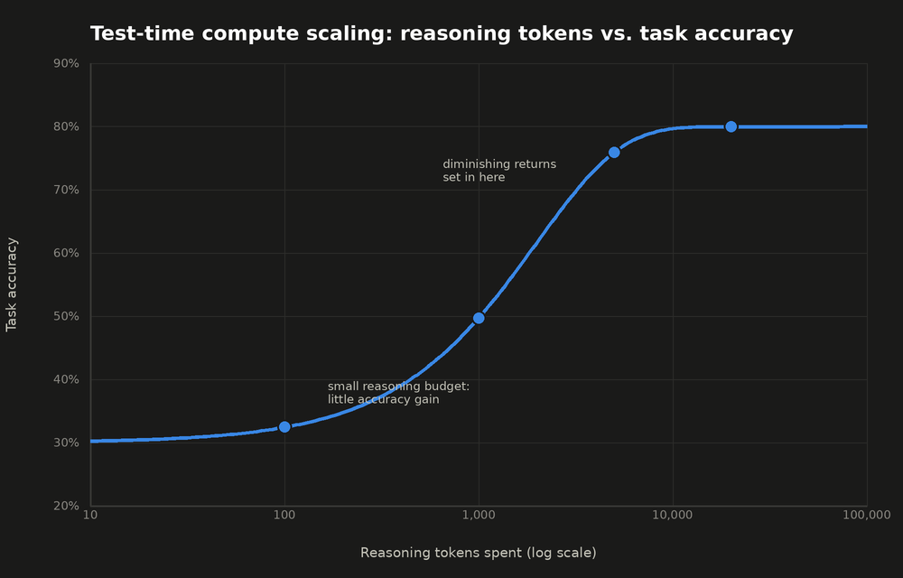

## Reasoning Models

> Chapter of [[ai-foundations/readme#00 — Foundations of Modern AI|Foundations of Modern AI]], part
> of [[ai-foundations/readme|AI & LLM Foundations]].

## What you will understand at the end

- Why "reasoning model" describes a different way of _using_ inference compute, not a different
  transformer architecture
- The difference between prompted chain-of-thought and a model natively trained to reason before
  answering
- A concrete framework for deciding when the added latency and cost of a reasoning model is actually
  worth paying for

---

## It's an inference-time strategy, not a new architecture

A reasoning model (OpenAI's o1/o3, Claude's extended thinking mode, DeepSeek-R1) is still the same
decoder-only transformer described in [[04-transformer-architecture|Transformer Architecture]]. What
changes is how it's trained and how it's _allowed to spend compute at inference time_: instead of
generating a direct answer immediately, it first generates an extended internal reasoning trace —
working through the problem step by step — before producing the final response.



This is why the framing "scaling test-time compute" is more precise than "a smarter model": the same
underlying capability can be made to perform better on hard, multi-step problems simply by letting
it generate (and effectively "think" through) more tokens before committing to an answer — trading
latency and cost for accuracy, at inference time, without touching model weights.

**This is the inference-time analog of the training-time scaling law from
[[01-the-evolution-of-artificial-intelligence#Era 5 — The Transformer and Foundation Models (2017–2022)|The Evolution of Artificial Intelligence]]:**
just as loss falls smoothly (then flattens) with more _training_ compute, task accuracy rises
smoothly (then flattens) with more _test-time_ reasoning compute:



The shape is the same lesson as the training-time curve, applied to a different budget: past some
point, spending more reasoning tokens on the same problem buys very little additional accuracy —
which is precisely why "just let it think longer" is not a free accuracy lever any more than "just
make the model bigger" was in the training-time story.

**A worked cost example, to make "reasoning models cost more" a number instead of a warning.** A
standard call answering directly in 50 output tokens, versus the same question routed to a reasoning
model that spends 4,000 reasoning tokens before a 50-token final answer, at a representative
$15-per-million-output-tokens price (reasoning tokens are billed as output tokens by most
providers):

```
standard call:  50 tokens     × ($15 / 1,000,000) = $0.00075
reasoning call: 4,050 tokens  × ($15 / 1,000,000) = $0.06075

cost multiplier for this single call: ~81x
```

That 81x isn't a worst case — it's what a single hard, multi-step question costs relative to a
simple one, on the same model family, purely from the reasoning trace. At any real request volume,
routing every call through reasoning mode "just to be safe" is exactly how a cost budget gets blown
without a corresponding accuracy win — which is the routing decision the rest of this chapter builds
toward.

**Two failure modes specific to spending inference-time compute this way:**

- **Reasoning-token runaway.** A reasoning model working an unsolvable or ill-posed problem has no
  natural stopping point — without a hard ceiling, it can keep generating reasoning tokens
  indefinitely, burning an unbounded budget for zero accuracy gain. The mitigation is exactly the
  max-iteration/timeout pattern already standard for agent loops generally — see
  [[01-agent-runtime|Agent Runtime]] — applied specifically to a single reasoning call's token
  budget, not just the outer agent loop.
- **Reasoning-trace exposure.** Raw chain-of-thought can contain unfiltered intermediate content the
  model wouldn't produce in a final answer, and a long reasoning trace is more surface area for
  prompt-injection or jailbreak techniques to probe. Some providers deliberately withhold raw
  reasoning tokens from the API response for exactly this reason, exposing only a summary. See
  [[01-guardrails|Guardrails]] for where this fits in a broader defense posture.

## Prompted chain-of-thought vs. trained-in reasoning

**Chain-of-thought (CoT) prompting** (see [[01-chain-of-thought|Chain of Thought]]) is a technique
applicable to _any_ LLM: asking it to "think step by step" elicits intermediate reasoning tokens
from a standard model, purely through prompting, with no special training involved. It reliably
improves performance on multi-step tasks, but the model was never _trained_ specifically to produce
or benefit from this behavior — it's an emergent side effect of how pretraining exposes the model to
text containing step-by-step reasoning.

**Reasoning models** are explicitly trained — often via reinforcement learning over reasoning traces
— to produce and benefit from extended, high-quality internal reasoning before answering, and to
know when a problem warrants more of it. The practical difference: a reasoning model adaptively
varies how much it "thinks" based on the problem's apparent difficulty, and its reasoning traces
tend to include self-correction (noticing and fixing its own errors mid-trace) far more reliably
than a standard model's prompted CoT does.

| Approach                  | Requires special training?           | Reasoning depth                                               | Cost model                                                                   |
| ------------------------- | ------------------------------------ | ------------------------------------------------------------- | ---------------------------------------------------------------------------- |
| Prompted chain-of-thought | No — works on any LLM                | Fixed, whatever the prompt elicits                            | Extra output tokens for the reasoning trace, same per-token price            |
| Trained reasoning model   | Yes — RL-trained on reasoning traces | Adaptive — model decides how much reasoning the problem needs | Often billed distinctly for "thinking" tokens, sometimes at a different rate |

## When the added latency and cost is actually justified

Reasoning models are not a strict upgrade — they cost more (more tokens generated per response) and
are slower (time-to-first-final-answer includes the entire reasoning trace) than a standard call to
the same model family. The decision of when to route to one is a concrete instance of the
capability/cost/latency tradeoff introduced in
[[08-large-language-models#The capability, cost, and latency tradeoffs an architect actually weighs|Large Language Models]].

**Reasoning models earn their cost on:**

- Multi-step math, logic, or planning problems where a single-pass answer is genuinely unreliable
- Debugging or root-cause tasks with several plausible-but-wrong intermediate hypotheses to rule out
- Tasks where getting it right the first time is cheaper than a retry loop built around a faster,
  less reliable model

**Reasoning models are wasted spend on:**

- Simple classification, extraction, or formatting tasks a smaller/faster standard model already
  handles reliably
- Latency-sensitive interactive paths where users are waiting synchronously on the response
- High-volume tasks where the accuracy delta over a standard model doesn't materially change the
  outcome, but the cost delta scales linearly with volume

This is precisely the decision [[07-model-selection-and-routing|Model Selection & Routing]]'s router
has to make per-request, and the reason [[08-ai-slos|AI SLOs]] treats token cost as a first-class
SLI rather than an afterthought — routing every request to a reasoning model "just to be safe" is
the single easiest way to blow an agentic system's cost budget without a corresponding accuracy win
to show for it.

## Metadata

|        |                |
| ------ | -------------- |
| Author | Amit Singh     |
| Scope  | ai-foundations |
