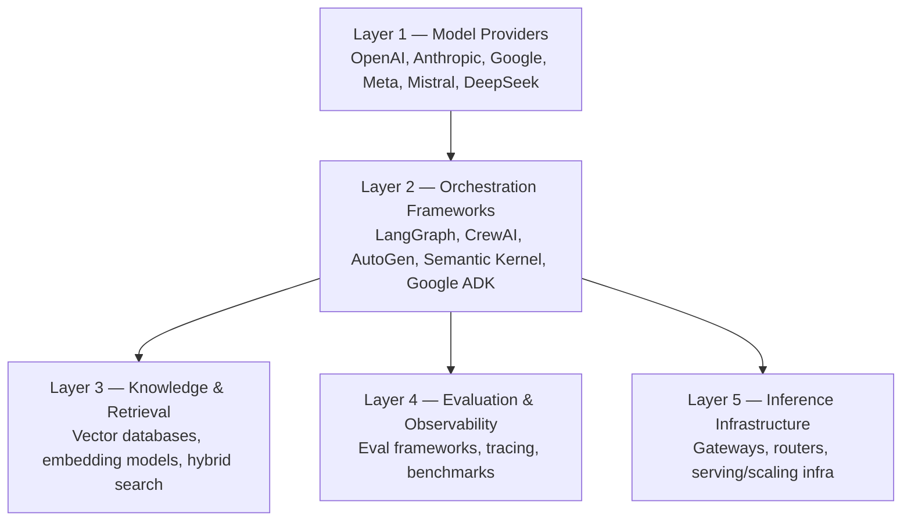
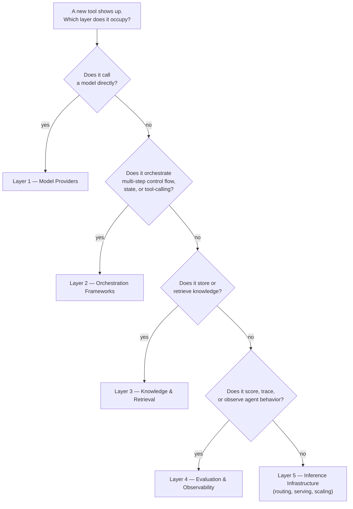

## The AI Ecosystem

> Chapter of [[ai-foundations/readme#00 — Foundations of Modern AI|Foundations of Modern AI]], part
> of [[ai-foundations/readme|AI & LLM Foundations]].

## What you will understand at the end

- The five layers of the modern AI stack, and which layer each tool category in this book actually
  lives at
- Why this ecosystem map is the one artifact in this Part most likely to go stale, and how to keep
  reading it usefully anyway
- Where the deep-dive chapters for each layer live, so this chapter can stay a map instead of
  duplicating them

---

## The stack, layer by layer

This is a map, not a catalog — every box above is covered at real depth elsewhere in this book. The
point of this chapter is showing how the layers relate to each other, so the rest of the book reads
as one coherent system instead of a list of unrelated tool names.

## Layer 1 — Model providers

The foundation models themselves — see [[07-foundation-models|Foundation Models]] for the
openness/modality/context-length axes that actually distinguish provider offerings, and
[[08-large-language-models|Large Language Models]] for what happens inside training before a model
ever reaches an API. This layer is also the one that turns over fastest — which is exactly why the
axes to evaluate on, not specific model names, are what this book invests in teaching.

## Layer 2 — Orchestration frameworks

The libraries that wrap a foundation model into an agent — state management, tool-calling plumbing,
multi-step control flow. [[01-evaluation-criteria|Agent Frameworks]] (Part 03 of Building &
Evaluating Agents) evaluates and compares LangGraph, CrewAI, AutoGen, Semantic Kernel, and Google
ADK on the axes that matter for adopting one — orchestration model, state management, observability,
ecosystem maturity. [[01-agent-architecture|Agent Architecture]] (Part 00 of Building & Evaluating
Agents) covers what these frameworks all wrap around: the same five-component loop (LLM, Tools,
Memory, Planning, Execution Loop), regardless of which framework's vocabulary you're using.

## Layer 3 — Knowledge & retrieval

Vector databases, embedding models, and the hybrid/reranking pipelines that ground an agent in more
than its context window can hold. See
[[01-retrieval-augmented-generation-rag|Retrieval-Augmented Generation (RAG)]] and
[[04-vector-search|Vector Search]] (Part 05 of Agentic AI Engineering) for the full retrieval stack,
and [[08-memory-storage-architectures|Memory Storage Architectures]] (Part 02 of Agentic AI
Engineering) for how this layer intersects with an agent's own memory subsystem.

## Layer 4 — Evaluation & observability

The tooling that answers "is the agent actually working" once it's wrapped in an orchestration
framework and grounded in a retrieval layer — tracing, token metrics, eval frameworks, benchmarks.
See [[01-ai-observability-fundamentals|AI Observability Fundamentals]] and
[[01-ai-evaluation-frameworks|AI Evaluation Frameworks]] (Part 02 of Building & Evaluating Agents)
for the metrics, logs, traces, and scoring methodology this layer is built from.

## Layer 5 — Inference infrastructure

The runtime substrate underneath everything above it: gateways that route across providers, the
runtime hosting an agent's reasoning loop, and the scaling/multi-tenancy concerns of running this at
production volume. See [[06-ai-gateways|AI Gateways]] (Part 04 of Production Agent Systems) and
[[01-agent-runtime|Agent Runtime]] (Part 00 of Production Agent Systems) for this layer in depth.

**This layer has a real, easy-to-forget latency cost of its own:** a gateway hop (auth, routing,
logging, sometimes a second TLS handshake) between the application and the model provider typically
adds somewhere in the tens-of-milliseconds range per request on top of the provider's own
time-to-first-token — small next to a multi-second generation, but not free, and worth measuring
directly rather than assuming away when a latency SLO is tight.

### Three failure modes that live specifically at the ecosystem-navigation layer

- **Silent model deprecation.** A pinned model version can be sunset by its provider with a
  deprecation notice easily missed in a changelog — the API call keeps working (often routed to a
  newer version automatically) but output characteristics, latency, or cost can shift with no
  corresponding code change on your side. Production systems that pin model versions need a
  deliberate process for tracking provider deprecation notices, not just an alert when a call starts
  failing outright.
- **Vendor lock-in via proprietary function-calling schemas.** Tool-call formats are not portable
  across providers by default — the same tool definition often needs translation to satisfy each
  provider's specific schema conventions, and an orchestration framework's abstraction over this can
  leak the moment a provider-specific quirk doesn't fit the framework's model.
- **Framework-abstraction leakage.** The whole point of an orchestration framework (Layer 2) is
  hiding provider differences behind one interface — until a provider-specific edge case forces a
  drop to the raw API anyway, at which point the framework has added a layer of indirection without
  delivering the portability it promised. This is a real, recurring cost of adopting Layer 2
  tooling, not a hypothetical one, and worth weighing against what the framework buys elsewhere.

## Why this map will age faster than the rest of this Part

Every other chapter in Part 00 describes mechanics — attention, tokenization, training pipelines —
that change on the timescale of research paradigm shifts (years). This chapter describes **vendors
and tools**, which turn over on the timescale of product releases (months). The specific frameworks
and providers named above are illustrative, not a permanent catalog — some of them will be replaced
by names that don't exist yet by the time you're reading this.

**The useful, durable part of this chapter is the five-layer map itself**, not the names filled into
it. When a new tool appears, the first useful question is not "is this good?" but "which layer does
this actually occupy, and what does it displace or wrap?" — a router that displaces Layer 5, an
orchestration framework that displaces Layer 2, an eval tool that adds to Layer 4. That placement
question is what keeps this chapter useful long after any specific name in it is outdated, and it's
the same layered-thinking habit
[[01-the-evolution-of-artificial-intelligence|The Evolution of Artificial Intelligence]] applies to
the field's larger paradigm shifts.

## Metadata

|        |                |
| ------ | -------------- |
| Author | Amit Singh     |
| Scope  | ai-foundations |
