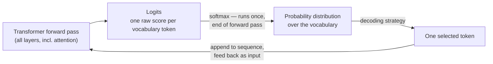

## Probability, Sampling & Decoding

> Chapter of [[ai-foundations/readme#00 — Foundations of Modern AI|Foundations of Modern AI]], part
> of [[ai-foundations/readme|AI & LLM Foundations]].

## What you will understand at the end

- What the model actually hands back before any decoding happens: a probability distribution over
  the entire vocabulary, not a token — and why that distinction is where every sampling parameter
  lives
- The concrete, numeric effect temperature has on that distribution, and why "low temperature for
  tool calls, higher temperature for brainstorming" is a real engineering decision, not a style
  preference
- Why top-p/top-k and beam search are solving different problems (truncating a distribution before
  sampling vs. searching for a high-probability sequence), and why beam search lost to sampling for
  chat and agent models specifically
- How to read entropy as a live, ground-truth-free uncertainty signal, and where that signal breaks
  down
- What KL divergence actually measures, worked by hand once, so "the KL penalty keeps the policy
  close to the reference model" in [[08-large-language-models|Large Language Models]]'s RLHF/DPO
  section stops being a phrase you repeat and becomes a mechanism you can reason about

---

## The mental model

Every one of this book's agent-loop diagrams — the ReAct loop in
[[01-agent-architecture|Agent Architecture]], the planner's step-by-step execution — treats "the LLM
decides what to do next" as one opaque box. This chapter opens that box at the one point where it's
actually simple: the final step of a single forward pass.

[[04-transformer-architecture|Transformer Architecture]]'s attention mechanism uses softmax
constantly — once per attention head, per layer, to turn raw query-key scores into weights over
other tokens in the context. That softmax runs dozens of times per forward pass and its output never
leaves the model; it's an internal representation. This chapter's softmax is a different call to the
same function, made exactly once at the very end of the forward pass: the model's final hidden state
is projected — using the same embedding weight matrix reused in reverse, per
[[05-tokens-embeddings-and-attention|Tokens, Embeddings & Attention]] — onto a vector with one raw
score (a **logit**) per entry in the vocabulary. Softmax turns that logit vector into a probability
distribution over "what token comes next." Confusing the two softmaxes is an easy interview slip:
one shapes internal representations, the other is the literal object every decoding strategy in this
chapter operates on.



The vocabulary here is tens of thousands of tokens
([[06-context-windows-and-tokenization|Context Windows & Tokenization]] covers how that size is
chosen), so in practice almost all of that probability mass concentrates on a small handful of
plausible continuations and the long tail is close to zero — which is exactly the shape every
technique below exploits. Everything from here is the same mechanism regardless of whether the call
is a normal chat turn or one token inside a reasoning model's extended thinking trace
([[09-reasoning-models|Reasoning Models]]) — reasoning models change how much gets generated before
you see an answer, not how any individual token gets selected.

**The strategies, previewed:**

| Strategy               | What it selects                                                          | Deterministic?                                         | Typical use                                                            |
| ---------------------- | ------------------------------------------------------------------------ | ------------------------------------------------------ | ---------------------------------------------------------------------- |
| Greedy (argmax)        | The single highest-probability token, every step                         | Yes                                                    | Fully deterministic pipelines; degrades into repetition on long output |
| Temperature sampling   | A token drawn from the reshaped distribution                             | No, unless T→0 (which degenerates into greedy)         | General-purpose chat/agent generation                                  |
| Top-p / top-k sampling | A token drawn from a truncated distribution                              | No — still sampling, just from a smaller candidate set | Same as above; guards against sampling from the far tail               |
| Beam search            | The highest-cumulative-probability sequence among `k` tracked candidates | Yes, given a fixed beam width and no ties              | Closed-ended seq2seq: translation, ASR, extractive summarization       |

The rest of this chapter builds one worked example and carries it through all four rows, then uses
the same example to make entropy and KL divergence concrete instead of abstract.

---

## 1. Temperature — sharpening or flattening the distribution

Take a toy 5-token vocabulary and suppose the model is deciding what comes right after "The on-call
engineer restarted the." (Hand-built for clean arithmetic — not a real model's actual logits.) The
final projection produces these logits:

| Token      | Logit |
| ---------- | ----- |
| `service`  | 6.0   |
| `server`   | 5.5   |
| `pod`      | 5.0   |
| `database` | 3.0   |
| `goat`     | -2.0  |

**Temperature divides the logits by `T` before softmax.** `T = 1` reproduces the raw distribution.
`T < 1` sharpens it — the gaps between logits get amplified before exponentiation, so the
already-strongest candidate pulls further ahead. `T > 1` flattens it — the gaps shrink, so
probability mass that was concentrated on the top candidate spreads out toward the rest of the
vocabulary, including the tail. Running softmax on the logits above, scaled by three different
temperatures:

| Token       | `T = 0.5` (sharper) | `T = 1` (baseline) | `T = 2` (flatter) |
| ----------- | ------------------- | ------------------ | ----------------- |
| `service`   | 66.4%               | 49.4%              | 38.1%             |
| `server`    | 24.4%               | 30.0%              | 29.6%             |
| `pod`       | 9.0%                | 18.2%              | 23.1%             |
| `database`  | 0.17%               | 2.5%               | 8.5%              |
| `goat`      | ~0.0%               | 0.02%              | 0.7%              |
| **Entropy** | **1.22 bits**       | **1.60 bits**      | **1.89 bits**     |

Read the `service` column across: at `T = 0.5` it's already collecting two-thirds of all probability
mass, and as `T → 0` this converges to exactly the greedy/argmax choice — one token at 100%, the
rest at 0%. Read the `goat` row across: at `T = 1` it's rounding-error noise (0.02%), but by `T = 2`
it has picked up 35× more mass (0.7%) even though it was never remotely plausible — temperature
doesn't just reshuffle the top few candidates, it pulls mass out of the tail too, which is exactly
why an unreasonably high temperature produces output that occasionally goes somewhere genuinely
bizarre, not just "more varied within reason." (The entropy row is explained in Section 4 — keep it
in view for now as a second number that moves the same direction as the intuition: sharper
distribution, lower entropy; flatter distribution, entropy climbing toward the ceiling.)

**Why this is an architectural decision, not a style preference.** A call inside an agent's
execution loop that emits a [[04-function-calling|tool call]] — a function name and a JSON argument
blob a downstream system will actually execute — wants the distribution as sharp as the task allows:
you want the model consistently landing on the one correct tool and the one correctly-typed
argument, not exploring the distribution's tail into a plausible-sounding but wrong parameter. A
call asked to brainstorm five distinct incident hypotheses wants the opposite: enough flattening
that the five samples are actually five different ideas, not five rewordings of the same most-likely
one. Same mechanism, opposite operating point, chosen deliberately per call site inside the loop —
not one global setting for the whole agent.

**A knob some frontier models no longer expose.**
[[01-prompt-engineering-fundamentals#Sampling controls — and their decline|Prompt Engineering Fundamentals]]
already flags this: current-generation Claude models (Opus 4.8, Sonnet 5) reject non-default
`temperature`/`top_p`/`top_k` outright with an HTTP 400. That doesn't make this section's mental
model obsolete — it changes what you use it for. Open-weight deployments (Llama, Mistral, DeepSeek
served through your own inference stack) and other providers' APIs still expose all three directly.
And even where the knob is gone, the concept explains what replaced it: prompt-based instructions
like "choose the most conventional interpretation" (in place of low temperature) or "propose several
distinct options" (in place of high temperature), and the `effort` parameter covered in
[[07-model-selection-and-routing|Model Selection & Routing]], are attempts to reach the same
distributional operating point through a different lever. Knowing what temperature actually does to
the distribution is what tells you `effort` is aiming at the same target, not a different concept
wearing a new name.

---

## 2. Top-p / top-k — truncating the tail before you sample

Temperature reshapes the whole distribution but never removes a candidate from consideration —
`goat` still has _some_ probability at every temperature above zero, and an unlucky sample can still
land on it. Top-p (nucleus sampling) and top-k solve a different problem: they truncate the
distribution to a candidate set _before_ sampling, so the tail is never in play at all.

**Top-p keeps the smallest set of highest-probability tokens whose cumulative mass reaches `p`.**
Apply `p = 0.9` to the two distributions from the table above, walking down in probability order:

- **`T = 0.5` (sharp):** `service` (66.4%) + `server` (24.4%) = 90.8% — already past 0.9. Nucleus =
  `{service, server}`, renormalized to `{73.1%, 26.9%}`. `pod`, `database`, and `goat` are excluded
  entirely, not just made unlikely.
- **`T = 1` (baseline):** `service` + `server` + `pod` = 97.6% before crossing 0.9 — `pod` is needed
  to clear the threshold. Nucleus = `{service, server, pod}`, renormalized to
  `{50.6%, 30.7%, 18.6%}`.

Same `p`, two different nucleus sizes — two tokens for the sharp distribution, three for the flatter
one — because top-p's cutoff tracks how much mass is actually concentrated at the top, not a fixed
headcount. That adaptiveness is the entire point of the technique, and the reason it largely
displaced top-k in practice.

**Top-k keeps a fixed number of tokens, full stop.** `top-k = 2` on the `T = 1` baseline
distribution keeps exactly `{service, server}` and permanently discards `pod` — even though `pod`
carries 18.2% of the mass, comparable to `server`'s 30.0%. Top-p on that same distribution correctly
keeps `pod`, because its cutoff is shape-aware and top-k's isn't. This is why
[[01-prompt-engineering-fundamentals#Sampling controls — and their decline|Prompt Engineering Fundamentals]]
calls `top_k` "mostly a research-era knob" now — top-p captures the intent (don't sample from the
implausible tail) without top-k's failure mode (truncating a genuinely plausible token just because
it happened to be third).

**Temperature and top-p/top-k compose, they don't compete.** The practical pipeline, where all three
are exposed, is: apply temperature to reshape the distribution, then truncate with top-p and/or
top-k, then renormalize the survivors to sum to 1, then sample. Temperature decides how spread out
the field of candidates is; top-p/top-k decides how much of that field's tail is even eligible to be
drawn.

---

## 3. Beam search — exploring sequences, not sampling tokens

Greedy decoding commits to the single highest-probability token at every step and never reconsiders.
Sampling (with or without truncation) draws one token per step from a probability distribution.
**Beam search does neither — it keeps `k` candidate sequences alive in parallel and, at each step,
extends every one of them, scores each extension by cumulative sequence probability, and keeps only
the top `k` sequences overall** — not the top `k` per branch. That "overall" is the whole mechanism:
a sequence that started weaker at step 1 can still out-rank a sequence that started stronger, once
you look one token further ahead.

Illustrative two-step walkthrough, beam width `k = 2`, continuing the earlier example (continuation
probabilities here are hand-built for the illustration, not derived from the logit table above):

**Step 1 — top-2 first tokens survive:** `service` (49.4%) and `server` (30.0%). Two live
hypotheses: `["service"]`, `["server"]`.

**Step 2 — extend each, score by cumulative probability:**

```
["service", "restarted"]  0.494 × 0.60 = 0.296
["service", "crashed"]    0.494 × 0.25 = 0.124
["server",  "restarted"]  0.300 × 0.70 = 0.210
["server",  "stopped"]    0.300 × 0.20 = 0.060
```

Keep the top 2 across _all four_ candidates: `["service", "restarted"]` (0.296) and
`["server", "restarted"]` (0.210) survive. `["service", "crashed"]` gets pruned even though
`service` was the stronger opening token — because once its actual continuation is weak, the other
branch's combination wins. This is what "beam search explores multiple candidate continuations"
means concretely: not that it tries more tokens per step than sampling does, but that it defers the
commitment greedy decoding makes immediately, and can recover from a strong-looking first token that
turns out to lead nowhere good. It's still a heuristic — a beam of width `k` is not exhaustive
search over all sequences, only the `k` best-so-far at each step — but it searches for the best
_sequence_, where greedy and sampling both only ever choose the best (or a sampled) _next token_.

**Why it's rarely used for chat and agent models despite dominating older seq2seq work.** Machine
translation and speech recognition are close to genuinely search problems: there's usually one
essentially-correct target, and finding the highest-likelihood sequence under the model is a
reasonable proxy for finding the best translation. Chat and agent output isn't that kind of problem,
for reasons that compound:

- **Maximizing sequence likelihood produces bland, repetitive text past short outputs.** This is a
  well-documented empirical finding in open-ended generation — Holtzman et al.'s "The Curious Case
  of Neural Text Degeneration" is the paper usually credited with popularizing nucleus (top-p)
  sampling specifically as a fix for beam search's tendency to degenerate into dull, repetitive
  continuations the longer the output runs. The single highest-likelihood sequence is not the same
  thing as the sequence a human rates as best.
- **It optimizes the wrong objective for an aligned model.**
  [[08-large-language-models|Large Language Models]]'s RLHF/DPO stage tunes the model against _human
  preference on a single sampled response_, not against sequence likelihood under the base language
  model. Beam search searches for something the alignment stage was never optimizing for.
- **Cost.** Tracking `k` hypotheses through every step multiplies inference cost (compute and/or
  KV-cache memory) roughly `k`×, for a technique that's actively fighting the quality goal above — a
  bad cost/benefit trade for chat and agent latency budgets.
- **Streaming incompatibility.** Chat and agent products stream tokens as they're generated. Beam
  search doesn't know which sequence "won" until the search finishes (or a later pruning step drops
  a sequence you'd already started streaming to the user) — fundamentally in tension with
  token-by-token UX.

Beam search still shows up legitimately where the task genuinely is "find the best-scoring
hypothesis" rather than "produce one good conversational turn" — machine translation, extractive
summarization, ASR decoding. If you're building an agent, greedy/sampling is almost always the right
default, and reaching for beam search is a signal worth double-checking against which of these two
problem shapes you're actually solving.

---

## 4. Entropy — turning "the model is uncertain" into a number

Entropy measures how spread out a probability distribution is, in bits:
**`H(P) = -Σ P(x)·log₂P(x)`**. A distribution with one dominant candidate has low entropy — little
genuine uncertainty about what comes next. A distribution spread evenly across many candidates has
high entropy — the model is choosing among several roughly-equally-plausible continuations, not
confidently picking one.

Working the formula by hand for the `T = 1` baseline distribution from Section 1:

```
H(P) = -(0.494·log₂0.494 + 0.300·log₂0.300 + 0.182·log₂0.182 + 0.025·log₂0.025 + 0.0002·log₂0.0002)
     ≈ 0.50 + 0.52 + 0.45 + 0.13 + 0.00
     ≈ 1.60 bits
```

Run the same arithmetic on the `T = 0.5` and `T = 2` columns and you get 1.22 bits and 1.89 bits —
the entropy row already in Section 1's table. The direction is exactly the intuition: sharpening the
distribution lowers entropy, flattening it raises entropy, and both move monotonically with
temperature because temperature and entropy are two views of the same reshaping. For this toy
5-token vocabulary, the ceiling is `log₂5 ≈ 2.32 bits` — a perfectly uniform distribution over five
candidates. A real vocabulary of, say, 50,000 tokens has a ceiling around `log₂50,000 ≈ 15.6 bits` —
which matters practically: raw entropy values aren't comparable across models or vocabularies with
different sizes without normalizing against that ceiling first.

**This is not the same quantity as perplexity, and the difference is the whole reason entropy is
usable in production.** [[08-large-language-models|Large Language Models]] defines perplexity as
`e^(cross-entropy loss)`, and cross-entropy loss needs the _actual_ next token to score the model's
assigned probability against it — it's only computable during training or offline evaluation, where
ground truth exists. Entropy, as computed above, needs nothing but the model's own predicted
distribution at the moment of generation — no ground truth required. That's precisely why entropy,
not perplexity, is the candidate signal for a _live_ confidence read at inference time: you don't
have the true next token to score against when the model is actually running.

**The aggregation gotcha.** A generated tool call is mostly JSON syntax — braces, quotes, commas —
and the model is extremely confident about all of it; those tokens sit at near-zero entropy simply
because JSON structure is highly predictable, not because anything substantive was verified. If you
naively average token entropy across an entire tool-call response, that syntactic certainty dilutes
the one or two tokens that actually carry the decision — the tool name, the key argument value. A
usable entropy-based signal has to be read at the tokens where the actual choice happens, not
smoothed across the whole response.

**Where this plugs into the rest of the book.**
[[14-trust-and-explainability|Trust & Explainability]]'s confidence-calibration section lists
"token-level probability / entropy" as one structural signal a reviewer can use instead of the
model's own self-reported confidence — this section is the mechanism underneath that table row. It
also explains _why_ that chapter immediately flags entropy's limitation: low entropy means the next
token was structurally or grammatically forced, which is a different claim from "the underlying fact
is correct." A model can be extremely confident about the next syntactically-required brace and
genuinely uncertain — or worse, confidently wrong — about the number three tokens earlier. Entropy
is a real, ground-truth-free signal; it is a signal about _phrasing_ concentration, not
fact-checking, and needs the other structural signals in that chapter's table (retrieval coverage,
self-consistency, an independent verifier) to become a trustworthy confidence read rather than just
a cheap one.

---

## 5. KL divergence — the distance metric underneath alignment

KL divergence measures how different two probability distributions over the same set of outcomes are
— informally, how much extra "surprise" you'd incur if you expected outcomes to follow distribution
`Q` but they actually follow distribution `P`. It is _not_ a true distance: it's asymmetric
(`KL(P‖Q) ≠ KL(Q‖P)` in general), it's always ≥ 0, and it's exactly 0 only when the two
distributions are identical. Because the direction matters, it's always written with an explicit
order — `KL(P‖Q)` reads as "the divergence of `P` from reference `Q`" — and calling it "distance"
the way you'd call Euclidean distance a distance is a category error worth avoiding out loud in an
interview.

The formula, worked once so it stops being abstract: `KL(P‖Q) = Σ P(x)·log₂(P(x)/Q(x))`. Take `P` as
the `T = 0.5` (sharpened) distribution from Section 1 and `Q` as the `T = 1` baseline — asking "how
far has this sharpened distribution drifted from the baseline?":

```
service:   0.664 · log₂(0.664/0.494) = 0.664 · log₂(1.344) ≈ +0.284
server:    0.244 · log₂(0.244/0.300) = 0.244 · log₂(0.815) ≈ -0.072
pod:       0.090 · log₂(0.090/0.182) = 0.090 · log₂(0.495) ≈ -0.091
database:  0.0017· log₂(0.0017/0.025)= 0.0017· log₂(0.067) ≈ -0.006
goat:      ~0
                                                          sum ≈ 0.11 bits
```

`KL(P‖Q) ≈ 0.11 bits` — small, because these two distributions only differ by a temperature scaling,
not a structural change in what's plausible. That number is the concrete referent for "how far has
the policy drifted from the reference," which is exactly the quantity
[[08-large-language-models#Stage 3 — RLHF / DPO alignment|Large Language Models]]'s RLHF/DPO section
is managing. A model that has genuinely learned new behavior — reliably refusing a category of
harmful request, or always emitting a specific tool-call format — will show a much larger,
structurally concentrated divergence at the specific tokens where that new behavior actually fires,
while tracking the reference almost exactly everywhere else. A model that's mode-collapsed or been
reward-hacked into padding every response will show divergence spread broadly across the response,
not concentrated where it should be.

**This is why RLHF-PPO keeps a frozen reference copy of the model resident during training, and why
DPO's loss has the same optimum without needing one explicitly.** The RLHF-PPO objective includes a
KL penalty term computed against that frozen reference at every generated token — directly
penalizing the policy for drifting away from where the SFT model started, even when the reward model
would score the drifted output higher. Push optimization against a proxy reward too hard with no
such brake, and you get exactly the failure modes [[08-large-language-models|Large Language Models]]
names: reward hacking (exploiting a quirk of the reward model) and mode collapse (output diversity
narrowing toward whatever pattern scores highest). The KL penalty — or DPO's mathematically
equivalent implicit constraint — is the mechanism that's supposed to keep that optimization pressure
bounded, not the aligned model's own good judgment. It is what actually stops "the reward model
prefers longer answers" from turning into "the model now pads everything," by making that drift cost
something in the loss.

**One more connection worth having, because it removes the last piece of "these are three unrelated
formulas."**
[[02-machine-learning-fundamentals#Loss functions — turning "wrong" into a number|Machine Learning Fundamentals]]
defines LLM training loss as `-log(P(actual_next_token))` — the model's assigned probability to
whatever token actually appeared. That's not a fourth, separate idea: it's cross-entropy, and
cross-entropy decomposes as `H(P, Q) = H(P) + KL(P‖Q)`, where `P` is the true distribution and `Q`
is the model's predicted one. At any single training position, the true distribution is a one-hot
spike on the token that actually appeared — zero entropy, no genuine uncertainty about what happened
in the training data — so `H(P) = 0` and cross-entropy collapses to exactly `KL(P‖Q)`. Training
loss, at every token, _is_ a KL divergence: the divergence from that token's one-hot answer to the
model's predicted distribution.
[[01-the-evolution-of-artificial-intelligence|The Evolution of Artificial Intelligence]]'s
observation that pretraining loss flattens toward "the entropy of natural language itself" is the
same statement one level up: real language isn't one-hot-deterministic — the same prefix genuinely
can continue multiple plausible ways — so the best any model can do is match the _true_ conditional
distribution over next tokens. At that point average KL divergence is zero and whatever loss remains
is natural language's own irreducible entropy floor, not a modeling deficiency the next architecture
or the next trillion tokens will fix.

---

## Why this matters once you're building agents, not tuning decoders

Three production habits fall directly out of this chapter, and naming which one applies turns a
vague intuition into a specific engineering choice:

- **Pick the operating point per call site, not per agent.** The tool-call-emitting step in a ReAct
  loop and the "propose three distinct approaches" step in the same agent's planning phase should
  not share a temperature — one wants the distribution as sharp as the task allows, the other wants
  it deliberately flattened, and conflating them either makes your tool calls flaky or makes your
  brainstorming repetitive.
- **Build confidence signals from the distribution, not from asking the model to grade itself.**
  Section 4's entropy, read at the decision-bearing tokens rather than averaged across boilerplate,
  is a real structural signal — self-reported confidence, as
  [[14-trust-and-explainability|Trust & Explainability]] covers in depth, is generated by the same
  mechanism as the answer itself and inherits the same blind spots.
- **Know what "aligned" actually constrains.** A model that's been through RLHF or DPO hasn't been
  turned into a free-floating optimizer of the reward model's preferences — its output distribution
  is explicitly bounded from drifting too far from a reference policy. That's a real, load-bearing
  design choice with practical consequences: it's part of why a heavily fine-tuned model's behavior
  on edge cases outside its preference-training distribution tends to fall back toward the reference
  model's behavior rather than extrapolating the fine-tune's intent arbitrarily far.

---

## Concept check

| Question                                                                               | Answer hint                                                                                                                                                                                                                                                |
| -------------------------------------------------------------------------------------- | ---------------------------------------------------------------------------------------------------------------------------------------------------------------------------------------------------------------------------------------------------------- |
| What exactly does the model hand back before any decoding strategy runs?               | A probability distribution over the whole vocabulary — logits from the final projection, passed through softmax                                                                                                                                            |
| Why are the attention softmax and the output-distribution softmax easy to conflate?    | Same formula, run at completely different points — attention's runs many times per layer on internal scores; this chapter's runs once, on vocabulary logits, at the very end                                                                               |
| What does low vs. high temperature concretely do to the distribution?                  | Low temperature sharpens toward the single most likely token (approaching greedy as T→0); high temperature flattens toward uniform, including pulling mass into the tail                                                                                   |
| Why does top-p adapt its cutoff size but top-k doesn't?                                | Top-p keeps tokens until cumulative mass reaches `p` — sharp distributions need few tokens, flat ones need more; top-k always keeps the same fixed count regardless of shape                                                                               |
| What does beam search track that greedy and sampling don't?                            | Multiple candidate sequences in parallel, pruned by cumulative sequence probability across branches — not just the best next token                                                                                                                         |
| Name two concrete reasons beam search is rarely used for chat/agent models.            | It optimizes sequence likelihood, which correlates poorly with human-judged quality on open-ended text (degeneration); the alignment stage optimizes single-sample human preference, not sequence likelihood; it also costs ~k× and doesn't stream cleanly |
| Why is entropy usable as a live confidence signal but perplexity isn't?                | Entropy needs only the model's own predicted distribution; perplexity needs the actual next token to score against, which doesn't exist yet at inference time                                                                                              |
| What's the aggregation mistake that ruins an entropy-based confidence signal?          | Averaging entropy across a whole response dilutes a few decision-bearing tokens with many syntactically-forced, near-zero-entropy tokens (JSON braces, etc.)                                                                                               |
| What does KL divergence measure, and why isn't "distance" quite the right word for it? | How much extra surprise results from assuming distribution Q when the real distribution is P — it's asymmetric and only symmetric distances deserve the word "distance"                                                                                    |
| Why does RLHF-PPO keep a frozen reference model resident during training?              | To compute a KL penalty at every token, bounding how far the trained policy's distribution can drift from the reference — the brake that keeps reward hacking and mode collapse in check                                                                   |
| How does cross-entropy loss connect to KL divergence?                                  | Cross-entropy = entropy of the true distribution + KL divergence from true to predicted; since the true next-token distribution is one-hot (zero entropy), LLM training loss at each token is exactly a KL divergence                                      |

---

## Vocabulary glossary

| Term                     | Definition                                                                                                                        |
| ------------------------ | --------------------------------------------------------------------------------------------------------------------------------- |
| Logit                    | A raw, unnormalized score the model assigns to one vocabulary token, before softmax                                               |
| Softmax                  | The function that converts a vector of logits into a probability distribution that sums to 1                                      |
| Temperature              | A scalar dividing logits before softmax — `T<1` sharpens the distribution, `T>1` flattens it, `T→0` converges to greedy           |
| Greedy decoding          | Always selecting the single highest-probability token — deterministic, prone to repetition on long output                         |
| Nucleus (top-p) sampling | Sampling only from the smallest set of highest-probability tokens whose cumulative mass reaches threshold `p`                     |
| Top-k sampling           | Sampling only from the fixed `k` highest-probability tokens, regardless of the distribution's actual shape                        |
| Beam search              | Maintaining `k` candidate sequences in parallel, pruned at each step by cumulative sequence probability across all branches       |
| Entropy                  | `H(P) = -ΣP(x)log₂P(x)` — a measure of how spread out a distribution is; low = confident/concentrated, high = uncertain/diffuse   |
| Perplexity               | `e^(cross-entropy loss)` — needs the actual next token to compute, unlike entropy, which needs only the model's own distribution  |
| KL divergence            | `KL(P‖Q) = ΣP(x)log₂(P(x)/Q(x))` — asymmetric measure of how much one distribution diverges from a reference; not a true distance |
| KL penalty               | The term in RLHF-PPO's training objective that penalizes the policy for diverging from a frozen reference model, bounding drift   |

## Metadata

|        |                |
| ------ | -------------- |
| Author | Amit Singh     |
| Scope  | ai-foundations |
