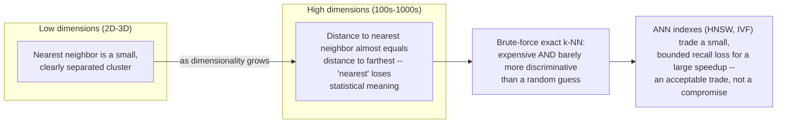

## Vector Geometry & Similarity

> Chapter of [[ai-foundations/readme#00 — Foundations of Modern AI|Foundations of Modern AI]], part
> of [[ai-foundations/readme|AI & LLM Foundations]].

## What you will understand at the end

- What an embedding vector geometrically _is_ — a point (equivalently, a direction from the origin)
  in a high-dimensional space, engineered so that semantic similarity corresponds to geometric
  proximity
- Why cosine similarity measures an **angle**, not a distance — and the concrete consequence: two
  vectors can point in nearly the same direction regardless of how long either one is
- Why Euclidean distance measures actual **distance**, which does care about magnitude, and a worked
  example where that difference flips which candidate looks "closer"
- The specific, silent failure mode of using a **dot-product / inner-product** similarity metric on
  vectors that were never normalized
- Why nearest-neighbor search stops behaving intuitively as dimensionality grows — the mechanism
  behind the "curse of dimensionality," not just the name — and why that's the actual reason
  production systems reach for approximate methods instead of exact search

---

## The mental model

An embedding model's whole job is to place semantically similar inputs near each other in vector
space and dissimilar inputs far apart.
[[05-tokens-embeddings-and-attention|Tokens, Embeddings & Attention]] already showed this
numerically — `king - man + woman` landing almost exactly on `queen` — but that chapter used the
result without explaining the geometry underneath it. This chapter is that geometry: what "near" and
"far" actually mean once you're comparing two vectors, why there are genuinely different ways to
define "near," and why the answer changes as the number of dimensions grows.

Every retrieval, memory, and search chapter in this book — vector databases, embeddings, vector
search, hybrid search, reranking — uses this geometry as a black box. This chapter is where you open
the box once, so none of those chapters have to.

---

## What an embedding vector geometrically is

An embedding is a list of numbers — `[0.12, -0.87, 0.34, ...]`, typically several hundred to a few
thousand of them (see
[[05-tokens-embeddings-and-attention#Stage 2 — Static embeddings|Tokens, Embeddings & Attention]]
for where that number comes from). Geometrically, that list of `d` numbers is a single point in
`d`-dimensional space — or, treated as an arrow from the origin to that point, a **direction**.

Neither the individual numbers nor the axes they sit on mean anything on their own — an embedding
model doesn't dedicate dimension 47 to "formality" or dimension 812 to "financial topic." What's
learned, via the training objective, is the **relative geometry**: which points end up close
together and which end up far apart. A contrastive training objective explicitly pulls embeddings of
semantically similar pairs toward each other and pushes dissimilar pairs apart — geometric proximity
is the target the model is optimized against, not an accident of how the numbers happen to fall out.
That's the one sentence this whole book leans on every time it says "embed and search": similarity
in meaning was engineered to become proximity in space.

The open question this chapter answers is: proximity measured **how**? There are two genuinely
different answers, and picking the wrong one is a real, shipped bug — not a stylistic preference.

---

## Cosine similarity: measuring the angle, not the distance

Cosine similarity between two vectors `u` and `v` is:

```
cosine(u, v) = (u · v) / (|u| × |v|)
```

`u · v` is the dot product (sum of elementwise products), and `|u|`, `|v|` are each vector's
magnitude (length). Dividing by both magnitudes is what makes this a pure measure of **angle** — it
answers "how aligned are these two directions?" and structurally cannot see how long either vector
is, because the division cancels magnitude out.

**Concretely: a vector and any positive scalar multiple of itself have identical cosine
similarity.** Take `u = (3, 4)` and `v = (6, 8)` — note `v` is exactly `2u`, same direction, twice
the length:

```
u · v = (3×6) + (4×8) = 18 + 32 = 50
|u| = √(3² + 4²) = 5        |v| = √(6² + 8²) = 10

cosine(u, v) = 50 / (5 × 10) = 50 / 50 = 1.0
```

A cosine similarity of `1.0` means "identical direction" — and it holds here no matter how much
longer `v` is than `u`. This is exactly why embedding magnitude is usually normalized away rather
than treated as signal: in most text embedding models, a vector's length is influenced by incidental
factors — the pooling strategy used to collapse token embeddings into one vector, document length,
or artifacts of a specific embedding model's training — not by "how much more of the meaning" the
vector carries. Cosine similarity ignores that incidental magnitude by construction and compares
only what the training objective actually optimized: direction.

---

## Euclidean distance: measuring actual distance, which does care about magnitude

Euclidean distance between `u` and `v` is the straight-line distance between them as points:

```
euclidean(u, v) = |u - v| = √(Σ(u_i - v_i)²)
```

Unlike cosine similarity, this is **not** scale-invariant — it directly measures how far apart the
two points sit, and two vectors that point in the same direction but differ in length are, by this
metric, genuinely far apart. Reusing `u = (3, 4)` and `v = (6, 8)` from above:

```
euclidean(u, v) = √((6-3)² + (8-4)²) = √(9 + 16) = √25 = 5
```

Same pair of vectors — cosine similarity says `1.0` (perfectly aligned), Euclidean distance says `5`
(quite far apart). Neither number is wrong; they're answering different questions.

### The example that makes the difference concrete

Introduce a third vector, `w = (4, 3)` — same magnitude as `u` (`|w| = 5`), but pointing in a
noticeably different direction:

```
cosine(u, w)   = ((3×4)+(4×3)) / (5×5) = 24/25 = 0.96
euclidean(u,w) = √((4-3)² + (3-4)²)    = √(1+1) = √2 ≈ 1.41
```

| Pair                | Cosine similarity        | Euclidean distance |
| ------------------- | ------------------------ | ------------------ |
| `u` and `v` (`=2u`) | **1.0** — same direction | 5.0 — far apart    |
| `u` and `w`         | 0.96 — close direction   | **1.41** — near    |

By Euclidean distance alone, `w` looks far closer to `u` (`1.41`) than `v` does (`5.0`) — even
though `v` points in _exactly_ the same direction as `u` and `w` doesn't. If "similar" is supposed
to mean "points at the same kind of thing regardless of vector length," Euclidean distance just gave
the wrong answer for this pair, and cosine similarity gave the right one (`1.0 > 0.96`, correctly
ranking `v` as more aligned). This is the concrete version of "cosine measures angle, Euclidean
measures magnitude too" — not an abstract distinction, a ranking that actually flips.

### Why they agree once vectors are normalized

L2-normalize a vector and it becomes a unit vector (`|v| = 1`) pointing in the same direction. Once
every vector in a comparison has unit length, cosine similarity and Euclidean distance become
related by a fixed identity:

```
||a - b||² = 2 − 2·cosine(a, b)      (true only when |a| = |b| = 1)
```

Checking it against `u` and `w` normalized to unit length — `û = (0.6, 0.8)`, `ŵ = (0.8, 0.6)`:

```
cosine(û, ŵ) = (0.6×0.8)+(0.8×0.6) = 0.96                (matches cosine(u,w) above — expected,
                                                            cosine already ignores magnitude)
||û - ŵ||²   = (0.6-0.8)² + (0.8-0.6)² = 0.04+0.04 = 0.08
2 − 2×0.96   = 0.08                                        ✓ matches exactly
```

**The practitioner payoff:** once vectors are unit-normalized, ranking by cosine similarity and
ranking by Euclidean distance produce the _identical_ ordering — a smaller Euclidean distance always
means a larger cosine similarity, one-to-one. This is why vector databases that expose both a
`cosine` and an `L2` (Euclidean) distance metric behave identically on normalized embeddings — the
metric choice only matters when magnitude hasn't been normalized away first.

---

## The dot-product pitfall

Most vector databases also offer a third metric: raw **dot product** (`u · v`, no division by
magnitude at all). It's cheaper to compute than cosine similarity — one multiply-accumulate instead
of a multiply-accumulate plus two magnitude computations and a division — which is why it's often
the fastest option in an ANN index. It is only _correct_, in the sense of ranking by semantic
alignment, when every vector being compared already has (close to) equal magnitude — ideally unit
norm.

Here's the failure mode when that assumption doesn't hold. Query `q = (1, 0)`. Candidate
`A = (0.99, 0.14)` — nearly unit length, closely aligned with `q`. Candidate `B = (5, 5)` — same
direction band as neither `q` nor `A`, but with a much larger magnitude:

```
dot(q, A) = (1×0.99)+(0×0.14) = 0.99
dot(q, B) = (1×5)+(0×5)       = 5.0        ← ranks B far above A

cosine(q, A) = 0.99 / (1×1.0)    ≈ 0.99    ← A is highly aligned with q
cosine(q, B) = 5.0 / (1×√50)     ≈ 0.71    ← B is only 45° aligned with q
```

Raw dot product ranks `B` as five times more "similar" to `q` than `A` — purely because `B` happens
to have a larger magnitude, not because it points anywhere near `q`. Cosine similarity gets this
right: `A` (0.99) is clearly the better match, `B` (0.71) is only loosely aligned. **Choosing "dot
product" as a vector index's distance metric without first normalizing every embedding to unit
length is a silent correctness bug** — it doesn't error, it just quietly biases retrieval toward
whichever documents happened to produce longer embedding vectors, for reasons that usually have
nothing to do with relevance (pooling strategy, document length, or plain variance across a specific
embedding model's outputs).

| Metric            | What it measures                  | Sensitive to magnitude? | Requires normalization to be "correct"      |
| ----------------- | --------------------------------- | ----------------------- | ------------------------------------------- |
| Cosine similarity | Angle between vectors             | No — divides it out     | No — safe on raw vectors                    |
| Euclidean (L2)    | Straight-line distance            | Yes                     | Only if you want it to match cosine ranking |
| Dot product       | Angle **and** magnitude, combined | Yes                     | Yes — silently wrong if skipped             |

**When Euclidean's magnitude-sensitivity is the right call, not a trap:** clustering algorithms like
k-means are defined in terms of Euclidean distance — a cluster centroid is a mean vector, which is
only a geometrically meaningful "center" under Euclidean distance, not under cosine similarity. Some
embedding spaces (certain vision or multimodal embeddings) also use magnitude as a deliberate signal
— e.g., confidence or salience. Cosine similarity is the right default for text/semantic search
specifically because embedding magnitude in that setting is usually incidental, not because
Euclidean distance is wrong in general.

---

## Why high-dimensional spaces behave counter-intuitively

Everything above holds in any number of dimensions. What changes as dimensionality grows into the
hundreds or thousands — where real embeddings live — is something stranger: the very idea of
"nearest neighbor" starts to lose meaning.

### The mechanism, not just the name

Take two random points with independent coordinates in `d` dimensions. Their squared Euclidean
distance is a sum of `d` roughly independent per-dimension terms:

```
distance² = Σ (u_i - v_i)²   for i = 1 to d
```

By the law of large numbers, a sum of `d` roughly independent terms has a mean that grows
proportionally to `d`, while its standard deviation grows only proportionally to `√d`. So the
_relative_ spread of that sum — standard deviation divided by mean — shrinks like `1/√d`, heading
toward zero as `d` grows. In plain terms: every pairwise distance concentrates tighter and tighter
around the same average value. The gap between your nearest neighbor's distance and your farthest
neighbor's distance shrinks toward nothing, relative to the distances themselves — this is the
distance-concentration effect first formalized for nearest-neighbor search by Beyer, Goldstein,
Ramakrishnan & Shaft ("When Is Nearest Neighbor Meaningful?", 1999).



**Where this needs an honest caveat:** the derivation above assumes independent, roughly uniform
coordinates — a worst-case model, not a description of real trained embeddings. Real embeddings are
not random; the training objective packs them onto a much lower-dimensional manifold inside that
high-dimensional space, with real cluster structure that distance-concentration would otherwise wash
out. That structure is exactly why nearest-neighbor search over real embeddings still works at all
in production. But it dampens the effect, it doesn't eliminate it — at the scale of millions of
documents in a few hundred to a few thousand real dimensions, the concentration pressure is still
enough to make two things true simultaneously: brute-force distance computation over every vector
gets expensive (`O(n × d)` per query), and the resulting top-k ranking is measurably less
discriminative than the same computation would be in, say, 10 dimensions.

### Why this is the reason approximate search exists

Given that even the exact brute-force answer is only marginally more meaningful than a close
approximation once distance concentration sets in, trading a small, bounded amount of recall for a
large speedup stops being a compromise and becomes the correct engineering call. That trade is
exactly what Approximate Nearest Neighbor (ANN) indexing does — HNSW (Hierarchical Navigable Small
World graphs) and IVF (Inverted File index) being the two most common implementations. This chapter
doesn't derive either algorithm; [[09-vector-databases|Vector Databases]] (Part 02 of Agentic AI
Engineering) and [[04-vector-search|Vector Search]] (Part 05 of Agentic AI Engineering) cover the
ANN mechanics themselves. What this chapter supplies is the "why approximate is fine" reasoning
those chapters lean on without re-deriving it: at the dimensionality real embeddings live in, exact
nearest-neighbor search was never as information-rich as its name implies.

---

## Where this geometry gets used without being re-derived

This chapter is deliberately the one place in the book that opens the geometry up. Everywhere else,
it's used as settled background:

| Chapter                                                                          | What it builds on top of this chapter                                                                                                                                                                                                 |
| -------------------------------------------------------------------------------- | ------------------------------------------------------------------------------------------------------------------------------------------------------------------------------------------------------------------------------------- |
| [[05-tokens-embeddings-and-attention\|Tokens, Embeddings & Attention]] (Part 00) | Already used cosine similarity numerically (the `king - man + woman ≈ queen` example) before this chapter explained why cosine, specifically, was the right lens                                                                      |
| [[02-embeddings\|Embeddings]] (Part 05 of Agentic AI Engineering)                | Picks a commercial vs. open-source embedding model by dimensionality, cost, and quality — assumes you already know why cosine is the default comparison metric for the vectors those models produce                                   |
| [[09-vector-databases\|Vector Databases]] (Part 02 of Agentic AI Engineering)    | Covers ANN indexing (HNSW, IVF) and similarity-metric configuration as a database concern — assumes you already know _why_ approximate beats exact at scale, and why the metric choice (cosine vs. L2 vs. dot product) isn't cosmetic |
| [[04-vector-search\|Vector Search]] (Part 05 of Agentic AI Engineering)          | Goes one level deeper into HNSW's and IVF's actual mechanics — assumes the distance-concentration motivation for why exact `k`-NN doesn't scale is already in hand                                                                    |

If any of those chapters' distance-metric or ANN-tradeoff discussions feel like they're skipping a
step, that step is this chapter.

---

## Concept check

| Question                                                                                                       | Answer hint                                                                                                                                     |
| -------------------------------------------------------------------------------------------------------------- | ----------------------------------------------------------------------------------------------------------------------------------------------- |
| What does an embedding vector represent geometrically?                                                         | A point (or direction from the origin) in a high-dimensional space, positioned so semantic similarity ≈ proximity                               |
| What does cosine similarity actually measure?                                                                  | The angle between two vectors — it divides out magnitude entirely                                                                               |
| Why does `cosine(v, 2v) = 1.0`?                                                                                | Cosine similarity is scale-invariant — a vector and any positive multiple of itself point in the same direction                                 |
| Why does Euclidean distance sometimes rank a differently-directed vector as "closer" than a same-directed one? | Euclidean distance measures actual point-to-point distance, which magnitude affects directly — cosine ignores that magnitude                    |
| Why is choosing "dot product" as a similarity metric risky?                                                    | It's only correct when every vector has equal (ideally unit) magnitude — otherwise it silently favors longer vectors                            |
| Why do cosine similarity and Euclidean distance agree on unit-normalized vectors?                              | The identity `‖a-b‖² = 2 − 2·cosine(a,b)` holds exactly when both vectors have unit length, making the two rankings identical                   |
| Why does nearest-neighbor search get harder to trust as dimensionality grows?                                  | Pairwise distances concentrate around the same average value — the nearest and farthest neighbor stop being meaningfully different              |
| Why is approximate nearest-neighbor search (HNSW, IVF) an acceptable engineering trade, not a compromise?      | At real embedding dimensionality, exact brute-force search is already less discriminative than its name implies, while being far more expensive |

---

## Vocabulary glossary

| Term                               | Definition                                                                                                              |
| ---------------------------------- | ----------------------------------------------------------------------------------------------------------------------- |
| Embedding vector                   | A point/direction in a `d`-dimensional space representing an input, positioned so meaning ≈ geometric proximity         |
| Cosine similarity                  | `(u·v)/(‖u‖·‖v‖)` — a scale-invariant measure of the angle between two vectors, range `[-1, 1]`                         |
| Euclidean distance (L2)            | `√Σ(u_i-v_i)²` — straight-line distance between two points, sensitive to magnitude                                      |
| Dot product / inner product        | `u·v` — angle and magnitude combined; a valid similarity metric only when vectors have equal/unit magnitude             |
| L2 normalization                   | Rescaling a vector to unit length (`‖v‖=1`) so cosine similarity and Euclidean distance rank identically                |
| Distance concentration             | The tendency, as dimensionality grows, for all pairwise distances between points to converge toward the same value      |
| Curse of dimensionality            | The umbrella term for the counter-intuitive behaviors (including distance concentration) that emerge in high-`d` spaces |
| Approximate Nearest Neighbor (ANN) | Search algorithms (HNSW, IVF) that trade a small, bounded recall loss for large speed gains over brute-force `k`-NN     |

## Metadata

|        |                |
| ------ | -------------- |
| Author | Amit Singh     |
| Scope  | ai-foundations |
