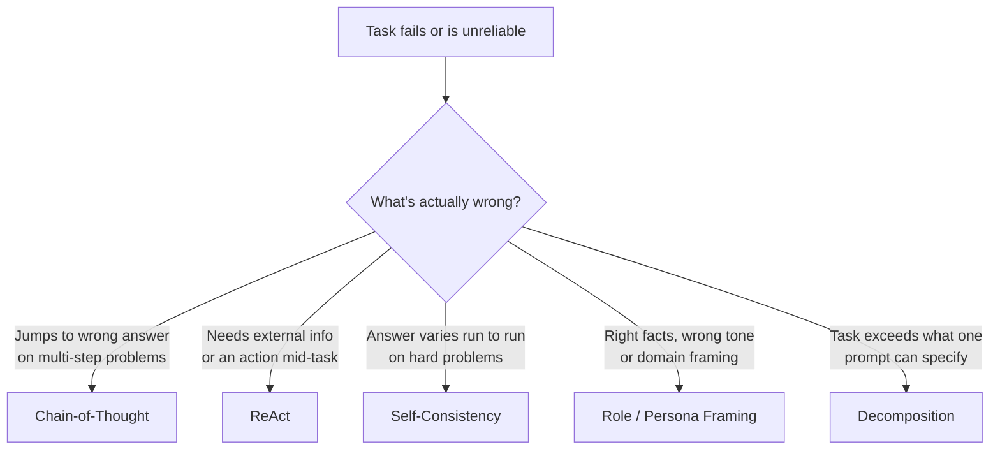

## Prompt Design Patterns

> Chapter of [[ai-foundations/readme#01 — Language Models in Practice|Language Models in Practice]],
> part of [[ai-foundations/readme|AI & LLM Foundations]].

## What you will understand at the end

- A working catalog of the prompt patterns that recur across nearly every production LLM
  application, and the specific failure mode each one targets
- Why each pattern is a **token-cost-for-reliability trade**, not a free upgrade — and how to decide
  when a task actually needs one
- Where each pattern's deeper algorithmic treatment lives elsewhere in this book, so this chapter
  stays a practitioner's field guide rather than a duplicate of Part 03 of Agentic AI Engineering

---

## Patterns are targeted fixes, not defaults

[[01-prompt-engineering-fundamentals|Prompt Engineering Fundamentals]] covered the four levers that
apply to _every_ prompt. The patterns in this chapter are different: each one is a specific
structural trick that fixes a specific failure mode, and each one costs tokens, latency, or both.
Reaching for chain-of-thought on a task that doesn't need multi-step reasoning is pure overhead —
the discipline this chapter teaches is matching pattern to failure mode, not applying every pattern
to every prompt.



## Chain-of-Thought: making reasoning steps explicit

**Failure mode it fixes:** the model pattern-matches straight to a plausible-looking final answer on
a problem that actually requires several dependent steps, skipping the arithmetic or logic that
would have caught an error.

**The fix:** instruct the model to work through intermediate steps before stating the final answer,
either by explicit instruction ("think step by step before answering") or by structural convention
(a `<thinking>` or `<reasoning>` section preceding the `<answer>`).

```python
messages = [{
    "role": "user",
    "content": (
        "A service handles 1,200 req/s at peak. Each request holds a DB connection "
        "for 40ms on average. The connection pool has 60 slots. Will the pool "
        "saturate at peak load? Show your work before answering.\n\n"
        "Work through: (1) how many connections are needed at any instant, "
        "(2) compare to pool size, (3) state yes/no with the margin."
    ),
}]
```

Forcing the intermediate steps into the output does two things: it gives the model computational
"scratch space" — later tokens can condition on earlier reasoning tokens, which changes what's
computable in a single forward pass — and it gives _you_ an inspectable trace to catch a wrong
premise before it reaches a wrong conclusion. On current Claude models, this same effect is often
available natively via adaptive extended thinking rather than a prompted "think step by step"
instruction; see the reasoning-model treatment in [[09-reasoning-models|Reasoning Models]] for the
architecture behind it, and
[[01-chain-of-thought|Part 03 of Agentic AI Engineering, Chapter 1 — Chain of Thought]] for the
algorithm's formal treatment and its backtracking limits.

**When it doesn't earn its cost:** simple lookups, single-fact retrieval, or classification tasks
where there's no intermediate step to expose — chain-of-thought here just adds latency and tokens
with no reliability gain, and can occasionally talk the model into overthinking a case that had an
obvious answer.

## ReAct: interleaving reasoning with action

**Failure mode it fixes:** a task that requires information the model doesn't have (current data, a
lookup, a computation) interleaved with reasoning about what to do next — plain chain-of-thought has
no way to pause reasoning, go get a fact, and resume with it.

**The fix:** structure the prompt (or, more commonly today, the tool-calling loop) around a
repeating **Thought → Action → Observation** cycle: the model reasons about what it needs, takes an
action (a tool call), receives the result, and reasons again with that result in context.

```
Thought: I need the current error rate for checkout-service to answer this.
Action: query_metrics(service="checkout-service", metric="error_rate", window="1h")
Observation: 0.4% over the last hour, up from a 0.05% baseline.
Thought: That's an 8x deviation — worth flagging, and I should check if a deploy
         correlates with the timestamp.
Action: query_deploys(service="checkout-service", window="1h")
...
```

This is the architectural default for most tool-using agents today, and it's covered at
implementation depth in [[04-function-calling|Function Calling]] and
[[05-tool-calling|Tool Calling]] in this Part, and at algorithmic depth in
[[02-react|Part 03 of Agentic AI Engineering, Chapter 2 — ReAct]]. The pattern-level takeaway here:
ReAct is chain-of-thought with an escape hatch to the outside world — reach for it the moment a
task's reasoning depends on a fact the model doesn't already have.

## Self-Consistency: sampling multiple reasoning paths

**Failure mode it fixes:** on genuinely hard multi-step problems, a single reasoning trace can go
down a locally-plausible but globally-wrong path, and there's no signal within that one trace that
it went wrong.

**The fix:** sample the same prompt multiple times (with variance in the model's own uncertainty, or
historically via a non-zero `temperature`), then take a majority vote over the final answers rather
than trusting any single trace.

```python
import collections

def self_consistent_answer(client, prompt, n=5):
    answers = []
    for _ in range(n):
        response = client.messages.create(
            model="claude-opus-4-8", max_tokens=1024,
            messages=[{"role": "user", "content": prompt}],
        )
        answers.append(extract_final_answer(response))
    return collections.Counter(answers).most_common(1)[0][0]
```

The cost is explicit and linear: `n`× the tokens and `n`× the latency of a single call, for a
reliability gain that only shows up on problems hard enough to have genuine path-dependent failure —
on easy problems every sample agrees and you've paid `n`× for nothing. This is the simplest instance
of a broader adversarial-verification idea (independent attempts, then a vote) that recurs at the
multi-agent level in
[[10-debate-and-critic-agents|Part 03 of Agentic AI Engineering, Chapter 10 — Debate & Critic Agents]]
and [[01-why-multi-agent-systems|Part 00 of Building & Evaluating Agents — Multi-Agent Systems]].

## Role and Persona Framing

**Failure mode it fixes:** the model's default response — competent, hedged, generalist — is the
wrong _register_ for the task even when the facts would be correct. A code review answered in
generic helpful-assistant voice misses the specific things a senior reviewer would flag; a summary
written for "anyone" buries the detail a specific audience actually needs.

**The fix:** assign a role in the system prompt that carries an implicit standard of judgment, not
just a job title:

```python
system = (
    "You are a Staff SRE reviewing this incident timeline for a blameless "
    "postmortem review board. Flag every place root cause is asserted without "
    "supporting evidence, every remediation item that isn't independently "
    "verifiable, and any single point of failure the timeline reveals but the "
    "author didn't name."
)
```

The difference between this and "you are an SRE" is the second sentence — the role name alone barely
shifts behavior; naming the _specific standard_ the role applies is what actually changes what the
model looks for. A persona without a specified standard of judgment is decoration, not instruction.

**Where this goes wrong:** over-specified personas ("You are Dave, a grizzled 20-year veteran who
hates meetings...") spend tokens on flavor that doesn't change what the model checks for, and can
occasionally leak tone artifacts (false familiarity, invented anecdotes) into otherwise factual
output. Keep the persona's _judgment criteria_ explicit and its _color_ minimal.

## Decomposition: when one prompt can't hold the task

**Failure mode it fixes:** a task with multiple independent sub-goals crammed into a single prompt
produces shallow treatment of each — attention and reasoning budget get split across sub-goals that
don't actually depend on each other, and quality drops on all of them simultaneously.

**The fix:** split the task into sequential or parallel sub-prompts, each with a narrow,
well-defined goal, then combine results programmatically (not by asking the model to do the
combining inside one mega-prompt too). "Summarize this incident, extract the action items, and draft
a Slack update" is three tasks wearing one prompt's clothing — running them as three focused calls
(or three tool-using sub-agents, see
[[01-why-multi-agent-systems|Part 00 of Building & Evaluating Agents — Multi-Agent Systems]])
consistently outperforms one call trying to do all three.

The signal that a prompt needs decomposition rather than a bigger model: if you struggle to write
one clean acceptance criterion for the whole prompt, it's actually several prompts.

## Choosing among patterns

| Symptom                                                                 | Pattern              | Cost                                 |
| ----------------------------------------------------------------------- | -------------------- | ------------------------------------ |
| Wrong answer on problems requiring several dependent steps              | Chain-of-Thought     | Extra output tokens                  |
| Task needs a fact or action the model doesn't already have              | ReAct                | Extra round trips                    |
| Right approach, but answer is inconsistent across runs on hard problems | Self-Consistency     | `n`× tokens and latency              |
| Facts are right, but tone/depth/focus is wrong for the audience         | Role/Persona Framing | Negligible                           |
| One prompt is quietly doing the job of several                          | Decomposition        | More calls, less depth loss per call |

None of these are mutually exclusive — a production agent commonly runs ReAct as its control loop,
with chain-of-thought inside each reasoning step and a role-framed system prompt over the whole
thing. The patterns compose; what doesn't compose safely is applying all of them reflexively to a
task that only needed the fundamentals from the previous chapter.

## Metadata

|        |                |
| ------ | -------------- |
| Author | Amit Singh     |
| Scope  | ai-foundations |
