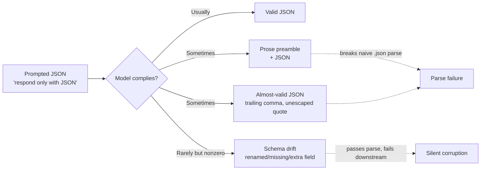

## Structured Outputs

> Chapter of [[ai-foundations/readme#01 — Language Models in Practice|Language Models in Practice]],
> part of [[ai-foundations/readme|AI & LLM Foundations]].

## What you will understand at the end

- Why "just ask for JSON" is a request, not a guarantee, and where naive prompted-JSON pipelines
  break in production
- The three real mechanisms that turn a schema into an enforced contract — prompted JSON,
  tool-schema coercion, and constrained/grammar decoding — and which one actually guarantees
  validity
- How to design a schema an LLM can reliably fill, and why validation-with-retry is still required
  even under the strongest guarantee

---

## The gap between "ask for JSON" and "guarantee JSON"

The naive approach — append "respond only with valid JSON matching this shape" to a prompt — works
often enough in a demo to feel solved, then breaks in production in a specific, recognizable way:



Three distinct failure classes hide inside "the JSON didn't work": a parse failure (extra prose, a
markdown code fence, a trailing comma), a **schema drift** failure that still parses but doesn't
match your contract (a renamed key, a missing required field, an extra field your code didn't
expect), and — the most dangerous one — a **hallucinated field** that both parses and matches the
schema's shape while being factually wrong, which no amount of JSON-validity checking can catch
because validity and correctness are orthogonal properties. This chapter covers mitigations for the
first two; the third is a hallucination problem, treated in
[[08-hallucination-management|Hallucination Management]].

## Three mechanisms, three guarantee levels

### 1. Prompted JSON (weakest guarantee)

Instructing the model to output JSON in the prompt, with no API-level enforcement. This is the "just
ask" approach and it is genuinely fine for low-stakes, human-reviewed, or easily-retried use cases —
but it offers **zero structural guarantee**. The model can, and eventually will, wrap the JSON in a
markdown fence, add an explanatory sentence before it, or violate the schema under sufficiently
unusual input.

````python
# Weakest guarantee — works most of the time, will eventually break silently
messages = [{
    "role": "user",
    "content": 'Extract name and email as JSON: "Contact Jane at jane@co.com"',
}]
# Response might be: {"name": "Jane", "email": "jane@co.com"}
# Or might be: Here's the extracted data:\n\n```json\n{"name": "Jane", ...}\n```
````

### 2. Tool/function-schema coercion (strong guarantee)

Reframing the extraction as a tool call turns the schema into an `input_schema` the API validates
against structurally, rather than a hope expressed in prose. This is covered mechanically in
[[04-function-calling|Function Calling]]; the relevant point here is that a tool's `input_schema` is
a genuine JSON Schema object, not a hint — you get a `tool_use` content block whose `input` is
guaranteed to be valid JSON matching the declared types.

```python
response = client.messages.create(
    model="claude-opus-4-8", max_tokens=1024,
    tools=[{
        "name": "extract_contact",
        "description": "Extract a contact's name and email from text.",
        "input_schema": {
            "type": "object",
            "properties": {
                "name": {"type": "string"},
                "email": {"type": "string"},
            },
            "required": ["name", "email"],
        },
    }],
    tool_choice={"type": "tool", "name": "extract_contact"},  # force this exact tool
    messages=[{"role": "user", "content": 'Extract from: "Contact Jane at jane@co.com"'}],
)
tool_use = next(b for b in response.content if b.type == "tool_use")
contact = tool_use.input  # already a parsed dict — {"name": "Jane", "email": "jane@co.com"}
```

Forcing `tool_choice` to the specific tool removes the model's option to respond with prose instead
of a call — without it, the model could still choose to answer conversationally and skip the tool
entirely.

### 3. Native structured output / constrained decoding (strongest guarantee)

The strongest mechanism constrains the token-generation process itself so that only tokens
consistent with the schema can be sampled at each step — the model is structurally incapable of
emitting `{"nam` when the schema requires `"name"`, because invalid continuations are masked out of
the distribution before sampling.

```python
response = client.messages.create(
    model="claude-opus-4-8", max_tokens=1024,
    output_config={
        "format": {
            "type": "json_schema",
            "schema": {
                "type": "object",
                "properties": {
                    "name": {"type": "string"},
                    "email": {"type": "string"},
                    "plan": {"type": "string"},
                },
                "required": ["name", "email", "plan"],
                "additionalProperties": False,
            },
        }
    },
    messages=[{"role": "user", "content": "Extract: John Smith (john@co.com), Enterprise plan"}],
)
```

This is `output_config.format` on the Messages API (the successor to the older, now-deprecated
`output_format` parameter). It genuinely eliminates the parse-failure and schema-drift classes from
the diagram above — the response is _structurally_ guaranteed to validate against the schema. It
does **not** eliminate hallucinated field values, and it has real limitations worth designing
around: recursive schemas, numeric range constraints (`minimum`/`maximum`), and string-length
constraints (`minLength`/`maxLength`) aren't supported by the constraint grammar — SDKs that offer
client-side validation (Pydantic models via `client.messages.parse()` in Python, Zod via the
equivalent TypeScript helper) will silently strip unsupported constraints from what's sent to the
API and enforce them locally instead, which is worth knowing before you assume a `minLength` you
wrote is actually being enforced server-side.

## Designing a schema an LLM can actually fill

A schema is a contract with two audiences: your downstream code, and the model doing the filling.
Schemas designed only for the first audience produce worse extraction quality even under the
strongest enforcement mechanism, because validity doesn't imply the _right_ value landed in each
field — an under-specified schema still leaves room for the model to guess wrong about what a field
means.

- **Every field needs a description, even ones that feel self-explanatory.** `"status"` is ambiguous
  between "HTTP status," "task status," and "account status" without one.
- **Use `enum` for closed sets instead of free-text `string`.**
  `"severity": {"enum": ["P1", "P2", "P3", "P4"]}` cannot drift to `"P0"` or `"high"`; a free-text
  severity field eventually will.
- **Make optional fields genuinely optional, not `required` with a "N/A" convention.** A schema that
  requires `middle_name` forces the model to either fabricate one or violate the schema when the
  input has none — omit it from `required` and let it be `null` or absent instead.
- **Keep nesting shallow.** Deeply nested objects-within-arrays-within-objects increase the chance
  the model gets the _shape_ right but a value at depth wrong, and they're harder for you to unit
  test against edge cases too.
- **Don't ask for a field to be computed from another field in the same call unless the model can
  see its own reasoning.** Asking for `total` to equal the sum of an `items` array it's
  simultaneously generating invites arithmetic drift — either have code compute derived fields after
  extraction, or use adaptive thinking so the arithmetic happens in a visible reasoning step before
  the final JSON is assembled.

## Validate, then retry — even under the strongest guarantee

Structural validity is not business validity. Even a response that's guaranteed to be well-formed
JSON matching your schema can have a plausible-but-wrong `email` field, a `severity` that doesn't
match the actual text, or a `total` that doesn't reconcile with the line items. Production pipelines
need a validation layer beyond the schema check:

```python
from pydantic import BaseModel, EmailStr, ValidationError

class Contact(BaseModel):
    name: str
    email: EmailStr
    plan: str

def extract_contact(client, text: str, max_retries: int = 2) -> Contact:
    for attempt in range(max_retries + 1):
        response = client.messages.parse(
            model="claude-opus-4-8", max_tokens=1024,
            messages=[{"role": "user", "content": f"Extract contact info: {text}"}],
            output_format=Contact,
        )
        try:
            return Contact.model_validate(response.parsed_output.model_dump())
        except ValidationError as e:
            if attempt == max_retries:
                raise
            # Feed the validation error back so the model can self-correct
            text = f"{text}\n\n(Previous attempt failed validation: {e})"
    raise RuntimeError("unreachable")
```

This is the same pattern that recurs in
[[10-building-reliable-llm-applications|Building Reliable LLM Applications]]: treat the model call
as a step that can fail its contract, validate the result explicitly, and retry with the failure fed
back as additional context rather than retrying blind. Schema enforcement at the API level reduces
how often you hit that retry path — it doesn't remove the need for one.

## Metadata

|        |                |
| ------ | -------------- |
| Author | Amit Singh     |
| Scope  | ai-foundations |
