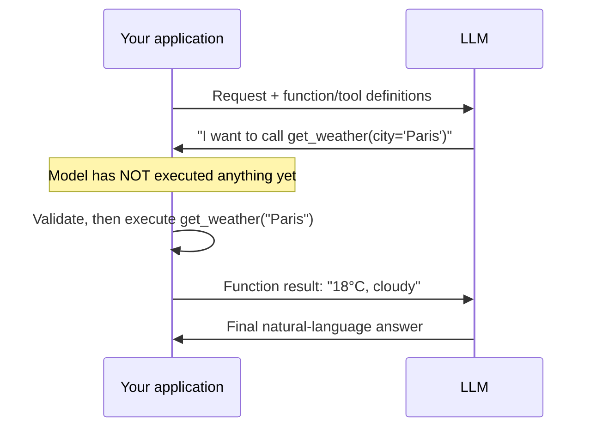

## Function Calling

> Chapter of [[ai-foundations/readme#01 — Language Models in Practice|Language Models in Practice]],
> part of [[ai-foundations/readme|AI & LLM Foundations]].

## What you will understand at the end

- The request/response contract that turns "the model wants to call a function" into code your
  application actually executes — and why the model never runs anything itself
- How a model selects which function to call and populates its arguments from natural language, and
  where that selection and population process breaks
- The specific defenses against parameter hallucination and ambiguous tool selection, before this
  Part extends the pattern to multi-tool agent design

---

## The model proposes; your code disposes

The single most important mental model for function calling: **the LLM never executes anything.** It
emits a structured description of a function call it would like made — a name and a set of arguments
— and your application code is entirely responsible for deciding whether to run it, running it, and
feeding the result back. This is true regardless of provider or SDK dressing; "function calling" and
"tool use" name the same underlying mechanism (Anthropic's Messages API calls it `tool_use`;
OpenAI's Chat Completions API calls it `function_call`/`tool_calls`), and every framework built on
top of either is implementing the same four-step loop:



The gap between "the model requested a call" and "the call happened" is exactly where the
application-level responsibility sits: validating arguments, enforcing permissions, handling
execution errors, and deciding what a failure should look like from the model's point of view. None
of that is the model's job, and code that treats a `tool_use` block as already-executed is the most
common source of confused, hard-to-debug agent behavior.

## The function-schema contract

A function definition given to the model is a JSON Schema describing the function's name, purpose,
and parameters — the same schema mechanism covered from the extraction side in
[[03-structured-outputs|Structured Outputs]], applied here to describing an _action_ instead of a
_data shape_:

```python
tools = [{
    "name": "get_weather",
    "description": "Get the current weather for a given city. Use this whenever "
                    "the user asks about current conditions, not historical or forecast data.",
    "input_schema": {
        "type": "object",
        "properties": {
            "city": {"type": "string", "description": "City name, e.g. 'Paris'"},
            "unit": {"type": "string", "enum": ["celsius", "fahrenheit"], "description": "Temperature unit"},
        },
        "required": ["city"],
    },
}]

response = client.messages.create(
    model="claude-opus-4-8", max_tokens=1024,
    tools=tools,
    messages=[{"role": "user", "content": "What's it like in Paris right now?"}],
)

for block in response.content:
    if block.type == "tool_use":
        print(block.name, block.input)  # "get_weather" {"city": "Paris"}
```

Two fields do almost all the work of correct selection and population, and both are frequently
under-invested in relative to their leverage:

- **`description` is the primary selection signal.** The model decides _whether_ to call a function,
  and _which_ of several candidates, almost entirely from the description text — not the function
  name. A description that states only what the function does ("Gets weather data") gives weaker
  selection signal than one that also states _when_ to call it ("Use this whenever the user asks
  about current conditions, not historical or forecast data") — being prescriptive about the trigger
  condition, not just the capability, is the single highest-leverage edit to a tool description.
- **Per-parameter `description` and `enum` do the population work.** A `city` parameter with no
  description leaves the model guessing at format (full name? airport code? "Paris, France" vs.
  "Paris"?); an `enum`-constrained `unit` parameter cannot drift to a value your code doesn't
  handle.

## Parameter hallucination

**The failure:** the model calls a real function with a plausible-looking argument that has no basis
in anything the user said or any data the model was given — inventing a `city` value, fabricating an
`order_id`, or supplying a default that happens to look reasonable rather than surfacing that the
information is missing.

This is a special case of hallucination (treated generally in
[[08-hallucination-management|Hallucination Management]]), and it's particularly dangerous in
function calling specifically because a hallucinated argument doesn't look like an error — it's a
syntactically perfect call to a real function with a wrong value, which will execute successfully
and produce a wrong-but-plausible result rather than failing loudly.

**Concrete defenses:**

- **Make genuinely required parameters `required` in the schema, and give the model permission to
  ask instead of guess.** A system prompt line like "If a required parameter isn't clear from the
  conversation, ask the user rather than guessing a value" measurably reduces confident invention —
  the model defaults to guessing when guessing is implicitly the only offered path forward.
- **Constrain everything constrainable.** Free-text fields invite invention; `enum`, date-format
  patterns, and numeric bounds close off entire classes of plausible-but-wrong values.
- **Validate before executing, and reject with a specific reason.** If `order_id` doesn't match your
  system's ID format, don't execute the call and hope — return a `tool_result` with `is_error: true`
  and a message the model can act on ("order_id must match format ORD-XXXXX"), which lets the model
  self-correct on the next turn instead of silently succeeding against garbage.
- **For destructive or high-stakes calls, require the model to restate what it's about to do before
  you execute it**, and gate execution behind that restatement matching the actual arguments — this
  catches cases where the model's stated intent and its populated arguments have quietly diverged.

## Ambiguous selection

**The failure:** with several tools available, the model picks the wrong one — not because it
hallucinated, but because two tool descriptions overlap in a way that makes selection genuinely
underdetermined from the model's point of view. A `search_orders` and `get_order_by_id` pair with
similar descriptions will get confused on requests that could plausibly go to either.

**Concrete defenses:**

- **Make descriptions mutually exclusive, not just individually accurate.** "Search orders by
  customer name or date range" and "Retrieve a single order by its exact order ID" don't overlap;
  "Look up order information" and "Get order details" do.
- **Reduce the tool count actually in context for a given turn.** Every function definition consumes
  context and, more importantly, competes for selection attention — a system that always exposes all
  40 tools to every request will make more selection errors than one that narrows to the 5 relevant
  tools per request. This scales into the tool-discovery and tool-search patterns covered in
  [[10-tool-discovery|Part 04 of Agentic AI Engineering — Tool Discovery]] and
  [[11-tool-selection-strategies|Tool Selection Strategies]].
- **Force the tool when the request genuinely has only one right answer.**
  `tool_choice: {"type": "tool", "name": "..."}` removes selection ambiguity entirely for requests
  you can classify upstream — don't leave the model to choose between two tools when your
  application logic already knows which one applies.

## From one function to many

This chapter deliberately stayed in single-function territory: one function offered, one call made,
one result returned. Real agents almost always offer several tools, choose among them per-turn, and
sometimes call more than one in the same turn — that's a distinct set of design problems (tool
registries, parallel vs. sequential invocation, tool-choice strategy) covered next in
[[05-tool-calling|Tool Calling]].

## Metadata

|        |                |
| ------ | -------------- |
| Author | Amit Singh     |
| Scope  | ai-foundations |
