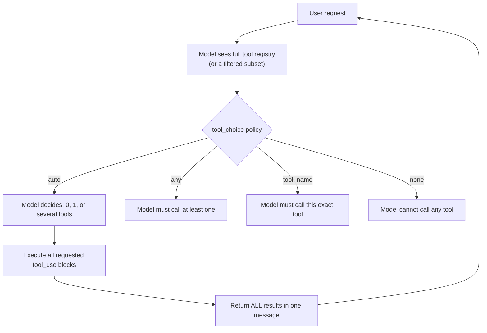

## Tool Calling

> Chapter of [[ai-foundations/readme#01 — Language Models in Practice|Language Models in Practice]],
> part of [[ai-foundations/readme|AI & LLM Foundations]].

## What you will understand at the end

- How the single-function contract from the previous chapter extends to a registry of many tools,
  and the design decisions that only exist once there's more than one
- The four `tool_choice` strategies and when each is the right default
- Why parallel tool execution is the default behavior worth understanding explicitly, and the one
  rule that keeps it from silently degrading into sequential-only behavior

---

## From one function to a registry

[[04-function-calling|Function Calling]] covered the request/response contract for a single tool.
The moment an agent has more than one tool available, three new design problems appear that don't
exist in the single-tool case: which tool(s) should the model be _allowed_ to call this turn, should
multiple calls in one turn run at once or in sequence, and how does the growing list of tool
definitions itself become something you have to manage rather than just declare.



## Tool-choice strategies

The `tool_choice` parameter governs how much latitude the model has over whether and which tool to
call — and picking the wrong default here is a common source of either over-triggering (the model
calls a tool when a plain answer would do) or under-triggering (the model answers from stale
knowledge when it should have looked something up):

| `tool_choice`                     | Behavior                                      | Right default for...                                                                 |
| --------------------------------- | --------------------------------------------- | ------------------------------------------------------------------------------------ |
| `{"type": "auto"}`                | Model decides freely — 0, 1, or several tools | General-purpose assistants where most turns don't need a tool                        |
| `{"type": "any"}`                 | Model must call at least one tool this turn   | Pipelines where you already know a tool call is required — force it rather than hope |
| `{"type": "tool", "name": "..."}` | Model must call this specific tool            | You've already classified the request upstream and know the answer                   |
| `{"type": "none"}`                | Model cannot call any tool this turn          | A turn where you want a plain answer even though tools are declared for later turns  |

`auto` is the right default for most conversational agents, but it's not free of failure modes — a
model with `auto` and a `search` tool available can either over-search (calling it on questions it
already knows confidently) or under-search (answering from parametric knowledge when the answer is
time-sensitive). Both are steerable via the tool's `description` — be explicit about _when_ to call
it, not just what it does — per the guidance in [[04-function-calling|Function Calling]]. When your
application already knows a tool call is mandatory (a data-extraction pipeline that must always call
`extract_fields`, never answer conversationally), forcing `any` or the specific tool name removes an
entire failure mode rather than hoping the model's judgment converges on the right choice.

## Parallel tool use is the default — and it has one hard rule

Modern tool-calling APIs allow a single assistant turn to request **multiple tool calls at once** —
the model might decide it needs both `get_weather("Paris")` and `get_weather("London")` to answer
one question, and emit two `tool_use` blocks in the same response rather than one, waiting for the
result, then asking for the second.

```python
response = client.messages.create(
    model="claude-opus-4-8", max_tokens=1024,
    tools=[weather_tool],
    messages=[{"role": "user", "content": "Compare the weather in Paris and London right now."}],
)

tool_uses = [b for b in response.content if b.type == "tool_use"]
# len(tool_uses) == 2 — both cities requested in one turn

# Execute them — genuinely concurrently is fine, since they're independent
results = [{"tool_use_id": t.id, "type": "tool_result", "content": execute(t.name, t.input)}
           for t in tool_uses]

# THE RULE: all results for this turn go back in a SINGLE user message
messages.append({"role": "assistant", "content": response.content})
messages.append({"role": "user", "content": results})  # not two separate messages
```

**The one rule that matters:** when a turn requests multiple tool calls, return **all** of their
results in a **single** subsequent user message, not split across multiple messages. Splitting them
across messages doesn't just look wrong structurally — on models that have been trained on the
parallel-call convention, it actively teaches the model, within that conversation, that parallel
calling doesn't pay off, and measurably suppresses parallel tool use on later turns in the same
session. This is a subtle failure mode: the pipeline still works, it just silently gets slower, call
by call, as the session goes on.

**Design implication:** if your tools have side effects that must not run concurrently (two writes
to the same record, an operation that must precede another), don't rely on the model to sequence
them correctly — either merge them into one tool that internally sequences the steps, or explicitly
instruct "call X and wait for its result before calling Y" and verify the model actually holds off
where you assumed it would.

## Managing a growing tool registry

A registry of 5 tools and a registry of 50 tools are different engineering problems, not the same
problem at a different scale:

- **Every declared tool consumes context on every request**, whether or not it's called — a large,
  rarely-used tool catalog is a standing token-cost tax, not a one-time cost.
- **Selection accuracy degrades as the candidate set grows**, independent of any individual
  description's quality — the model has more plausible-looking options to confuse, not just more
  options.
- **Static, request-independent tool exposure ("always send all 40 definitions") is the naive
  default and the first thing to fix** once a catalog outgrows what one prompt should carry. The two
  real fixes — narrowing by task classification upstream, or dynamic tool search/discovery where the
  model itself queries a larger catalog for the handful of relevant tools — are covered at
  architecture depth in
  [[10-tool-discovery|Part 04 of Agentic AI Engineering, Chapter 10 — Tool Discovery]] and
  [[11-tool-selection-strategies|Chapter 11 — Tool Selection Strategies]].

The Part 01 scope stops at understanding _why_ a growing registry needs management; the _how_ — tool
search, embedding-based retrieval over tool catalogs, hierarchical routing — belongs to Part 04 of
Agentic AI Engineering's deeper treatment of environment interaction.

## Tool descriptions are prompt engineering, recursively

The most easily overlooked point in multi-tool design: a tool's `name` and `description` are, in
effect, a prompt written for an audience of one — the model, at the moment it's deciding what to do
next. Every principle from [[01-prompt-engineering-fundamentals|Prompt Engineering Fundamentals]]
about clarity and specificity applies to tool descriptions exactly as it applies to system prompts,
and a team that carefully engineers its system prompt while treating tool descriptions as an
afterthought ("Searches things") is leaving the same category of quality on the table they already
learned to fix once, in the wrong place.

## Metadata

|        |                |
| ------ | -------------- |
| Author | Amit Singh     |
| Scope  | ai-foundations |
