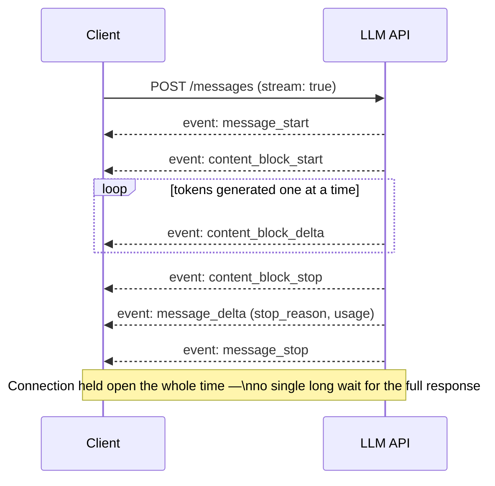

## Streaming Responses

> Chapter of [[ai-foundations/readme#01 — Language Models in Practice|Language Models in Practice]],
> part of [[ai-foundations/readme|AI & LLM Foundations]].

## What you will understand at the end

- Why streaming isn't a UX nicety layered on top of an LLM call — for large `max_tokens` it's a
  structural requirement most SDKs enforce, because a synchronous request risks an HTTP timeout
  before generation finishes
- The Server-Sent Events wire format underneath every "typing" effect, and the event types that
  actually carry content vs. the ones that carry metadata
- How streaming interacts with tool calling and structured outputs — where content arrives
  incrementally and where it can only be trusted once complete

---

## Why streaming exists: it's a timeout problem before it's a UX problem

The common framing of streaming — "it makes the response feel faster" — understates why it's load-
bearing. Generating a long response takes real wall-clock time, one token at a time; a non-streaming
HTTP request has to hold the connection open for the _entire_ generation before returning anything,
and most HTTP clients and load balancers have timeout defaults well under what a large `max_tokens`
response can take to fully generate. On current Claude models, output token budgets up to 128K are
supported, but SDKs actively guard against issuing a non-streaming request they estimate will exceed
roughly ten minutes — past that threshold, the Python SDK raises a `ValueError` rather than letting
the request go out and time out silently downstream. **Streaming is the mechanism that makes
large-output requests viable at all**, not an optional enhancement on top of requests that would
have worked fine synchronously anyway.



## The SSE event vocabulary

Streaming responses are delivered as **Server-Sent Events** — a simple, one-directional wire format
where the server pushes a sequence of typed, timestamped events over a single held-open HTTP
connection. Every mainstream LLM provider's streaming API is a variation on this same shape:

| Event type            | Carries                                                                    | Fires                                                      |
| --------------------- | -------------------------------------------------------------------------- | ---------------------------------------------------------- |
| `message_start`       | Message metadata (id, model, empty usage)                                  | Once, at the very beginning                                |
| `content_block_start` | The type of block beginning (`text`, `tool_use`, `thinking`)               | Each time a new content block starts                       |
| `content_block_delta` | The incremental chunk — `text_delta`, `input_json_delta`, `thinking_delta` | Repeatedly, once per chunk of generated content            |
| `content_block_stop`  | Signal that this block is complete                                         | Each time a content block finishes                         |
| `message_delta`       | `stop_reason` and cumulative `usage`                                       | Near the end, once the model has decided why it's stopping |
| `message_stop`        | Nothing — end-of-stream marker                                             | Once, at the very end                                      |

The raw wire format (what you'd see with a bare `curl` against the streaming endpoint) looks like:

```
event: content_block_delta
data: {"type":"content_block_delta","index":0,"delta":{"type":"text_delta","text":"Hello"}}

event: content_block_delta
data: {"type":"content_block_delta","index":0,"delta":{"type":"text_delta","text":" there"}}
```

In practice you rarely parse this by hand — every official SDK wraps it in a higher-level streaming
helper:

```python
with client.messages.stream(
    model="claude-opus-4-8", max_tokens=64000,
    messages=[{"role": "user", "content": "Write an incident postmortem summary."}],
) as stream:
    for text in stream.text_stream:      # yields just the text deltas, pre-filtered
        print(text, end="", flush=True)

    final_message = stream.get_final_message()   # full accumulated Message, once done
    print(final_message.usage.output_tokens)
```

`stream.text_stream` gives you the token-by-token UX effect directly; `get_final_message()` gives
you the fully-accumulated response once the stream completes — most production code needs both: the
former for the live UI, the latter for anything that inspects `stop_reason`, `usage`, or structured
content after the fact.

## Streaming interacts differently with each content type

Streaming is not uniformly "the same content, delivered incrementally" — different content types
carry genuinely different guarantees mid-stream:

- **Plain text (`text_delta`)** is safe to render incrementally, chunk by chunk, exactly as it
  arrives — this is the classic chat-UI "typing" effect and the only content type where partial
  content is meaningful to a human reader before the block finishes.
- **Tool-call arguments (`input_json_delta`)** stream as fragments of a JSON string being assembled
  token by token. A partial fragment (`{"city": "Par`) is **not valid JSON** and must not be parsed
  or acted on until `content_block_stop` signals the block is complete — attempting to execute a
  tool against a mid-stream partial argument is a real and easy-to-introduce bug in hand-rolled
  streaming loops. This is exactly why [[03-structured-outputs|Structured Outputs]] emphasized
  validating only the complete response.
- **Thinking content (`thinking_delta`)** streams the model's extended-thinking process when
  enabled, and is genuinely useful to surface as a "thinking..." indicator — but on current Claude
  models the default `display` setting is `"omitted"`, meaning thinking blocks stream with empty
  text unless you explicitly request `display: "summarized"`. A UI that silently assumes it will get
  readable thinking content by default will show a long pause instead — set the parameter
  deliberately rather than discovering the default the hard way.

## Streaming and tool-calling loops together

A tool-using agent that also streams has to handle a subtlety: the _decision to call a tool_ only
becomes final once the assistant turn completes — `stop_reason: "tool_use"` is a property of the
finished message, not something you can read off mid-stream. The practical pattern is to stream the
text portion of a turn live (for UX), while still calling `get_final_message()` (or your SDK's
equivalent) to inspect `stop_reason` and extract complete `tool_use` blocks before executing
anything:

```python
with client.messages.stream(
    model="claude-opus-4-8", max_tokens=16000, tools=tools, messages=messages,
) as stream:
    for text in stream.text_stream:
        render_to_ui(text)  # live text, safe to show incrementally

    response = stream.get_final_message()

if response.stop_reason == "tool_use":
    # Only now — after the stream is fully consumed — extract and execute tool_use blocks
    ...
```

## Time-to-first-token vs. total completion time

Streaming reframes the latency conversation into two separate numbers that used to be conflated into
one "response time":

- **Time-to-first-token (TTFT)** — how long before the _first_ piece of content arrives. This is
  what users perceive as "responsiveness," and it's dominated by model size, prompt length (a long,
  uncached system prompt adds real TTFT), and provider queue depth — see
  [[07-model-selection-and-routing|Model Selection & Routing]] for how model tier choice trades
  against this directly.
- **Total completion time** — how long until the _entire_ response, including any tool round-trips,
  is done. For a chat UI, TTFT dominates perceived quality even if total time is unchanged; for a
  batch pipeline generating a report nobody is watching live, TTFT is irrelevant and only total time
  (and cost) matters.

This distinction is why "just stream everything" isn't always the right call — see below.

## When not to stream

Streaming adds real complexity: partial-content handling, reconnection logic, and (for tool-using
agents) the discipline of not acting on incomplete fragments. It earns that complexity when a human
is watching the output arrive live, or when `max_tokens` is large enough that a synchronous request
risks timing out. It doesn't earn it when:

- **The output feeds another system, not a human.** A batch classification pipeline that writes
  results to a database has no UX benefit from streaming and gains nothing but extra plumbing — use
  `messages.create()` directly, or the Batch API if latency-per-item doesn't matter at all.
  `stream.get_final_message()` exists precisely so streaming code and non-streaming code converge to
  the same final object — pick based on whether anyone is watching, not by default.
- **Output is short and bounded** (a classification label, a short structured extraction) — TTFT and
  total completion time are close enough together that streaming adds complexity without a
  perceptible win.
- **You need the complete, validated response before doing anything with it anyway** — a strict
  structured-output extraction that must pass Pydantic validation before your code proceeds gets no
  benefit from seeing partial JSON arrive; you were always going to wait for the whole thing.

## Metadata

|        |                |
| ------ | -------------- |
| Author | Amit Singh     |
| Scope  | ai-foundations |
