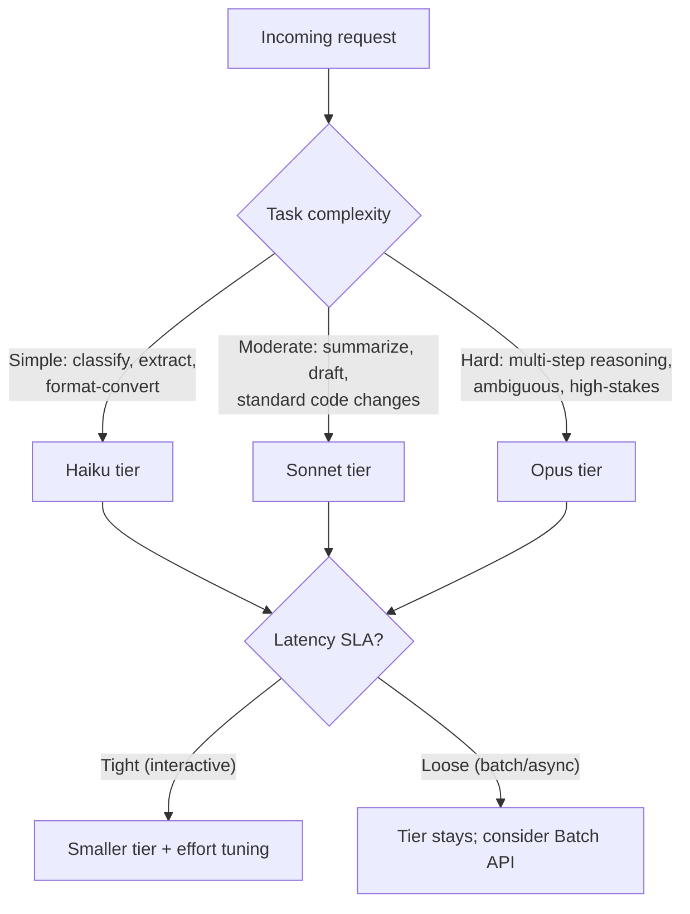

## Model Selection & Routing

> Chapter of [[ai-foundations/readme#01 — Language Models in Practice|Language Models in Practice]],
> part of [[ai-foundations/readme|AI & LLM Foundations]].

## What you will understand at the end

- Why "always call the biggest model" is a defensible prototype strategy and an indefensible
  production one, once traffic volume makes the cost and latency delta real money and real SLA risk
- The concrete axes a router decides on — task complexity, latency budget, and cost ceiling — and
  how to classify a request against them before the expensive model ever sees it
- How the `effort` parameter adds a fourth, finer-grained dial _within_ a model tier, alongside
  model choice itself

---

## The tiering reality behind "which model should I use"

Every frontier LLM provider ships multiple tiers of the same model family, priced and latency-tuned
differently, and the tiers are not interchangeable-but-slower versions of each other — they trade
capability for cost and speed in a way that matters for architecture, not just budget:

| Model tier       | Per-1M input | Per-1M output | Context | Where it wins                                                                                   |
| ---------------- | -----------: | ------------: | ------- | ----------------------------------------------------------------------------------------------- |
| Claude Opus 4.8  |        $5.00 |        $25.00 | 1M      | Long-horizon agentic work, hard reasoning, ambiguous tasks                                      |
| Claude Sonnet 5  |      $2–3.00 |     $10–15.00 | 1M      | The best cost/quality balance — near-Opus on coding/agentic tasks at a fraction of the price    |
| Claude Haiku 4.5 |        $1.00 |         $5.00 | 200K    | High-volume, latency-critical, low-ambiguity tasks (classification, extraction, routing itself) |

(Pricing cached at time of writing — treat the _shape_ of this table, not the exact numbers, as the
durable lesson: there is always roughly a 5–25× spread between the cheapest and most capable tier in
a provider's current lineup, and that spread is the entire reason routing exists as a discipline.)

The mistake this chapter exists to prevent: calling the top-tier model for every request because
it's "the safe choice." It's the safe choice for correctness on any _individual_ request — it is the
expensive and slow choice in aggregate the moment volume is real, and at scale it also means every
simple classification request pays the queueing and inference latency of a model sized for hard
reasoning, dragging down p50 latency for your entire product.

## The three axes a router actually decides on

A model router is a classifier that sits in front of the "real" LLM call and answers one question
cheaply: _which tier does this specific request need?_ It decides based on three axes, and a mature
router scores a request on all three rather than picking one:



- **Task complexity** — the strongest signal, and the one worth investing real classification effort
  in. A request that's a closed-set classification, a well-defined extraction, or a lookup against a
  known schema rarely benefits from a top-tier model's extra reasoning depth; a request with several
  dependent steps, genuine ambiguity, or high stakes for getting it wrong does. This is the same
  judgment call as "does this task need chain-of-thought" from
  [[02-prompt-design-patterns|Prompt Design Patterns]], applied one level up — to model tier instead
  of prompting technique.
- **Latency SLA** — an interactive chat surface and an overnight batch job have wildly different
  latency budgets for the _same_ underlying task. A tight SLA pushes you toward a smaller tier (and
  toward the `effort` dial below) even for moderately complex tasks; a loose one opens up the
  biggest model, or the Batch API (roughly half the per-token cost, in exchange for up-to-24-hour
  turnaround) for non-latency-sensitive volume.
- **Cost ceiling** — the axis that turns "we could use the best model for everything" into "we
  can't, at this volume." A router's real job is finding the _cheapest_ tier that clears your
  accuracy bar for a given request class, not the most capable tier available.

## Building the classifier

The router itself should be cheap and fast — routing 1,000 requests/second through an Opus-tier
classifier to decide whether to _route to_ Opus defeats the purpose. Three practical approaches, in
increasing order of sophistication:

**1. Rule-based routing** — the cheapest option, and often sufficient. If your request types are
already distinguishable by structure (an API endpoint, a UI action, a known intent), route on that
directly with no model call at all:

```python
def route(request_type: str) -> str:
    if request_type in ("classify_ticket", "extract_fields", "format_convert"):
        return "claude-haiku-4-5"
    if request_type in ("summarize", "draft_email", "code_review_pass"):
        return "claude-sonnet-5"
    return "claude-opus-4-8"  # unclassified or explicitly flagged as hard
```

**2. Small-model-as-classifier** — when request type isn't known upstream, use the cheapest tier
itself to classify complexity before routing the real work to the tier that classification implies.
This adds one cheap call to every request but avoids ever sending a genuinely simple request to an
expensive tier:

```python
def classify_complexity(client, user_request: str) -> str:
    response = client.messages.create(
        model="claude-haiku-4-5", max_tokens=10,
        messages=[{"role": "user", "content":
            f"Classify this request's complexity as exactly one word — "
            f"simple, moderate, or hard:\n\n{user_request}"}],
    )
    return response.content[0].text.strip().lower()

TIER_FOR_COMPLEXITY = {"simple": "claude-haiku-4-5", "moderate": "claude-sonnet-5", "hard": "claude-opus-4-8"}
```

**3. Escalation on failure** — start at the cheapest tier that plausibly handles the request, and
escalate to the next tier only when the cheap tier's output fails validation (see
[[10-building-reliable-llm-applications|Building Reliable LLM Applications]] for the
validation-and-retry pattern this composes with). This trades a small amount of added latency on the
failure path for meaningfully lower average cost — most requests never escalate.

## `effort` — a finer dial within a tier

Current-generation Claude models expose an `effort` parameter (`low` / `medium` / `high` / `xhigh` /
`max`) that controls thinking depth and overall token spend _within_ a chosen model, independent of
adaptive thinking's own on/off state. This is a second routing axis, orthogonal to model choice: two
requests both routed to Sonnet can still be differentiated by effort level.

```python
response = client.messages.create(
    model="claude-sonnet-5", max_tokens=4096,
    thinking={"type": "adaptive"},
    output_config={"effort": "low"},   # short, scoped task — don't over-think it
    messages=[{"role": "user", "content": "Classify this support ticket's urgency."}],
)
```

Lower effort produces fewer, more consolidated tool calls and terser output — appropriate for
latency-sensitive or genuinely simple tasks even on a capable model; `high` or `xhigh` is the right
default for coding and agentic work where under-thinking risks a wrong multi-step answer; `max` is
reserved for cases where correctness matters more than cost or latency, full stop. Treat `effort` as
the dial you reach for _within_ a tier decision, and model choice as the coarser dial across tiers —
a router with both dials available has meaningfully more resolution than one with model choice
alone.

## Fallback and degraded-mode design

A production router needs a failure path, not just a happy path — provider outages, rate limits, and
regional degradation are operational realities, not edge cases (see
[[11-high-availability|Part 02 of Building & Evaluating Agents, Chapter 11 — High Availability]] for
the infrastructure-level treatment). At minimum, a router should:

- **Have a same-provider fallback tier defined per route** — if Opus is rate-limited or overloaded,
  falling back to Sonnet with a note in the response that quality may be reduced is usually better
  than failing the request outright.
- **Distinguish retryable failures (429, 5xx, network) from non-retryable ones (400)** — retrying a
  malformed request against a different model tier just reproduces the same 400 elsewhere.
- **Track per-tier error rates and latency as first-class metrics**, not just aggregate ones — a
  router silently degrading because one tier is unhealthy is invisible unless you're watching each
  tier's health independently. This is the same instrumentation discipline covered generally in
  [[01-ai-observability-fundamentals|Part 01 of Production Agent Systems — AI Observability Fundamentals]].

## Metadata

|        |                |
| ------ | -------------- |
| Author | Amit Singh     |
| Scope  | ai-foundations |
