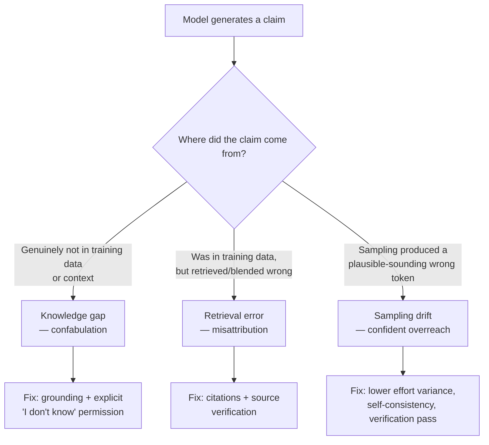

## Hallucination Management

> Chapter of [[ai-foundations/readme#01 — Language Models in Practice|Language Models in Practice]],
> part of [[ai-foundations/readme|AI & LLM Foundations]].

## What you will understand at the end

- Why hallucination is not a bug to be patched but a structural consequence of how these models
  generate text — and why that framing changes what "fixing" it actually means
- The three distinct mechanisms that produce hallucinated content, because they call for different
  mitigations
- The concrete, composable defenses — grounding, citation requirements, and confidence-calibrated
  refusal — and where each one's limits are

---

## Hallucination is structural, not a bug

A language model generates text by repeatedly sampling the most probable next token given everything
before it. It has no separate mechanism that checks "is this claim actually true" before emitting a
token — fluency and factuality are not the same optimization target, and the model was trained
almost entirely on the former. A hallucinated citation, a fabricated API method, and a confidently
wrong statistic are not the model "malfunctioning" — they are the model doing exactly what it does
everywhere else (producing the most probable-sounding continuation), applied to a case where the
most probable-sounding continuation happens to be false. This reframing matters because it rules out
the naive fix: no amount of "please don't hallucinate" instruction addresses a _structural_ property
of next-token generation the way it would address a policy the model is merely choosing not to
follow.



## Three mechanisms, three distinct failure signatures

**Knowledge gaps (confabulation).** The model is asked about something genuinely outside its
training distribution — a fact that postdates its training cutoff, an internal system it was never
exposed to, a niche detail with too little training signal to have learned reliably. Rather than an
explicit "I don't know," the training process's strong pull toward producing _a_ plausible answer
(because refusing to answer was rarely the reward-maximizing response during training) produces a
fluent, specific-sounding, entirely fabricated one. This is the single most common hallucination
pattern in practice, and it's recognizable by a specific signature: the fabricated answer is usually
_stylistically_ indistinguishable from a correct one — same confidence, same specificity, same
formatting — which is exactly why it's dangerous.

**Retrieval/misattribution errors.** The underlying fact genuinely exists somewhere in the model's
training data or provided context, but it gets attributed to the wrong source, blended with a
similar but distinct fact, or retrieved with a detail from an adjacent but different case. This is
common in citation generation (a real paper title paired with the wrong author or year) and in RAG
pipelines where retrieval returns a document that's topically similar but doesn't actually support
the specific claim being made.

**Sampling drift.** Even with correct knowledge available, the probabilistic nature of generation
means a low-probability-but-nonzero wrong token can get sampled, and once it's in the context, the
model tends to build a self-consistent (and now wrong) continuation around it rather than "noticing"
and correcting — there's no built-in self-correction step in a single forward generation pass. This
is the mechanism [[02-prompt-design-patterns|Prompt Design Patterns]]' self-consistency pattern
targets directly, and it's also why hallucination rates are not zero even on tasks squarely within a
model's demonstrated knowledge.

## Mitigation 1: grounding

**What it fixes:** knowledge gaps and, to a lesser extent, misattribution — by giving the model the
actual source material in context instead of relying on parametric (trained-in) knowledge, which
removes the "confabulate because there's nothing else to draw on" pressure entirely.

Retrieval-Augmented Generation is the dominant grounding pattern in production — retrieve relevant
documents for a query, place them in context, and instruct the model to answer _only_ from what's
provided:

```python
system = (
    "Answer the user's question using ONLY the information in the <context> "
    "tags below. If the answer isn't in the provided context, say so explicitly "
    "— do not use outside knowledge, and do not guess."
)
messages = [{
    "role": "user",
    "content": f"<context>{retrieved_documents}</context>\n\nQuestion: {user_question}",
}]
```

Grounding doesn't eliminate hallucination — a model can still misread or misattribute a claim from
within the provided context — but it converts an open-ended "does the model happen to know this"
problem into a bounded "does the model correctly extract this from the text in front of it" problem,
which is both more reliable and, critically, more _testable_: you can eval a grounded pipeline
against known documents and known correct answers in a way you cannot eval "does the model know
random facts about the world." The full retrieval architecture — chunking, embeddings, hybrid
search, reranking — is covered at depth in
[[01-retrieval-augmented-generation-rag|Part 05 of Agentic AI Engineering — Retrieval & Knowledge Systems]];
this chapter's scope is the grounding _principle_, not the retrieval pipeline that implements it.

## Mitigation 2: citation requirements

**What it fixes:** misattribution specifically, by forcing the model to point at _where_ a claim
comes from rather than just stating it — which both discourages fabrication (a claim with no source
to point to is harder to confidently assert) and gives you a verification hook after the fact.

The Claude API supports native citations on document content blocks: enable
`citations: {enabled: true}` on a `document` block, and the response splits into text blocks that
carry a `citations` array pointing back to the exact span of source text each claim is grounded in:

```python
response = client.messages.create(
    model="claude-opus-4-8", max_tokens=1024,
    messages=[{
        "role": "user",
        "content": [
            {"type": "document", "source": {...}, "citations": {"enabled": True}},
            {"type": "text", "text": "Summarize the key financial risks in this document."},
        ],
    }],
)
# response text blocks now carry `.citations` — each cited_text traceable to a
# specific char_location / page_location in the source document
```

Where native citation support isn't available, the same principle works as a prompted convention:
require every factual claim to be tagged with a source reference, and treat an untagged claim as a
signal worth extra scrutiny rather than trusting it at the same confidence as a cited one. Either
way, the mechanism is the same — citations don't make claims true, they make claims **checkable**,
and checkability is what actually matters for catching hallucination before it reaches a user.

## Mitigation 3: confidence-calibrated refusal

**What it fixes:** the training-time pressure toward always producing an answer, by explicitly
making "I don't know" or "I'm not confident" an acceptable, even rewarded, response in your system
prompt — countering the default bias toward fluent confabulation over honest uncertainty.

```python
system = (
    "If you are not confident in an answer, or if the question requires information "
    "you don't have access to, say so explicitly rather than guessing. A clear "
    "'I don't have enough information to answer that confidently' is a better "
    "response than a plausible-sounding guess."
)
```

This is a genuinely underused lever precisely because it feels counterproductive — it will produce
more refusals, and refusals feel like failures compared to a fluent (even if wrong) answer. But for
any use case where a wrong-but-confident answer costs more than an honest "I don't know" — financial
figures, medical or legal information, anything a user might act on directly — the tradeoff is
usually correct. Pair this with a downstream **verification pass**: a separate model call (often at
a cheaper tier — see [[07-model-selection-and-routing|Model Selection & Routing]]) whose only job is
to check the first response's claims against the provided context or known facts, flagging anything
unsupported before it reaches the user. This is a specialized instance of the
adversarial-verification pattern that recurs throughout the reasoning and multi-agent Parts of this
book — an independent check, run separately from the generation that produced the claim, catches
errors the generating pass structurally cannot catch in itself.

## Whose problem this actually is

One framing is worth stating plainly alongside the mechanisms above, because it changes how a team
responds when a hallucination reaches production. A user of a consumer AI product — someone using
ChatGPT or Claude directly — who hits a hallucination can reasonably complain about it; they're a
consumer of someone else's system with no visibility into or control over its internals. An engineer
_building_ an agentic or LLM-backed system is not in that position. Choosing to build a product on a
token-prediction engine means its statistical, occasionally-wrong nature is a known property signed
up for at design time, not a surprise defect discovered in production. "The LLM hallucinated" is not
a valid excuse for the person who built the system — it's a requirements gap in the grounding,
citation, and refusal mitigations above, or in the eval and monitoring coverage from
[[production-agent-systems/01-observability/01-ai-observability-fundamentals/01-ai-observability-fundamentals|AI Observability Fundamentals]]
that should have caught the residual rate before a user did. The job, stated plainly: align
next-token prediction with a business outcome — you code for hallucination, you don't blame it.

## What these mitigations don't fix

None of the three defenses above make hallucination rate zero, and treating any of them as a
complete solution is itself a design mistake. Grounding fails if retrieval returns the wrong
documents. Citations can be attached to a claim that misreads the cited span. Confidence-calibrated
refusal only helps when the model's own uncertainty correlates with actual correctness, which is
imperfect. The realistic engineering posture — covered as a system-level discipline in
[[10-building-reliable-llm-applications|Building Reliable LLM Applications]] — treats hallucination
as a residual error rate to be measured, monitored, and designed around (evals, human review gates
on high-stakes output, graceful degradation), not a problem with a final fix.

## Metadata

|        |                |
| ------ | -------------- |
| Author | Amit Singh     |
| Scope  | ai-foundations |
