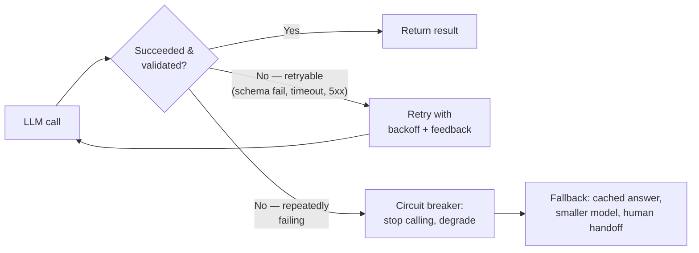

## Building Reliable LLM Applications

> Chapter of [[ai-foundations/readme#01 — Language Models in Practice|Language Models in Practice]],
> part of [[ai-foundations/readme|AI & LLM Foundations]].

## What you will understand at the end

- Why an LLM call is a **non-deterministic dependency**, and why every SRE discipline built for
  flaky, latent, partially-reliable dependencies applies here largely unmodified
- The five concrete practices — validation-and-retry, timeouts, circuit breakers, evals-as-CI-gates,
  and prompt versioning — that convert a probabilistic model call into a component you can put an
  SLO on
- How this chapter's practices are the connective tissue between everything else in this Part and
  the production-infrastructure and observability treatment early in
  [[production-agent-systems/readme|Production Agent Systems]] (Parts 00–01)

---

## An LLM call is a dependency, not a function

Everything in this Part so far has treated the model call as the unit of work — write a good prompt,
enforce a schema, choose the right tool, pick the right tier. This closing chapter reframes the
model call itself: from an SRE's vantage point, `client.messages.create(...)` is not a pure
function. It has latency variance, a nonzero error rate, occasional partial failures (a schema
violation that's _structurally_ valid JSON but _semantically_ wrong), and a cost per call that
scales with input and output size. That is exactly the shape of a flaky external dependency — a
third-party API, a distributed database, a network call — and the reliability engineering that makes
those tractable transfers here with almost no modification:



The single biggest mindset shift this chapter asks for: stop treating a bad LLM response as a bug to
be prompt-engineered away, and start treating it as an **expected failure mode** to be engineered
around — the same way a well-run service treats a downstream 500 as expected, not exceptional.

## Validation-and-retry, not retry-and-hope

A plain retry — resend the identical request and hope for a different, better outcome — is weak
because it gives the model no new information about _why_ the previous attempt was wrong. The
pattern that actually improves outcomes on retry is: validate the response against an explicit
contract, and if it fails, **feed the specific failure back** into the next attempt rather than
retrying blind:

```python
def call_with_validated_retry(client, prompt: str, validator, max_retries: int = 2):
    context = prompt
    for attempt in range(max_retries + 1):
        response = client.messages.create(
            model="claude-opus-4-8", max_tokens=1024,
            messages=[{"role": "user", "content": context}],
        )
        text = response.content[0].text
        ok, error = validator(text)
        if ok:
            return text
        if attempt == max_retries:
            raise RuntimeError(f"validation failed after {max_retries} retries: {error}")
        context = f"{prompt}\n\nYour previous response failed validation: {error}\nTry again."
    raise RuntimeError("unreachable")
```

This is the same principle introduced in [[03-structured-outputs|Structured Outputs]]'s
validate-then-retry example and in [[04-function-calling|Function Calling]]'s `is_error` tool-result
guidance, generalized: **every LLM call in a production path should have an explicit definition of
"succeeded" that's checked in code, not assumed from a 200 status.** A response that parses, matches
the schema, and passes every downstream business-logic check is "succeeded"; anything else is a
retryable failure, a degrade-and-continue case, or a hard error — and deciding which, deliberately,
is part of the design, not an afterthought discovered in an incident review.

## Timeouts and backoff — inherited, not reinvented

LLM API calls fail the same way any HTTP dependency fails: connection errors, 429 rate limits, and
5xx server errors, all of which are transient and worth retrying with backoff; 400s and other 4xx
errors, which are not — retrying an identical malformed request against the same or a different
model tier just reproduces the same error. Every official SDK already implements exponential backoff
with jitter for the retryable class by default (typically `max_retries=2` out of the box) — the
design mistake to avoid is layering a second, uncoordinated retry loop on top of the SDK's own,
which multiplies effective retry count and backoff delay in ways that are easy to lose track of. Set
timeouts deliberately per call rather than accepting a library default that may be tuned for a
different `max_tokens` regime than yours — a request with `max_tokens=64000` and streaming disabled
needs a materially different timeout budget than a short classification call, and conflating the two
is a common source of either premature timeouts on legitimate long generations or dangerously long
hangs on calls that should fail fast.

## Circuit breakers for a probabilistic dependency

A circuit breaker — stop calling a dependency once its failure rate crosses a threshold, and fail
fast (or fall back) instead of continuing to hammer it — applies to LLM calls with one added
wrinkle: "failure" here includes validation failures, not just transport errors. A model tier that's
returning schema-valid-but-consistently-wrong output under some input distribution shift is failing
in a way a naive health check (did the HTTP call succeed?) will never catch, but your
validation-and-retry loop will see it immediately as a rising retry rate. Wire the circuit breaker
to that signal — retry rate and validation-failure rate, not just transport error rate — and have an
explicit fallback path: route to a different model tier (see
[[07-model-selection-and-routing|Model Selection & Routing]]), serve a cached or templated response,
or hand off to a human, rather than letting a degraded dependency silently degrade every request
that depends on it.

## Evals as the CI gate for a probabilistic component

Unit tests assert an exact expected output for an exact input — the wrong mental model for an LLM
call, where the same prompt can legitimately produce several acceptable phrasings of a correct
answer. **Evals** are the equivalent gate for probabilistic components: a held-out dataset of
representative inputs, each with a way to score the output as acceptable or not (an exact match for
structured extraction, a rubric or LLM-as-judge score for open-ended generation, a pass/fail
assertion for tool-selection accuracy), run against every prompt change, tool-schema change, or
model migration before it ships.

```python
def run_eval_suite(client, model: str, cases: list[dict]) -> float:
    passed = 0
    for case in cases:
        response = client.messages.create(
            model=model, max_tokens=1024,
            messages=[{"role": "user", "content": case["input"]}],
        )
        if case["scorer"](response.content[0].text, case["expected"]):
            passed += 1
    return passed / len(cases)

# Treat this exactly like a test-coverage gate: block the merge if score regresses
score = run_eval_suite(client, "claude-opus-4-8", golden_dataset)
assert score >= BASELINE_SCORE - REGRESSION_TOLERANCE
```

Without a standing eval suite, a prompt edit, a model migration, or a tool-description tweak ships
on vibes — it looked better on the three examples someone tried by hand, and nobody finds out it
regressed a different case class until a user does. This is the direct analog of a regression test
suite gating a deploy, and it's covered as a full discipline (offline eval sets, online shadow
comparison, LLM-as-judge scoring) in
[[01-ai-evaluation-frameworks|Part 02 of Building & Evaluating Agents, Chapter 1 — AI Evaluation Frameworks]]
and [[04-offline-evaluation|Chapter 11 — Offline Evaluation]].

## Prompt and schema versioning

A system prompt, a tool schema, and a model ID together define the contract a downstream consumer
depends on — exactly the way an API version defines a contract its callers depend on — and treating
that contract as mutable, untracked prose that changes silently between deploys is how a "small
prompt tweak" becomes an untraceable production regression. Version prompts and schemas the same way
you'd version an API: track changes in source control (not a chat UI or a wiki page nobody diffs),
attach an eval-suite score to each version so a regression is caught before rollout, and roll out
changes with the same caution as any other production dependency change — canary a new prompt
version against a subset of traffic before full rollout, and keep the previous version's exact text
available for instant rollback.
[[12-rollback-strategies|Part 00 of Production Agent Systems, Chapter 12 — Rollback Strategies]]
covers this at the deployment-pattern level; the point to internalize here is narrower: **a prompt
edit is a production change**, not a copy-paste, and it deserves the same change-management rigor
ShipSolid's platform engineering standards already apply to a Helm values file or a Terraform
variable.

## Observability for non-deterministic output

Standard service observability — latency, error rate, saturation — still matters for an LLM
dependency, but it's incomplete: two requests with identical latency and a 200 status can differ
enormously in output quality, and none of the classic golden signals would show it. The metrics that
close this gap are specific to LLM workloads: token counts (input/output/cached) as first-class
SLIs, since a silent prompt-length regression or a runaway agentic loop shows up here before it
shows up in cost dashboards; validation-failure and retry rate as a proxy for output quality drift;
and tool-call success/error rate broken out per tool, since an aggregate success rate hides a single
misbehaving tool. This Part deliberately stayed prompt- and application-level; the full
instrumentation architecture — tracing spans around LLM and tool calls, dashboards, alerting
thresholds tuned for probabilistic components — is the subject of
[[01-ai-observability-fundamentals|Part 01 of Production Agent Systems — Observability]] in its
entirety, which is the natural next stop for anyone building on top of what this chapter introduced.

## Closing the Part: from raw API to dependable component

Trace back across this Part's ten chapters and a single arc emerges:
[[01-prompt-engineering-fundamentals|Chapter 1]] framed a prompt as an interface contract; every
chapter since has been about **enforcing that contract mechanically** rather than trusting it to
hold — schemas instead of hoped-for JSON, forced tool choice instead of hoped-for tool use,
validation-and-retry instead of hoped-for correctness, evals instead of hoped-for regression safety.
That arc — turn a probabilistic capability into an engineered, contract-bound system component — is
also the arc of this entire book: the next Part,
[[01-what-is-agentic-ai|Introduction to Agentic AI]], starts stacking planning, memory, and
multi-step autonomy on top of exactly the dependable foundation this Part exists to establish. None
of what follows is safe to build without it.

## Metadata

|        |                |
| ------ | -------------- |
| Author | Amit Singh     |
| Scope  | ai-foundations |
