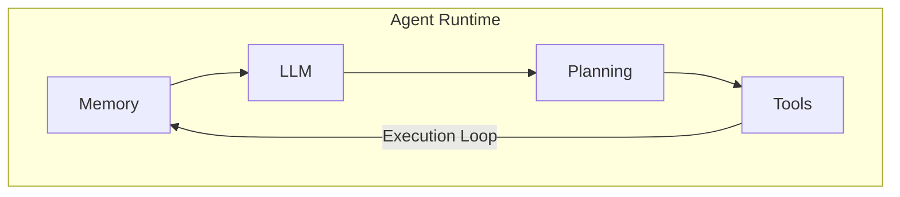
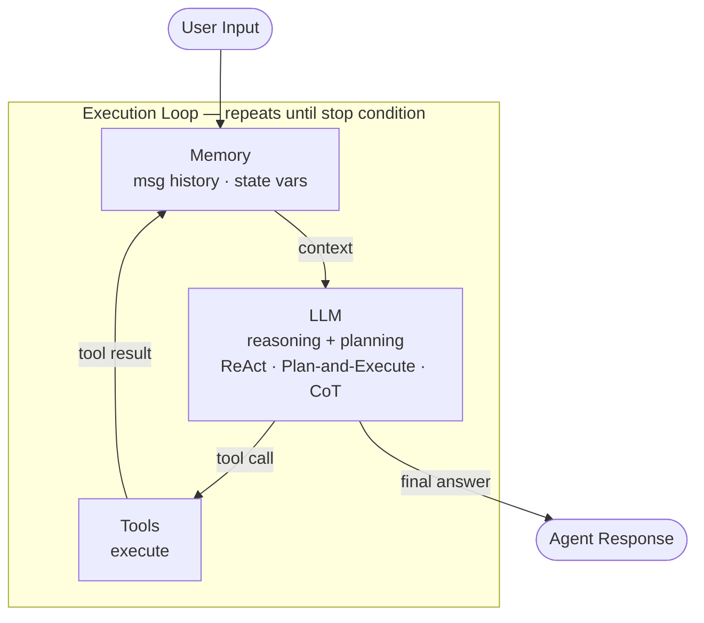

## Agent Architecture

> Chapter of
> [[building-agentic-systems/readme#00 — Building Single-Agent Systems|Building Single-Agent Systems]],
> part of [[building-agentic-systems/readme|Building & Evaluating Agents]].

## What you will understand at the end

- What each of the five core agent components does and _why_ it exists
- How those components connect into an execution loop
- The vocabulary used by frameworks like LangChain, LangGraph, and the Anthropic SDK

---

## The mental model

An agent is not a single program — it is a **runtime** that wraps a language model and gives it
capabilities the model cannot have on its own: persistent state, external tool access, and
controlled iteration.

Think of it like this:



None of these components is optional. Remove any one and you have something weaker — a chatbot, a
function, a script — not an agent.

---

## Component 1 — LLM (Large Language Model)

**What it is:** The reasoning engine. Given text in, text out. It can produce natural language,
structured JSON, tool calls, or code — depending on how you prompt it.

**What it is NOT:** Stateless and memoryless by design. Each call to the API is independent. The LLM
does not "remember" previous calls unless you pass that history in the prompt.

**Why this matters for agents:**

The LLM's statelessness is actually a feature. It means the agent runtime — not the model — owns the
state. This gives you full control over what context the model sees, what gets stored, and for how
long.

**What the LLM does in the agent loop:**

1. Reads the current context (system prompt + message history + tool results)
2. Decides what to do next: answer directly, request a tool call, or ask for clarification
3. Returns either a final answer or a structured tool call request

**Model selection in this course:**

| Model               | When to use                                         |
| ------------------- | --------------------------------------------------- |
| `claude-haiku-4-5`  | Lab exercises, smoke tests, high-volume cheap tasks |
| `claude-sonnet-4-6` | Multi-step reasoning, tool use, code generation     |
| `claude-opus-4-8`   | Production, highest capability tasks                |

The labs are model-agnostic by design — swapping the model string is intentional exploration.

---

## Component 2 — Tools

**What they are:** Functions the LLM can invoke. A tool has three parts:

1. **Name** — identifier (`search_web`, `read_file`, `execute_sql`)
2. **Description** — natural language explanation the LLM uses to decide when to call it
3. **Input schema** — JSON Schema defining what parameters the function expects

**How tool calling works (step by step):**

```txt
1. You define tools as a list of schemas
2. You pass the tools list to the LLM with the user's message
3. The LLM responds with a tool_use block instead of text:
       {"name": "search_web", "input": {"query": "Anthropic agent SDK"}}
4. Your code executes the real function with those inputs
5. You feed the function's return value back to the LLM as a tool_result
6. The LLM reads the result and continues
```

**The LLM does not execute tools — your code does.** The LLM only generates the call parameters.
This is a safety guarantee: you control what runs.

**Common tool categories:**

| Category           | Examples                                                        |
| ------------------ | --------------------------------------------------------------- |
| Information access | Web search, document retrieval, database query                  |
| Code execution     | Python sandbox, SQL runner, shell commands                      |
| External services  | Email, calendar, Slack, GitHub API                              |
| Memory operations  | Store to vector DB, retrieve from vector DB                     |
| Agent spawning     | Create a sub-agent, delegate a sub-task (multi-agent workflows) |

**Why description quality matters:** The LLM picks tools based on their descriptions. A vague
description leads to wrong tool choices. A precise description with examples leads to correct use.
This is prompt engineering applied to tool design.

---

## Component 3 — Memory

**Why it exists:** The LLM context window is finite. A real agent task may span hundreds of turns
and reference data from hours or days ago. Memory solves the persistence problem.

**The four layers of agent memory:**

| Layer              | Where it lives        | How long it lasts | Example use                                |
| ------------------ | --------------------- | ----------------- | ------------------------------------------ |
| In-context (short) | The message list      | One session       | Current conversation history               |
| Working memory     | Variables in code     | One agent run     | Intermediate results, accumulated answers  |
| External (long)    | Vector DB / SQL       | Indefinitely      | User preferences, past interactions        |
| Episodic           | Semantic search index | Indefinitely      | Retrieve relevant past tasks by similarity |

**In-context memory is the message list.** Every time you call the LLM, you pass the full
conversation history as the `messages` parameter. This is explicit and visible — you decide what
stays in it, what gets summarized, and what gets dropped.

```python
messages = [
    {"role": "user",      "content": "What is the capital of France?"},
    {"role": "assistant", "content": "Paris."},
    {"role": "user",      "content": "And what is its population?"},
    # The assistant has "memory" only because we passed both prior messages above
]
```

**Long-term memory requires external storage.** The agent uses a tool to store and retrieve from a
vector database. Retrieval is semantic — you search by meaning, not exact text. This is how agents
feel like they "remember" past sessions.

**Memory is where most production agent bugs hide.** Common failures:

- Context window overflow — the message list grows too large
- Memory hallucination — the model generates plausible but false "memories"
- Context poisoning — stale or incorrect data in the message list contaminates reasoning

---

## Component 4 — Planning

**What it is:** The strategy the agent uses to decide _how_ to approach a multi-step task.

**Why it matters:** A single LLM call is rarely enough for complex tasks. Planning determines how
the agent decomposes a goal into steps, tracks progress, and adapts when a step fails.

**The three main planning patterns:**

### ReAct (Reason + Act)

The most common pattern. The agent interleaves reasoning traces with actions:

```txt
Thought: I need to find the population of Paris. I'll use the search tool.
Action: search_web(query="Paris population 2024")
Observation: Paris has a population of approximately 2.1 million in the city proper.
Thought: I now have the answer. I can respond directly.
Answer: The population of Paris is approximately 2.1 million.
```

Each "thought" is a scratchpad the LLM uses to reason. Each "action" is a tool call. Each
"observation" is the tool's return value. The loop continues until the LLM emits a final answer.

**This is what LangGraph implements natively.**

### Plan-and-Execute

The agent generates a full step-by-step plan _before_ acting, then executes each step in order —
rather than interleaving reasoning and action turn-by-turn the way ReAct does. Front-loading the
decomposition makes long, structured tasks easier to checkpoint and reason about, at the cost of
brittleness when an early step invalidates the rest of the plan. See
[[ai-architecture-and-system-design/00-ai-architecture-patterns/02-planner-executor-pattern/02-planner-executor-pattern|the canonical Planner–Executor Pattern treatment (Part 00 of AI Architecture & System Design)]]
for the full architectural discussion.

### Chain-of-Thought (CoT)

The agent reasons through a problem in a single LLM call before acting:

```txt
Question: What is 17 × 24?
Let me work through this step by step.
17 × 20 = 340
17 × 4  = 68
340 + 68 = 408
Answer: 408
```

Not a loop — pure reasoning in one call. Effective for math, logic, and well-structured problems.

**Which to use:**

| Pattern          | Best for                                        | Weakness                     |
| ---------------- | ----------------------------------------------- | ---------------------------- |
| ReAct            | Open-ended tasks, tool use, search-heavy agents | More LLM calls = higher cost |
| Plan-and-Execute | Long structured tasks, parallel sub-tasks       | Brittle if early steps fail  |
| Chain-of-Thought | Math, logic, single-call reasoning              | Cannot use tools mid-thought |

This book covers each of these in depth in
[[agentic-ai-engineering/readme#03 — Planning & Reasoning Algorithms|Planning & Reasoning Algorithms]]
— this chapter only needs you to recognize them as planning strategies an agent architecture must
choose between.

---

## Component 5 — Execution Loop

**What it is:** The control flow that ties all four components together and runs until a stopping
condition is met.

**The canonical loop:**

```python
while not done:
    context = memory.read()          # 1. Load current state
    decision = llm.call(context)     # 2. Ask the LLM what to do next

    if decision.is_final_answer():   # 3. Check stopping condition
        done = True
        return decision.text

    tool_result = tools.run(decision.tool_call)  # 4. Execute the chosen tool
    memory.write(decision, tool_result)           # 5. Update memory with result
```

This is not pseudocode for dramatic effect — LangGraph's `StateGraph`, LangChain's `AgentExecutor`,
and Anthropic's tool use pattern are all implementations of this exact loop.

**Stopping conditions:**

| Condition             | Description                                                    |
| --------------------- | -------------------------------------------------------------- |
| Final answer emitted  | LLM produces a text response with no tool call — task complete |
| Max iterations        | Hard limit to prevent infinite loops (usually 10–25)           |
| Token budget exceeded | Context window approaching limit — force a summary or stop     |
| Error state           | Tool returned an unrecoverable error — surface it to the user  |
| Human-in-the-loop     | Agent pauses and waits for user confirmation before continuing |

**Why max iterations matters:** Without a hard limit, a misbehaving agent that never reaches a final
answer will run forever (and bill you forever). Always set one.

**The loop in the Anthropic SDK (conceptual):**

```python
messages = [{"role": "user", "content": task}]

for _ in range(max_iterations):
    response = client.messages.create(
        model="claude-sonnet-4-6",
        tools=tool_schemas,
        messages=messages,
    )

    if response.stop_reason == "end_turn":
        return response.content[0].text          # Final answer — stop

    tool_call = response.content[0]              # LLM requested a tool
    result = execute_tool(tool_call)             # Run it

    messages.append({"role": "assistant", "content": response.content})
    messages.append({"role": "user",      "content": [tool_result_block(result)]})
    # Loop continues with the expanded message history
```

---

## How the five components fit together



**Reading the diagram:**

1. The loop starts by loading context from Memory into the LLM
2. The LLM decides: emit a final answer, or call a tool
3. If a tool call, Tools executes it and the result goes back into Memory
4. The loop repeats until the LLM emits a final answer or a stop condition fires
5. Planning is not a separate step — it is _how the LLM reasons_ inside step 2

---

## Concept check

Before moving to the next lab, you should be able to answer these questions without notes:

| Question                                             | Answer hint                                                             |
| ---------------------------------------------------- | ----------------------------------------------------------------------- |
| Why is the LLM stateless by design?                  | The agent runtime — not the model — owns state. This gives you control. |
| Who actually executes a tool?                        | Your code. The LLM only generates the call parameters.                  |
| What is in-context memory?                           | The `messages` list you pass to every LLM call.                         |
| What does ReAct stand for?                           | Reason + Act — interleaved thinking and tool calls.                     |
| What happens if you don't set a max iteration limit? | A stuck agent runs forever.                                             |

---

## Vocabulary glossary

| Term            | Definition                                                                  |
| --------------- | --------------------------------------------------------------------------- |
| Agent           | An LLM-powered system that can take actions in a loop until a goal is met   |
| Tool            | A function the LLM can request; your code executes it                       |
| Tool call       | Structured JSON emitted by the LLM specifying which tool to invoke          |
| Tool result     | The return value from your code, fed back to the LLM                        |
| Message history | The running list of user/assistant/tool messages — the agent's short memory |
| Context window  | The maximum tokens the LLM can receive in a single call                     |
| ReAct           | Reason+Act loop: thought → action → observation → repeat                    |
| Stop condition  | The rule that ends the loop (final answer, max steps, error, human gate)    |
| StateGraph      | LangGraph's implementation of the execution loop                            |
| AgentExecutor   | LangChain's older implementation of the execution loop                      |

## Metadata

|        |                          |
| ------ | ------------------------ |
| Author | Amit Singh               |
| Scope  | building-agentic-systems |
