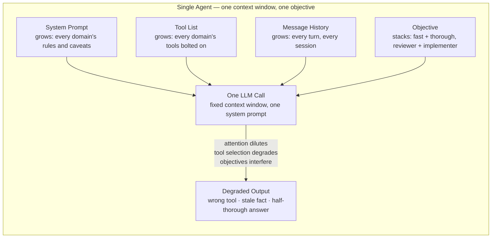

## Why Multi-Agent Systems

> Chapter of [[building-agentic-systems/readme#01 — Multi-Agent Systems|Multi-Agent Systems]], part
> of [[building-agentic-systems/readme|Building & Evaluating Agents]].

## What you will understand at the end

- The three concrete failure modes that make a single agent unreliable — context overload, tool
  sprawl, and conflicting objectives — and why each one is a ceiling, not a bug you can patch away
- Why these failures degrade quality gradually and then suddenly, not with a clean error you can
  catch
- The actual decision criterion for splitting one agent into several, versus just giving the one
  agent more context or more tools
- Why a fleet of narrowly-scoped agents is an organizational pattern before it's a technical one —
  and how GitHub's custom-agent model operationalizes that

---

## The mental model

[[01-agent-architecture|Agent Architecture]] (Part 00) established the five components every agent
needs: LLM, Tools, Memory, Planning, Execution Loop. That chapter treated "give the agent more
tools" and "let the conversation run longer" as free variables — knobs you turn up as the task
grows. This chapter is about what happens when you keep turning them.

A single agent packs everything into one context window on every call: the system prompt, the full
tool catalog, and the accumulated message history. Three things grow inside that one window as scope
increases — the instructions (more domains, more edge cases, more caveats), the tool list (more
capabilities bolted on), and the objective (more responsibilities stacked onto one role). None of
these growth curves is bounded by anything in the architecture itself. The LLM will happily accept a
40-tool schema and a contradictory two-sentence mandate — it won't refuse the call. It will just get
worse at the job, quietly, in ways that don't show up as an exception in your logs.

Read the diagram as a converging-pressure system, not a pipeline. All four inputs land in the same
context window and are resolved by the same weights in the same forward pass. There is no isolation
between "the part of the prompt about security review" and "the part about generating tests" — they
compete for the same attention budget on every single token the model generates. That competition is
the root cause behind all three failure modes below.

---

## Failure mode 1 — Context overload

**The mechanism:** every turn appends to message history. Every domain the agent has been extended
to cover appends to the system prompt. Nothing in the execution loop from Part 06 of Agentic AI
Engineering removes anything by default — memory management is an opt-in you have to build (see
[[agentic-ai-engineering/readme#02 — Memory Systems|Memory Systems]]), not a property of the loop
itself.

**Why bigger context windows don't solve it:** a model with a much larger context window doesn't
fail by truncation — it fails by attention dilution. This is the well-documented "lost in the
middle" effect: information placed in the middle of a long context is retrieved and weighted less
reliably than information at the start or end, regardless of how much headroom is left in the
window. Doubling the context window buys you more room to make the problem worse, not a fix for it.

**Worked example:** a support-triage agent starts with a 2K-token system prompt and 15 tools. Six
months later, after "just add one more capability" three times, it has an 8K-token system prompt
(four product lines' worth of triage rules), 45 tools, and conversations that regularly run 60+
turns before resolution. The agent starts contradicting tool results it retrieved 40 turns earlier,
re-asking questions the user already answered, and reaching for a tool that is a near-duplicate of
the one it actually needs. None of this throws an error. It shows up as a slow decline in resolution
rate that takes a quarter to notice in the metrics, because
[[production-agent-systems/01-observability/02-agent-tracing/02-agent-tracing|Agent Tracing]] and
token-level observability (Part 01 of Production Agent Systems) weren't in place from day one.

**The ceiling:** context overload isn't solved by a bigger model or a longer window. It's solved by
giving each unit of work a smaller, more relevant context — which is either aggressive memory
engineering within one agent, or splitting the work so each agent's context only has to hold what
its slice of the job actually needs.

---

## Failure mode 2 — Tool sprawl

**The mechanism:** every tool you add to an agent's registry is a line item the LLM has to
discriminate against every other line item, on every single call, before it's even started reasoning
about the task. Tool selection is itself an LLM inference — it fails the same way any classification
task fails as the number of plausible-looking classes grows.

**Why "just give it every tool" fails in practice:** an agent with 10 well-differentiated tools
picks the right one close to 100% of the time. The same architecture with 150 tools — the realistic
count once you've registered "every tool in the org" onto one agent — starts confusing tools with
overlapping descriptions (`search_customer_db` vs. `query_customer_records`), picking a
plausible-sounding tool over the correct one, or populating the right tool with the wrong argument
shape because the schema competed with 149 others for the model's attention. This isn't a training
gap that a better prompt closes — it's the same discrimination-under-crowding problem context
overload creates, applied to the tool axis instead of the history axis.

**This is exactly what Part 04 of Agentic AI Engineering exists to solve at the single-agent level**
— [[10-tool-discovery|Tool Discovery]] and
[[11-tool-selection-strategies|Tool Selection Strategies]] cover embedding-based retrieval and
hierarchical routing that shrink the _effective_ tool list presented on any one call, without
deleting tools from the registry. Read this chapter's tool-sprawl argument as the motivating
failure; read Part 04 of Agentic AI Engineering for the mitigation you try **before** concluding you
need a second agent.

**The ceiling:** routing and retrieval reduce the tool list size per call, but they don't help when
the underlying tool sets genuinely don't share a usage pattern — a security-review agent's tools
(static analysis, CVE lookups, dependency graph queries) are never relevant mid test-generation, and
vice versa. When that's true, no amount of smarter routing changes the fact that you're maintaining
two disjoint tool vocabularies inside one agent for no benefit. That's the signal to split, not
route.

---

## Failure mode 3 — Conflicting objectives

**The mechanism:** a system prompt is a single, unconditional instruction the model has to satisfy
on every token of every response. When you ask one agent to be both fast and thorough, or both a
reviewer and an implementer, you haven't given it two goals — you've given it one goal with an
internal contradiction, and the model has to pick a blend for every response whether or not that
blend fits the specific request in front of it.

**Why this degrades both goals, not just one:** thoroughness needs a skeptical, adversarial, "assume
this is wrong until proven otherwise" reasoning mode with a generous token/latency budget. Speed
needs an optimistic, action-biased, "commit to the first workable answer" mode with a tight budget.
There is no temperature setting, no single system prompt, and no amount of few-shot exemplars that
produces both modes from one call — you get a compromise that is too slow to feel fast and too
shallow to feel thorough. The same logic applies to reviewer-vs-implementer: asking one agent to
write code and then critically review its own output is asking it to be its own adversary, which is
the same conflict-of-interest problem as asking a person to grade their own exam. The review pass
inherits the blind spots of the implementation pass because it's the same weights, the same context,
and often the same latent reasoning trace.

**The ceiling:** this is not fixable by better prompting. A contradictory objective is contradictory
regardless of how well you phrase it. The fix is either routing between two different system
prompts/temperature settings for the same underlying model (cheap, works when the tension is mild —
e.g., a "quick answer" mode and a "deep dive" mode selected by request type), or running two
separate agents with independently tuned prompts, tool access, and even different models per role
(necessary when the tension is structural, like reviewer-vs-implementer).

---

## The decision criterion — when to split, not just scale

The temptation at every one of the three failure modes above is to reach for more: a bigger context
window, a smarter router, a more carefully worded prompt. Sometimes that's correct — splitting into
multiple agents adds real coordination cost (orchestration complexity, cross-agent context handoff,
new failure modes at the handoff itself — covered in
[[03-communication-protocols|Communication Protocols]]), so it should not be the default reach.

Use three tests before deciding to split:

1. **Context/tool orthogonality test** — do the sub-tasks need genuinely disjoint context and tools,
   such that giving them all to one agent bloats its context/tool list past the point where it still
   performs well on _any single_ sub-task?
2. **Objective divergence test** — are the sub-tasks' objectives actually in tension (fast vs.
   thorough, adversarial vs. cooperative, generative vs. critical), such that one prompt tuned for
   one measurably degrades the other?
3. **Net value test** — is the quality lost to overload greater than the coordination tax of running
   multiple agents (added latency, orchestration code, new inter-agent failure surface)? If a single
   well-curated agent still clears the bar on tests 1 and 2, splitting only adds overhead — see
   [[07-when-not-to-build-an-agent|When NOT to Build an Agent]] for the same complexity-budget logic
   applied one level up, to whether you should be building an agent at all.

| Failure mode           | Symptom you'll actually observe                                                   | Try first — still one agent                                                                                               | Split when…                                                                                                 |
| ---------------------- | --------------------------------------------------------------------------------- | ------------------------------------------------------------------------------------------------------------------------- | ----------------------------------------------------------------------------------------------------------- |
| Context overload       | Contradicts its own earlier tool results; re-asks answered questions              | Summarize/compact history, retrieve instead of stuff, prune stale tool results                                            | No compaction strategy keeps every sub-task's needed context under budget at the same time                  |
| Tool sprawl            | Picks a plausible-but-wrong tool more often as the registry grows                 | Hierarchical routing / embedding retrieval to shrink the effective per-call tool list (Part 04 of Agentic AI Engineering) | The tool sets don't overlap in usage — a router can't shrink the list without also separating the roles     |
| Conflicting objectives | Consistently mediocre at both goals, or inconsistently fast/thorough call to call | Route by request type to a different system prompt/temperature within the same process                                    | The tension is structural to the task pairing (reviewer vs. implementer) — no single setting satisfies both |

If none of the three tests fire, don't split — you're paying orchestration cost for no quality gain.
If one or more fires clearly, that's the actual trigger for everything the rest of Part 00 builds:
[[02-collaboration-models|Collaboration Models]] on how to divide the work,
[[03-communication-protocols|Communication Protocols]] on how the split agents talk to each other,
and [[09-supervisor-architectures|Supervisor Architectures]] on who resolves it when they disagree.

---

### GitHub Copilot in practice

GitHub's own product direction is a live example of this chapter's argument, not just an analogy.
Rather than shipping one do-everything Copilot agent with every tool and every instruction file in a
repository loaded into a single context, GitHub's custom-agent model lets a team define narrowly
scoped agents as individual files — conceptually `.github/agents/*.md`, each with its own name,
description, restricted tool list, and system instructions — structurally close to how this very
repo's own Claude Code tooling defines subagents under `.claude/agents/*.md`. A team can maintain a
security-review agent, a test-generation agent, and a docs agent as three separate definitions
instead of three responsibilities crammed into one.

This is the tool-sprawl and conflicting-objectives tests above, made concrete at the org level:

- A **security-review agent**'s tool list (static analysis, CVE/dependency lookups, SAST queries)
  and objective (adversarial, skeptical, slow-is-acceptable) genuinely don't overlap with a
  **test-generation agent**'s tool list (test runner, coverage reporter) and objective (generative,
  fast, optimistic). Bundling both into one agent reproduces exactly the tool-discrimination and
  objective-blending failures described above.
- Scoping each custom agent's tool access means a docs agent physically cannot invoke a destructive
  shell tool it has no legitimate reason to touch — least-privilege by construction, not by prompt
  instruction (the same principle Part 00 of Production Agent Systems's
  [[production-agent-systems/readme#02 — Reliability, Security & Governance|guardrails chapters]]
  cover from the security angle).
- Because each agent is a file with its own frontmatter rather than a shared monolith, the
  activation energy for doing the _architecturally correct_ thing (author a new narrow agent) drops
  below the activation energy for the expedient thing (add one more instruction to the existing
  agent) — which is the organizational lever that actually keeps do-everything agents from
  re-accumulating over time.

**Flagging the generalization:** the exact file location, frontmatter schema, and GA-vs-preview
status of GitHub's custom-agent format has moved quickly and may have changed again by the time you
read this — verify against GitHub's current Copilot documentation before treating any specific path
or field name as stable. The durable claim is the architectural one above: splitting by tool set and
objective, not the specific YAML shape GitHub ships this quarter.

---

## Concept check

Before moving to the next chapter, you should be able to answer these without notes:

| Question                                                           | Answer hint                                                                                                                |
| ------------------------------------------------------------------ | -------------------------------------------------------------------------------------------------------------------------- |
| Why doesn't a bigger context window fix context overload?          | Attention dilutes with distance from the ends ("lost in the middle") — window size isn't the bottleneck                    |
| Why does adding more tools eventually _reduce_ tool-call accuracy? | Tool selection is a classification call; discrimination degrades as the candidate set grows                                |
| Why can't a better-worded prompt fix conflicting objectives?       | The contradiction is structural (fast vs. thorough) — no phrasing removes the tradeoff                                     |
| What's the actual trigger for splitting into multiple agents?      | Context/tool orthogonality or objective divergence outweighing the coordination tax of the split                           |
| What do you try _before_ splitting into agents for tool sprawl?    | Hierarchical routing / embedding-based tool retrieval (Part 04 of Agentic AI Engineering) to shrink the per-call tool list |

---

## Vocabulary glossary

| Term                      | Definition                                                                                                                                              |
| ------------------------- | ------------------------------------------------------------------------------------------------------------------------------------------------------- |
| Context overload          | Quality degradation from a system prompt, tool list, or message history that has grown past what the model can reliably attend to                       |
| Lost in the middle        | The documented effect where information placed mid-context is retrieved less reliably than information near the start or end                            |
| Tool sprawl               | Falling tool-selection accuracy as the number of registered tools on one agent grows                                                                    |
| Conflicting objectives    | One system prompt asked to satisfy two goals whose reasoning modes are in tension (e.g., fast vs. thorough)                                             |
| Coordination tax          | The added latency, orchestration code, and new failure surface introduced by splitting one agent into several                                           |
| Orthogonality test        | Whether two sub-tasks' context/tool needs are disjoint enough that combining them bloats both                                                           |
| Objective divergence test | Whether two sub-tasks' goals are actually in tension, not just different in topic                                                                       |
| Custom agent (GitHub)     | A narrowly-scoped agent definition (name, description, restricted tools, instructions) as an individual file rather than one shared do-everything agent |

## Metadata

|        |                          |
| ------ | ------------------------ |
| Author | Amit Singh               |
| Scope  | building-agentic-systems |
