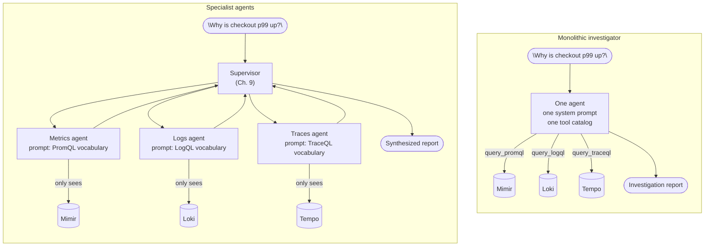

## Collaboration Models

> Chapter of [[building-agentic-systems/readme#01 — Multi-Agent Systems|Multi-Agent Systems]], part
> of [[building-agentic-systems/readme|Building & Evaluating Agents]].

## What you will understand at the end

- Why a single "investigate this incident" agent degrades as its tool catalog grows, even when the
  underlying LLM is capable enough for each individual domain
- **Tool isolation** and **prompt specialization** as the two concrete levers you pull to split one
  agent into several, and why they are the same lever applied to two different surfaces
- How to reason about the split along a real worked example — a metrics agent, a logs agent, and a
  traces agent replacing one observability investigator — instead of in the abstract
- The coordination cost this trade introduces, and why it is never optional once you split

---

## The mental model

A single agent's reliability is bounded by the worst-served tool in its catalog and the least-tuned
sentence in its system prompt. Add tools faster than you tune the prompt around them, and the agent
does not fail loudly — it fails quietly, picking the wrong tool or blending domains that should stay
separate. Collaboration models exist to bound that decay by giving each domain its own agent, its
own tool catalog, and its own system prompt — then reassembling the outputs after the fact.



Same question, same three backends, same eventual report. What changed is where the tool-selection
decision and the domain vocabulary live — inside one overloaded prompt, or inside three narrow ones
coordinated by a fourth. Neither topology is free; this chapter is about naming the price of each.

---

## 1. The monolithic investigator — and where it breaks

Start with the agent this chapter's [[01-why-multi-agent-systems|previous chapter]] motivated in the
abstract: one agent, given the incident query "why is checkout p99 up?", holding every observability
tool it might need in a single catalog:

| Tool                  | Backend | Domain  |
| --------------------- | ------- | ------- |
| `query_promql`        | Mimir   | Metrics |
| `list_active_alerts`  | Mimir   | Metrics |
| `get_recording_rules` | Mimir   | Metrics |
| `query_logql`         | Loki    | Logs    |
| `tail_logs`           | Loki    | Logs    |
| `get_log_volume`      | Loki    | Logs    |
| `query_traceql`       | Tempo   | Traces  |
| `get_trace_by_id`     | Tempo   | Traces  |
| `get_service_graph`   | Tempo   | Traces  |

Nine tools is not an unreasonable catalog size on paper — well inside what most model providers
support in a single request. The problem is not the count. It is what one system prompt has to hold
simultaneously to use all nine well:

- **PromQL vocabulary** — rate/sum/histogram_quantile semantics, recording-rule naming conventions,
  what counts as a "series" versus a "sample"
- **LogQL vocabulary** — label-selector syntax, line-filter operators, the difference between a
  structured and unstructured log line
- **TraceQL vocabulary** — span attributes, root-span identification, how a service graph edge
  differs from a call-graph edge

None of these vocabularies conflict logically, but they compete for the same finite instruction
budget and the same finite attention over a long tool catalog. In practice this shows up as three
correlated failure modes, not one:

| Failure mode                 | What it looks like in a transcript                                                                                                                   |
| ---------------------------- | ---------------------------------------------------------------------------------------------------------------------------------------------------- |
| Wrong-tool selection         | Calls `query_logql` with a PromQL-shaped selector, or vice versa, because the two syntaxes blur together in a prompt that has to describe both       |
| Shallow-domain investigation | Spends most of its reasoning budget on metrics (the domain best-represented in the prompt) and only superficially checks logs/traces                 |
| Prompt-tuning gridlock       | Fixing a logs-tool-selection bug means re-reading and re-testing the whole prompt, including the metrics and traces instructions that weren't broken |

That third failure mode is the one that actually stalls teams.
[[agentic-ai-engineering/00-introduction-to-agentic-ai/06-agent-design-principles/06-agent-design-principles|Agent Design Principles]]
(Part 00 of Agentic AI Engineering) already flagged tool sprawl as a scoping problem; this chapter
is about what you do next, once sprawl has already happened and rescoping the tools alone won't fix
the prompt that describes them.

---

## 2. Splitting by domain: three specialists

The fix is not "write a better prompt." It's structural: replace the one agent with three, each
scoped to exactly one observability signal.

| Specialist    | Tool catalog                                                | System prompt is tuned for                                                     |
| ------------- | ----------------------------------------------------------- | ------------------------------------------------------------------------------ |
| Metrics agent | `query_promql`, `list_active_alerts`, `get_recording_rules` | PromQL syntax, rate-vs-gauge reasoning, alert-to-symptom mapping               |
| Logs agent    | `query_logql`, `tail_logs`, `get_log_volume`                | LogQL selectors, structured-vs-unstructured parsing, error-pattern recall      |
| Traces agent  | `query_traceql`, `get_trace_by_id`, `get_service_graph`     | Span semantics, latency attribution across a call chain, service-graph reading |

Each specialist gets the same task framing — "investigate why checkout p99 latency is elevated" —
but arrives at it with a tool catalog and a system prompt that only need to be right about one
domain. This is the direct answer to the brief this chapter opens with: it is not three copies of
the monolith with fewer tools each; it is three agents that can be independently correct, wrong,
tested, and fixed.

Two separate design levers make this possible, and it matters that they are separate — you can pull
either one without the other, and teams that only pull one usually stop halfway to the reliability
gain they were expecting.

---

## 3. Lever one — tool isolation

**Tool isolation** means each specialist's tool catalog contains only the tools relevant to its
domain. The metrics agent cannot call `query_logql` because that tool schema is never in its request
— not because a system-prompt instruction told it not to.

This distinction — _cannot_ versus _told not to_ — is the entire value of the lever. A system prompt
that says "only use metrics tools" is a request the model can still violate under pressure (a vague
query, a long context, a distracting few-shot example). A tool catalog that simply does not contain
`query_logql` makes the violation structurally impossible. [[12-tool-security|Tool Security]] (Part
04 of Agentic AI Engineering) makes the same argument for least-privilege scoping against malicious
input; tool isolation is the same primitive applied for a reliability reason instead of a security
one — smaller catalog, less schema for the model to disambiguate between, higher odds it picks
correctly among what remains.

**What tool isolation buys you, concretely:**

- **Higher tool-selection accuracy per call.** Choosing correctly among 3 tools is a strictly easier
  classification problem than choosing correctly among 9 — same model, same capability, fewer
  plausible wrong answers.
- **Independent tool evaluation.** You can build a golden eval set of "does the metrics agent call
  `query_promql` with a syntactically valid range vector" without any logs or traces test cases
  contaminating the signal.
- **Independent blast radius.** A bad `query_logql` schema change breaks the logs agent's tool
  selection. It cannot regress the metrics agent's tool selection, because that agent's request
  never included the schema that changed.

**What it does not buy you:** tool isolation says nothing about whether the specialist's _reasoning_
about the tools it does have is any good. That's the second lever.

---

## 4. Lever two — prompt specialization

**Prompt specialization** means each specialist's system prompt is written, tuned, and evaluated for
exactly one domain's vocabulary and failure modes — instead of one prompt trying to be fluent in
PromQL, LogQL, and TraceQL simultaneously.

Concretely, the metrics agent's system prompt can afford to spend its entire instruction budget on
things like:

```txt
When investigating latency regressions:
- Prefer histogram_quantile(0.99, rate(...)) over raw counters for p99 claims
- Cross-check any single-series anomaly against `list_active_alerts` before reporting it
  as the root cause — an unfired alert on a metric that "looks bad" is a weaker signal
  than a fired one
- Recording rules exist for the checkout service's SLIs; query
  `get_recording_rules` first rather than recomputing them from raw series
```

None of that is generically useful instruction text — it is metrics-specific tradecraft that would
be dead weight in a logs agent's prompt and actively confusing in a traces agent's. Multiply that by
three domains in one prompt and you get the gridlock failure mode from Section 1: every prompt
change is a change to a shared resource, and every regression test has to cover all three domains
regardless of which one you actually touched.

**What prompt specialization buys you, concretely:**

| Property                   | Monolithic prompt                                             | Specialist prompt                                                   |
| -------------------------- | ------------------------------------------------------------- | ------------------------------------------------------------------- |
| Change surface per edit    | Whole prompt — every domain re-tested on every change         | One domain — the other two specialists are untouched                |
| Eval set                   | Must cover metrics + logs + traces reasoning jointly          | One golden set per specialist, scored independently                 |
| Domain depth per tool call | Shallow — instruction budget split three ways                 | Deep — full instruction budget for one domain's tradecraft          |
| Ownership                  | One prompt, ambiguous owner if domains map to different teams | One prompt per domain — can map 1:1 to a team that owns that signal |

This is the same pattern [[05-router-pattern|Router Pattern]] (Part 00 of AI Architecture & System
Design) describes for classifying requests into handlers — except here there's no router deciding
_which one_ specialist to invoke. All three run, on the same incident, because a real investigation
usually needs all three signals to corroborate or contradict each other. That's a materially
different coordination problem than routing, and it's the subject of the next section.

---

## 5. The coordination cost you just introduced

Splitting the monolith into three specialists does not remove the need to answer "why is checkout
p99 up?" as one coherent statement. It just moves that synthesis step out of the LLM's implicit
reasoning and into something you now have to build explicitly. Three things become true the moment
you split:

1. **Someone has to run all three and wait.** The metrics, logs, and traces agents can execute in
   parallel — they share no state — but the incident report can't be written until the slowest one
   returns. Fan-out/fan-in latency now dominates instead of one sequential ReAct loop.
2. **Someone has to reconcile disagreement.** The metrics agent might report CPU throttling on the
   checkout pods as the likely cause. The traces agent might report a downstream payment-service
   timeout as the likely cause. Both can be true, one can be the real cause and the other a
   correlated symptom, or one specialist can simply be wrong. A human reading three independent
   reports has to do that reconciliation manually; a production system needs a component that does
   it automatically.
3. **Someone has to guarantee a consistent frame.** All three specialists need to investigate the
   _same_ incident window — the same start/end timestamps, the same service and environment scope.
   Nothing about tool isolation or prompt specialization enforces that on its own; it has to be
   passed in as shared task context by whatever dispatches the three agents.

That "someone" is a fourth component, not a fourth specialist — a supervisor that delegates the same
incident to all three, waits on all three, and resolves conflicting conclusions into one report.
[[09-supervisor-architectures|Supervisor Architectures]], the chapter directly after this one, is
where that component gets formalized: how it aggregates, how it breaks ties between contradictory
specialist findings, and where a supervisor's own logic becomes a new single point of failure once
you've spent this chapter's effort distributing the other three.

The honest accounting, then, is that this chapter's split trades one kind of unreliability
(wrong-tool selection, shallow-domain reasoning, prompt gridlock) for a different kind (coordination
latency, conflict resolution, a new component to keep correct). That is a good trade when the
monolith's failure modes are already visible in production — but it is a trade, not a strict
improvement, and it should be justified the same way any architecture decision is: against the
failure modes you're actually seeing, not against a hypothetical.

| Axis                           | Monolithic investigator                       | Metrics/logs/traces specialists                           |
| ------------------------------ | --------------------------------------------- | --------------------------------------------------------- |
| Tool-selection accuracy        | Degrades as catalog grows                     | High — each agent chooses among 3 tools, not 9            |
| Prompt tuning                  | One shared prompt; every edit is global       | One prompt per domain; edits are local                    |
| Eval story                     | Joint eval set, hard to attribute regressions | Per-specialist golden sets, regressions are attributable  |
| Latency per investigation      | One sequential loop                           | Three parallel loops + supervisor synthesis overhead      |
| LLM call volume / cost         | Baseline                                      | Roughly 3–4x (three specialists + supervisor synthesis)   |
| Cross-domain conflict handling | Implicit, inside one model's reasoning        | Explicit, must be engineered into the supervisor          |
| Team ownership                 | Ambiguous if domains map to different owners  | Maps cleanly to a metrics/logs/traces platform-team split |

---

### GitHub Copilot in practice

The same specialization principle — narrow the tool catalog, narrow the prompt, per domain — shows
up outside custom agent frameworks, in GitHub Copilot's own configuration surface. Two features are
documented and stable enough to build on directly:

- **Custom instructions** (`.github/copilot-instructions.md`, plus path-scoped
  `.github/instructions/*.instructions.md` files with a glob `applyTo` frontmatter key) let a repo
  attach different instruction text to different file paths. This is the prompt-specialization
  lever: a `security-review` instructions file can carry threat-modeling vocabulary and a
  `test-writer` instructions file can carry the repo's test-framework conventions, without either
  polluting the other's context.
- **Custom chat modes** in VS Code (`*.chatmode.md` files, typically under `.github/chatmodes/`) go
  further and add the tool-isolation lever explicitly: each chat mode declares its own `tools:` list
  in frontmatter, its own system-prompt body, and can even pin a specific model. A security-review
  mode can be scoped to read-only tools (`codebase`, `search`, no `edit` or `runInTerminal`); a
  test-writer mode can be scoped to include `edit` and `runTests`; a docs mode can be scoped to
  `edit` restricted by instruction to files under `/docs`. Selecting a mode in the chat UI is,
  mechanically, the same move as routing an incident to the metrics specialist instead of the logs
  one — a narrower tool catalog and a narrower prompt, chosen for the task at hand instead of one
  broad agent trying to be adequate at all three.

**Flagging the generalization:** the specific mechanism names above (`applyTo`, `.chatmode.md`, the
exact frontmatter keys) are current as of this book's last verification pass and are the parts most
likely to have shifted by the time you're reading this — GitHub has iterated on custom-agent
configuration surfaces quickly. The underlying claim is the durable one: whenever a Copilot-adjacent
product lets you scope both the tool list and the instructions per named mode/agent, it is applying
this chapter's two levers, regardless of what the YAML key happens to be called this quarter. Verify
the current schema against GitHub's own docs before wiring a repo's chat modes around it.

---

## Concept check

Before moving to [[09-supervisor-architectures|Supervisor Architectures]], you should be able to
answer these without notes:

| Question                                                                 | Answer hint                                                                                                                                                  |
| ------------------------------------------------------------------------ | ------------------------------------------------------------------------------------------------------------------------------------------------------------ |
| What's the difference between tool isolation and prompt specialization?  | Tool isolation restricts _what a specialist can call_; prompt specialization tunes _how well it reasons_ about what it can call. They're independent levers. |
| Why is "cannot call the tool" stronger than "told not to call the tool"? | A missing tool schema is a structural constraint; a prompt instruction is a request the model can still violate under pressure.                              |
| What does splitting into specialists NOT solve automatically?            | Synthesizing three independent findings into one coherent report — that's a new component (the supervisor), not a side effect of the split.                  |
| Why is this different from the Router pattern?                           | A router picks _one_ handler per request. This split runs all three specialists on the _same_ incident and reconciles their outputs afterward.               |
| What's the real cost of this split, beyond engineering effort?           | Latency (fan-out/fan-in), LLM call volume (roughly 3–4x), and a new conflict-resolution component that can itself be wrong.                                  |

---

## Vocabulary glossary

| Term                  | Definition                                                                                                                                                      |
| --------------------- | --------------------------------------------------------------------------------------------------------------------------------------------------------------- |
| Tool isolation        | Scoping an agent's tool catalog to only the tools relevant to its domain, so wrong-domain tool calls are structurally impossible rather than merely discouraged |
| Prompt specialization | Tuning a system prompt for one domain's vocabulary and failure modes instead of covering multiple domains in one shared prompt                                  |
| Specialist agent      | An agent scoped to one domain's tools and prompt (e.g. the metrics agent), as opposed to a generalist agent holding every tool                                  |
| Fan-out / fan-in      | Dispatching the same task to multiple agents in parallel (fan-out), then waiting for and combining all their results (fan-in)                                   |
| Coordination cost     | The latency, LLM-call volume, and conflict-resolution logic a multi-agent split adds on top of what a single agent would have cost                              |
| Golden eval set       | A fixed, labeled set of test cases used to score one component's outputs consistently across changes                                                            |

## Metadata

|        |                          |
| ------ | ------------------------ |
| Author | Amit Singh               |
| Scope  | building-agentic-systems |
