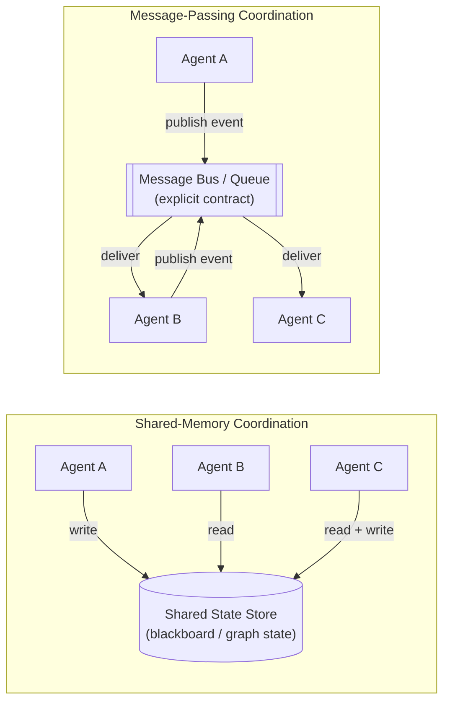
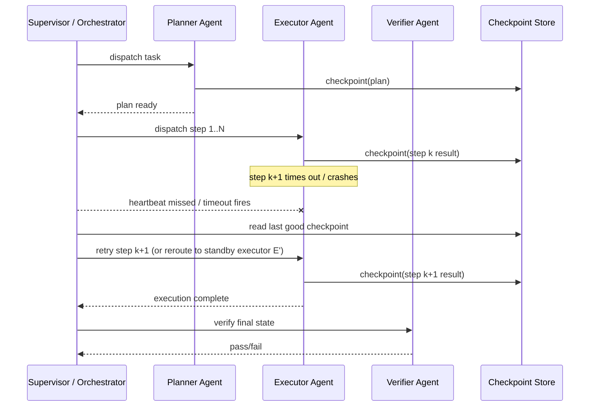

## Communication Protocols

> Chapter of [[building-agentic-systems/readme#01 — Multi-Agent Systems|Multi-Agent Systems]], part
> of [[building-agentic-systems/readme|Building & Evaluating Agents]].

## What you will understand at the end

- The difference between shared-memory and message-passing coordination, and which coupling and
  failure profile each one actually buys you — this is a distributed-systems tradeoff wearing an
  agentic-AI costume, not a new problem
- When synchronous request/response between two agents is the right call, and when it silently turns
  a "multi-agent system" into one long fragile call stack with extra token cost
- What "recovery" concretely means when one agent in a chain fails or times out: fail-fast,
  same-agent retry, supervisor reroute, or checkpointed resume — and the worked reasoning for
  picking one over another
- Why GitHub-integrated coding agents get away without a dedicated agent-to-agent RPC channel, and
  why that is a defensible design choice rather than a missing feature

---

## The mental model

Every multi-agent coordination protocol you will encounter is a specific point on two axes: **where
does shared state live**, and **how synchronously do agents wait on each other**. Framework
marketing names (LangGraph's `StateGraph`, AutoGen's group chat, CrewAI's `Process`) are all
implementations sitting somewhere on this plane — learn the plane, not the vendor noun.



Neither side of this diagram is "the right architecture." Shared memory is a distributed cache with
N writers and no consensus protocol — cheap and fast until two agents disagree about what the
current state actually is. Message passing is a microservices architecture wearing an LLM costume —
looser coupling, but you inherit every distributed-systems problem microservices have: ordering,
duplication, and partial failure.

---

## 1. Shared-memory coordination

**What it is:** Every agent in the system reads from and writes to one common state object — a
Python dict passed by reference, a LangGraph `StateGraph`'s state, a Redis hash, or a literal
"blackboard" document that specialist agents annotate. See
[[ai-architecture-and-system-design/00-ai-architecture-patterns/06-blackboard-pattern/06-blackboard-pattern|Blackboard Pattern]]
for the formalized version of this idea as a reusable architecture pattern.

**Why teams reach for it first:** it is the path of least resistance. If you're already inside
LangGraph, every node function receives and returns the same state dict — shared memory is the
default, not a decision you consciously made. No serialization boundary, no network hop, no schema
negotiation between agents. Agent B just reads the field Agent A wrote.

**The coupling cost hides until it doesn't:**

- **Implicit schema contract.** Nothing enforces that Agent B reads the field with the name and
  shape Agent A actually wrote. The "contract" is tribal knowledge in the prompt engineering, not a
  validated interface. A field rename in Agent A's output silently breaks Agent B three months
  later.
- **Write collisions.** If two agents can write to overlapping state concurrently (parallel tool
  calls, a fan-out step), you now have a race condition indistinguishable from any other shared
  mutable state bug — last writer wins, and "last" is nondeterministic.
- **No natural audit trail.** The state object typically holds only the _current_ value, not the
  history of who wrote what and when. You lose the ability to answer "which agent introduced this
  bad value" without separately logging every write.

**Where it genuinely wins:** a small number of tightly-coordinated agents inside one process or one
trust boundary, where sub-call latency matters more than loose coupling — for example, the
metrics/logs/traces specialist agents from
[[building-agentic-systems/01-multi-agent-systems/02-collaboration-models/02-collaboration-models|Collaboration Models]]
annotating one shared investigation object before a supervisor synthesizes the final report. That is
a blackboard pattern operating inside a single request's lifetime, not a durable cross-service
contract.

---

## 2. Message-passing coordination

**What it is:** Agents do not share a state object. They exchange explicit messages or events — a
task request, a completion notification, a status update — over a queue, topic, or bus. Each agent
owns its own internal state privately and exposes only what it chooses to put on the wire.

**This is the microservices analogy, and it is not a loose one:**

| Microservices concept  | Multi-agent equivalent                                                 |
| ---------------------- | ---------------------------------------------------------------------- |
| Service boundary       | Agent boundary — each agent is independently deployable/versioned      |
| API contract / schema  | Message schema (task spec, result envelope)                            |
| Event bus (Kafka, SNS) | Agent-to-agent message bus                                             |
| Circuit breaker        | Timeout + fallback around a downstream agent call                      |
| Dead-letter queue      | Failed-task queue for messages an agent couldn't process               |
| Distributed trace      | Trace context propagated in message headers/metadata across agent hops |

**Why it costs more up front:** you must design the message schema deliberately — what does a "task
request" to the executor agent actually need to contain, what does a "result" envelope look like,
how do you version that schema when the executor's expected input changes. This is real interface
design work that shared memory lets you skip, right up until it bites you.

**What you get for that cost:** failure isolation. A malformed or unprocessable message can be
dead-lettered without corrupting a shared object every other agent also reads. Agents can be
versioned, scaled, and deployed independently — Agent B doesn't need to know Agent A's internal
representation changed, only that the message contract didn't. And because messages are typically
durable (written to a log or queue before being consumed), the message history _is_ the audit trail
shared memory doesn't give you for free.

---

## 3. Shared memory vs. message passing — the tradeoff

| Dimension                       | Shared-memory coordination                                         | Message-passing coordination                                         |
| ------------------------------- | ------------------------------------------------------------------ | -------------------------------------------------------------------- |
| Coupling                        | Tight — every agent implicitly agrees on a state schema            | Loose — agents agree only on a message/event contract                |
| Failure blast radius            | One bad writer can corrupt state every reader depends on           | Isolated — a bad message drops or dead-letters on its own            |
| Audit trail                     | None by default — state holds current value, not history           | Built in — the message log is the history                            |
| Scaling agents                  | Contention grows with concurrent writers (locking, races)          | Fan-out is natural; backpressure via queue depth                     |
| Latency                         | Lower — direct in-process read, no serialization round trip        | Higher — publish/serialize/consume round trip per hop                |
| Consistency discipline required | Read-your-writes ordering, locking, or single-writer rules         | Idempotent consumers, explicit ordering or none at all               |
| Best fit                        | Few agents, one process/trust boundary, blackboard-style synthesis | Many agents, cross-service/team boundaries, need durability + replay |

Most production systems end up as a **hybrid**: a durable message bus for cross-agent handoffs (who
does what, in what order) plus a shared, checkpointed state object _within_ one agent's own
multi-step execution loop (see
[[building-agentic-systems/00-building-single-agent-systems/01-agent-architecture/01-agent-architecture|Agent Architecture]]'s
Memory component). The mistake worth avoiding is not "picking the wrong one" — it's not noticing
you're using shared memory as a cross-team contract when you actually needed a versioned message
schema.

---

## 4. Synchronous request/response vs. asynchronous event-driven handoff

Orthogonal to _where state lives_ is _how agents wait on each other_. A planner agent calling an
executor agent and blocking until it returns is synchronous request/response — structurally
identical to a nested function call, or a tool call, just with an LLM on both ends. An agent
publishing "task ready" and continuing without waiting for a reply is asynchronous, event-driven
handoff.

```txt
Synchronous:                          Asynchronous:
  Planner --call--> Executor            Planner --publish "task ready"--> Queue
  Planner <--result-- Executor          Planner continues immediately
  (Planner is blocked the whole time)   Executor consumes when free, publishes "task done"
                                         Something (supervisor, next agent) reacts to that event
```

| Dimension            | Synchronous request/response                                                                                             | Async event-driven handoff                                                            |
| -------------------- | ------------------------------------------------------------------------------------------------------------------------ | ------------------------------------------------------------------------------------- |
| Caller blocks        | Yes — caller's loop halts until the callee returns                                                                       | No — caller enqueues and moves on                                                     |
| Who owns retry       | The caller, at the call site                                                                                             | The consumer or a supervising orchestrator, via redelivery/backoff                    |
| Failure visibility   | Immediate — exception or timeout at the call site                                                                        | Delayed — visible via dead-letter queue or a missed heartbeat                         |
| Time coupling        | Both agents must be running at the same instant                                                                          | Agents need not overlap in time at all                                                |
| Natural fit          | Tool-call-style delegation where the caller needs the result to proceed (planner needs executor's output to plan step 2) | Long-running or fan-out work (a pool of executor agents draining a shared task queue) |
| Default failure mode | The whole call stack stalls or unwinds unless the caller has its own timeout/retry                                       | One event gets redelivered; the rest of the chain is unaffected                       |

The trap: teams default to synchronous because it maps directly onto how a single agent's own tool
loop already works (call, block, get result). That default is fine for two or three agents. It stops
being fine once agent chains grow long enough that one slow or stuck agent starts holding every
upstream caller's execution loop open, burning wall-clock time and, if the caller is metering tokens
per session, real budget.

---

## 5. When one agent in the chain fails

This is the question the rest of this chapter has been building toward, and it's the one production
incidents actually turn on: agent execution is not free, most of it is not idempotent by default,
and a chain of five agents where the fourth one times out is a very different failure than a single
LLM call timing out.



Read the diagram as the answer to three separate questions the brief asks, because they are three
separate design decisions, not one:

**Does the whole chain stall?** Only if nothing is watching. A chain with no supervisor and no
timeout is a chain where a stuck executor agent hangs forever and every upstream agent's blocking
call hangs with it. This is the naive synchronous-request/response default from Section 4, and it is
the single most common way a "multi-agent system" becomes a single point of failure with extra
steps.

**Does a supervisor detect and reroute?** Only if one exists and is watching heartbeats/timeouts
independently of the call stack — see
[[building-agentic-systems/01-multi-agent-systems/09-supervisor-architectures/09-supervisor-architectures|Supervisor Architectures]].
The supervisor's job here is specifically _not_ to do the work itself; it's to notice absence (a
missed heartbeat, an exceeded timeout, a dead-lettered message) and decide: retry the same agent
(cheap, correct for transient failures like a rate limit or a flaky tool call), or reroute to a
standby/fallback agent (more expensive to provision, necessary when the failure is systematic — a
bad prompt version, a poisoned context, a genuinely broken tool).

**Does partial state get checkpointed so the chain resumes rather than restarts?** This is the
detail that actually determines the cost of failure. Without checkpointing, a failure at step 4 of 5
means steps 1–3's LLM calls, tool calls, and token spend are simply gone, and the whole chain reruns
from zero. With checkpointing — persisting each completed agent's output to a durable store, keyed
by chain/run ID, before advancing — a failure at step 4 means only step 4 re-executes. See
[[production-agent-systems/00-production-infrastructure/03-state-persistence/03-state-persistence|State Persistence]]
for the durable-store mechanics and
[[production-agent-systems/00-production-infrastructure/06-workflow-engines/06-workflow-engines|Workflow Engines]]
for engines (Temporal, Step Functions) that implement exactly this pattern generically so you don't
hand-roll it per chain.

| Recovery strategy                   | What happens when Agent K fails                                                                | Tradeoff                                                                                                        |
| ----------------------------------- | ---------------------------------------------------------------------------------------------- | --------------------------------------------------------------------------------------------------------------- |
| Fail the whole chain                | Entire run aborts; caller/human restarts from the top                                          | Simplest to build, most expensive to fail — every completed upstream agent's work is wasted                     |
| Same-agent retry                    | Supervisor notices the timeout, re-invokes Agent K with the same input                         | Cheap and correct for transient failure (rate limit, flaky tool); useless if the agent is systematically broken |
| Reroute to a standby/fallback agent | Supervisor swaps in a redundant instance or a cheaper deterministic fallback                   | Preserves availability; requires a pre-provisioned alternative and a way to know it's equivalent                |
| Checkpointed resume                 | Only the failed step re-runs; steps 1..K-1's outputs are read from the checkpoint store        | Requires idempotent steps + a durable store, but is the only strategy that doesn't waste completed work         |
| Compensating action (saga rollback) | Previously-completed agents' _real-world_ side effects are explicitly undone, not just retried | Mandatory once agents write to production systems (sent an email, charged a card) — a re-run alone is not safe  |

**Worked reasoning — why checkpointing wins on cost, not just elegance:** consider a 5-agent chain
where each agent costs roughly one Sonnet-class call (context + generation) and the chain fails at
agent 4 roughly 10% of the time (a believable rate for a flaky external tool call). Fail-the-whole-
chain means that 10% of runs pay for agents 1–5 twice — a 50% cost inflation on the failing slice,
which at volume shows up directly as a token-spend anomaly on your cost dashboard. Checkpointed
resume means that same 10% of runs pay only for agent 4 twice — roughly a 20% inflation on the
failing slice. The gap between those two numbers _is_ the ROI case for building a checkpoint store
before you need it, not after the first expensive incident makes it obvious. The same logic that
governs SLO error-budget policy for a service applies here: cheap, frequent, partial failure should
never be allowed to force full-cost, full-latency retries.

One more failure-recovery detail worth naming because it is genuinely agentic-AI-specific and not
just distributed-systems boilerplate: **retries must be idempotent at the side-effect level, not
just the LLM-call level.** Re-running Agent K's _reasoning_ is cheap and safe. Re-running Agent K's
_tool calls_ is not automatically safe — if step k+1 already sent an email or wrote a database row
before it timed out on the _next_ step, a naive retry from the checkpoint replays that side effect a
second time. Checkpointing the LLM's output without checkpointing (or de-duplicating) the tool calls
it already triggered is a common half-finished implementation of this pattern.

---

## 6. Choosing a coordination protocol

| Question                                                                                            | If yes, lean toward...                                                                    |
| --------------------------------------------------------------------------------------------------- | ----------------------------------------------------------------------------------------- |
| Do all agents run in one process/trust boundary and need sub-millisecond coordination?              | Shared memory                                                                             |
| Do agents cross a service, team, or vendor boundary?                                                | Message passing                                                                           |
| Does the caller need the result before it can take its next action (tool-call-style delegation)?    | Synchronous request/response                                                              |
| Is the work long-running or fan-out, and can the caller proceed without the result immediately?     | Asynchronous event-driven handoff                                                         |
| Do agents trigger real-world side effects that can't be silently re-run?                            | Checkpointed resume + compensating actions — never fail-fast-and-restart                  |
| Is the chain long enough (4+ agents) that one stuck agent holding every caller open is a real cost? | A supervisor watching timeouts independently of the call stack, not nested blocking calls |

None of these are mutually exclusive within one system — the common production shape is message
passing between agent boundaries, synchronous request/response for the tool-call-like sub-steps
inside one agent's own loop, and a supervisor with a checkpoint store sitting above the whole chain
watching for the failure modes above.

### GitHub Copilot in practice

GitHub-integrated coding agents — the Copilot coding agent that opens PRs, Copilot's automated code
review, and CI/Actions bots reacting to repo events — do not, as far as is publicly documented, talk
to each other over a private agent-to-agent RPC channel. They coordinate indirectly through the repo
itself: commits and commit messages, PR descriptions and review comments, issue state and labels,
and check-run/status transitions. That repo state is the shared, durable, human-readable bus every
participant — human or agent — reads and writes to.

Concretely, the pattern looks like message passing dressed as version control: an agent pushes a
commit and opens a PR (a write to the bus). A review agent or CI job reads the diff and PR metadata
and posts comments or a check result (another write). A human or a follow-up agent reads those
comments and pushes another commit (read-then-write). A check transitioning from pending to
failing/passing acts as a synchronous-ish gate — the next step (merge, next agent) doesn't proceed
until that status changes, which is functionally a message-passing handoff with git as the queue and
the commit graph as the durable log.

This is a reasonable coordination substrate for this specific domain, not a workaround for a missing
feature: code review, blame, and rollback already require every change to be durable and
human-auditable regardless of whether a human or an agent made it. The repo is simultaneously an
event log (commit history), a state store (current tree, open PR/issue state), and a pub/sub surface
(webhooks and Actions firing on state transitions) — three things a purpose-built agent-to-agent bus
would otherwise have to duplicate, less auditably, alongside the channel every human reviewer
already trusts. Failure recovery maps onto Section 5's vocabulary directly: a failed check stays
visibly "failing" rather than silently vanishing (a durable failure signal, not a stall), and
because commits are checkpoints, a re-run of a failed CI step doesn't require re-generating the code
from nothing — it resumes from the last good commit, which is checkpointed resume, not
fail-the-whole-chain.

**Flagging the generalization:** the externally observable coordination surface — commits, PRs,
issues, checks — is documented and consistent across GitHub's agentic features, and that's what the
description above is grounded in. What is _not_ publicly documented in detail, and should be treated
as inference rather than fact, is whether a single Copilot coding-agent task internally decomposes
into multiple cooperating sub-agents before anything is committed, and if so, how those internal
sub-agents coordinate before they ever touch the repo. Treat the repo-as-message-bus model as
accurate for cross-agent, cross-tool coordination on GitHub — not as a claim about any one agent's
private internal architecture.

---

## Concept check

Before moving to the next chapter, you should be able to answer these without notes:

| Question                                                                | Answer hint                                                                                                                             |
| ----------------------------------------------------------------------- | --------------------------------------------------------------------------------------------------------------------------------------- |
| What's the core coupling cost of shared-memory coordination?            | An implicit, unenforced schema contract — Agent B trusts Agent A wrote the field it expects, with nothing validating that               |
| Why does message passing cost more up front but less over time?         | It forces explicit schema/contract design early, in exchange for failure isolation and a built-in audit trail later                     |
| What's the difference between same-agent retry and reroute?             | Retry assumes the failure was transient (retry the same agent); reroute assumes the agent itself is the problem (swap in a standby)     |
| Why is checkpointed resume cheaper than fail-the-whole-chain?           | It only re-runs the failed step, not every upstream agent's already-completed (and already-paid-for) work                               |
| Why can't you always retry a failed step safely?                        | If the step already triggered a real-world side effect (tool call, email, write) before failing, a naive retry replays that side effect |
| How do GitHub-integrated agents coordinate without a dedicated RPC bus? | Indirectly, through the repo itself — commits, PR comments, issue state, and check statuses as a durable, human-readable message bus    |

---

## Vocabulary glossary

| Term                         | Definition                                                                                                  |
| ---------------------------- | ----------------------------------------------------------------------------------------------------------- |
| Shared-memory coordination   | Agents read/write one common state object; coupling via implicit schema                                     |
| Message-passing coordination | Agents exchange explicit messages/events over a bus; coupling via explicit contract                         |
| Blackboard pattern           | The formalized shared-memory pattern — specialist agents opportunistically annotate one shared workspace    |
| Synchronous request/response | Caller agent blocks until the callee agent returns a result                                                 |
| Async event-driven handoff   | Caller agent publishes an event and continues without waiting for a reply                                   |
| Checkpoint                   | A durably persisted snapshot of a completed step's output, keyed by chain/run ID                            |
| Checkpointed resume          | Recovering from a failure by replaying only the failed step, reading prior steps from checkpoints           |
| Compensating action / saga   | An explicit rollback step that undoes a completed agent's real-world side effect after a downstream failure |
| Dead-letter queue            | Where an unprocessable message goes instead of silently corrupting shared state                             |
| Idempotent consumer          | An agent/step safe to retry because re-execution doesn't duplicate a real-world side effect                 |
| Supervisor                   | The component watching for timeouts/missed heartbeats and deciding retry vs. reroute vs. abort              |

## Metadata

|        |                          |
| ------ | ------------------------ |
| Author | Amit Singh               |
| Scope  | building-agentic-systems |
