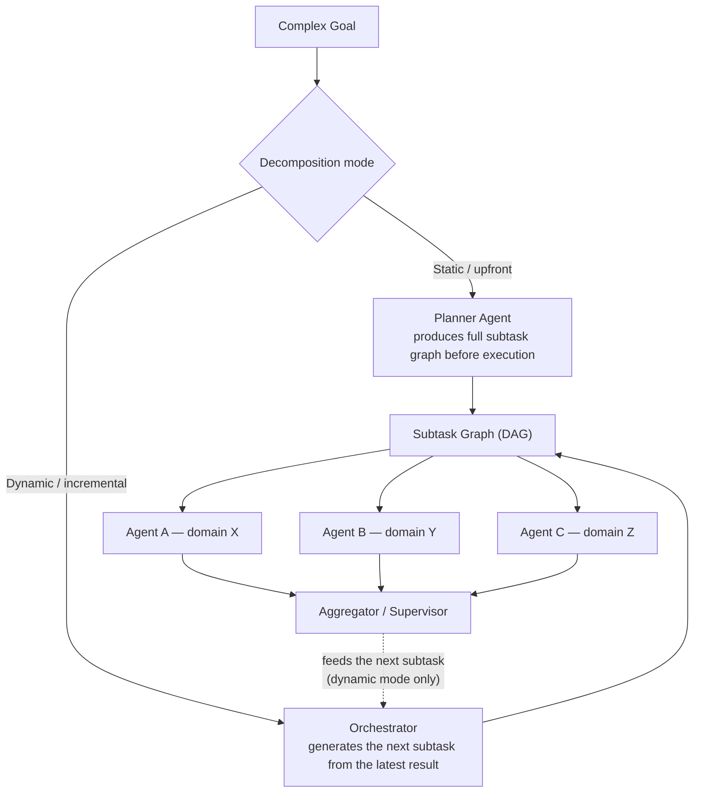

## Task Decomposition

> Chapter of [[building-agentic-systems/readme#01 — Multi-Agent Systems|Multi-Agent Systems]], part
> of [[building-agentic-systems/readme|Building & Evaluating Agents]].

## What you will understand at the end

- The difference between static (upfront) and dynamic (incremental) decomposition, and the concrete
  signal that tells you which one a task actually needs
- Three orthogonal ways to cut a goal into subtasks — functional/skill split, data-partition split,
  pipeline-stage split — and when each one produces clean versus messy boundaries
- Why subtask granularity is a cost curve, not a preference: too coarse loses parallelism and
  specialization, too fine drowns the win in coordination overhead
- How to read GitHub's sub-issue graph as a live, inspectable instance of a decomposition graph
  running in production

---

## The mental model

Task decomposition is the step that turns "investigate this outage" into a set of things that can
actually be assigned, scheduled, and executed — by different agents, in parallel where possible,
without every agent needing the full context of every other agent's work.

Every decomposition approach answers the same two questions differently:

1. **When is the subtask graph decided?** All at once, before any agent starts (static), or piece by
   piece, as results come back (dynamic)?
2. **Where is the cut line between subtasks?** Skill, data partition, or pipeline stage?

Reading the diagram: static decomposition commits to the full graph before Agent A, B, or C ever
runs — the dotted feedback loop simply doesn't exist for that mode. Dynamic decomposition keeps that
loop alive: the aggregator's output becomes an input to deciding what the _next_ subtask even is.

Everything else in this chapter — which strategy to cut along, how big to make each piece — is
downstream of that first choice.

---

## 1. Static (upfront) vs. dynamic (incremental) decomposition

**Static decomposition:** a planner agent looks at the goal once and produces the complete subtask
graph — nodes and dependency edges — before any worker agent executes a single step. Execution then
becomes "just" scheduling: topologically sort the DAG, dispatch independent branches in parallel,
wait, aggregate. This is the multi-agent generalization of the single-agent
[[07-plan-and-execute|Plan-and-Execute]] pattern — the difference is that each "step" in the plan is
now a full agent invocation with its own context, not a single tool call inside one agent's loop.

**Dynamic decomposition:** there is no complete graph up front. An orchestrator generates the next
subtask (or the next small batch of subtasks) based on what the _previous_ subtask returned. The
graph exists only in retrospect, once the run finishes — you can draw it after the fact from the
execution trace, but nobody could have drawn it before the first agent ran.

**Worked reasoning — an incident RCA:**

Take the goal "explain why checkout latency spiked at 14:02 UTC."

- _Static approach:_ a planner commits upfront to four parallel branches — check recent deploys,
  check infra metrics, check dependency health, check traffic pattern — and dispatches all four
  agents at once. This works well when the investigation follows a known runbook: the shape of "what
  to check" doesn't depend on what any individual check finds.
- _Dynamic approach:_ one agent checks deploys first. Result: no deploy in the window. Only _then_
  does the orchestrator spawn an infra-metrics agent. That agent returns: database CPU pegged at
  14:01. Only _then_ does the orchestrator spawn a fourth agent to pull the slow-query log for that
  specific window. Each subtask is chosen by the answer to the one before it — the same
  thought-action-observation shape as [[02-react|ReAct]], except each "action" here is a full
  sub-agent invocation rather than one tool call.

Most production multi-agent systems are hybrid: a static skeleton (always spin up metrics/logs/
traces specialists, per [[02-collaboration-models|Collaboration Models]]) with a dynamic tail — a
supervisor decides, based on what those specialists return, whether to spawn a fifth investigative
branch. [[09-supervisor-architectures|Supervisor Architectures]] covers that aggregation-and-branch
decision in depth; this chapter only needs you to recognize which half of the run you're in.

| Dimension                     | Static (upfront)                                                         | Dynamic (incremental)                                                                                   |
| ----------------------------- | ------------------------------------------------------------------------ | ------------------------------------------------------------------------------------------------------- |
| When the graph is decided     | Once, before execution starts                                            | Continuously, interleaved with execution                                                                |
| Parallelism ceiling           | High — independent branches launch immediately                           | Lower — the next step often can't be chosen until the last one returns                                  |
| Adaptability to surprises     | Low — a wrong upfront guess wastes every branch built on it              | High — bad information is caught within one hop, before it propagates                                   |
| Cost predictability           | High — the whole plan can be priced and reviewed before spending a token | Low — total cost is only known once the run finishes                                                    |
| Auditability / approval gates | Easy — insert a human review of the full plan before any agent acts      | Hard — there is no single artifact to review, only a trace after the fact                               |
| Failure mode                  | Silent — garbage-in-garbage-out from a bad root node                     | Visible — failure surfaces at the specific step, but recovery needs live re-planning                    |
| Natural fit                   | ETL/batch pipelines, code migrations, anything with a known shape        | Investigation, debugging, research — anything where "what to check next" depends on what you just found |

---

## 2. Three ways to cut a goal into subtasks

Once you know when the graph gets decided, you still have to decide _where_ the cut lines go. Three
strategies cover most of what shows up in practice, and they compose.

**Functional / skill split** — cut along what capability, domain, or tool access a subtask requires.
The metrics/logs/traces specialists from [[02-collaboration-models|Collaboration Models]] are a
functional split: each agent gets a narrower toolset and a narrower prompt, which makes each one
more reliable inside its lane. The boundary is clean when the domains are genuinely non-overlapping;
it gets messy when ownership is ambiguous — is a slow endpoint a "logs problem" or a "traces
problem"? Both agents may claim it, or neither will, and someone has to arbitrate.

**Data-partition split** — cut along an independent slice of the same workload: one agent per AWS
region, per tenant, per file shard, per customer cohort. Every agent runs the _same_ logic against a
disjoint slice of data, so there's no need to design a different prompt or toolset per agent — only
to bound the blast radius per partition. This is the closest of the three to embarrassingly
parallel, and coordination need stays near zero until the reduce/aggregate step at the end.

**Pipeline-stage split** — cut along a strict sequential pipeline, where the output of stage _N_ is
the literal input of stage _N+1_: ingest → enrich → score → report. This is the split most workflow
engines default to, because it maps directly onto a DAG they already know how to run — but it buys
zero parallelism _across_ stages. Parallelism only exists _within_ a stage, if that stage is itself
data-partitioned internally.

| Strategy                 | Cuts along                                | Example                                                              | Coordination need                                                | Failure isolation                                                  |
| ------------------------ | ----------------------------------------- | -------------------------------------------------------------------- | ---------------------------------------------------------------- | ------------------------------------------------------------------ |
| Functional / skill split | Domain expertise or tool access           | Metrics agent + Logs agent + Traces agent investigating one incident | Low–medium — agents work independently, merge only at synthesis  | High — one specialist's failure doesn't corrupt another's evidence |
| Data-partition split     | An independent slice of the same workload | One agent per region / tenant / file shard, running identical logic  | Very low — near embarrassingly parallel until reduce/aggregate   | High — one shard's failure stays contained to that shard           |
| Pipeline-stage split     | Sequential stage in a value chain         | Ingest agent → Enrich agent → Score agent → Report agent             | High — strict ordering, stage N+1 is blocked on stage N's output | Low — a stage failure blocks everything downstream of it           |

These compose more often than they compete. A pipeline stage that has to process a million records
commonly fans out into a data-partition split internally, then reduces before handing off to the
next stage — that's the [[04-orchestrator-worker-pattern|Orchestrator–Worker Pattern]] nested inside
one node of a larger pipeline-stage graph. Recognizing which strategy (or combination) you're
actually looking at is most of the design work; the rest is mechanical.

---

## 3. Sizing subtasks: the granularity tradeoff

Choosing a strategy tells you _where_ the cut lines go. It doesn't tell you _how many_ cuts to make.
That's a separate decision, and it has real cost on both ends.

**Too coarse** — one subtask per "whole domain," e.g. a single "investigate everything" agent. You
lose the benefit of parallel specialists: that one agent's context window fills with tool calls and
findings from every domain at once, unrelated evidence crowds out the reasoning that actually
matters, and any failure forces a full redo rather than a redo of one narrow piece. You paid for a
multi-agent architecture and got single-agent reliability.

**Too fine** — one subtask per atomic action, e.g. one agent invocation per file in a 5,000-file
migration. Every subtask carries the fixed overhead of an agent invocation — system prompt, tool
schema, context assembly, a few hundred to a few thousand tokens before any real work happens — plus
the overhead of writing its result to shared state, tracking its status, merging its output, and
handling its individual retry on failure. Past a point, the supervisor spends more tokens and
wall-clock coordinating than the workers spend doing the work, and you're paying full
agent-invocation overhead for something a five-line deterministic loop would have done for free.

**Worked reasoning — migrating 200 microservices to a new logging schema:**

- _1 subtask (the whole migration):_ a single agent's context balloons past its usable window well
  before service #50. One bad edit anywhere forces re-review of everything. Zero parallelism.
- _200 subtasks (one per service):_ 200 agent invocations, 200 PRs to track, 200 possible retry
  loops. The supervisor now spends more tokens tracking status than the agents spend making edits.
  Any two services that share an on-call team or a shared config file become a merge-conflict risk
  that _parallelizing_ introduced, not one that existed in the work itself.
- _~15–20 subtasks, batched by team ownership or shared dependency cluster:_ each subtask is large
  enough to amortize the fixed cost of one more agent invocation, small enough that one failure
  doesn't force a full re-plan, and the batch boundaries align with real merge-conflict boundaries
  (team/repo ownership) instead of an arbitrary headcount.

**A working heuristic:** size a subtask so the work inside it is at least one to two orders of
magnitude larger than the fixed overhead of spinning up, briefing, and reconciling one more agent
invocation. If you can't state in one sentence why subtask N+1 needs a _different_ agent context
than subtask N, they're probably the same subtask wearing two costumes.

**Why edges matter more than nodes:** coordination cost scales with the number of dependency edges
that need synchronization, not the raw subtask count. Functional and data-partition splits keep edge
count close to node count — only fan-out and fan-in need synchronizing. Deeply chained pipeline
splits turn _every_ stage boundary into a mandatory synchronization point regardless of how many
nodes exist, which is why long pipelines feel disproportionately expensive to coordinate even when
each individual stage is simple. [[11-hierarchical-planning|Hierarchical Planning]] covers the
related problem of bounding this cost by nesting decomposition — subgoals owned by a higher-level
planner, each further decomposed only by the lower-level planner responsible for it — so the
synchronization fan-in at any one level stays small.

---

## 4. The decomposition graph as a runtime artifact

The subtask graph isn't only a design-time diagram — in a running system, it _is_ the execution
trace. Each subtask node corresponds to a span; each dependency edge corresponds to a parent/child
span relationship; the aggregator is where those spans converge back into one. If you've
instrumented the system the way [[02-agent-tracing|Agent Tracing]] describes, you can reconstruct
the decomposition graph after the fact purely from spans — which matters most for dynamic
decomposition, where no upfront diagram ever existed to compare against.

This is also where decomposition quality becomes visible operationally, not just architecturally: a
graph with too few edges relative to nodes runs fast and fails cleanly; a graph with too many
synchronization points shows up in traces as agents idling on each other, which is the runtime
signature of the "too fine" failure mode from Section 3.

---

## Seeing the decomposition graph in the wild

### GitHub Copilot in practice

GitHub's issue tooling and Copilot's coding agent give you a concrete, inspectable instance of task
decomposition running against real infrastructure — using features that exist independently of any
particular agent framework:

- GitHub Issues supports native **sub-issues**: a parent (epic) issue tracks a checklist of child
  issues, each with its own number, assignee, and status, rolled up into a progress bar on the
  parent. This is decomposition-as-data — the subtask graph _is_ the issue tracker, not a diagram
  maintained separately from execution.
- Copilot's coding agent can be assigned directly to an issue. Once assigned, it starts an
  autonomous session in an isolated sandbox: it reads the issue, drafts a plan, opens a draft pull
  request, and pushes commits as it works, with progress visible as commits and PR checkboxes.
- Assigning several sub-issues to Copilot independently — one sub-issue per bounded piece of work —
  spins up one agent session per sub-issue, and each session only sees its own issue's context, not
  the sibling sub-issues' in-flight state. That's a functional split or a data-partition split
  depending on how the epic was cut: "add tests" vs. "update the docs" is a skill split; "migrate
  service A" / "migrate service B" per sub-issue is a data-partition split.
- The parent issue's checklist plus each sub-issue's linked PR becomes the **visible decomposition
  graph**: which nodes are done (PR merged), in flight (draft PR open, commits still landing),
  blocked (sub-issue unassigned or waiting on a dependency), or failed (PR closed without merging,
  needs re-assignment).

The mechanics above — sub-issues, checklist rollups, and issue-assignment triggering a sandboxed
agent session — are documented product behavior. Two things below are generalizations from how teams
actually use this, not platform guarantees, and are flagged as such:

- **Cross-sub-issue coordination is not automatic.** If sub-issue B's correct implementation depends
  on a decision Copilot made while working sub-issue A, there is no built-in mechanism for B's
  session to be aware of A's in-flight reasoning — only of A's _merged_ state, and only if a human
  ordered the assignment that way. Teams handle this by sequencing assignment deliberately (don't
  assign B until A's PR merges) rather than trusting the platform to serialize it — a manual
  instance of the static-vs-dynamic tradeoff from Section 1, decided by the human doing the
  assigning instead of by the tool.
- **The "right" granularity for sub-issues is a team convention, not a platform rule.** Some teams
  cut one sub-issue per file or per service (fine-grained, higher review overhead, easy individual
  rollback); others cut one sub-issue per feature slice spanning several files (coarser, fewer PRs
  to review, harder to isolate a single bad change). GitHub's tooling supports either — it's the
  Section 3 sizing judgment call, relocated to issue-tracker granularity instead of runtime
  agent-invocation granularity.

---

## Concept check

Before moving to the next chapter, you should be able to answer these without notes:

| Question                                                                         | Answer hint                                                                                                                         |
| -------------------------------------------------------------------------------- | ----------------------------------------------------------------------------------------------------------------------------------- |
| What's the one-sentence difference between static and dynamic decomposition?     | Whether the full subtask graph exists before any agent runs, or only in retrospect after the run.                                   |
| Why does dynamic decomposition usually have a lower parallelism ceiling?         | The next subtask often can't be chosen until the previous one's result is known.                                                    |
| Name the three decomposition strategies covered here.                            | Functional/skill split, data-partition split, pipeline-stage split.                                                                 |
| Which strategy is closest to embarrassingly parallel, and why?                   | Data-partition split — every agent runs identical logic on a disjoint slice, so almost no coordination is needed until aggregation. |
| What actually drives coordination cost — node count or edge count?               | Edge count — synchronization points, not raw subtask count.                                                                         |
| In the GitHub Copilot pattern, what plays the role of the "decomposition graph"? | The parent issue's sub-issue checklist plus each sub-issue's linked PR status.                                                      |

---

## Vocabulary glossary

| Term                     | Definition                                                                                        |
| ------------------------ | ------------------------------------------------------------------------------------------------- |
| Task decomposition       | Breaking a complex goal into subtasks that can be assigned to and executed by different agents    |
| Static decomposition     | The full subtask graph is produced upfront, before any agent executes                             |
| Dynamic decomposition    | Subtasks are generated incrementally, each one reacting to the previous result                    |
| Subtask graph            | The DAG of subtasks and their dependency edges — the decomposition, made explicit                 |
| Functional / skill split | Cutting subtasks along domain expertise or tool access                                            |
| Data-partition split     | Cutting subtasks along independent slices of the same workload                                    |
| Pipeline-stage split     | Cutting subtasks along sequential stages where one stage's output feeds the next                  |
| Granularity              | How large or small each subtask is — the coarse/fine tradeoff this chapter's Section 3 covers     |
| Coordination overhead    | The cost of tracking, synchronizing, and reconciling subtasks — scales with edges, not just nodes |
| Sub-issue                | GitHub's native child-issue primitive, rolled up into a parent issue's checklist and progress bar |

## Metadata

|        |                          |
| ------ | ------------------------ |
| Author | Amit Singh               |
| Scope  | building-agentic-systems |
