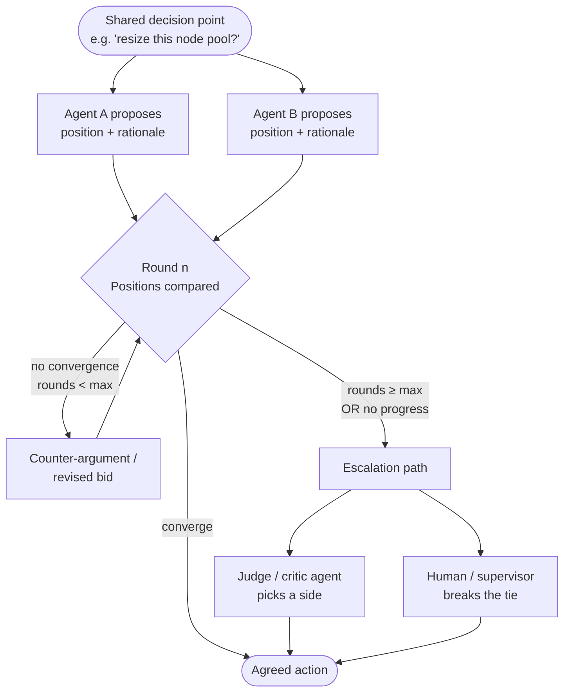

## Agent Negotiation

> Chapter of [[building-agentic-systems/readme#01 — Multi-Agent Systems|Multi-Agent Systems]], part
> of [[building-agentic-systems/readme|Building & Evaluating Agents]].

## What you will understand at the end

- Why negotiation is a genuinely different coordination problem than task routing or task
  decomposition — it exists only when agents have conflicting objectives or incomplete shared state,
  not just different jobs
- Two concrete negotiation protocols — debate-style (argue positions, judge decides) and
  auction-style (bid confidence/cost, highest bid wins) — and when each is the right shape
- Why unbounded agent-to-agent negotiation is a production failure mode, and the four mechanisms
  that bound it: max rounds, forced tie-break, escalation, and cost-of-delay
- Where negotiation sits relative to the neighboring chapters —
  [[02-collaboration-models|task decomposition]] (who does the work), negotiation (who wins when
  objectives conflict), and [[06-consensus-mechanisms|consensus mechanisms]] (how many agents agree,
  not why they disagree)

---

## The mental model

Most multi-agent chapters up to this point assume agents want the same outcome and just split the
labor. Negotiation is what you need the moment that assumption breaks: two (or more) agents each
have a **defensible, individually rational position**, and only one shared action can actually be
taken.

This shows up in exactly two shapes, and it's worth telling them apart because they call for
different designs:

- **Conflicting objectives.** A cost-optimizing agent and a latency-optimizing agent both see the
  full picture but disagree because their reward functions point in different directions — one is
  scored on the cloud bill, the other on p99. Neither is wrong.
- **Partial information.** Each agent sees a slice of the shared state and reasons correctly from
  it, but the slices don't agree. A capacity-planning agent sees queue depth; a budget agent sees
  spend-to-date; neither sees the other's slice unless the protocol forces disclosure.

In practice these two shapes combine — a cost agent both optimizes for a different variable _and_
lacks visibility into the latency agent's SLO, which is exactly why the disagreement can't be
resolved by just handing one agent more context. There is a real conflict to adjudicate, not a
communication gap to patch.

**Reading the diagram:** negotiation is a bounded loop with an explicit exit condition on _both_
sides — a happy exit (convergence) and an unhappy exit (escalation). A negotiation protocol that
only defines the happy path is not a negotiation protocol; it's a hope.

---

## 1. Why this is not task routing

It's tempting to model negotiation as "just another router" — pick which agent's answer wins. The
router pattern
([[ai-architecture-and-system-design/readme#00 — AI Architecture Patterns|Part 00 of AI Architecture & System Design]])
and negotiation solve different problems, and conflating them is the most common design mistake in
this space.

| Property                  | Task routing / decomposition                             | Agent negotiation                                                       |
| ------------------------- | -------------------------------------------------------- | ----------------------------------------------------------------------- |
| Why multiple agents exist | To divide labor — each owns a disjoint slice of the work | To represent conflicting perspectives on the _same_ decision            |
| What "done" looks like    | Each agent finishes its slice; results get merged        | One shared action is chosen; the other position is overruled            |
| Objective alignment       | Agents share the top-level goal                          | Agents' reward functions genuinely diverge                              |
| Information shape         | Complementary (A has what B doesn't, no conflict)        | Overlapping and contested (A and B may see the same fact differently)   |
| Failure mode              | A dropped subtask, a missed handoff                      | An infinite disagreement loop, or a silently-arbitrary tie-break        |
| Resolution mechanism      | A router or supervisor assigns work upfront              | A protocol (debate, auction, vote) resolves a conflict _after_ the fact |

The tell: if you can resolve the disagreement by giving one agent more context, it was a
communication gap, not a negotiation — fix the context pipeline instead of building a protocol. If
the agents would still disagree with perfect shared context because they're optimizing different
things, you have a genuine negotiation problem.

---

## 2. Debate-style negotiation

**The idea:** each agent states a position and a rationale, sees the other agent's position, and
gets a bounded number of rounds to argue or revise. A separate **judge (critic) agent** — one with
no stake in the outcome — reads the transcript and picks a winner, or a merged position.

This is the multi-agent application of the algorithmic pattern covered in
[[10-debate-and-critic-agents|Debate & Critic Agents]] (Part 03 of Agentic AI Engineering); here the
"opposing positions" are not sampled from the same model for robustness — they're two agents with
structurally different objectives.

**Worked example — infra change proposal:**

> A **cost-optimizing agent** proposes scaling a node pool down 30% based on average CPU utilization
> over the trailing week. A **latency-optimizing agent** proposes leaving it as-is, citing p99
> latency headroom that only shows up during a daily traffic spike the cost agent's weekly average
> smooths over.
>
> Round 1 — Cost agent: "Utilization averages 22%; scale-down saves ~$4,200/mo." Latency agent:
> "Averages hide the 14:00 UTC spike where utilization hits 81%; scale-down risks breaching the p99
> SLO."
>
> Round 2 — Cost agent revises: "Propose scaling down only the off-peak baseline, keep spike-hour
> capacity via a scheduled scale-out." Latency agent: "Acceptable if the scale-out completes before
> 13:55 UTC, given ~4 min node bring-up time."
>
> Judge agent reads both rounds, checks the revised proposal against the actual spike window in the
> shared telemetry, and approves the scheduled-scaling compromise — a position neither agent held at
> round 1.

**Why the judge matters:** without a third, disinterested agent, "debate" degenerates into whichever
agent argues longer or louder — LLM-generated arguments are persuasive independent of correctness. A
judge with a narrow, well-specified rubric (e.g., "does this proposal violate the p99 SLO, yes/no")
is what keeps debate from becoming a rhetoric contest.

**Failure mode specific to debate:** sycophantic convergence — one agent capitulates to sound
cooperative rather than because the argument was stronger. Mitigate by scoring the judge's decision
against ground truth (the actual SLO, the actual budget) rather than against which agent "won" the
argument.

---

## 3. Auction / bidding-style negotiation

**The idea:** instead of arguing a position, each agent submits a **bid** — a confidence score, a
cost estimate, or both — for the right to own a task or claim a shared resource. Highest (or
lowest-cost) bid wins; no back-and-forth argument required.

This is a much cheaper protocol than debate — one round, no judge, no LLM-vs-LLM rhetoric — and it's
the right shape when the thing being contested is _ownership of a task_, not the _correctness of a
position_.

**Worked example — task claiming in an incident-response fleet:**

> An alert fires that could be root-caused by either a database-specialist agent or a
> network-specialist agent. Both bid:
>
> | Agent                    | Confidence bid | Estimated cost (tokens + tool calls) | Estimated time |
> | ------------------------ | -------------- | ------------------------------------ | -------------- |
> | DB-specialist agent      | 0.72           | ~1,800 tokens, 3 tool calls          | 45s            |
> | Network-specialist agent | 0.61           | ~2,600 tokens, 5 tool calls          | 90s            |
>
> A bid-selection rule — e.g. `confidence / cost`, or confidence-first with cost as tie-break —
> awards the investigation to the DB-specialist agent. If it later returns a low-confidence result,
> the orchestrator can re-open the auction to the network-specialist agent rather than trusting a
> bid that didn't pay off.

**Why bidding beats debate here:** the two agents aren't disagreeing about a _fact_ — they're each
estimating their own likelihood of being useful. There is nothing to argue; there's only a number to
compare. Auctions also parallelize well — you can run one auction across five specialist agents in a
single round, where debate scales rounds linearly with participants.

**The honesty problem:** an auction only works if bids are calibrated. An agent that always bids 0.9
confidence regardless of actual fit breaks the mechanism exactly the way a human bidder sandbagging
an estimate breaks a real auction. In practice this means treating bid calibration as an evaluation
metric (Part 02) — track bid confidence against post-hoc outcome quality per agent, and down-weight
or retrain agents whose bids don't correlate with results.

---

## 4. Comparing the two protocols

| Dimension             | Debate-style                                                  | Auction / bidding-style                                       |
| --------------------- | ------------------------------------------------------------- | ------------------------------------------------------------- |
| What's being resolved | Which _position_ is correct                                   | Which _agent_ should own the task                             |
| Rounds needed         | Multiple (argue, counter, revise)                             | Typically one                                                 |
| Needs a judge?        | Yes — a disinterested third party                             | No — a comparison rule (max confidence, min cost) suffices    |
| Cost profile          | Higher — each round is an LLM call per agent, plus the judge  | Lower — one bid per agent, no argument transcript             |
| Scales with N agents  | Poorly — rounds tend to grow with participants                | Well — bids are independent, easy to parallelize              |
| Right for             | Genuine value disagreements (cost vs. latency, risk appetite) | Task/resource claiming, specialist routing under uncertainty  |
| Wrong for             | Simple task claiming (needless LLM spend)                     | Value tradeoffs (there's no "bid" for whose SLO matters more) |

Both protocols are **designed mechanisms**, not emergent agent behavior. LLM agents don't have
stable internal utility functions the way game-theoretic agents in the classical literature do —
"negotiation" here means you engineered a specific message-passing protocol with a specific
resolution rule, not that two agents discovered a Nash equilibrium on their own. Treat any framework
claim that agents "negotiate autonomously" with the same skepticism you'd apply to a vendor claiming
a model "reasons" — useful shorthand, not a literal mechanism.

---

## 5. The failure mode: negotiation that never converges

The most common way this goes wrong in production is boring and entirely predictable: two agents
each hold their ground, round after round, because neither has a mechanism that forces a decision.
Debate without a judge is the classic version — the transcript grows, token spend grows with it, and
nothing gets decided until someone notices the loop is still running an hour later.

The bounding mechanisms, in the order you should reach for them:

| Mechanism                         | What it does                                                                                                                                 | When to use it                                                                           |
| --------------------------------- | -------------------------------------------------------------------------------------------------------------------------------------------- | ---------------------------------------------------------------------------------------- |
| **Max rounds**                    | Hard cap on negotiation rounds (3–5 is typical); force a decision at the cap                                                                 | Always — this is the non-negotiable floor under every protocol above                     |
| **Forced tie-break**              | A deterministic rule that fires when max rounds is hit — e.g. lower-risk position wins, or the position with the smaller blast radius        | When you can define "safer default" unambiguously for the domain                         |
| **Escalation**                    | Route to a human or a supervisor agent when rounds are exhausted without convergence                                                         | When the decision carries real cost/risk (infra changes, spend, customer-facing actions) |
| **Cost-of-delay circuit breaker** | Track wall-clock or token spend on the negotiation itself; abort and escalate if the _cost of negotiating_ exceeds the value of the decision | High-frequency, low-stakes decisions where debate is disproportionately expensive        |

This mirrors the execution-loop discipline from
[[building-agentic-systems/00-building-single-agent-systems/01-agent-architecture/01-agent-architecture|Agent Architecture]]
(Part 00) — "always set a max-iteration limit" applies just as literally to a two-agent negotiation
as it does to a single agent's tool-call loop. The difference is that a negotiation loop has _two_
runaway risks instead of one: either agent can be the one that never yields, and a max-rounds cap on
the conversation is the only thing that catches both.

**A design detail that matters:** escalation should not silently default to "agent A wins" — that's
a tie-break wearing an escalation costume. A real escalation path either pages a human with the
actual transcript, or hands off to a supervisor agent (Part 00,
[[09-supervisor-architectures|Supervisor Architectures]]) with authority neither negotiating agent
has, such as visibility into both agents' objective functions simultaneously. If your "escalation"
is just the forced tie-break rule with an audit log, say so in the design doc — don't let a
rubber-stamp path get mistaken for genuine human oversight.

---

### GitHub Copilot in practice

GitHub's Copilot code-review surface (Copilot code review, and repository-configured review agents
via GitHub Actions/Copilot extensions) can produce something that _looks_ like the negotiation
scenario above: two review-focused passes leave conflicting inline suggestions on the same pull
request — for example, a performance-oriented pass suggesting a refactor toward a more
allocation-efficient loop, and a readability-oriented pass suggesting the opposite, favoring a
clearer but less optimized structure over the same block of code.

What's documented and what's inference, stated plainly:

- **Documented:** GitHub Copilot's PR review comments are surfaced as ordinary review comments/
  suggestions on the diff, the same UI surface human reviewers use. There is no agent-to-agent
  negotiation channel between separate review passes — each comment is generated independently
  against the diff and posted.
- **Inference (flagged as such):** if two differently-configured review passes (or two different
  review tools) both comment on the same hunk with opposing suggestions, GitHub's product surface
  does not run a debate or auction between them. The conflict sits in the PR as two comments.
- **What resolves it in practice:** a **human reviewer** reads both suggestions and picks one, edits
  toward a compromise, or dismisses one outright before merge. This is the forced-tie-break and
  escalation mechanisms from Section 5, just performed by the human who was always the final
  approver in the pull request workflow — not a novel resolution path Copilot introduces.

The broader point generalizes beyond Copilot specifically: most GitHub-integrated review agents
today (Copilot's own review feature, as well as third-party review bots configured as GitHub Apps or
Actions) are **independent commentors on a shared diff**, not participants in a negotiation protocol
with each other. The PR's human reviewer is the de facto judge agent from Section 2 — except nobody
engineered that role; it's simply the role a human reviewer already had. If you want actual
agent-to-agent negotiation on a PR (a debate round, a bid for which suggestion to apply), that has
to be built as a layer _on top of_ these tools — e.g., an orchestrating script that collects both
tools' comments before either posts, runs them through a judge step, and posts only the resolved
suggestion. As of this writing, that orchestration is not something Copilot's review feature does
natively — treat this as the current state of a fast-moving product surface, not a permanent
architectural ceiling.

---

## Concept check

Before moving to [[06-consensus-mechanisms|Consensus Mechanisms]], you should be able to answer
these without notes:

| Question                                                              | Answer hint                                                                                                                                          |
| --------------------------------------------------------------------- | ---------------------------------------------------------------------------------------------------------------------------------------------------- |
| What distinguishes negotiation from task decomposition?               | Conflicting objectives or contested/partial state — not just complementary work to divide                                                            |
| When is debate-style negotiation worth its cost over an auction?      | When the disagreement is about which _position_ is correct, not which _agent_ should own a task                                                      |
| Why does an auction need calibrated bids to work?                     | An agent that always bids high confidence breaks the comparison the mechanism relies on                                                              |
| What's the non-negotiable floor under every negotiation protocol?     | A max-round cap — exactly like the max-iteration limit on a single agent's execution loop                                                            |
| Why is escalation different from a forced tie-break?                  | Escalation hands the decision to a party with authority/visibility neither agent has (human/supervisor); a tie-break is just a deterministic default |
| How does negotiation differ from consensus mechanisms (next chapter)? | Negotiation resolves _why_ two agents disagree; consensus mechanisms resolve _how many_ agents must agree, generally assuming shared objectives      |

---

## Vocabulary glossary

| Term                     | Definition                                                                                          |
| ------------------------ | --------------------------------------------------------------------------------------------------- |
| Negotiation              | A bounded protocol for resolving conflicting agent positions into one shared action                 |
| Debate-style negotiation | Agents argue positions over bounded rounds; a judge/critic agent decides                            |
| Judge / critic agent     | A disinterested third agent that scores or picks between competing positions                        |
| Auction / bidding        | Agents submit confidence/cost bids for task ownership; a comparison rule selects the winner         |
| Bid calibration          | How well an agent's stated confidence correlates with its actual outcome quality                    |
| Max rounds               | The hard cap on negotiation rounds before a forced resolution fires                                 |
| Forced tie-break         | A deterministic default rule applied when negotiation exhausts its round budget                     |
| Escalation               | Handing an unresolved negotiation to a party (human or supervisor) with authority neither agent has |
| Cost-of-delay breaker    | An abort condition that fires when the cost of negotiating exceeds the value of the decision        |
| Partial information      | A state where each agent reasons correctly from a slice of shared state that the others don't see   |

## Metadata

|        |                          |
| ------ | ------------------------ |
| Author | Amit Singh               |
| Scope  | building-agentic-systems |
