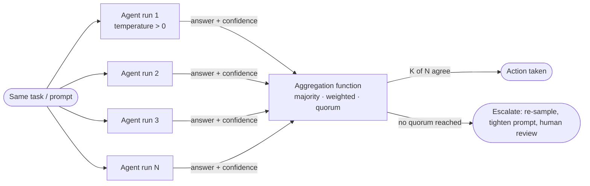

## Consensus Mechanisms

> Chapter of [[building-agentic-systems/readme#01 — Multi-Agent Systems|Multi-Agent Systems]], part
> of [[building-agentic-systems/readme|Building & Evaluating Agents]].

## What you will understand at the end

- Why running the same task through N independently-sampled agent instances and voting on the
  outcome is
  [[agentic-ai-engineering/03-planning-and-reasoning-algorithms/03-self-consistency/03-self-consistency|self-consistency]]
  lifted from token-level sampling to agent-level orchestration
- How majority voting, plurality voting, and confidence-weighted voting differ mechanically, and the
  specific condition under which adding more voters helps versus does nothing
- What a quorum gate (K-of-N) buys you operationally, and how K actually gets chosen in practice
  (empirically, against an eval set — not derived from a fault-tolerance proof)
- Where the Raft/Paxos distributed-consensus analogy is genuinely useful, and exactly where it
  breaks down — different failure model, different fix, no equivalent safety guarantee
- How GitHub's branch protection rules already run a human consensus gate in production, and how
  automated review agents' outputs compose with (not replace) that gate

---

## The mental model

Distributed-systems consensus (Raft, Paxos, Multi-Paxos) answers: **"how do N processes agree on one
value despite some of them crashing or getting partitioned, while everyone who answers is otherwise
telling the truth?"**

Multi-agent consensus answers a different question that happens to rhyme: **"how do N runs of the
same (or different) LLM agent converge on one answer despite each run reasoning its way to a
different conclusion, when nothing has crashed and nothing is lying?"**

That difference in _why_ the parties disagree is the entire chapter. Everything below — voting,
weighting, quorum — is a family of aggregation functions built for disagreement caused by
**reasoning variance**, not **network or process failure**.

**Reading the diagram:** the same task is dispatched to N agent runs — either N samples of one
agent, or N differently-specialized agents looking at the same question. Each returns an answer,
optionally with a confidence score. An aggregation function decides whether there's enough agreement
to act, and if not, the system falls back to gathering more evidence rather than guessing.

---

## Why one agent call isn't enough

A single LLM call is one sample from a distribution over possible reasoning paths. Temperature above
zero, non-determinism in the sampling procedure, and the sheer combinatorics of natural language
mean the _same_ prompt sent twice can produce two different — sometimes contradictory — answers.
This is not a bug to be patched; it's the mechanism by which the model explores its reasoning space
at all.

[[agentic-ai-engineering/03-planning-and-reasoning-algorithms/03-self-consistency/03-self-consistency|Self-consistency]]
exploits this at the _token_ level: sample several chain-of-thought completions from one call, take
the majority final answer. Multi-agent consensus mechanisms take the identical idea and move it up a
layer of abstraction — instead of sampling completions from one call, you sample from N independent
**agent runs**, each of which may itself contain a full reasoning loop, tool calls, and retrieved
context. The unit of disagreement changes from "a token sequence" to "an agent's considered
conclusion," but the underlying fix — sample more, aggregate, look for convergence — is the same
insight applied one level higher.

---

## Mechanism 1 — Majority and plurality voting

**Majority voting:** run the same task through N independent agent instances. If more than N/2
return the same answer, that answer wins. If nothing clears 50%, there's no consensus — escalate.

**Plurality voting:** relax the bar to "most votes wins," even if that's short of a majority. Use
this when the answer space is large enough (open-ended text, multi-way classification) that a strict
majority is unlikely even when the agents are all reasoning well — three agents converging on the
same answer out of five, with the other two scattered across two different wrong answers, is still a
meaningfully strong signal.

**The Condorcet condition, translated to agents.** Majority voting only outperforms a single agent
call when two conditions hold:

1. Each individual agent is right more often than wrong (error probability < 0.5 on the task)
2. Errors are **independent** across agent runs

Condition 1 is usually satisfiable — pick a model/prompt combination that clears 50% accuracy on
your task, which for most well-scoped tasks is a low bar. Condition 2 is where the real work is, and
where naive implementations quietly fail: five samples from the _same_ model, on the _same_ prompt,
with the _same_ retrieved context, are not five independent judges. They're one judge asked five
times. If the model has a systematic bias (a stale fact in its training data, a misleading tool
result all five runs shared, an ambiguous instruction they all misread the same way), the errors are
correlated — the majority reinforces the bias instead of canceling it out. Voting reduces
**variance**; it does nothing against **shared bias**. That distinction is the single most important
thing to get right before trusting a voting scheme in production.

**Practical implication:** vary what you can between runs to push errors back toward independence —
different temperature/seed at minimum, ideally different prompt phrasings, different retrieval
passes, or (for real diversity) different underlying models. Voting five identical runs against a
poisoned context is theater, not consensus.

---

## Mechanism 2 — Weighted voting by reliability and confidence

Plain majority voting treats every voter equally. That's the wrong default once agents differ in how
trustworthy they are for the task at hand — a specialist "SQL-validation agent" should outweigh a
generalist agent on a query-correctness question; an agent with a strong recent track record on a
task type should outweigh one with a weak one.

**Two ways to derive weights:**

| Weighting source         | How it's computed                                                                                            | Failure mode                                                                                                                                                |
| ------------------------ | ------------------------------------------------------------------------------------------------------------ | ----------------------------------------------------------------------------------------------------------------------------------------------------------- |
| Historical accuracy      | Track each agent role's correct-vote rate on a labeled eval set; use it as a static or slowly-updated weight | Stale if the task distribution shifts; needs a feedback loop to stay honest                                                                                 |
| Self-reported confidence | Ask the agent to emit a confidence score alongside its answer, weight the vote by that score                 | LLMs are frequently **overconfident and poorly calibrated** — a 90% self-reported confidence does not mean 90% empirical accuracy unless you've verified it |

The second source is tempting because it's free (just ask the model), but treat it as a _feature_
for a weight, not the weight itself. The defensible pattern is: log (self-reported confidence,
actual correctness) pairs over time, fit a calibration curve per agent role, and use the calibrated
mapping — not the raw number — as the vote weight. This is the same discipline as calibrating a
classifier's predicted probabilities before using them for a downstream decision; skipping it is the
most common mistake in weighted-voting designs.

**Worked comparison — same five votes, three aggregation rules:**

Five agent runs investigate whether an alert is a true P1 incident. Votes:
`[Yes, Yes, No, Yes, No]`, with self-reported confidences `[0.6, 0.9, 0.8, 0.55, 0.7]` and
(separately tracked) historical accuracy for each agent role `[0.7, 0.85, 0.9, 0.6, 0.75]`.

| Rule                | Computation                                               | Result                                                                                                                    |
| ------------------- | --------------------------------------------------------- | ------------------------------------------------------------------------------------------------------------------------- |
| Plain majority      | 3 Yes vs 2 No                                             | **Yes** (weak margin — 60/40)                                                                                             |
| Confidence-weighted | Yes-weight = 0.6+0.9+0.55=2.05; No-weight = 0.8+0.7=1.5   | **Yes** (larger margin, but driven partly by an overconfident 0.9)                                                        |
| Accuracy-weighted   | Yes-weight = 0.7+0.85+0.6=2.15; No-weight = 0.9+0.75=1.65 | **Yes**, but the single **No** voter with 0.9 historical accuracy is the most reliable voter in the room and got outvoted |

The third row is the honest takeaway: weighted voting can still overrule your most reliable voter if
enough less-reliable voters agree. Weighting improves the aggregate estimate on average; it does not
guarantee the aggregate is right on any single instance, and it should not be sold to stakeholders
as if it does.

---

## Mechanism 3 — Quorum-based consensus

Voting produces a _ranked_ answer. A quorum gate turns that into a _binary_ one: **require K of N
agents to agree before the system is allowed to act autonomously.** Below K agreeing votes, the
system doesn't guess — it escalates, re-samples with a different approach, or hands off to a human.

This is the right default whenever the downstream action is irreversible or high-blast-radius
(executing a remediation, sending a customer-facing message, approving a financial transaction).
Voting alone tells you which answer is _most likely_ right; a quorum tells you when you're _sure
enough_ to act on it, which is the actual question that matters before autonomous execution.

**Choosing K:** unlike a Byzantine quorum system, where K is derived from a proof (tolerate `f`
faulty nodes out of `3f+1` with quorum `2f+1`), there is no equivalent derivation for K here,
because there is no formal fault model for "an LLM reasons incorrectly." K gets chosen empirically:
run the ensemble against a labeled eval set, sweep K, and plot the precision/recall (or
escalation-rate) tradeoff. A higher K raises confidence in what does get actioned but raises the
escalation/human-review rate; a lower K acts faster but on weaker evidence. That tradeoff curve —
not a formula — is the artifact you bring to a design review.

| K relative to N           | Effect                                     | Use when                                                            |
| ------------------------- | ------------------------------------------ | ------------------------------------------------------------------- |
| K = N (unanimity)         | Highest precision, highest escalation rate | Action is destructive/irreversible; false positives are very costly |
| K > N/2 (supermajority)   | Good balance for most production gates     | Default choice for autonomous remediation actions                   |
| K = plurality winner only | Fastest, weakest guarantee                 | Low-stakes, easily-reversible actions; internal draft generation    |

---

## Distributed-systems consensus: what rhymes and what doesn't

It's tempting to reach for Raft or Paxos vocabulary the moment "multiple agents need to agree" comes
up. The framing rhymes — N parties, an agreement rule, a decision that downstream systems act on —
but the mechanism and the guarantees are not transferable, and saying so explicitly is more useful
than a shallow analogy.

| Dimension                            | Raft / Paxos                                                                                              | Multi-agent voting/quorum                                                                                                                   |
| ------------------------------------ | --------------------------------------------------------------------------------------------------------- | ------------------------------------------------------------------------------------------------------------------------------------------- |
| **Why parties disagree**             | Crash faults, message loss, network partition — correct processes that can't currently talk to each other | Reasoning variance, sampling non-determinism, occasionally shared systematic bias — processes that are "up" and answering, just differently |
| **What's being agreed on**           | A single ordered value / log entry, with strict ordering across all replicas                              | A task's final answer or action — no ordering requirement, no replicated log                                                                |
| **The fix for disagreement**         | Leader election, log replication, retry until a majority of _reachable_ nodes commit                      | More independent samples, better/diversified prompts, calibrated weighting, escalate to a human                                             |
| **Safety guarantee**                 | Provable: safe despite up to `⌊(N-1)/2⌋` failures (Raft) under stated assumptions                         | None provable — voting is a heuristic reliability lift measured empirically on an eval set, not a theorem                                   |
| **Liveness guarantee**               | Eventually elects a leader and commits, given partial synchrony                                           | No guarantee of eventual agreement — an ensemble can tie forever or converge on a wrong shared bias                                         |
| **What a "faulty" party looks like** | Silent (crashed) or slow (partitioned); assumed non-Byzantine unless explicitly designed for it           | Fully responsive and articulate — the wrong answer arrives with the same fluency as the right one                                           |

The last row is the crux. In Raft/Paxos, a faulty node's signature is _absence_ — its silence is the
fault signal. A wrong LLM agent gives you no such signal: a confidently-wrong answer is
indistinguishable, by format, from a confidently-right one. You cannot detect a "faulty" agent by
watching for a timeout the way you'd detect a crashed replica; you can only detect it statistically,
by disagreement with other independent samples. That's the real reason voting exists here — not to
survive a partition, but to surface disagreement that a single call would hide entirely.

**Where the analogy is still useful:** it's a fine way to explain the _shape_ of the problem to an
audience that already knows distributed systems — "N parties, an agreement threshold, a decision
gate" is genuinely the right mental scaffold. Just don't let anyone walk away thinking a
consensus-gated agent ensemble has Raft's safety proof. It doesn't, and presenting it as if it does
is the kind of overclaim that falls apart under a Staff-level design review.

---

## Where correlated errors break voting entirely

Continuing the P1-incident example: suppose all five agent runs are handed the same stale runbook
that says a since-decommissioned service is still the root-cause owner for this alert class. All
five reason correctly _given_ that input and all five arrive at the same wrong conclusion. Five
independent runs, unanimous vote, K-of-N quorum cleared — and still wrong, because the fault was
upstream of the ensemble, in shared context, not in reasoning variance. No amount of additional
sampling from the same poisoned input fixes this; only diversifying the _input_ (different retrieval
pass, a second tool call to re-verify the runbook's freshness, a human spot-check) does. Voting is a
defense against reasoning-path noise. It is not a defense against a shared bad premise — that
failure mode needs to be caught by context/tool validation, not by adding more voters.

---

### GitHub Copilot in practice

GitHub's branch protection rules are a consensus gate that predates "agents" as a term, and it's
worth naming explicitly because most engineers already operate inside one daily.

**What's documented and stable:** a protected branch can require, before merge: a minimum number of
approving pull request reviews (`required_approving_review_count`), that stale approvals be
dismissed on new pushes, that reviews come from specific path-scoped owners via `CODEOWNERS`, and
that a named set of status checks pass. That combination is literally a **weighted quorum**: the
"required approvals" count is a K-of-N gate over human reviewers; `CODEOWNERS` is domain-based
weighting (a reviewer's vote only satisfies the gate for the paths they own — the same idea as
weighting a vote by an agent's proven reliability on a specific task type); required status checks
are a separate, mandatory voter that must also pass regardless of how the human quorum votes.

**How this composes with automated review agents (Copilot code review or any other bot-based
reviewer):** a bot's output reaches the merge gate through one of two channels, and which channel
matters a lot for whether it actually blocks anything:

1. **As a PR review** (approve / comment / request changes) — this only counts toward the required
   approving-review count if the bot's identity is itself eligible to satisfy that count (in
   practice: added as a required reviewer or covered by `CODEOWNERS` for the changed paths).
   Otherwise its comments are visible, useful, advisory input that a human still has to act on — the
   equivalent of an unweighted, non-binding vote sitting outside the quorum.
2. **As a status check** (wired through GitHub Actions or a similar CI integration) — this is a
   harder gate: if it's marked required, a failing/blocking result from the automated reviewer
   blocks merge exactly like a failing test suite would, independent of the human approval count.

**Flagging the generalization:** the exact current behavior of GitHub's own Copilot code-review
feature specifically — whether its review state counts toward required-approval math by default,
versus always being advisory unless separately wired as a required check — is a product detail that
has moved before and is reasonable to expect to keep moving. Treat the mechanism above (review vs.
status-check channel, and which one actually gates) as the durable model, and verify the current
specifics against GitHub's own branch-protection docs for whatever GA state you're building against
before writing it into a runbook or ADR.

**The takeaway for a multi-agent design:** this is a real, working instance of the same problem this
chapter solves — a mix of high-trust required voters (humans, or a required check) and lower-trust
advisory voters (bot comments) resolved by an explicit gate — deployed at massive scale, that most
engineering orgs already trust without ever calling it "consensus." It's a good reference point to
cite when a stakeholder asks "why do we need a quorum gate, can't the agent just decide?" — point at
branch protection and note that the org already answered that question for humans years ago.

---

## Choosing a mechanism

| Situation                                                               | Reach for                                                                                          |
| ----------------------------------------------------------------------- | -------------------------------------------------------------------------------------------------- |
| Cheap, reversible answer; just want a reliability bump over one call    | Plain majority/plurality voting                                                                    |
| Agents have known, differentiated reliability by task type              | Weighted voting, calibrated against a labeled eval set                                             |
| The downstream action is autonomous and hard to undo                    | Quorum gate (K > N/2 at minimum) with an explicit escalation path below K                          |
| Agents might share a bad premise (same stale context, same tool result) | Diversify inputs before adding more voters — voting alone won't help                               |
| You're tempted to borrow Raft/Paxos vocabulary for a design doc         | Fine for the "N parties, agreement threshold" framing — do not imply the safety proof carries over |

---

## Concept check

| Question                                                                           | Answer hint                                                                                                                                                        |
| ---------------------------------------------------------------------------------- | ------------------------------------------------------------------------------------------------------------------------------------------------------------------ |
| Why doesn't majority voting help against a systematic model bias?                  | Voting cancels independent variance; a shared bias produces correlated errors that reinforce rather than cancel                                                    |
| What's the actual difference between Raft's failure model and an agent ensemble's? | Raft handles crash/partition faults where faulty nodes go silent; agent disagreement comes from reasoning variance where every "faulty" answer is fully responsive |
| Why is self-reported LLM confidence risky as a vote weight?                        | LLMs are often poorly calibrated/overconfident; confidence needs to be calibrated against actual correctness before it's trustworthy as a weight                   |
| How should K in a K-of-N quorum actually be chosen?                                | Empirically, by sweeping K against a labeled eval set and reading the precision/escalation-rate tradeoff — not derived from a fault-tolerance proof                |
| Where does GitHub branch protection map onto this chapter's vocabulary?            | Required approving-review count is a quorum gate; `CODEOWNERS` is domain-weighted voting; required status checks are a separate mandatory voter                    |

---

## Vocabulary glossary

| Term                | Definition                                                                                                                                                              |
| ------------------- | ----------------------------------------------------------------------------------------------------------------------------------------------------------------------- |
| Majority voting     | Aggregation rule requiring more than half of N independent votes to agree before selecting an answer                                                                    |
| Plurality voting    | Aggregation rule selecting the answer with the most votes, without requiring a strict majority                                                                          |
| Weighted voting     | Voting where each agent's vote is scaled by a reliability or calibrated-confidence factor before aggregation                                                            |
| Quorum              | The minimum number K of N agreeing votes required before the system is allowed to act                                                                                   |
| Condorcet condition | The requirement that voters be individually better than chance and make independent errors for majority voting to outperform a single voter                             |
| Correlated error    | An error shared across multiple agent runs because they share a common cause (same model bias, same poisoned context) rather than independent reasoning noise           |
| Calibration         | The property that a model's self-reported confidence matches its empirical accuracy; most LLMs need explicit calibration before confidence is used as a decision input  |
| Byzantine quorum    | A distributed-systems quorum sized to tolerate a bounded number of faulty/adversarial nodes with a formal safety proof — the proof does not transfer to agent ensembles |
| Branch protection   | GitHub's rule set gating merges on required reviews, required status checks, and CODEOWNERS — a production human-agent consensus gate                                   |

## Metadata

|        |                          |
| ------ | ------------------------ |
| Author | Amit Singh               |
| Scope  | building-agentic-systems |
