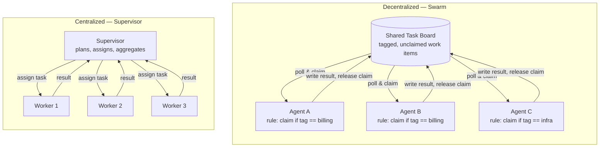

## Swarm Intelligence

> Chapter of [[building-agentic-systems/readme#01 — Multi-Agent Systems|Multi-Agent Systems]], part
> of [[building-agentic-systems/readme|Building & Evaluating Agents]].

## What you will understand at the end

- Why ant colonies and bird flocks are the canonical reference points for swarm intelligence, and
  what "simple local rule → emergent global behavior" actually means mechanically
- How that framing translates to LLM agents: many cheap, narrow agents each running a local
  claim-heuristic instead of a scheduler that assigns work
- The concrete workload shape where a swarm beats a supervisor, and the concrete shape where it
  loses outright — this is a design decision, not an aesthetic preference
- Why the honest answer to "should I build a swarm?" is almost always "no" in enterprise contexts
  today, and what has to be true before that answer flips

---

## The mental model

A **swarm** has no component whose job is to look at the whole system and decide who does what next.
Every agent runs the same (or a similarly simple) local rule, looking only at its own neighborhood —
a shared task board, a pheromone-strength gradient, the position of nearby flock-mates — and the
coherent-looking global behavior is a side effect of many local decisions, not a plan anyone
computed.

Contrast that with every other pattern in this Part. **Supervisor architectures**
([[09-supervisor-architectures|Chapter 9]]) put a component in the loop that sees the whole task and
decides. A swarm deliberately has no such component:



Two things to notice about the swarm side that are easy to miss:

1. **No agent talks to another agent.** Coordination happens entirely through the shared environment
   (the task board) — this indirect, environment-mediated coordination has a name: **stigmergy**,
   borrowed directly from the ant-colony literature. The
   [[06-blackboard-pattern| Blackboard Pattern]] (Part 00 of AI Architecture & System Design) is the
   same idea formalized as a reusable architecture.
2. **The claim step is the entire "intelligence."** There is no negotiation, no voting, no planning
   — just a predicate ("is this tagged `billing` and unclaimed?") evaluated locally, repeatedly, by
   every agent, against shared state.

---

## 1. The classical framing, and why it matters here

Swarm intelligence is not an AI-agent invention — it is a 1980s–1990s biology-and-optimization
research thread that agentic AI is borrowing wholesale.

**Ant colony optimization.** A forager ant does not know the shortest path to a food source. It
follows a simple rule: prefer trails with a stronger pheromone concentration, and lay down pheromone
as you walk, decaying over time. Shorter paths get walked (and thus reinforced) more often per unit
time than longer ones, so pheromone concentration on the short path grows faster and recruits more
ants — a global optimization (shortest path) emerges from local, myopic, pheromone-following
behavior with zero ant ever seeing the whole graph.

**Boids (bird flocking).** Craig Reynolds' 1987 model produces convincing flocking behavior from
exactly three local rules, each agent evaluating only its nearest neighbors:

| Rule       | Local behavior                                        |
| ---------- | ----------------------------------------------------- |
| Separation | Steer away from neighbors that are too close          |
| Alignment  | Steer toward the average heading of nearby neighbors  |
| Cohesion   | Steer toward the average position of nearby neighbors |

No boid has a notion of "the flock." There is no leader, no flight plan, no central velocity vector
being computed and broadcast. The flock shape is an emergent statistical property of thousands of
independent three-rule evaluations running in parallel.

**The property that makes both examples work — and that you must reproduce for a swarm to work — is
that the local rule is a genuinely sufficient proxy for the global goal.** Pheromone-following
approximates shortest-path-seeking well enough, cheaply enough, at colony scale. Separation +
alignment + cohesion approximates "don't collide, move together" well enough for a flock. If the
local rule is a poor proxy for what you actually want globally, you don't get emergent intelligence
— you get emergent nonsense at scale, faster and cheaper than before.

---

## 2. Translating swarm intelligence to LLM agents

The agentic-AI analogue of "follow the pheromone trail" is a **local claim heuristic** running
inside many narrow, cheap agent instances, instead of a scheduler assigning work:

```txt
# Centralized (supervisor) scheduling
supervisor.plan(all_tasks) → assignment_map → dispatch(assignment_map)

# Swarm-style local rule (this is the entire "brain" of each worker)
loop:
    task = task_board.peek_next_unclaimed()
    if task.tags ∩ my_tags ≠ ∅ and task_board.try_claim(task, lease=90s):
        result = process(task)
        task_board.complete(task, result)
    else:
        sleep(poll_interval)
```

Every worker runs the identical loop. There is no code path anywhere that looks at the full task
list and decides who gets what — `try_claim` is an atomic compare-and-swap against shared state (a
row lock, a Redis `SETNX`, an optimistic-concurrency write), which is the only piece of real
engineering this pattern needs, and it is a **distributed coordination primitive**, not an agentic
one — see [[08-distributed-coordination|Chapter 8]] for the lease-expiry, partial-failure, and
double-claim failure modes that primitive has to handle correctly.

**Why bother, if the coordination machinery is the same as any work-queue system?** Because the
_decision_ logic that used to live in a planner — "which agent should handle this?" — is now folded
into each agent's own claim predicate, evaluated in parallel by every instance against shared state,
with no serialization point. At small N this buys you nothing over a queue with a dispatcher. At
large N (thousands of narrow tasks, hundreds of workers) the dispatcher becomes the bottleneck and
the swarm's lack of one becomes the entire value proposition.

If this sounds familiar from infrastructure work: it is structurally the same shape as a
**Kubernetes controller** reconciling against `etcd` — no controller is told "handle pod X"; every
controller watches shared state and reconciles whatever matches its own selector, independently,
continuously. Swarm-style agent coordination is that pattern applied to LLM task claiming instead of
infrastructure reconciliation.

---

## 3. Where this actually beats centralized orchestration

The workload shape has to satisfy all three of these, not just one:

| Requirement                 | Why it matters                                                                                                                                               |
| --------------------------- | ------------------------------------------------------------------------------------------------------------------------------------------------------------ |
| **Embarrassingly parallel** | Each unit of work is independent — task _i_'s outcome never depends on task _j_'s outcome                                                                    |
| **Loosely coupled**         | No task needs another task's result as input mid-flight                                                                                                      |
| **Large N, uniform tasks**  | Enough tasks that a central planner's per-item dispatch cost becomes the bottleneck, and the tasks are similar enough that one simple claim rule covers them |

Concrete fits: bulk classification or tagging over a large document/log corpus, first-pass triage
across a large batch of independent tickets or alerts, large-scale synthetic-check style probing
where each probe is self-contained, distributed simulation/search (e.g., particle-swarm
hyperparameter search), or crawling/indexing where each page is an independent unit of work.

The economic argument, stated plainly for a Staff-level review: a supervisor's assignment step is
O(N) LLM calls (or at least O(N) planning tokens) before any work starts. A swarm's claim step is
O(1) per worker per poll, and total throughput scales with worker count, not with a single planner's
serial dispatch rate. That is the entire case for swarms — it is a throughput argument, not an
intelligence argument.

---

## 4. Where it clearly doesn't — and reintroduces the problem it tried to avoid

Two failure shapes, and they are different failures:

**Global consistency requirements.** If the answer must be _one coherent thing_ — a single incident
RCA narrative, a single architectural recommendation, a single merged PR — a swarm cannot produce
that on its own. Independent agents will produce independent, sometimes contradictory partial
results, and reconciling them requires exactly the component a swarm was designed to avoid:
something that looks at all the outputs together and decides. You end up bolting a supervisor onto
the back of your swarm anyway — at which point you have a **scatter-gather/orchestrator-worker
hybrid** ([[04-orchestrator-worker-pattern|Part 00 of AI Architecture & System Design]]), not a pure
swarm, and you should just call it that.

**Anything with cross-task dependency or shared, scarce state.** The moment task B needs task A's
output, or two agents might legitimately want to claim overlapping work (the same customer's
tickets, the same file, the same budget), you need real coordination — leases, locks, ordering
guarantees, conflict resolution. [[06-consensus-mechanisms|Consensus Mechanisms]] (Chapter 6) exists
precisely because "just let them all claim independently" breaks down the instant claims can
legitimately conflict. At that point the coordination overhead you pay is not smaller than a
supervisor's — it is arguably worse, because it is now distributed, harder to observe, and harder to
reason about failure modes for, than a single planner making one decision per task.

The tell, as an architect reviewing a proposed swarm design: if you find yourself adding a
reconciliation step, a "master claim log," or a conflict-resolution policy, you have re-derived
centralized orchestration with extra latency and a less legible failure surface. Don't fight it —
just draw the supervisor box explicitly and stop pretending it isn't there.

---

## 5. Swarm vs. centralized orchestration — the comparison

| Axis                          | Swarm (decentralized)                                                         | Centralized (supervisor/planner)                                                 |
| ----------------------------- | ----------------------------------------------------------------------------- | -------------------------------------------------------------------------------- |
| Coordination overhead         | Amortized across workers; near-zero serialization at the top                  | Concentrated in the planner; scales with task count                              |
| Scalability ceiling           | Very high — bounded by shared-state contention, not planner throughput        | Bounded by planner's serial dispatch/aggregation rate                            |
| Global consistency            | Not guaranteed — needs a reconciliation step if required                      | Native — the supervisor is the single source of truth                            |
| Failure isolation             | Strong per-task; a stuck worker only stalls its own claimed tasks             | Depends on planner design; planner failure can stall everything                  |
| Debuggability / observability | Hard — no single trace shows "the decision"; must reconstruct from claim logs | Straightforward — one trace through the planner shows the whole decision         |
| Best-fit workload             | Large N, embarrassingly parallel, independent tasks                           | Small-to-medium N, tasks with dependencies or requiring a single coherent output |
| Production maturity (2026)    | Rare outside research/extreme-scale batch systems                             | Dominant — this is what "multi-agent system" means in practice today             |

The observability row deserves a callout for this audience specifically: a swarm's emergent behavior
is, by construction, not traceable through any single execution path. If you instrument it the way
you'd instrument a supervisor (one trace per task, parent-child spans down through the planner), you
will get a forest of disconnected traces and no view of "why did the system end up doing this." You
have to instrument the _shared state_ — claim events, lease expiries, contention rate on the task
board — as the primary signal, not agent-to-agent spans that don't exist.

---

## 6. Worked reasoning: designing a swarm-style triage system

Say you have 50,000 unclassified error events from a log pipeline and need first-pass classification
(service, likely cause category, severity) before anything else happens with them.

**Why not a supervisor here?** A planner reading all 50,000 events to build an assignment map either
has to fit them in context (it won't) or paginate through them serially, which makes the planner the
bottleneck at exactly the point where you have the most parallelism available to exploit. This is
the textbook large-N, independent-task shape from Section 3.

**Swarm design:**

1. Push all 50,000 events onto a shared task board as individual claimable items, tagged by service
   name (already known from the log's structured fields).
2. Spin up N worker agents, each configured with a narrow system prompt for one or two services they
   specialize in — a `checkout-service` worker, a `payments-service` worker, a general-purpose
   fallback worker with no tag filter.
3. Each worker's local rule: poll the board, claim the next item matching its tag (or any unclaimed
   item, for the fallback worker) with a 90-second lease, classify it, write the result, release the
   claim.
4. Lease expiry (worker crashed or hung mid-classification) returns the item to unclaimed — no
   central health check is required; the _next poll from any worker_ self-heals it.
5. A lightweight aggregator — not a planner, just a reader — runs after the board drains and rolls
   the 50,000 individual results into one report.

**Where the real engineering effort goes:** almost none of it is agentic. It's the claim primitive's
atomicity (compare-and-swap, not read-then-write), the lease timeout tuned against worst-case
classification latency, and the aggregator's tolerance for a small number of permanently-failed
items (dead-lettered after N lease expiries, not retried forever). The LLM prompt for each worker is
the easy part — a few sentences of scope. This ratio — mostly distributed-systems engineering, a
little agent prompting — is typical of swarm designs and is exactly why Section 4's warning matters:
the moment step 5's aggregator needs to _resolve disagreement_ between workers rather than just
concatenate results, you've silently grown a supervisor.

---

## 7. What's actually deployed today

Be honest with yourself in a design review: **most production multi-agent systems shipping in 2026
are centrally orchestrated** — a supervisor or planner explicitly assigns work to specialist agents
and aggregates their output ([[09-supervisor-architectures|Chapter 9]]), or a router dispatches to
one of several handlers
([[ai-architecture-and-system-design/00-ai-architecture-patterns/05-router-pattern/05-router-pattern|Router Pattern]],
Part 00 of AI Architecture & System Design). Swarm-style, no-central-assigner coordination shows up
in two places: academic/research multi-agent systems (where studying emergent behavior is the
point), and extreme-scale batch workloads where the economics in Section 3 actually bite — genuinely
large N, genuinely parallel, genuinely loosely-coupled.

For a typical enterprise agent deployment — a handful to a few dozen specialist agents behind a
supervisor, doing investigation, drafting, or approval-gated action — a swarm buys you nothing and
costs you observability and consistency guarantees you'll want on day one. This pattern is worth
knowing cold for an L6/L7 interview and for recognizing when someone else's "multi-agent swarm"
pitch is actually just a supervisor with extra marketing. It is not, today, the default choice you
should reach for.

### GitHub Copilot in practice

GitHub Copilot's current multi-agent surface — the Copilot coding agent you assign to a GitHub
issue, and custom agents/chat modes configured per-repository or per-organization — is a
**centralized, explicitly-invoked model**, not a swarm. You (or a maintainer) assign a specific
issue to Copilot, or select a named custom agent with its own instructions and tool scope, and that
single, explicitly-configured agent goes to work on that single, explicitly-chosen task, opening a
draft PR and iterating against CI/review feedback. The assignment step — deciding which agent
handles which issue — is a human (or a human-configured automation rule) doing what a scheduler does
in Section 2's terms: nothing in that flow is agents polling a shared issue board and self-claiming
by label match with no assigner in the loop.

A swarm-style version of the same product would look like this instead: every open issue is a
claimable item tagged by label (`bug`, `good-first-issue`, `area:auth`), and a fleet of
identically-capable Copilot agent instances poll the repository's issue tracker, each claiming any
unclaimed issue whose labels match its own configured scope, with no per-issue human or scheduler
decision anywhere in the loop. That is a coherent design on paper — it maps directly onto Section
2's claim-heuristic pattern with GitHub's issue tracker as the task board — but it is not how the
product ships today, and the reasons line up with Section 4 almost exactly: **accountability** (who
is responsible for a PR needs to be a legible answer, not "whichever instance happened to win the
race"), **duplicate-claim risk** (two agent instances racing to claim the same issue and opening
competing PRs is a worse failure mode for a human reviewer to untangle than a missed assignment),
and **cost/governance control** (an org wants an explicit gate on how many agents are running
against its repos and against which issues, not organic self-assignment at whatever rate the swarm
finds work). Treat the swarm-Copilot description above as an illustrative extrapolation of the
pattern, not a documented GitHub roadmap item — the point is the architectural contrast with what's
actually shipped, not a prediction.

---

## Concept check

Before moving to the next chapter, you should be able to answer these without notes:

| Question                                                                           | Answer hint                                                                                                                                            |
| ---------------------------------------------------------------------------------- | ------------------------------------------------------------------------------------------------------------------------------------------------------ |
| What does "stigmergy" mean, and what's the agentic-AI equivalent?                  | Coordination through shared environment state, not direct messaging — a shared task board an agent claims from is stigmergic coordination.             |
| What three conditions does a workload need before a swarm beats a supervisor?      | Embarrassingly parallel, loosely coupled, large N of uniform tasks — all three, not just one.                                                          |
| Why does a swarm need a reconciliation step the moment global consistency matters? | Independent agents can produce contradictory partial results; something has to look at all of them and decide — which is a supervisor by another name. |
| Why is a swarm harder to observe than a supervisor?                                | There's no single trace through "the decision" — you have to instrument shared-state claim/contention events instead of agent-to-agent spans.          |
| Is GitHub Copilot's coding agent a swarm today?                                    | No — issues are explicitly assigned to an explicitly-configured agent; there's no self-claiming by label match with no assigner.                       |

---

## Vocabulary glossary

| Term                       | Definition                                                                                                                                  |
| -------------------------- | ------------------------------------------------------------------------------------------------------------------------------------------- |
| Swarm intelligence         | Global behavior that emerges from many agents independently following simple local rules, with no central planner                           |
| Stigmergy                  | Indirect coordination through shared environment state (a pheromone trail, a task board) rather than direct agent-to-agent messages         |
| Boids                      | Reynolds' 1987 flocking model: separation + alignment + cohesion, each evaluated against nearest neighbors only                             |
| Local claim heuristic      | The predicate a swarm worker evaluates against shared state to decide whether to take a task — the entire "decision logic" of a swarm agent |
| Lease                      | A time-bounded claim on a shared task; expiry returns the task to unclaimed so a crashed worker self-heals without a health check           |
| Compare-and-swap (CAS)     | The atomic primitive (`try_claim`) that prevents two workers from claiming the same task simultaneously                                     |
| Embarrassingly parallel    | A workload where units of work have no dependency on each other's outcome                                                                   |
| Orchestrator-worker hybrid | A swarm with a reconciliation/aggregation step bolted on — the honest name for a "swarm" that needs a coherent final answer                 |

## Metadata

|        |                          |
| ------ | ------------------------ |
| Author | Amit Singh               |
| Scope  | building-agentic-systems |
