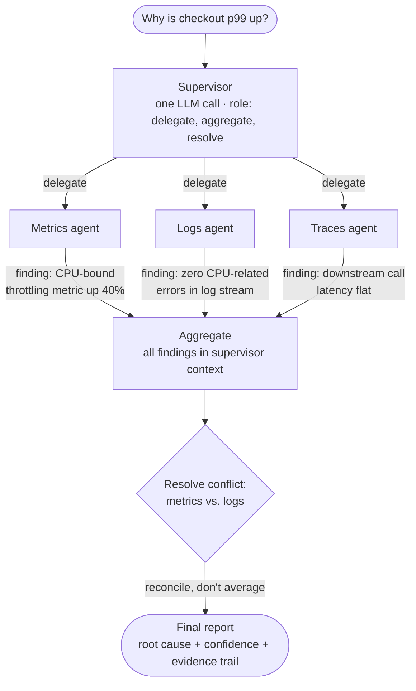

## Supervisor Architectures

> Chapter of [[building-agentic-systems/readme#01 — Multi-Agent Systems|Multi-Agent Systems]], part
> of [[building-agentic-systems/readme|Building & Evaluating Agents]].

## What you will understand at the end

- The supervisor's three jobs, stated precisely enough to test against: **delegate** subtasks to the
  right specialist, **aggregate** their independent results into one coherent view, and **resolve
  conflicting conclusions** when two specialists disagree
- Why a supervisor is not a special component type — it is another LLM call with a specific system
  prompt and role, which means it inherits every LLM failure mode, including hallucinating a
  synthesis that quietly discards the finding that didn't fit a clean narrative
- A worked reconciliation of the exact kind of conflict this chapter is named for: a metrics
  specialist concluding "CPU-bound" against a logs specialist concluding "no CPU-related errors" —
  and why the correct move is neither to average them nor to pick the more confident-sounding one
- When the supervisor pattern breaks down — too many specialists for one arbitration call to
  meaningfully judge, and the supervisor itself becoming a bottleneck and a single point of failure
- That this chapter is the multi-agent-systems worked instance of a pattern
  [[03-supervisor-pattern|Supervisor Pattern]] (Part 00 of AI Architecture & System Design)
  formalizes as a reusable, cross-cutting architecture — read that chapter for the general
  applicability criteria; read this one for how the pattern actually behaves on a concrete incident

---

## The mental model

[[02-collaboration-models|Collaboration Models]], the previous chapter, split one overloaded
investigator into a metrics agent, a logs agent, and a traces agent — and ended by naming the bill
for that split: something now has to run all three, wait on all three, and turn three independent
reports into one. That something is the supervisor. It is not a fourth specialist with its own
domain — it has no PromQL, LogQL, or TraceQL vocabulary of its own. Its domain is the other three
agents' outputs.



Three things to read off this diagram before the rest of the chapter unpacks them:

1. **Delegation fans out; aggregation fans in.** The supervisor doesn't do the specialists' work —
   it dispatches the same incident window to all three and waits. This is the fan-out/fan-in
   coordination cost [[02-collaboration-models|Collaboration Models]] already introduced; this
   chapter is about what happens at the "fan-in" arrow specifically.
2. **The conflict is drawn on purpose.** Two specialists reporting compatible findings needs no
   supervisor beyond concatenation. The pattern earns its keep exactly when specialists disagree,
   which is the normal case in a real incident, not the exception.
3. **"Resolve" is a distinct box from "aggregate."** Collecting three reports into one context
   window is mechanical. Deciding what to do when two of them point in different directions is a
   judgment call — and judgment calls are where this pattern can quietly go wrong.

---

## 1. The supervisor's three jobs

Strip away the framing and a supervisor agent does exactly three things. Naming them precisely
matters, because each one fails differently and gets debugged differently.

| Job                                 | What it means                                                                                                                                                           | What it is not                                                                                                                                                                                            |
| ----------------------------------- | ----------------------------------------------------------------------------------------------------------------------------------------------------------------------- | --------------------------------------------------------------------------------------------------------------------------------------------------------------------------------------------------------- |
| **Delegate**                        | Decide which specialist(s) get which subtask, and pass each one enough shared context (incident window, service, environment) that their investigations stay comparable | Not routing — a router picks _one_ handler per request; a supervisor typically dispatches to _several_ specialists on the _same_ task because the investigation needs more than one signal to corroborate |
| **Aggregate**                       | Pull every specialist's output into one place — the supervisor's own context window — without dropping or truncating any of them before synthesis                       | Not just concatenation — aggregation has to normalize format (a metrics agent's PromQL result and a logs agent's log excerpt are structurally different) so the next step can reason over them uniformly  |
| **Resolve conflicting conclusions** | Recognize when two specialists' findings are in tension, decide what that tension means, and produce one coherent answer that doesn't silently discard either finding   | Not majority vote, not "trust whichever specialist sounds more confident" — both are shortcuts that produce a wrong answer with high confidence, which is worse than an honest "unresolved"               |

Delegation and aggregation are largely mechanical — plumbing you can get right with careful prompt
and schema design and verify with a unit test. Conflict resolution is the job that makes a
supervisor an _agent_ rather than a fan-out utility: it requires the same
reasoning-under-uncertainty the specialists themselves do, just one level up, over their outputs
instead of over raw telemetry.

**Why delegation here is a harder problem than the Router pattern's.**
[[ai-architecture-and-system-design/00-ai-architecture-patterns/05-router-pattern/05-router-pattern|Router Pattern]]
(Part 00 of AI Architecture & System Design) classifies an incoming request and sends it to exactly
one handler — the routing decision is mutually exclusive by construction, and once it's made, the
router's job is done. A supervisor's delegation decision is not mutually exclusive: "why is checkout
p99 up" goes to the metrics agent _and_ the logs agent _and_ the traces agent, because none of the
three signals alone is trustworthy enough to close the investigation. That's what pulls "aggregate"
and "resolve" into the supervisor's job description in the first place — a router never needs
either, because it never has more than one response to reconcile.

---

## 2. The supervisor is just another LLM call — and it fails the same way

It is worth saying plainly, because the word "supervisor" invites the opposite assumption: there is
no special orchestration primitive here. A supervisor is one more call to the same model API the
specialists use, with a system prompt shaped for coordination instead of domain investigation:

```txt
You are the supervisor for a checkout-latency investigation. You will receive independent
findings from a metrics agent, a logs agent, and a traces agent, all investigating the same
incident window. Your job:

1. Summarize each specialist's finding without altering its substance.
2. Identify any findings that are in tension with each other.
3. For each tension, either reconcile it with a stated reason, or explicitly mark it
   unresolved — do not silently prefer one finding over another without justification.
4. Produce a final root-cause statement with a confidence level and the evidence it rests on.

You must list all three specialists' findings in your output, even the ones that don't
support your final conclusion.
```

Because this is an LLM call like any other, it inherits the failure modes covered across Part 01 of
AI & LLM Foundations — most dangerously here, the ones that look like competence. Given the
metrics-vs-logs conflict from the diagram above, a supervisor with a loose prompt (no explicit
instruction to enumerate every finding, no "do not silently prefer" constraint) will often produce
something like:

> "Root cause: CPU throttling on checkout pods is causing the p99 regression."

That sentence is not false — it may even be the correct conclusion. What it is missing is worse than
being wrong: it never mentions that the logs agent found no corroborating errors, so a reader has no
way to know a second specialist's evidence was considered and reasoned about, versus simply dropped
because it complicated the narrative. This is a **hallucinated synthesis** — not a fabricated fact,
but a fabricated _sense of resolution_ over evidence that was never actually reconciled. It is the
aggregation-layer equivalent of the wrong-tool-selection failure mode
[[02-collaboration-models|Collaboration Models]] named at the tool layer: the failure doesn't throw
an error, it just quietly produces a worse answer that reads as confident.

**The mitigation is the same lever the rest of this book keeps reaching for: structure, not
politeness.** A free-text "please consider all findings" instruction is a request the model can
still violate under a long context or a messy conflict. A required output schema with a non-optional
`specialist_findings: list` field and a non-optional `conflicts: list` field (even if that list is
sometimes empty) makes omission structurally awkward instead of merely discouraged — the same
"cannot versus told not to" argument [[03-structured-outputs|Structured Outputs]] (Part 01 of AI &
LLM Foundations) and [[12-tool-security|Tool Security]] (Part 04 of Agentic AI Engineering) make in
their own contexts, applied here to the synthesis step instead of the tool-call step.

---

## 3. Worked example — reconciling "CPU-bound" against "no CPU errors"

This is the conflict the diagram set up, worked through properly. Two specialists, same incident
window, same checkout service:

| Specialist    | Finding                 | Evidence                                                                                                                                                |
| ------------- | ----------------------- | ------------------------------------------------------------------------------------------------------------------------------------------------------- |
| Metrics agent | "CPU-bound"             | `container_cpu_cfs_throttled_periods_total` elevated ~40% above baseline on checkout pods for the duration of the p99 spike; correlates tightly in time |
| Logs agent    | "No CPU-related errors" | Zero `OOMKilled` events, zero throttling warnings, zero CPU-related ERROR-level log lines in the same window; structured log volume flat                |

A supervisor that treats these as a straight contradiction and has to "pick a winner" is already
reasoning about the problem wrong. The correct move is domain knowledge the supervisor's prompt
needs to actually carry: **CPU throttling enforced via a cgroup CFS quota is a kernel-scheduler
decision, invisible to the application process.** A throttled container does not raise an exception,
does not log a warning, and does not know it was throttled — it just runs slower. "No CPU-related
errors in the logs" is not evidence _against_ CPU throttling; it is exactly what CPU throttling
looks like from inside the application, because the mechanism operates below the layer the
application can observe or log about.

Read that way, the two findings are not in conflict — they are two different vantage points on the
same event, and one of them (logs) was never capable of falsifying the other (metrics) in the first
place. A supervisor's reconciliation, stated well, looks like this:

> "Metrics: CPU throttling elevated 40% above baseline, correlated with the p99 window. Logs: no
> CPU-related errors — expected, since cgroup-level throttling is enforced by the kernel scheduler
> and does not surface in application logs; this is not disconfirming evidence. Traces: downstream
> call latency flat, ruling out a dependency as the cause. **Conclusion: CPU-bound, high
> confidence**, corroborated by the absence of a downstream explanation in traces."

Three things made that reconciliation possible, and a supervisor system prompt should be built to
force all three rather than hope for them:

1. **Domain knowledge about what each specialist's silence means**, not just what its findings mean.
   A logs agent finding nothing is only informative once you know whether the thing you're looking
   for would have logged in the first place.
2. **A third signal used as a tie-break, not just two specialists left to argue.** The traces
   agent's flat downstream latency is what actually raises confidence here — it rules out the
   competing hypothesis (a dependency timeout) rather than just re-stating the metrics/logs tension.
3. **An explicit confidence level and evidence trail in the output**, so a human reading the final
   report can audit _why_ the supervisor reconciled the way it did, instead of trusting a bare
   assertion. This is the same audit requirement [[07-ai-logging|AI Logging]] (Part 01 of Production
   Agent Systems) argues for at the specialist layer, applied one level up.

Not every conflict resolves this cleanly. Sometimes two specialists really do disagree because one
of them is wrong, or because the incident genuinely has two contributing causes. When the supervisor
can't reconcile with the evidence in hand, the honest output is an explicit **unresolved** conflict
flag and a recommendation for what additional evidence would settle it — not a forced single answer.
A confident wrong synthesis is a worse operational outcome than an honest "here are two findings in
tension, here's what would disambiguate them."

---

## 4. Supervisor vs. peer-to-peer and swarm coordination

The supervisor pattern is one point on a spectrum of multi-agent coordination topologies, not the
only way to reconcile several agents' outputs. The alternative worth contrasting against directly is
**peer-to-peer / swarm coordination** — [[07-swarm-intelligence|Swarm Intelligence]] (this Part)
covers it in depth; here's the shape of the tradeoff against what this chapter has been building.

| Axis                | Supervisor (hub-and-spoke)                                                                                  | Peer-to-peer / swarm                                                                                                             |
| ------------------- | ----------------------------------------------------------------------------------------------------------- | -------------------------------------------------------------------------------------------------------------------------------- |
| Topology            | One central coordinator; specialists only talk to the supervisor, never to each other                       | Agents communicate directly with each other; no central node holds the final view                                                |
| Delegation          | Explicit — the supervisor decides who investigates what                                                     | Emergent — agents pick up or bid on work via shared signals, not a central assignment                                            |
| Conflict resolution | Centralized — one component owns synthesis and is accountable for it                                        | Distributed — consensus, voting, or negotiation among the agents themselves                                                      |
| Failure mode        | Supervisor down or wrong ⇒ the whole investigation stalls or is wrong, even if every specialist was correct | No single point of failure, but no single point of accountability either — harder to say _why_ the system converged where it did |
| Observability       | High — one final report, one reasoning trace to audit                                                       | Low — the useful behavior is an emergent property of many local interactions, harder to trace back to a decision                 |
| Latency shape       | Bounded: slowest specialist + one synthesis call                                                            | Can be faster in the best case (no central bottleneck), harder to bound in the worst case (no clear termination signal)          |
| Scales best to      | A small, known set of specialists with clearly distinct domains — 3 to roughly 7                            | Larger agent populations, or problems where the "right" decomposition into roles isn't known upfront                             |
| Fits                | Structured investigations with defined roles: incident RCA, PR review, compliance checks                    | Open-ended search, exploration, or optimization problems without a natural coordinator role                                      |

The honest framing, consistent with how this book has treated every pattern so far: supervisor
architectures trade decentralization and blast-radius isolation for auditability and a single
accountable synthesis step. That trade is right when you can actually name the roles in advance —
metrics, logs, traces — and wrong when the set of relevant "specialists" or the right decomposition
of the problem isn't knowable until agents start exploring it, which is the swarm chapter's
territory instead.

---

## 5. Where supervisor architectures break down

Two failure conditions show up often enough in practice to name explicitly, and both are structural
— you don't fix either by writing a better supervisor prompt.

### 5a. Too many specialists for one arbitration call

The supervisor's system prompt has to carry enough domain knowledge about _every_ specialist's
domain to judge conflicts between them — the CPU-throttling-doesn't-log reasoning in Section 3 is
domain knowledge the supervisor needed, not just the specialists. That's a bounded ask across three
domains. It stops being bounded past roughly five to seven specialists: the same instruction-budget
dilution [[02-collaboration-models|Collaboration Models]] diagnosed for a single agent trying to
hold PromQL, LogQL, and TraceQL fluency at once recurs here, one level up — a supervisor prompt
trying to arbitrate across security, performance, cost, compliance, and UX specialists
simultaneously degrades the same way the original monolithic investigator did, just at the synthesis
layer instead of the tool-selection layer.

The fix is structural, not rhetorical, same as it was in Chapter 2: don't ask one supervisor to
arbitrate everything. Either narrow the specialist count per investigation (a pre-filter step
decides which specialists are even relevant before fan-out, so the supervisor never sees more than
it can meaningfully reason about), or introduce a second tier — a **supervisor of supervisors**,
where each sub-supervisor owns arbitration within a related cluster of specialists (e.g. one
supervisor for the observability trio, a separate one for security/compliance findings) and a
top-level supervisor only reconciles across clusters, not across every individual specialist. This
hierarchical shape is exactly what [[04-orchestrator-worker-pattern|Orchestrator–Worker Pattern]]
(Part 00 of AI Architecture & System Design) generalizes for the pure fan-out case;
[[03-supervisor-pattern|Supervisor Pattern]] (Part 00 of AI Architecture & System Design) covers
where the line is between adding a second tier of supervisors and switching to that pattern
outright.

### 5b. The supervisor as bottleneck and single point of failure

Every specialist's output has to pass through one component before anything downstream can act on
it. That has three concrete costs, stated in the vocabulary this book's audience already uses for
distributed systems, because that's exactly what this is:

| Cost                  | What it looks like                                                                                                                                                                                                                                                                  |
| --------------------- | ----------------------------------------------------------------------------------------------------------------------------------------------------------------------------------------------------------------------------------------------------------------------------------- |
| **Latency SPOF**      | Total investigation time is never less than delegate-fan-out + slowest specialist + supervisor synthesis. The supervisor call itself — often the largest single call, since it holds every specialist's output in context — sits on the critical path of every single investigation |
| **Availability SPOF** | If the supervisor call fails, times out, or is rate-limited, the system produces nothing usable — even though three specialists may have already returned solid, individually correct findings                                                                                      |
| **Correctness SPOF**  | A supervisor that reconciles wrong (Section 2's hallucinated-synthesis failure) makes the _whole system_ wrong, even when every specialist underneath it was right. Specialist errors are isolated to one domain; supervisor errors are not isolated to anything                    |

None of these are solved by "make the supervisor prompt better," because they're topology problems,
not prompt problems — this is the same distinction Section 5a's fix relies on. Concrete mitigations
worth reaching for, roughly in order of how much they cost to build:

- **Treat supervisor latency and error rate as their own SLO**, separate from the specialists' — the
  pattern [[08-ai-slos|AI SLOs]] (Part 01 of Production Agent Systems) describes applied
  specifically to the one component every investigation now depends on, with its own error budget
  and its own alert.
- **A circuit breaker that bypasses synthesis under degradation.** When the supervisor is
  unavailable or its confidence is low, surface the raw specialist findings unsynthesized rather
  than blocking on a component that isn't healthy — a degraded report beats no report.
- **Redundant supervisor calls with disagreement detection**, not full majority vote (that
  multiplies cost roughly N-fold for marginal gain) — run a second, cheaper synthesis pass only when
  the first one reports an unresolved conflict, escalating cost only when the arbitration was
  actually hard.

The deeper point, worth carrying into Part 03 of Production Agent Systems's more general treatment:
a supervisor buys you centralized accountability and a single auditable reasoning trace, and it buys
that by construction at the cost of centralizing risk. That's the same tradeoff every hub-and-spoke
system makes over a mesh — this pattern is a distributed-systems tradeoff wearing an agentic-AI
costume, same as [[03-communication-protocols|Communication Protocols]] (this Part) already made
that argument for shared-memory versus message-passing coordination.

---

### GitHub Copilot in practice

The clearest documented instance of this chapter's pattern in GitHub's own product surface is not
one named "supervisor" feature — it's a composition of several independently-documented pieces that,
wired together, do exactly the delegate/aggregate/resolve job this chapter describes.

**The independently-real building blocks:**

- **GitHub Copilot code review** can be requested on a PR (or configured to run automatically) and
  leaves its own inline review comments and a summary — a specialist producing an independent
  finding, in this chapter's vocabulary.
- **CodeQL with Copilot Autofix** runs as a separate security-scanning check and posts its own
  alerts on a PR, each with a suggested fix — a second, differently-scoped specialist, run
  independently of the code-review pass.
- **The GitHub Copilot coding agent**, when assigned an issue, works autonomously and opens its own
  draft PR — itself reviewable and subject to the same code-review and CodeQL passes as any other
  PR, which means a single PR can accumulate findings from several independent Copilot-adjacent
  passes without any of them having coordinated with each other.
- **Custom chat modes and custom instructions** (covered in
  [[02-collaboration-models|Collaboration Models]]'s own GitHub Copilot section) let a repo define a
  narrowly-scoped agent — for instance, one with read access to the PR's review comments, CodeQL
  alerts, and a test-coverage check's output via the Checks API — whose job is exactly the
  supervisor's: pull those independently-produced findings together and post one synthesized summary
  comment.

**Composed, this is the supervisor pattern end to end:** the code-review pass, the CodeQL scan, and
a test-coverage check are the delegated specialists — they already ran independently, with no
awareness of each other. A coordinating agent (built from the custom-chat-mode primitive above, with
access to the PR and Checks APIs) aggregates their outputs and has to do real arbitration when they
disagree — for example, Copilot's code review judging a change "looks fine" while CodeQL flags a
real injection vulnerability in the same diff. The correct synthesis surfaces the higher-severity,
more-authoritative signal rather than averaging sentiment across the two, exactly the discipline
Section 3 worked through for metrics-vs-logs.

**Flagging the generalization:** the individual pieces above — Copilot code review, CodeQL Autofix,
the coding agent, custom chat modes — are each independently documented and stable enough to build
on. What is _not_ a documented, out-of-the-box GitHub feature is a single branded "release
readiness" agent that performs this exact synthesis automatically; that composition is illustrative
of what the supervisor pattern looks like once you assemble it from GitHub's existing building
blocks, not a claim that GitHub ships one component with that name and scope. Verify current API
surface (particularly the Checks API and coding-agent session model, both of which have moved
quickly) against GitHub's own docs before wiring a repo's automation around this shape.

---

## Concept check

Before moving to [[10-agent-meshes|Agent Meshes]], you should be able to answer these without notes:

| Question                                                                                         | Answer hint                                                                                                                                                                                                                             |
| ------------------------------------------------------------------------------------------------ | --------------------------------------------------------------------------------------------------------------------------------------------------------------------------------------------------------------------------------------- |
| What are the supervisor's three jobs, precisely?                                                 | Delegate subtasks to the right specialist, aggregate their results into one view, resolve conflicting conclusions between them                                                                                                          |
| Why is supervisor delegation a harder problem than router dispatch?                              | A router sends one request to exactly one handler and is done. A supervisor typically fans out the same task to several specialists and then has to reconcile all of them — routing never needs that second step                        |
| Why is "the supervisor said CPU-bound" not enough, on its own, to trust the output?              | The supervisor is just another LLM call and can hallucinate a synthesis — confidently stating one conclusion while silently dropping a specialist's contradicting finding, which reads as resolved when it wasn't reasoned about at all |
| In the CPU-bound vs. no-CPU-errors example, why weren't the two findings actually contradictory? | Kernel-enforced CPU throttling (cgroup CFS quota) never surfaces in application logs — the logs agent's silence was never capable of disconfirming the metrics agent's finding in the first place                                       |
| What structurally forces a supervisor not to silently drop a specialist's finding?               | A required output schema with non-optional fields for every specialist's finding and for any conflicts — the same "cannot vs. told not to" argument structured output makes at the tool-call layer, applied to synthesis                |
| When does a supervisor architecture stop scaling?                                                | Roughly past five to seven specialists, when one arbitration call can no longer carry enough domain knowledge to meaningfully judge conflicts between all of them — the fix is a second tier of supervisors, not a longer prompt        |
| What two structural risks does centralizing arbitration in one supervisor introduce?             | A latency/availability bottleneck (every investigation blocks on one component) and a correctness single point of failure (a wrong synthesis makes the whole system wrong even if every specialist was individually correct)            |

---

## Vocabulary glossary

| Term                              | Definition                                                                                                                                                                                    |
| --------------------------------- | --------------------------------------------------------------------------------------------------------------------------------------------------------------------------------------------- | -------------------- |
| Supervisor                        | An agent whose role is coordination — delegating subtasks, aggregating specialist results, and resolving conflicts — rather than domain investigation of its own                              |
| Delegation                        | The supervisor's decision of which specialist(s) receive which subtask, typically fanning out the same task to several specialists rather than routing to exactly one                         |
| Aggregation                       | Collecting every dispatched specialist's output into the supervisor's own context, normalized enough to reason over uniformly                                                                 |
| Conflict resolution               | Deciding what it means when two specialists' findings are in tension, and producing one coherent answer without silently discarding either finding                                            |
| Hallucinated synthesis            | A supervisor output that reads as a resolved, confident conclusion but was never actually reasoned through against all the evidence — a fabricated sense of resolution, not a fabricated fact |
| Single point of failure (SPOF)    | A component whose failure or error makes the whole system's output unusable or wrong, even when every other component behaved correctly — here, the supervisor itself                         |
| Peer-to-peer / swarm coordination | A decentralized alternative topology where agents coordinate directly with each other instead of through a central supervisor; see [[07-swarm-intelligence                                    | Swarm Intelligence]] |
| Supervisor of supervisors         | A hierarchical mitigation for arbitration overload — clustering specialists under sub-supervisors, with a top-level supervisor reconciling only across clusters                               |

## Metadata

|        |                          |
| ------ | ------------------------ |
| Author | Amit Singh               |
| Scope  | building-agentic-systems |
