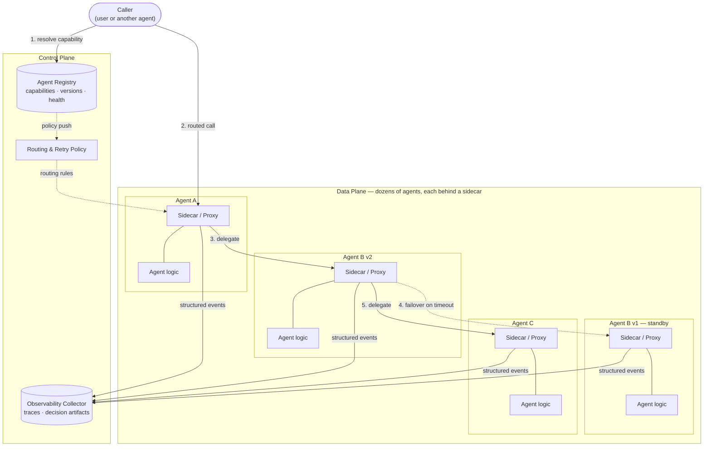

## Agent Meshes

> Chapter of [[building-agentic-systems/readme#01 — Multi-Agent Systems|Multi-Agent Systems]], part
> of [[building-agentic-systems/readme|Building & Evaluating Agents]].

## What you will understand at the end

- Why a service mesh's core split — control plane vs. data plane — is the right lens for
  agent-to-agent discovery and routing once there are more agents in play than one person can track
  in their head
- Registry/discovery at the _agent_ level: what belongs on an agent's capability manifest, and why
  it's the same problem
  [[agentic-ai-engineering/04-tools-and-environment-interaction/10-tool-discovery/10-tool-discovery|Tool Discovery]]
  and
  [[agentic-ai-engineering/04-tools-and-environment-interaction/09-model-context-protocol-mcp/09-model-context-protocol-mcp|MCP]]
  solve one layer down — for tools, not for whole agents
- Routing with retries and failover to an _equivalent_ agent — the mesh's answer to "which agent
  handles this," and why "equivalent" is a weaker guarantee for agents than it is for stateless
  service replicas
- Why observability at mesh scale is a different problem than observability for one agent: it
  requires artifacts suitable for review/audit, documented handoff _decisions_ (not just handoff
  events), and tooling purpose-built for post-hoc reconstruction, because live-watching dozens of
  interacting agents does not scale to a human
- The concrete GH-600 tie-in — "Configure observability for multi-agent behavior by using logs,
  artifacts, and operational signals" — and what that skill actually asks you to produce, not just
  instrument
- When an agent mesh's control-plane overhead is worth paying, versus when a hand-wired supervisor
  is the more honest architecture for the agent count you actually have

---

## The mental model

At three to five agents, a supervisor can hardcode "if the task looks like X, call agent B." The
routing table fits in one person's head, and it fits in one prompt. That stops being true well
before "dozens" — it starts breaking down once agents are owned by different teams, ship on
independent release cadences, or exist in multiple versions running side by side. This is the exact
shape of the problem that pushed backend engineering from a monolith calling internal functions to
microservices calling each other over a network: once you can no longer hardcode "who's out there
and how do I reach them," you need a substrate that answers that question for you.

Service mesh is the infrastructure pattern that emerged from that pressure — Istio, Linkerd, Consul
Connect. Its defining move is separating two concerns that used to live inside every service's own
code: the **data plane** (a sidecar proxy sitting next to each service, actually carrying the
traffic) and the **control plane** (a central brain that tells every sidecar who exists, how to
route to them, and what policy to enforce). Discovery, retries, mTLS identity, and telemetry all
move out of application code and into that shared substrate. An agent mesh applies the identical
move: pull discovery, routing, and observability out of each agent's own prompt and orchestration
code, and into a control plane every agent's runtime talks to.



Two things worth noticing immediately, because they're the two things the rest of this chapter
unpacks. First, the caller never hardcodes an agent's address — it asks the registry to resolve a
_capability_, and the registry decides which live agent instance answers. Second, every sidecar
emits its events to one collector, so "who did what" is captured uniformly, whether the agent behind
that sidecar was written by your team or a completely different one.

---

## 1. The service-mesh analogy, mapped literally

Amit's day job runs this exact pattern for services — Alloy sidecars shipping telemetry, a control
plane deciding scrape/routing policy. The mapping to agents is closer than it first looks:

| Service mesh concept                                   | Agent mesh equivalent                                                    | What it buys you                                                                       |
| ------------------------------------------------------ | ------------------------------------------------------------------------ | -------------------------------------------------------------------------------------- |
| Data plane (per-service sidecar proxy, e.g. Envoy)     | Per-agent proxy/wrapper intercepting inbound and outbound calls          | Cross-cutting concerns (auth, retry, tracing) live outside the agent's own prompt/code |
| Control plane (Istio's `istiod`, Linkerd's controller) | Agent registry + routing policy engine                                   | One place to push routing/policy changes without redeploying every agent               |
| Service discovery / DNS                                | Agent registry / capability manifest catalog                             | Callers resolve "which agent(s) can do X," not a hardcoded endpoint                    |
| mTLS between sidecars                                  | Signed agent identity + capability-scoped tokens per call                | Agent A can prove _which_ agent it is before B accepts a delegated task                |
| Circuit breaker / retry policy                         | Failover to an equivalent agent instance or version                      | A degraded agent doesn't take the whole request down with it                           |
| Access logs + distributed tracing                      | Structured per-agent decision log + trace exporter                       | Post-hoc reconstruction of who did what, and why, across a run                         |
| Ingress gateway                                        | Agent gateway — a single enforcement point for traffic entering the mesh | One place to apply policy to every external caller, not one per agent                  |

This isn't a loose metaphor manufactured for the book. Google's Gemini Enterprise Agent Platform
ships exactly this trio as named, first-class components —
[[gemini-enterprise-agent-platform|Agent Identity, Agent Registry, and Agent Gateway]] — described
in Google's own material as "air traffic control" for A2A and MCP traffic between agents. That's a
real vendor betting the control-plane/data-plane split is the right shape for this problem at
enterprise scale, not a pattern this book is inventing by analogy alone.

---

## 2. Discovery — the agent-level registry

Tool discovery (see
[[agentic-ai-engineering/04-tools-and-environment-interaction/10-tool-discovery/10-tool-discovery|Tool Discovery]]
and
[[agentic-ai-engineering/04-tools-and-environment-interaction/09-model-context-protocol-mcp/09-model-context-protocol-mcp|MCP]])
answers "what functions can be called, with what parameters" — a registry entry there is a function
schema. Agent discovery answers a question one layer up: "which autonomous agent should even receive
this task" — a registry entry there is a **capability manifest**: what skills or task types this
agent claims, what its input/output contract looks like, what version and health state it's in, and
who owns it. An individual agent's own MCP tool catalog can sit _inside_ that manifest as a nested
detail — the mesh registry doesn't need to know Agent B calls seven tools to do its job, only that
Agent B claims the "summarize-incident" capability and is currently healthy.

The real-world shape of this manifest already exists: Google's A2A protocol formalizes an "Agent
Card" — a published JSON description of an agent's skills, auth requirements, and endpoint, so
agents built by different teams or vendors can find and call each other without custom glue code
(see [[gemini-enterprise-agent-platform|Gemini Enterprise Agent Platform]]'s interop section).
Whether you adopt A2A specifically or roll your own registry schema, the shape is the same: a
capability claim, a version, a health signal, and an endpoint.

**Static beats dynamic until it doesn't — the same ceiling as tool discovery.** Most systems start
with a hardcoded map (`intent -> agent`) inside the supervisor's own code, exactly like most agents
start with a hardcoded tool list. That's correct, not lazy, while the agent count is small and one
team owns all of them. The forcing function to build a real registry is the same one that forces
dynamic tool discovery: the map now spans team or org boundaries, agents ship on independent release
cadences, or the number of agents has grown past what a human maintaining an `if/elif` ladder can
keep accurate.

---

## 3. Routing — which agent should handle this

Once a caller has resolved a set of candidate agents from the registry, routing decides which one
actually gets the task — the same intent-classification-plus-fallback problem as the
[[ai-architecture-and-system-design/00-ai-architecture-patterns/05-router-pattern/05-router-pattern|Router Pattern]],
applied at agent granularity instead of tool/handler granularity. What the mesh adds on top is
retries and failover: if the selected agent times out or returns a degraded result, the router tries
an _equivalent_ agent instead of failing the whole request.

**"Equivalent" is a weaker guarantee here than it is for a stateless microservice replica, and that
gap is a real production risk.** Two pods of the same container image are, by construction,
behaviorally identical — that's what makes failover safe by default. Two agents that both claim the
"triage-incident" capability are not automatically identical: one might be running a newer prompt
version, a different underlying model, or a fine-tune with subtly different judgment. Failing over
silently from Agent B v2 to Agent B v1 (the standby in the diagram above) can quietly change the
_quality_ of the answer, not just its latency — a failure mode a stateless load balancer never has
to worry about. The mitigation is to make equivalence an explicit, versioned claim in the registry
(same capability contract, same evaluation score band) rather than an assumption baked into the
routing policy, and to log every failover as a first-class event — Section 4 covers exactly what
that log needs to contain.

```txt
1. Caller asks the registry: "who can do triage-incident?"
2. Registry returns: [Agent B v2 (healthy), Agent B v1 (healthy, standby)]
3. Router selects Agent B v2 — higher eval score, current default version
4. Agent B v2 times out after its configured SLA
5. Router fails over to Agent B v1 — logs the failover + the reason (timeout, not error)
6. Agent B v1 completes; result is returned, tagged with which version actually served it
```

That last tag — _which version actually served the request_ — is not optional bookkeeping. Without
it, a downstream quality regression traced back to "sometimes we get worse triage results" is
unsolvable, because nothing recorded that some fraction of requests silently fell back to the older
agent.

---

## 4. Observability at mesh scale — the exam-relevant core

This is where the mesh analogy earns its keep, and it's the GH-600-relevant center of this chapter:
"configure observability for multi-agent behavior by using logs, artifacts, and operational
signals." That phrasing names three distinct things, not one, and the distinction matters:
**operational signals** tell you _that_ something happened, **logs** tell you what was said around
it, and **artifacts** are the structured, durable records built specifically for review and audit
after the fact. A mesh that only has the first two is observable the way a service with metrics but
no traces is observable — you can tell something is wrong, not what actually happened.

### 4a. Structured traces — artifacts suitable for review and audit

Apply distributed tracing's model directly: one trace ID per end-user request or run, one span per
agent invocation, and nested spans underneath each agent for its own tool calls — the identical
parent/child span model already used for microservice call graphs, extended with the emerging OTel
GenAI semantic conventions (`gen_ai.agent.name`, `gen_ai.operation.name`, and related attributes;
treat the exact attribute set as evolving, and pin to whatever version your collector supports
rather than hardcoding names from memory). Every hop across the mesh — Agent A delegating to Agent
B, B calling its own tools, B delegating to C — becomes one connected trace, walkable end to end
after the run.

A trace answers _that_ Agent A called Agent B at a given timestamp. It does not, by itself, answer
_why_ — and "why" is the part an audit actually asks for.

### 4b. Documented decisions and handoffs — the artifact a trace alone can't give you

A span is an **operational signal**: "Agent A invoked Agent B at t = 12.4s, duration 340ms, status
ok." A **decision record** is a different, purpose-built artifact: which candidate agents the router
considered, the score or confidence assigned to each, which one was selected and why, which
routing-policy version was applied, and — if the router itself reasoned in natural language — the
router's stated rationale at that moment. That last piece is the one most systems lose, because once
an LLM's reasoning has been consumed and the loop has moved on, there is no way to reconstruct it
later unless it was captured as data at the time.

The practical shape: emit a structured JSON event alongside the routing span itself — attached as a
span event or a correlated log line carrying the trace and span ID — rather than trying to re-derive
"why B, not C" from control-flow logs after the fact. That structured record is the artifact
GH-600's phrasing is naming: not "we have logs," but "we have a durable, queryable record of the
decision," which is exactly the difference between a service having access logs and a service having
a reviewable change-approval record.

### 4c. Post-hoc analysis — because live observation doesn't scale to dozens of agents

A live dashboard trying to show every hop across dozens of concurrently-running agents in real time
is not humanly parseable — the same reason a single Grafana panel plotting forty simultaneous
microservice call graphs is useless as a _live_ view, however useful the underlying data is later.
The operational answer the observability world already found for this is the distributed trace
waterfall — Tempo, Jaeger — built specifically for reconstructing one request's full path _after_ it
happened, not for watching it unfold live. Agent meshes need the direct equivalent: a
trace-and-artifact store that lets you pull one run's complete agent graph, walk its handoffs in
order, read each routing decision's stated rationale, and diff the run against the routing-policy
version active at the time. This is the same discipline as an incident postmortem — reconstructing a
timeline from durable evidence because nobody was watching all forty dashboards live when it
happened — applied to a multi-agent run instead of a service outage.

**Retention discipline, briefly, because it's the first question a cost review will ask:** span
volume at dozens of agents times many runs gets expensive fast, and it's tempting to sample it down
the way you'd sample any high-cardinality trace data. Sample the high-volume operational signal —
raw spans — freely. Do not sample the decision-record artifacts. Compliance-grade auditability means
100% retention of the _why_, on a much smaller and cheaper volume than the _what_, because a handoff
decision is written once per routing event, not once per span.

---

## 5. Agent mesh vs. a hand-wired supervisor topology

| Dimension            | Hand-wired supervisor                                                            | Agent mesh                                                                                                           |
| -------------------- | -------------------------------------------------------------------------------- | -------------------------------------------------------------------------------------------------------------------- |
| Agent count it fits  | A handful — single digits                                                        | Dozens and growing, especially cross-team                                                                            |
| Discovery            | Hardcoded in the supervisor's own prompt/code                                    | Registry lookup against published capability manifests                                                               |
| Routing changes      | Requires a code or prompt redeploy                                               | Policy update pushed through the control plane                                                                       |
| Adding a new agent   | Edit the supervisor                                                              | Publish to the registry; existing callers pick it up                                                                 |
| Observability        | Whatever ad hoc logging the supervisor's loop happens to emit                    | Uniform tracing/artifact schema enforced at the sidecar                                                              |
| Failure isolation    | Whatever the supervisor's own error handling does                                | Circuit-breaking/failover policy applied consistently mesh-wide                                                      |
| Operational overhead | Low — one thing to run and reason about                                          | Real — registry, policy engine, and collector are systems someone now owns                                           |
| Where it breaks down | The supervisor's own code becomes a growing `if/elif` ladder as agents are added | Overkill for three agents owned by one team — paying control-plane tax for a coordination problem you don't have yet |

**Worked reasoning — where the break-even actually sits.** A mesh control plane is, at minimum,
three systems someone puts on call for: a registry, a policy engine, and an observability collector.
That's a real, non-trivial fixed cost, comparable to standing up any other piece of shared platform
infrastructure. A hand-wired supervisor's cost is different in shape: it's not fixed, it's marginal
and compounding — every new agent adds one more branch to the routing logic, one more place ad hoc
logging has to be remembered, one more spot where "did we handle the failure case for this one too"
has to be manually re-verified. At three agents, that marginal cost is trivially smaller than the
mesh's fixed cost — building a registry to route three hardcoded names is pure overhead. The lines
cross once either of two things happens: agent count keeps climbing past roughly eight to twelve
_and_ keeps growing, at which point the compounding marginal cost overtakes the mesh's fixed cost;
or, independent of raw count, agents span team or org boundaries and a compliance requirement
demands a uniform audit-artifact shape across every one of them regardless of who owns it — a
requirement a supervisor's ad hoc logging can't satisfy no matter how few agents there are, because
"uniform" is exactly the property centralization buys and hand-wiring can't.

---

## 6. Choosing: when the mesh's overhead is worth it

| Question                                                                                                 | If yes, lean toward...                                         |
| -------------------------------------------------------------------------------------------------------- | -------------------------------------------------------------- |
| Do all agents ship from one codebase, owned by one team?                                                 | Hand-wired supervisor                                          |
| Do agents cross team, org, or vendor boundaries?                                                         | Agent mesh — you need a registry neither side privately owns   |
| Is the agent count small and stable (unlikely to double soon)?                                           | Hand-wired supervisor                                          |
| Does an audit or compliance requirement demand a uniform decision-record shape across every agent?       | Agent mesh — centralization is what makes "uniform" achievable |
| Would adding agent #9 mean adding branch #9 to a growing conditional?                                    | Agent mesh — that's the compounding-cost signal from Section 5 |
| Can you tolerate building and operating a registry + policy engine + collector as real platform systems? | Only then — otherwise the mesh is a liability, not a solution  |

None of these are permanent. The common trajectory is a hand-wired supervisor first, because it's
genuinely the right call at low agent count, followed by a deliberate migration to a mesh once one
of the "lean toward mesh" signals actually fires — not a mesh built speculatively on day one for a
problem that doesn't exist yet.

### GitHub Copilot in practice

Fleet-scale observability for an org running many custom agents across many repos starts from an
asymmetry worth naming plainly: a large piece of the audit trail already exists, for free, because
of how GitHub itself works — and a large piece still has to be built, because GitHub's platform
boundary stops at the repo.

**What exists for free:** every GitHub-integrated coding-agent action — a pushed commit, an opened
PR, a review comment, a check result — is git- and GitHub-native. Actor identity (the bot/app
account), timestamp, the actual diff, and PR/issue linkage are already durable and queryable through
the GitHub API and the org's audit log, across every repo in the org, without instrumenting anything
yourself. That is functionally the same gift a service mesh's sidecar gives you: the platform, not
each individual agent's author, is the one emitting the signal, uniformly, whether the agent behind
a given commit was built by your team or bundled with the product. For a GitHub-native fleet, a
meaningful slice of GH-600's "operational signals" and "logs" requirement is pre-built
infrastructure you get by using the platform at all, not something every agent has to separately
ship.

**What still has to be built:** cross-repo, cross-agent _correlation_ — specifically, "was this
production incident caused by an agent-authored change, and which agent." Answering that requires
joining three separately-owned systems: the incident timeline (from your own observability stack —
Tempo/Loki/whatever backs your SLOs), the deploy/commit history (from GitHub), and the actor
metadata (was that commit's author a Copilot coding agent, and which configured agent or task run
produced it). As of this writing there is no documented, single first-party join key wiring "this
trace's error spike" directly to "this specific agent-authored PR" across those three systems
automatically. This is precisely Section 4's decision-record gap, restated at fleet scale: git gives
you the _what happened_ audit trail for free — actor, timestamp, diff. It does not give you the _why
did this agent's reasoning lead here_ decision record, because that reasoning never had a
platform-native home to be written to outside the agent's own internal execution. Building that
correlation — tagging deploys with the agent/task-run ID that authored them, and joining that tag
against your incident timeline — is the part of GH-600's observability skill an org has to design
itself.

**Flagging the generalization:** confident on what the GitHub audit log and API expose today —
actor, timestamp, diff, PR/issue/check linkage for any bot or app actor — because that's documented,
standard GitHub platform behavior, not something specific to Copilot alone. Less confident, and
explicitly inferring rather than reporting documented fact, on whether GitHub's own Copilot-specific
tooling already ships a built-in cross-repo "which agent caused this incident" correlation feature
beyond what you can build yourself by joining the audit log against your own observability stack.
Treat that gap as real and unaddressed by the platform today unless you have first-hand
documentation saying otherwise.

---

## Concept check

Before moving to the next chapter, you should be able to answer these without notes:

| Question                                                                               | Answer hint                                                                                                                                                                            |
| -------------------------------------------------------------------------------------- | -------------------------------------------------------------------------------------------------------------------------------------------------------------------------------------- |
| What's the core split a service mesh introduces, and what's the agent-mesh equivalent? | Data plane (per-service sidecar) vs. control plane (central registry/policy) — mapped to per-agent proxy vs. agent registry + routing policy                                           |
| How does agent-level discovery differ from tool-level discovery (MCP, Tool Discovery)? | Tool discovery resolves _what a function does_; agent discovery resolves _which whole agent should even get the task_ — one layer up, via a capability manifest, not a function schema |
| Why is "equivalent agent" a weaker guarantee than "equivalent service replica"?        | Two agents claiming the same capability can differ in prompt version, model, or fine-tune — failover can silently change answer quality, not just latency                              |
| What's the difference between an operational signal and a decision-record artifact?    | A span says _that_ Agent A called Agent B; a decision record says _why_ B was chosen over the other candidates, at the time it happened                                                |
| Why can't you sample decision-record artifacts the way you sample trace spans?         | Compliance-grade auditability requires 100% retention of the _why_, on much lower volume than the _what_                                                                               |
| What does GitHub give a fleet of agents for free, and what's still missing?            | Free: actor/timestamp/diff audit trail via git + the GitHub API. Missing: first-party cross-repo correlation of an incident to the specific agent-authored change that caused it       |

---

## Vocabulary glossary

| Term                             | Definition                                                                                                    |
| -------------------------------- | ------------------------------------------------------------------------------------------------------------- |
| Data plane                       | The layer that actually carries traffic — per-agent sidecar/proxy intercepting calls                          |
| Control plane                    | The central system pushing discovery and routing policy to every sidecar                                      |
| Agent registry                   | Catalog of agents by capability manifest, version, and health — the agent-level analog of a tool registry     |
| Capability manifest / Agent Card | A published description of what an agent claims to do, its contract, and its endpoint                         |
| Failover / equivalent agent      | Rerouting a failed call to another agent claiming the same capability — not guaranteed behaviorally identical |
| Operational signal               | A raw event — a span, a metric point — that says something happened, without saying why                       |
| Decision record                  | A structured artifact capturing a routing/handoff decision's candidates, rationale, and policy version        |
| Post-hoc reconstruction          | Rebuilding what happened across a multi-agent run from durable trace + artifact data, after the fact          |
| Agent gateway                    | The single ingress enforcement point for traffic entering the mesh from outside                               |
| mTLS-style identity              | Signed, per-call agent identity used to authorize delegation between agents                                   |

## Metadata

|        |                          |
| ------ | ------------------------ |
| Author | Amit Singh               |
| Scope  | building-agentic-systems |
