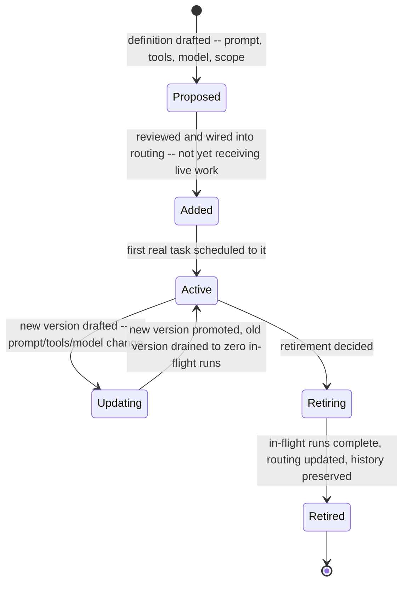
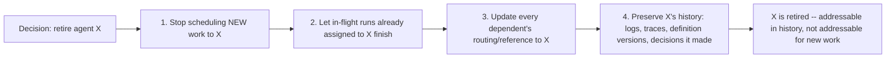

## Agent Lifecycle Management

> Chapter of [[building-agentic-systems/readme#01 — Multi-Agent Systems|Multi-Agent Systems]], part
> of [[building-agentic-systems/readme|Building & Evaluating Agents]].

## What you will understand at the end

- How a new agent gets discovered and wired into an already-running supervisor, mesh, or pipeline
  topology without a full-system redeploy
- Why updating an agent's prompt, tools, or model is a **version cutover problem**, not a config
  edit — and the difference between draining in-flight runs onto the old version and hard-cutting
  everything over immediately
- What "retire an agent" actually means operationally: stop scheduling new work to it, update every
  dependent's routing rule, and preserve its history — three distinct actions that are easy to
  conflate into one "delete it" step
- Why an agent's interface is not just its input/output schema — its prompt _is_ part of its
  contract, and a schema-compatible change can still silently change behavior in a way no type
  system or API version bump will catch
- How GitHub Copilot's custom-agent model handles exactly this lifecycle in a shipped product, and
  why git's own commit history — not a bespoke audit subsystem — ends up being the audit trail

---

## The mental model

Every other chapter in Part 00 has treated the set of agents in a workflow as a given — you design
the collaboration model, the communication protocol, the supervisor's routing table, assuming the
cast of agents is fixed for the life of the diagram. In production, it never is. Agents get added
because a new capability is needed, updated because the prompt was wrong in a way nobody caught
until week three, and retired because the task they handled moved to a different team or got folded
into another agent. The workflow has to keep running through all of it — there is rarely a
maintenance window where you can freeze every in-flight run, redeploy the whole topology, and
resume.

Read this as a state machine that a **workflow coordinator** — the supervisor, the mesh registry, or
the pipeline's stage config — has to track per agent, independently of whatever state machine the
agent's own execution loop is running internally. Conflating the two is the single most common
design mistake in this chapter's territory: an agent's _task-level_ state (planning, executing,
done) is not the same thing as its _lifecycle_ state (added, active, retiring), and a workflow that
only models the former has no place to represent "this agent is mid-retirement, still finishing two
runs, and should not be handed a third."

---

## 1. Adding a new agent without redeploying everything

How a new agent gets discovered depends entirely on which coordination pattern from earlier in this
Part you're running — there is no single universal mechanism, because "wiring in" means something
different in each topology.

| Coordination pattern          | How a new agent gets wired in                                                                                                                                                            | What "without redeploying everything" means here                                                                                                                                 |
| ----------------------------- | ---------------------------------------------------------------------------------------------------------------------------------------------------------------------------------------- | -------------------------------------------------------------------------------------------------------------------------------------------------------------------------------- |
| Supervisor (Part 00, Ch. 9)   | A new entry is added to the supervisor's routing table / delegation tool list — the supervisor's own prompt or tool schema gains one more callable specialist                            | The supervisor process itself doesn't restart; the routing table is data the supervisor reads per call, not a compiled-in list                                                   |
| Mesh (Part 00, Ch. 10)        | The new agent registers itself (or is registered) against a shared discovery mechanism — a registry, a shared message bus topic, a service-mesh-style sidecar announcing capability tags | Every other agent in the mesh keeps running against the existing registry snapshot until it next queries for capable peers; no agent needs to know the mesh's membership changed |
| Pipeline (sequential handoff) | The new agent is inserted as a stage between two existing stages, or as a new terminal/branch stage                                                                                      | Only the stages immediately upstream and downstream of the insertion point need their handoff contract touched — the rest of the pipeline is unaffected                          |

The common thread across all three: **the coordination layer holds agent membership as data it
reads, not as code it's compiled against.** If "adding an agent" requires editing and redeploying
the supervisor's own source code, the design has conflated the supervisor's reasoning logic with its
routing configuration — the same anti-pattern as hardcoding a service's downstream dependency list
into its binary instead of reading it from service discovery.

**The shadow-launch pattern.** A new agent entering `Added` state should not go straight to
receiving production-critical tasks. The standard mitigation, borrowed directly from canary
deployment practice: route a small, low-stakes slice of real traffic to the new agent while the
existing path keeps serving the rest, compare outcomes (did the new agent's output match what the
established path would have produced, on the dimensions you can actually score), and only widen the
routing share once the new agent has cleared a bar on real traffic — not just on a pre-launch eval
set. This matters more for agents than for typical services because an agent's failure mode is
rarely a clean 5xx; a bad agent addition often looks like _plausible but subtly wrong_ output that
passes a shallow health check.

---

## 2. Updating, reconfiguring, or replacing an agent mid-flight

This is where agent lifecycle management stops resembling routine config management and starts
resembling a deployment problem — because "in-flight work" for an agent can mean a multi-turn,
multi-tool-call run that's been executing for minutes or hours, not a single stateless request.

**Version the agent definition, not just its weights.** Treat an agent's full definition — system
prompt, tool list and their schemas, model identifier, temperature/sampling config, and any
retrieval or memory configuration — as one versioned artifact, the same way you'd version a
container image rather than patching a running container's filesystem in place. This gives you a
concrete object to reference: "the supervisor is currently routing to `security-review-agent@v14`,"
not a vague "the security review agent, whichever prompt happens to be live right now."

**Draining vs. hard cutover:**

| Strategy             | What happens to in-flight runs                                                                                                  | What happens to new work                               | When it's the right call                                                                                                                                                                            |
| -------------------- | ------------------------------------------------------------------------------------------------------------------------------- | ------------------------------------------------------ | --------------------------------------------------------------------------------------------------------------------------------------------------------------------------------------------------- |
| Drain (soft cutover) | Runs already assigned to the old version finish on the old version's prompt/tools/model                                         | New task assignments go to the new version immediately | Default choice — an in-flight multi-step run switching prompts or tools mid-execution is a correctness risk, not just a UX wrinkle                                                                  |
| Hard cutover         | In-flight runs are interrupted, and either abandoned or resumed against the new version's definition                            | New and resumed work both use the new version          | Only when the old version is actively harmful (e.g., it's using a tool that just had its credentials revoked, or its prompt is producing unsafe output) — the update is itself an incident response |
| Dual-run / shadow    | In-flight runs continue on the old version; the new version also runs the same inputs in parallel without its output being used | Comparison-only — no real routing change yet           | Validating a prompt/tool/model change before trusting it with any real cutover, old or new                                                                                                          |

Drain is the default for the same reason it's the default in ordinary service deployments: an
in-flight agent run has accumulated state — a message history built against the old system prompt's
assumptions, tool results interpreted under the old prompt's instructions, partial progress toward a
plan the old prompt helped construct. Swapping the prompt underneath a run that's halfway through
executing that plan is closer to hot-patching a running process's code segment than to a rolling
deploy — the run's own internal "understanding" of its task was shaped by instructions that no
longer exist.

**Interface/contract compatibility.** An agent's interface to the rest of the workflow has (at
least) three layers, and "backward compatible" has to be evaluated at all three, not just the first:

1. **Structural contract** — the input schema it accepts and the output schema it returns (e.g., a
   JSON result shape the supervisor parses). This is the layer a type system or a JSON Schema
   validator actually checks.
2. **Side-effect contract** — which tools it's permitted to call and what those tools are allowed to
   touch. A version that gains a new tool, or loses one it used to rely on, changes what the rest of
   the workflow can assume about what "delegating to this agent" might cause downstream.
3. **Behavioral contract** — the actual character of its output: how cautious it is, what it treats
   as sufficient evidence before acting, what it escalates versus handles autonomously. Nothing
   enforces this layer mechanically. It's covered in depth in Section 4 below, because it's the
   layer that makes this entire chapter harder than ordinary service lifecycle management.

A version bump that only changes layer 3 — same input schema, same output schema, same tool list —
will pass every structural compatibility check a CI pipeline can run, and still break the workflow
that depends on it.

---

## 3. Retiring an agent: continuity and auditability are separate problems

Retirement gets treated as a single action ("turn it off") far more often than it should be. It is
actually three independent actions, and conflating them is exactly what causes either a silent
workflow break or a lost audit trail:

**Stop scheduling new work vs. delete all record it existed.** These are opposite ends of a
spectrum, and "retire" almost always means the former, never the latter:

| Property                                                                              | "Stop scheduling new work" (retirement)         | "Delete all record it existed" (almost never correct) |
| ------------------------------------------------------------------------------------- | ----------------------------------------------- | ----------------------------------------------------- |
| New tasks routed to it                                                                | No                                              | No                                                    |
| Existing runs already assigned to it                                                  | Allowed to finish                               | Forcibly terminated or orphaned                       |
| Its execution logs / traces                                                           | Retained, queryable                             | Deleted                                               |
| Its definition history (prompt/tool versions over time)                               | Retained                                        | Deleted                                               |
| Can you answer "what did this agent do on incident date X"?                           | Yes                                             | No                                                    |
| Can other agents/supervisors still reference its past decisions in their own history? | Yes — the reference resolves to historical data | No — dangling reference                               |

The only scenario where actual deletion is defensible is a hard compliance requirement (e.g., a data
retention policy mandating erasure) — and even then, deletion should be scoped to the specific data
subject to that requirement, not applied wholesale to the agent's operational history, because doing
so destroys your ability to reconstruct what happened in any past incident that agent was part of.

**Updating dependents so nothing silently breaks.** Retirement is only safe once every other agent
or coordinator that could route to the retired agent has its own reference updated:

- **Supervisor pattern** — remove (or replace) the retired agent's entry in the routing table /
  delegation tool list. If it's being replaced by a successor, the supervisor's routing logic needs
  the substitution made explicit, not left to fall through to a stale entry that now points at
  nothing.
- **Mesh pattern** — deregister the agent from the discovery mechanism. Peers that cached its
  capability advertisement need either a TTL-based expiry on that cache or an explicit
  deregistration event, or they will keep attempting to route to an agent that no longer answers.
- **Pipeline pattern** — the stage immediately upstream needs to either hand off to a different
  stage or be reconfigured to skip the retired stage entirely. An unmodified upstream stage that
  still hands off to a retired stage produces a silent stall, not a clean error — this is the
  failure mode worth testing for explicitly before considering a retirement complete.

The through-line: **"nothing silently breaks" is a property you verify, not one you assume** — the
same discipline [[03-communication-protocols|Communication Protocols]] (Part 00, Ch. 3) already
established for handling a mid-chain agent failure applies identically to a _planned_ agent removal.
A retirement that isn't propagated to every dependent's routing logic is operationally
indistinguishable from an unplanned outage of that agent, just one you scheduled yourself.

---

## 4. Why this is harder than normal service lifecycle management

Everything above has an analogue in ordinary microservice lifecycle management: canary rollout,
draining connections before taking an instance out of a load balancer pool, deprecating an API
version, deregistering from service discovery. The mechanics rhyme. The part that doesn't rhyme is
what actually constitutes the "interface" being versioned.

| Dimension                                  | Traditional service                                     | Agent                                                                                                                                |
| ------------------------------------------ | ------------------------------------------------------- | ------------------------------------------------------------------------------------------------------------------------------------ |
| What defines the interface                 | API schema — request/response shape, status codes       | API schema **plus** the prompt, which encodes behavior, tone, judgment thresholds, and escalation rules                              |
| How you verify compatibility               | Contract tests, schema diffing, typed client generation | Schema diffing covers only the structural layer; behavior needs eval suites sampling a distribution, not a proof                     |
| What a "compatible" change can still break | Very little — if the schema validates, callers are safe | Downstream trust assumptions ("this agent always asks before deleting") that live nowhere machine-checkable                          |
| Rollback signal                            | Error rate, latency, explicit exceptions                | Often no error at all — output is well-formed and plausible, just subtly wrong; requires quality/eval signal, not just health checks |
| Versioning granularity                     | Code + config, usually deployed together                | Prompt, tools, and model can each change independently, and each is a distinct axis of behavior change                               |

The concrete failure case worth internalizing: version 14 of an agent's prompt says "flag anything
uncertain for human review before proceeding." Version 15 rewords this for brevity to "use judgment
on ambiguous cases" — same input schema, same output schema, same tool list, ships through every
structural compatibility check clean. The behavioral contract the rest of the workflow was silently
depending on — that this agent never proceeds autonomously on low-confidence calls — is gone. No
type error, no failed contract test, no schema version bump. The workflow finds out when the agent
takes an autonomous action on something it used to escalate, and by then it's an incident, not a
code review comment.

This is why eval suites and golden-set regression testing (covered in
[[building-agentic-systems/readme#02 — Evaluation|Evaluation]], Part 02) function as this domain's
substitute for a type system — but substitute is the operative word. A type checker proves the
_absence_ of a category of error across all inputs. An eval suite samples a distribution and reports
how the new version scored _on the cases you thought to include_. Treat eval-suite clearance as
evidence that reduces risk, not as a compatibility proof that eliminates it — which is also the
practical argument for defaulting to drain-based cutover from Section 2: even a well-evaluated
prompt change deserves to prove itself on new work before any in-flight run is asked to trust it.

---

## GitHub Copilot in practice

GitHub's custom-agent model — narrowly scoped agent definitions as individual files, conceptually
`.github/agents/*.md`, each with a name, description, restricted tool list, and system instructions
(introduced in [[01-why-multi-agent-systems|Why Multi-Agent Systems]], Ch. 1, and used as the
reference implementation for repo-scoped, event-triggered coding agents in
[[agentic-ai-engineering/04-tools-and-environment-interaction/13-agents-in-ci-cd-and-sdlc-workflows/13-agents-in-ci-cd-and-sdlc-workflows|Agents in CI/CD & SDLC Workflows]],
Part 04 of Agentic AI Engineering Ch. 13) — gives this chapter's abstract lifecycle a concrete,
git-native implementation. The reason it's worth centering this chapter on: an agent definition that
lives as a file in the same repository the agent operates on inherits that repository's entire
version control apparatus for free, without any bespoke agent-lifecycle tooling having to be built.

**Adding an agent.** A new `.github/agents/<name>.md` file is authored, reviewed, and merged through
the exact same PR process as any other repository change — the review that decides whether the
agent's scope and instructions are sound _is_ the review gate from Section 1's shadow-launch
discussion, just implemented as ordinary code review rather than a separate approval workflow. Once
merged to the default branch, the agent is addressable by whatever mechanism triggers Copilot agents
in that repo (issue assignment, PR delegation) — there is no separate "deploy the agent" step,
because the agent's deployment artifact _is_ the repository state at the commit the trigger reads
from.

**Updating an agent.** Because the definition is a tracked file, versioning it is git's own
versioning — no separate registry or artifact store is needed. A prompt or tool-list change is a
commit; the prior version is simply the file's content at the prior commit, retrievable with
ordinary `git show` or `git log -p` against that path. This is Section 2's "version the agent
definition as an artifact" recommendation, satisfied structurally by git rather than by a purpose
built system.

**How an in-flight run is handled when the definition changes underneath it.** This is the specific
mechanic this chapter cares about most, and it's worth being precise about what's documented
knowledge versus reasonable inference from the architecture:

- **What follows directly from the CI/CD chapter's execution-context model:** Part 04 of Agentic AI
  Engineering Ch. 13 established that a coding agent's execution context — repo, branch,
  permissions, triggering event — is resolved once, at trigger time, before the agent's first tool
  call. A run already in progress is operating against the repository state (including the agent's
  own instruction file) that was current when it was triggered, or that it read early in its
  execution. A definition change merged to the default branch _after_ a run has started is not
  something that run is continuously re-polling for — the same way a CI job doesn't rebase its own
  checkout mid-run because the source branch received a new commit.
- **What this implies for cutover, generalizing from that architecture:** new triggers — an issue
  assigned after the merge, a new PR review comment after the merge — read the updated definition
  and get the new prompt/tools/model. A run already executing when the merge landed plausibly
  finishes against the definition it started with. That is the drain pattern from Section 2, arrived
  at as a natural consequence of "context resolved once at trigger time" rather than as a
  purpose-built agent-versioning feature.
- **Flagging the generalization explicitly, per this chapter's own standard:** the exact operational
  detail — whether a long-running Copilot agent session re-reads its instruction file at any point
  during execution, what the precise behavior is for a run that spans a definition change
  mid-session versus one triggered cleanly before or after it — is an implementation detail of a
  product that changes across GitHub releases. Treat "in-flight runs are insulated from a mid-run
  definition change, new runs pick up the new definition" as the architecturally sound and most
  probable behavior given the documented trigger model, not as a specific mechanic to cite as
  confirmed. Verify against GitHub's current documentation before depending on the exact guarantee
  in a design review.

**Retiring an agent.** Removing or archiving `.github/agents/<name>.md` — deleted outright, or moved
to a clearly-marked non-active location if the team wants the definition discoverable without it
being live — is Section 3's "stop scheduling new work" action: once it's gone from the active set,
whatever mechanism assigns issues or delegates PR review to it no longer resolves to a live agent.
That is a single, ordinary commit, reviewed the same way the original addition was.

**Why git history is the audit trail, not a separate system.** This is the elegant part, and it's
the direct answer to this chapter's "preserving auditability" requirement: git's commit history is
already an append-only, timestamped record of every version of that file that ever existed, and
which commit's version was live on any given date. `git log --follow -- .github/agents/<name>.md`
recovers the full history of the agent's instructions even after the file is deleted from the
current tree. Every PR the agent authored while a given version was live still carries that PR's own
history — its diff, its description, its review thread — completely independent of whether the agent
definition that produced it still exists. No bespoke "agent audit log" has to be built, because the
substrate the agent's definition lives in (git) was already an audit log for every other kind of
change to that repository, and the agent's definition is just one more tracked file subject to the
same guarantee.

---

## Concept check

Before moving on, you should be able to answer these without notes:

| Question                                                                                          | Answer hint                                                                                                                                                                                                           |
| ------------------------------------------------------------------------------------------------- | --------------------------------------------------------------------------------------------------------------------------------------------------------------------------------------------------------------------- |
| Why does adding a new agent not require redeploying the whole workflow?                           | Coordination layers (supervisor routing table, mesh registry, pipeline stage config) hold agent membership as data they read, not code they're compiled against                                                       |
| Why is drain the default cutover strategy, not hard cutover?                                      | An in-flight run's accumulated state (message history, tool results, plan) was built against the old version's assumptions — swapping prompts mid-run is closer to hot-patching a running process than a clean deploy |
| What are the three layers of an agent's interface?                                                | Structural (input/output schema), side-effect (tool access), behavioral (judgment, caution, escalation rules)                                                                                                         |
| Why can a schema-compatible prompt change still break the workflow?                               | The behavioral contract downstream agents depend on lives in the prompt's wording, not in anything a schema validator checks                                                                                          |
| What are the three distinct actions inside "retire an agent"?                                     | Stop scheduling new work, let in-flight runs finish, update every dependent's routing reference — plus preserving history as a fourth, separate concern                                                               |
| In GitHub Copilot's custom-agent model, what serves as the audit trail after an agent is retired? | Git's own commit history on the agent's definition file, plus the PR history each version produced — no separate audit system needed                                                                                  |

---

## Vocabulary glossary

| Term                  | Definition                                                                                                                                                                       |
| --------------------- | -------------------------------------------------------------------------------------------------------------------------------------------------------------------------------- |
| Agent lifecycle state | The coordinator-tracked state of an agent as a workflow member (proposed, added, active, updating, retiring, retired) — distinct from the agent's own task-level execution state |
| Drain (soft cutover)  | Letting in-flight runs finish on the old agent version while new work routes to the new version                                                                                  |
| Hard cutover          | Interrupting in-flight runs immediately to move everything to a new agent version, used only when the old version is actively harmful                                            |
| Shadow launch         | Routing a small slice of real traffic to a new agent alongside the existing path, or running both in parallel, before trusting the new agent with full routing share             |
| Structural contract   | The input/output schema layer of an agent's interface — the only layer a type system or schema validator checks                                                                  |
| Side-effect contract  | The tool-access layer of an agent's interface — what it's permitted to call and touch                                                                                            |
| Behavioral contract   | The judgment/caution/escalation layer of an agent's interface, encoded in its prompt — not mechanically enforced by anything                                                     |
| Retirement (agent)    | Stopping new-work scheduling and updating dependent routing, while preserving history — distinct from deleting all record the agent existed                                      |
| Audit trail (agent)   | The preserved record of an agent's past definitions and the actions taken under each — in GitHub Copilot's model, git's own commit history                                       |

## Metadata

|        |                          |
| ------ | ------------------------ |
| Author | Amit Singh               |
| Scope  | building-agentic-systems |
