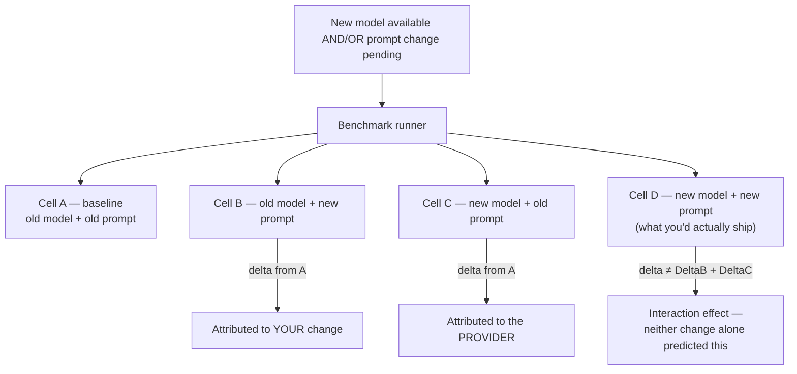

## Benchmarks

> Chapter of [[building-agentic-systems/readme#02 — Evaluation|Evaluation]], part of
> [[building-agentic-systems/readme|Building & Evaluating Agents]].

## What you will understand at the end

- Why "the benchmark score dropped" is not, by itself, an actionable signal — and the specific
  control you have to run to know whether the provider or you caused it
- Why pinning a dated model snapshot instead of a rolling alias is the precondition for that
  question being answerable at all, and what happens once the provider retires the pin
- How to structure a benchmark suite as two different instruments — cheap golden-answer tripwires
  and expensive rubric-scored tasks — because one suite can't do both jobs well
- Why a benchmark task has a shelf life: what ceiling saturation looks like, and the maintenance
  loop that keeps the suite discriminating instead of quietly turning into theater
- Why "per-PR," "nightly," and "on provider model update" are three different triggers answering
  three different questions, not three redundant copies of the same suite

---

## The mental model

Your tool-selection accuracy metric drops from 94% to 82% overnight. Nothing in this fact tells you
what to do next. It could mean three completely different things, and each one has a different fix:

1. **You broke it.** Yesterday's prompt tweak or tool-schema edit introduced an ambiguity the model
   now resolves incorrectly.
2. **The provider broke it.** The model version behind your API calls changed — a rolling alias
   moved to a newer snapshot, and that snapshot's tool-calling behavior shifted in a way nobody on
   your team decided or reviewed.
3. **The suite broke.** A golden answer went stale (the fact it encodes changed in the world, not in
   the model), and the suite is now failing correct output.

A raw aggregate score cannot distinguish these. This chapter is about the run structure and suite
design that makes the distinction cheap to make, instead of a multi-hour forensic exercise every
time the number moves.

Keep this chapter's altitude distinct from its siblings in this Part.
[[01-ai-evaluation-frameworks|AI Evaluation Frameworks]] defines the metrics vocabulary this chapter
uses (success rate, cost, latency) without prescribing how to run them repeatably.
[[04-offline-evaluation|Offline Evaluation]] is the CI-gate mechanics for _one candidate change_ —
statistical significance thresholds, when a score delta is real versus noise.
[[03-online-evaluation|Online Evaluation]] scores live traffic after deploy. This chapter sits
underneath all three: it's about the **suite as a standing asset** — what's in it, how you tell
provider drift from self-inflicted regression, when a task stops earning its keep, and how often the
whole thing runs.

---

## 1. The two-cause problem

Provider-side drift is easy to dismiss as theoretical until you've been burned by it once. Model
providers version their APIs with a mix of dated snapshots (stable, immutable) and rolling aliases
("the current default," "the latest point release") that are convenient to call but can resolve to a
different underlying model on a date you don't control and often aren't told about in advance. If
your benchmark harness calls an alias, a score change on a Tuesday can mean the provider shipped a
new snapshot behind that alias on Monday — not that anything in your repo changed.

Conflating the two causes is expensive in both directions:

| If you assume...                           | ...but the real cause was      | What it costs you                                                                                                                                       |
| ------------------------------------------ | ------------------------------ | ------------------------------------------------------------------------------------------------------------------------------------------------------- |
| "The model got worse" (provider caused it) | Your own prompt/tool change    | A real regression ships to production while you wait for a provider fix that isn't coming — nothing is broken on their end                              |
| "My change broke it" (you caused it)       | A provider-side model update   | Engineering time burned bisecting a diff that has nothing to do with the regression, while the actual cause — a silent model swap — goes uninvestigated |
| "The benchmark is flaky, ignore it"        | Either of the above, genuinely | The suite stops being trusted, someone widens the regression tolerance to make the noise go away, and the suite quietly stops catching real regressions |

The third row is the one that kills a benchmark suite slowly. Once a team has been burned by
unexplained noise a couple of times, the easiest fix — loosen the threshold — is also the one that
turns the suite into a rubber stamp. The isolation technique in the next section exists specifically
to stop that decay before it starts.

---

## 2. Isolating the cause: pin, then run a control

### Pin the model, not the alias

You cannot ask "did the model change" if you don't know what "the model" resolved to on any given
day. The fix is mechanical: benchmark runs — and ideally production traffic too — should call a
**dated snapshot ID**, not a rolling alias. `claude-sonnet-4-6` as a bare alias is convenient for a
demo; `claude-sonnet-4-6-<snapshot-date>` is what makes a benchmark run reproducible, because the
weights behind it don't move under you between two runs.

Pinning isn't permanent, and it's worth being honest about the limits here rather than presenting it
as a free lunch: providers retire old snapshots on a deprecation schedule, so a pin buys you a
**window**, not an indefinite anchor. You will eventually be forced onto a newer snapshot whether
you initiate the move or not. I'm not going to assert a specific deprecation timeline here — those
windows vary by provider and change over time, and stating one with false precision would be worse
than not stating it. What matters architecturally is that your benchmark harness treats "the
provider just forced a migration" as a first-class, expected event with its own trigger — covered in
Section 5 — not an emergency each time it happens.

### Run the suite as a 2×2, not a single pass

Once you can pin, the isolation itself is a small, deliberate experiment design: run the _same_
suite across the two variables that can each independently move your score — the model and your own
prompt/tool change — instead of changing both at once and reading one number.

| Cell | Model               | Prompt / tools      | What it isolates                                                                               |
| ---- | ------------------- | ------------------- | ---------------------------------------------------------------------------------------------- |
| A    | Old pinned snapshot | Unchanged (current) | **Baseline.** What you already know is working.                                                |
| B    | Old pinned snapshot | New (candidate)     | Isolates **your change** — the model is held fixed, so any delta from A is yours.              |
| C    | New pinned snapshot | Unchanged (current) | Isolates **the provider's change** — your prompt is held fixed, so any delta from A is theirs. |
| D    | New pinned snapshot | New (candidate)     | The condition you'd actually ship — both variables moved at once.                              |

You don't always need all four cells. If you have no pending prompt change and just want to know
whether a forced model migration is safe, A vs. C is the whole exercise. If you're only shipping a
prompt change against an unchanged, already-pinned model, A vs. B is sufficient — that's the
ordinary case Offline Evaluation's regression gate covers. Run all four only when both variables are
moving in the same release, which is exactly the situation where you most need the isolation: a
prompt change that looks clean against the old model can interact badly with the new one in a way
neither B's delta nor C's delta predicts on its own. That's cell D's job — it's not redundant with B
and C, it's the check for an **interaction effect**, and interaction effects are precisely the
regressions that get shipped when a team only ever runs the "did it get better" pass on the final
combined change.

Cost is the honest objection to running four cells instead of one: you're paying for 4x the model
calls on every release that touches both variables. That's a real tradeoff, not a free upgrade —
it's why Section 5 keeps the full 2×2 off the per-PR path and reserves it for the moments that
actually carry both variables at once.

---

## 3. Composition: golden-answer tasks and rubric-scored tasks

A benchmark suite that only does one of these two things is measuring half the failure surface.

**Golden-answer tasks** have an exact or near-exact expected output: a tool-selection task where
there's one correct tool for the input, a structured-extraction task with a known-correct JSON
shape, a factual question with one right answer. Scoring is a string match, a JSON schema diff, or a
deterministic assertion — cheap, fast, zero judge variance. These are your tripwire: they catch the
loud, unambiguous regressions (wrong tool called, malformed output, factual answer changed) at near
Prometheus-alert speed and cost.

**Rubric-scored (or LLM-as-judge) tasks** cover what golden answers structurally can't: open-ended
generation, multi-step plan quality, whether the agent asked a clarifying question when it should
have, whether a summary preserved the material facts without inventing new ones. There is no single
correct string here — there's a rubric ("did the plan address all three constraints in the request,"
"is the final answer grounded in the retrieved documents, or does it contain unsupported claims")
and either a human or a judge model scores against it.

| Property         | Golden-answer                   | Rubric / LLM-as-judge                                                      |
| ---------------- | ------------------------------- | -------------------------------------------------------------------------- |
| Scoring cost     | Near-zero — string/schema match | An additional LLM call per case, sometimes several for reliability         |
| Scoring latency  | Milliseconds                    | Seconds per case, and it doesn't parallelize as cheaply                    |
| Noise            | None — deterministic            | Real — the same output can score differently on repeated judge calls       |
| What it catches  | Clear, structural failures      | Subtle quality regressions: worse reasoning, worse tone, missed edge cases |
| Where it belongs | Every run, including per-PR     | Nightly / periodic — too slow and noisy for a per-PR gate                  |

That noise row deserves its own callout: **an LLM judge is itself a probabilistic dependency**, with
the same failure modes [[10-building-reliable-llm-applications|Building Reliable LLM Applications]]
covers for any other LLM call in the critical path — it can be inconsistent across identical inputs,
and it can drift when the provider updates the judge model out from under you exactly like Section 2
describes for the agent under test. Two mitigations are standard practice, not optional polish:
score each case with more than one judge call and take a majority or average rather than trusting a
single pass, and periodically calibrate the judge against a small set of human-labeled examples so
silent judge drift doesn't get read as agent drift. [[04-offline-evaluation|Offline Evaluation]]
covers the statistical threshold question this feeds — how much judge noise is tolerable before a
delta is real.

The composition principle that falls out of this: golden-answer tasks are the fast, cheap layer that
runs on everything; rubric tasks are the slower, more expensive layer that runs less often and
carries more of the suite's actual signal about reasoning quality. There's no universal ratio
between the two — it depends on how much of your agent's real failure surface is "wrong tool, wrong
schema" versus "technically valid output that's a worse answer" — but a suite that's 100%
golden-answer will consistently miss the second category, and a suite that's 100% rubric-scored is
too slow and too noisy to gate a merge.

---

## 4. Staleness: when the suite stops discriminating

A benchmark task earns its place by separating acceptable agent behavior from unacceptable behavior.
The moment every candidate — every model you'd realistically deploy, every prompt variant you'd
realistically ship — scores at or near ceiling on a task, that task has stopped doing its job. It
still costs tokens, latency, and (for rubric tasks) judge calls on every run, and worse, it inflates
the aggregate score in a way that hides real regressions elsewhere in the suite: ten tasks stuck at
100% and one task that dropped from 90% to 60% still looks like "97% pass rate, mostly fine" in a
single blended number.

There are two distinct staleness mechanisms, and they look similar from the outside but need
different fixes:

- **Ceiling saturation** — the task got easy relative to the field of candidates, not because
  anything about the task is wrong, but because the models you're benchmarking have simply gotten
  good enough that the task no longer separates them. This is a _success_ of the underlying
  technology and a _failure_ of that specific task's continued usefulness to you.
- **Answer-key drift** — the golden answer itself was time-bound (a fact, a price, a policy, a
  library's current API surface) and the world moved on while the suite didn't. This produces a
  regression-shaped symptom — a task that used to pass now fails — but the fix isn't a code change
  on your side, it's updating the fixture. Treated as a real regression, it wastes exactly the kind
  of bisecting time Section 1's third row describes, just with the suite itself as the false lead
  instead of the model.

The mechanism for catching both: track **per-task** score history across models and prompt versions,
not just the suite's blended aggregate. A task with zero variance across the last N runs and N
candidate models — everyone scores 100%, every time — is a retirement or a hardening candidate. A
task that suddenly flips from consistently-passing to consistently-failing with no corresponding
model or prompt change on your side is an answer-key-drift candidate, worth a five-minute check
before it's treated as a regression at all.

This implies the suite needs its own maintenance loop, not a "write once" existence. A practical
cadence: a periodic audit (quarterly is a reasonable default, not a rule) to retire
ceiling-saturated tasks, refresh time-bound golden answers, and — the part teams most often skip —
add new tasks targeting whatever failure category [[03-online-evaluation|Online Evaluation]] is
currently surfacing in production. That's the loop closing: live traffic finds the failure mode your
offline suite didn't have a task for yet, and the next audit is where it gets one. A benchmark suite
that never grows new tasks from production incidents is measuring an increasingly outdated idea of
what "good" means for your agent.

---

## 5. Cadence: per-PR, nightly, and on provider model update

Three triggers, three different questions, and conflating them either slows down every merge or lets
real regressions sit undetected for days.

| Trigger                      | Suite subset                                                                                 | Question it answers                                                                                          | Cost posture                                                                                                              |
| ---------------------------- | -------------------------------------------------------------------------------------------- | ------------------------------------------------------------------------------------------------------------ | ------------------------------------------------------------------------------------------------------------------------- |
| **Per-PR / pre-merge**       | Golden-answer heavy, small N, fast subset                                                    | "Did _this_ change break something obvious?"                                                                 | Cheap and fast is the whole point — this is the unit-test analog, it has to stay fast enough that nobody routes around it |
| **Nightly / scheduled**      | Full suite — golden-answer plus rubric/LLM-judge, larger N, multiple samples per rubric task | "Has quality drifted gradually across several small changes that no single PR-sized diff would have caught?" | Can afford the expensive rubric layer and the judge-noise-averaging repeats — nothing is blocked waiting on it            |
| **On provider model update** | Full suite, run as the 2×2 isolation from Section 2                                          | "Did the provider just change behavior under us, and is it safe to move onto the new pin?"                   | Not on your calendar — this trigger fires on the provider's schedule, not yours, and needs its own detection mechanism    |

That last row is the one teams most often miss, because it's the only trigger that isn't
self-scheduled. If your harness calls a pinned snapshot, a provider update doesn't silently change
your score — it just doesn't fire the trigger at all until you decide to move the pin. If any part
of your stack still calls a rolling alias — sometimes true even after you've pinned the benchmark
harness itself, if production traffic didn't get the same discipline — you need an explicit
detection mechanism: subscribing to the provider's model changelog, or a lightweight canary check
that periodically asks "what snapshot does this alias currently resolve to" and diffs it against the
last known value. Silence is not evidence nothing changed; it's evidence nobody's watching.

The cost tradeoff across all three rows is worth stating plainly rather than leaving implicit:
running the expensive rubric layer on every PR is a fast way to both slow down every merge and blow
through whatever token budget the suite has. Token cost and suite wall-clock latency are themselves
SLIs for the eval system, and the cadence table above is one of the concrete levers that spends that
budget — the same error-budget framing [[08-ai-slos|AI SLOs]] applies to the agent workload itself
applies here to the harness that gates it. Keep the per-PR gate cheap on purpose; that's not a
shortcut, it's what keeps it in the path at all instead of getting disabled the first time it makes
a release late.

---

## Concept check

| Question                                                                                          | Answer hint                                                                                                                                                                                |
| ------------------------------------------------------------------------------------------------- | ------------------------------------------------------------------------------------------------------------------------------------------------------------------------------------------ |
| Why isn't a dropped benchmark score by itself actionable?                                         | It could mean you broke it, the provider broke it, or the suite itself went stale — each needs a different fix                                                                             |
| What has to be true before you can even ask "did the model change"?                               | You're calling a pinned, dated snapshot — not a rolling alias — so you know what resolved on any given run                                                                                 |
| What does cell D in the 2×2 catch that cells B and C individually can't?                          | An interaction effect — a prompt change and a model change that are each individually clean but combine badly                                                                              |
| Why can't one benchmark suite be 100% golden-answer or 100% rubric-scored?                        | Golden-answer misses subtle reasoning/quality regressions; rubric-only is too slow, expensive, and noisy for a per-PR gate                                                                 |
| What are the two distinct causes of a task "going stale," and why does it matter which one it is? | Ceiling saturation (task got too easy) vs. answer-key drift (the fact the golden answer encodes changed) — one is a retirement decision, the other is a fixture bug, not a real regression |
| Why is "on provider model update" a harder trigger to operate than per-PR or nightly?             | It isn't on your calendar — it needs its own detection mechanism (changelog subscription or a resolved-snapshot canary), or it silently never fires                                        |
| Why does keeping the per-PR gate cheap matter beyond raw cost?                                    | An expensive, slow gate is the one that gets disabled the first time it blocks a release — cheap is what keeps it in the path                                                              |

---

## Vocabulary glossary

| Term                        | Definition                                                                                                          |
| --------------------------- | ------------------------------------------------------------------------------------------------------------------- |
| Rolling alias               | A model identifier (e.g. "latest") that can resolve to a different underlying snapshot without notice               |
| Pinned snapshot             | A dated, immutable model version ID — the precondition for a reproducible benchmark run                             |
| Isolation run / 2×2 control | Running the same suite across model-held-fixed and prompt-held-fixed cells to attribute a score delta to its cause  |
| Interaction effect          | A regression that appears only when two variables (model + prompt) change together, invisible to either delta alone |
| Golden-answer task          | A benchmark case with an exact or schema-matchable expected output — cheap, deterministic scoring                   |
| Rubric / LLM-as-judge task  | A benchmark case scored by a rubric or a judge model against open-ended output — expensive, and itself noisy        |
| Ceiling saturation          | A task where every realistic candidate scores near-max, so it stops discriminating between acceptable and not       |
| Answer-key drift            | A golden answer that was correct when authored but is now stale because the world it describes changed              |
