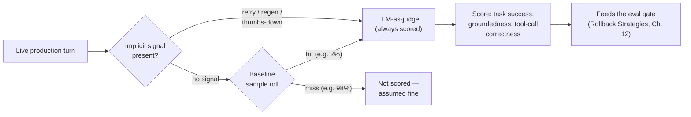

## Online Evaluation

> Chapter of [[building-agentic-systems/readme#02 — Evaluation|Evaluation]], part of
> [[building-agentic-systems/readme|Building & Evaluating Agents]].

## What you will understand at the end

- Why scoring live traffic is a structurally different problem from scoring a golden set — there is
  no ground truth for a request that just happened, only a rubric and a trajectory
- Why implicit feedback signals (retry, thumbs-down, abandonment, regeneration) aren't a cheap
  substitute for LLM-as-judge scoring so much as a **triage filter** that decides where the
  expensive judge calls get spent
- The sampling problem, restated precisely: you cannot judge-score every production turn at
  cost/latency-neutral scale, and the sampling strategy you pick determines what kind of regression
  you'll catch fast, catch slow, or never catch at all
- Why shadow-mode comparison changes the judge's job from absolute rubric scoring to pairwise
  comparison, and why that's a better-conditioned question for an LLM judge to answer
- How the score this chapter produces becomes the literal input to
  [[production-agent-systems/02-reliability-security-and-governance/12-rollback-strategies/12-rollback-strategies|Rollback Strategies]]'
  eval gate — and the more speculative connection to a canary-level circuit breaker, honestly
  flagged as unwritten territory

---

## The mental model

[[building-agentic-systems/02-evaluation/01-ai-evaluation-frameworks/01-ai-evaluation-frameworks|AI Evaluation Frameworks]]
flagged this chapter's core problem in one sentence, in passing: online, "groundedness / judge
scoring becomes... sampled — you can't judge-score every production trace at the volumes agents run
at." That sentence is correct and does none of the actual work. This chapter is where "sampled"
turns into a design decision with real tradeoffs, instead of a footnote.

Three structural facts set this chapter apart from everything else in Part 02:

1. **There is no ground truth.** A golden dataset
   ([[building-agentic-systems/02-evaluation/04-offline-evaluation/04-offline-evaluation|Offline Evaluation]])
   was built with a known-correct answer in mind. A production request that just happened has no
   such thing — you have a trajectory and a rubric, nothing to exact-match against.
2. **Volume makes exhaustive scoring structurally unaffordable.** An LLM-as-judge call is,
   mechanically, another LLM call over the full trajectory — same order of magnitude in tokens and
   latency as the agent call it's scoring. Score every turn and you've roughly doubled your
   inference bill and, if you did it synchronously, doubled your response latency too. That's not
   evaluation anymore; that's a very expensive inline guardrail (see
   [[production-agent-systems/02-reliability-security-and-governance/01-guardrails/01-guardrails|Guardrails]],
   Part 02 of Production Agent Systems, for what actually belongs in that blocking, inline slot —
   this chapter's scoring runs out-of-band, after the response is already served).
3. **The traffic you're scoring is the traffic that's actually happening**, not a curated
   distribution you control. A rare intent, a new user segment, a tenant nobody load-tested against
   — all of it shows up unannounced, which is exactly the gap online evaluation exists to catch that
   no offline suite, however well maintained, can anticipate.

Read that diagram left to right: implicit signals are the cheap, always-on triage step; the LLM
judge is the expensive, sampled confirmation step; and the baseline sample exists specifically to
catch what the triage step structurally can't. The next three sections build each stage; the last
section wires the output into the machinery that actually acts on it.

---

## 1. LLM-as-judge on real conversations, not benchmark cases

The mechanics are the same rubric-and-judge-call pattern Chapter 1 introduced — task, output,
rubric, score — but three things change when the input is a live conversation instead of a curated
benchmark case, and each one makes the judge's job harder, not easier.

**The input is a full trajectory, not a single turn.** A benchmark case is usually one input, one
output. A production conversation carries message history, prior tool calls, and accumulated state —
scoring "was this response good" in isolation, without the preceding turns, produces a judge verdict
that's confidently wrong about context the judge never saw. The judge prompt has to carry enough of
the trajectory to make the score meaningful, which is the same context-assembly problem
[[agentic-ai-engineering/06-context-engineering/01-context-assembly/01-context-assembly|Context Assembly]]
(Part 06 of Agentic AI Engineering) solves for the agent itself, now solved a second time for the
thing scoring the agent.

**There's no golden answer to fall back on.** Offline evaluation can lean on exact-match for the
easy cases and reserve the judge for the hard ones (Chapter 2's golden-answer vs. rubric-scored
split). Online, every case is the hard case — rubric-only, always. This raises the stakes on the two
failure modes Chapter 1 already named (judge bias, run-to-run inconsistency): in an offline suite,
judge noise is a nuisance that widens your regression-detection threshold; in production, judge
noise _is_ the entire measurement, because there's nothing else backing it up.

**The rubric itself has to be monitored, not just the agent.** Chapter 1's mitigation for judge
inconsistency was "keep a human-labeled sample running in parallel... an LLM judge that's never
re-validated against a human baseline can drift silently for months." Online, that stops being a
one-time calibration step and becomes a standing production concern: you now have to distinguish
"the agent got worse" from "the judge got worse" on a rolling basis, using the same small
human-labeled holdout, scored periodically, as your check against judge drift. This is the
observability discipline of monitoring your own monitor — the online-eval version of asking who
watches the watcher, and skipping it means every quality dashboard you build is only as trustworthy
as a judge nobody's re-checked since it was configured.

---

## 2. Implicit feedback signals — cheaper, and structurally different

Retry rate, thumbs-down, session abandonment, regeneration rate — these get pitched as "cheap
proxies for explicit scoring," which is true but understates what they actually are. They're not a
discount version of the judge's signal; they're a **different measurement with different
confounds**, and conflating the two produces dashboards that look precise and aren't.

| Signal                  | What it actually measures                                            | Confound that makes it noisy                                                                                                                                                             |
| ----------------------- | -------------------------------------------------------------------- | ---------------------------------------------------------------------------------------------------------------------------------------------------------------------------------------- |
| **Retry rate**          | User resubmitted or rephrased within a short window after a response | Some users habitually double-message as a normal continuation, not dissatisfaction — needs a same-intent-within-N-seconds definition to mean anything                                    |
| **Thumbs-down**         | An explicit, unambiguous negative signal                             | Severe participation bias — only a small, self-selecting fraction of unhappy users bother to click anything, so the rate is a ratio over an unrepresentative numerator                   |
| **Session abandonment** | User left without a completing action                                | A legitimately satisfied user who got their answer and closed the tab looks identical to a user who gave up — you need a product-level "task assumed complete" signal to tell them apart |
| **Regeneration rate**   | User explicitly clicked "regenerate" / "try again"                   | Cleanest signal of the four because it's an explicit UI action, not an inference — but it only exists if the product surface has that button at all                                      |

That last row matters more than it looks. **Chat-UI implicit signals don't exist for every agent
surface.** An autonomous background agent triggered by an API call, or a coding agent that opens a
PR and walks away, has no retry button and no thumbs-down widget — the proxy has to be redefined per
surface.
[[production-agent-systems/02-reliability-security-and-governance/11-failure-recovery/11-failure-recovery|Failure Recovery]]'s
GitHub Copilot section already found this signal in the wild without naming it as one: a coding
agent's draft PR that sits open, unmerged, with no human iteration on it, is the coding-agent
equivalent of a thumbs-down — nobody clicked a negative-feedback button, but the absence of the
positive action (merge) is the signal. The general lesson: before you build an implicit-signal
pipeline, find out what "the user gave up" actually looks like on _your_ product surface, because it
is almost never a UI widget that was designed for this purpose.

**The mechanism that makes these signals earn their keep isn't standing alone as cheaper telemetry —
it's using them as the triage layer that decides which turns get the expensive judge call**, which
is exactly what the mermaid diagram above shows and what the next section formalizes.

---

## 3. The sampling problem

State it precisely: judge-scoring 100% of production turns costs roughly as much in tokens and
latency as running the agent itself, so at any real traffic volume it is not cost/latency-neutral —
it's a second, parallel inference bill. You have to sample. The question is which sample, and every
choice trades off differently against what it catches.

If you've ever sized a trace sampler for Tempo or Jaeger, this is the identical design problem with
an LLM judge sitting where the trace store used to be — head-based vs. tail-based sampling,
restated.

| Strategy                                           | Mechanism                                                                                                      | Catches                                                                                                                           | Misses                                                                                                                                   |
| -------------------------------------------------- | -------------------------------------------------------------------------------------------------------------- | --------------------------------------------------------------------------------------------------------------------------------- | ---------------------------------------------------------------------------------------------------------------------------------------- |
| **Uniform random**                                 | Score a fixed % of all turns, chosen independently of any signal                                               | An unbiased, statistically clean baseline read on overall quality                                                                 | Rare-but-important segments — a regression confined to 2% of traffic can sit below a 1% uniform sample's detection floor for a long time |
| **Stratified / segment-weighted**                  | Over-sample by task family, tenant, or intent — the same segmentation Chapter 1 argued task success rate needs | Regressions concentrated in a specific segment that a uniform sample would dilute into the aggregate                              | Requires you to already know which segments matter enough to weight — a genuinely new segment still slips through                        |
| **Signal-triggered**                               | Always score turns with a negative implicit signal (retry, regen, thumbs-down)                                 | The cheapest, highest-precision way to spend judge calls on turns already suspected of being bad                                  | **Confidently wrong answers the user simply accepted** — no retry, no thumbs-down, no regen, because the user never knew it was wrong    |
| **Baseline sample (paired with signal-triggered)** | A small uniform sample scored regardless of signal, run alongside the signal-triggered stream                  | Estimates the **false-negative rate of the implicit signals themselves** — how often the judge flags something the signals missed | Costs judge calls on turns that were probably fine, by design — that's the price of measuring the blind spot                             |

That third row's blind spot is the one worth sitting with. A plausible-sounding, fluent, wrong
answer that the user doesn't push back on — because it reads as confident and correct — triggers
exactly zero implicit signals. Pure signal-triggered sampling will never catch it, for the same
structural reason Chapter 1 flagged for naive success metrics: "an agent that returns a fluent,
well-formatted, completely wrong answer passes every naive check." The baseline sample isn't
redundant with the signal-triggered stream; it's the only piece of the pipeline that can see that
specific failure mode at all.

### Worked example (illustrative)

A support agent handles 50,000 conversational turns/day. Judge-scoring every turn at, say,
$0.02/call would run roughly $1,000/day in judge cost alone — on top of whatever the agent itself
costs to run. A signal-triggered-plus-baseline design might look like:

| Stream                                         | Volume/day           | Judge calls/day  | Judge cost/day |
| ---------------------------------------------- | -------------------- | ---------------- | -------------- |
| Signal-triggered (retry/regen/👎)              | ~3% of turns → 1,500 | 1,500            | $30            |
| Baseline (uniform, 2% of the remaining 48,500) | ~970                 | 970              | $19            |
| **Total scored**                               | —                    | **~2,470 (~5%)** | **~$49/day**   |

Roughly 5% coverage for under 5% of the cost of full coverage, with the signal-triggered stream
carrying most of the high-precision catches and the baseline stream carrying the blind-spot check.
These numbers are illustrative, not a benchmark result — your actual judge cost, signal prevalence,
and acceptable detection lag will differ; the structure of the tradeoff won't.

---

## 4. Shadow-mode comparison: the paired case

Shadow-mode comparison runs a candidate deploy unit alongside production on live input, but the
candidate's output is never served — it's scored and discarded, and the user only ever sees the
baseline's response.
[[production-agent-systems/02-reliability-security-and-governance/12-rollback-strategies/12-rollback-strategies|Rollback Strategies]]
(Part 02 of Production Agent Systems, §4) already covers the infrastructure side of this in depth —
traffic duplication cost, mocking or dry-running mutating tools so the shadow path's side effects
never actually fire. This chapter's angle is narrower and specific to online evaluation: shadow mode
changes **what question you can ask the judge**, and the change is a genuine improvement in the
judge's problem, not just a cheaper way to get a score.

**Live monitoring asks an absolute question**: "on a 1-5 rubric, how good is this response?" —
because for any given production turn, there's no second version of the same input to compare
against. The judge has nothing to anchor its score to except the rubric text itself, which is
exactly the setup that produces Chapter 1's verbosity and inconsistency failure modes.

**Shadow mode asks a relative question**: "given the identical input, which of these two responses
is better, A or B, and why?" — because both versions ran against the exact same request at the same
moment. A pairwise judge call is a better-conditioned question than two independent absolute scores
for the same reason Chapter 1's position-bias mitigation exists: comparing two things directly is a
more stable judgment than two separately-anchored absolute ratings that then get subtracted from
each other after the fact. The standard mitigation carries over unchanged — randomize which response
is presented first, run both orderings, and average — because pairwise comparison inherits position
bias exactly as described in Chapter 1, it just doesn't inherit the run-to-run absolute-scale drift
that plagues two independent ratings.

Shadow mode still inherits this chapter's sampling problem — you don't need to shadow-run 100% of
traffic any more than you need to judge-score 100% of it. What's genuinely different is what you do
with the pair once you have one: absolute rubric scoring for the live-monitoring stream, pairwise
comparison for the shadow stream, feeding the same eval-gate machinery downstream with a
higher-confidence signal per sample.

---

## 5. Closing the loop: feeding Rollback Strategies (and, tentatively, Circuit Breakers)

Everything above produces a number — or a stream of numbers with a confidence interval attached.
What happens to that number is deliberately out of scope for this chapter and squarely in scope for
the next Part.
[[production-agent-systems/02-reliability-security-and-governance/12-rollback-strategies/12-rollback-strategies|Rollback Strategies]]
draws this exact boundary already: "Part 02 builds the scoring machinery... this chapter is where
that scoring becomes a release-blocking, and release-reverting, control." Concretely, two of this
chapter's own decisions are load-bearing inputs to that machinery, not independent settings:

- **Your sampling rate determines how fast `MIN_SAMPLES` accumulates.** Rollback Strategies' eval
  gate holds a promote/rollback decision until it clears a minimum sample size, sized against the
  eval's own observed variance. A 1% baseline sample on a 5% canary reaches statistical confidence
  slower than a 5% baseline sample on the same canary — the same traffic, spread thinner across
  judge calls, takes longer to produce a trustworthy delta. That's a real dial, and it's set here,
  in this chapter's sampling design, not in the rollback chapter's gate logic.
- **Your judge's measured noise floor determines what `REGRESSION_THRESHOLD` can safely be.**
  Section 1's judge-drift monitoring is what tells you whether a 0.2-point score movement is a real
  regression or scoring noise wearing a signal's clothes — Rollback Strategies' worked example
  depends on that threshold already being calibrated against a noise floor this chapter is
  responsible for measuring.

**The more speculative connection, honestly flagged:** the eval gate above is inherently statistical
— it waits for enough samples before it trusts a delta, which means a canary can serve a genuinely
bad response to real users for the duration of that wait. The natural complement is a fast,
threshold-free trip switch that doesn't wait for statistical significance at all — the same
fast-burn-vs-slow-burn split that multi-window, multi-burn-rate error-budget alerting uses: a small
number of catastrophic implicit signals (three thumbs-down in a row, three judge scores at the floor
of the rubric) on a 5% canary is worth halting immediately, independent of whether `MIN_SAMPLES` has
been reached yet.

Whether that's actually
[[production-agent-systems/02-reliability-security-and-governance/13-circuit-breakers-and-timeout-strategies/13-circuit-breakers-and-timeout-strategies|Circuit Breakers & Timeout Strategies]]'
job is genuinely unclear as of this writing — that chapter is unwritten, and its stated scope leans
toward containing a **single run's** own runaway behavior (infinite tool-calling loops, cascading
failures across cooperating agents, timeout budgets across a tool chain) rather than a
**rollout-level** tripwire on canary traffic. The fast-trip-switch idea above is a reasonable
extrapolation from the general circuit-breaker pattern, not a documented connection this book has
committed to yet. Treat it as the shape the boundary probably takes, and revisit this paragraph once
Chapter 13 exists.

---

## Concept check

| Question                                                                                    | Answer hint                                                                                                                                                                                         |
| ------------------------------------------------------------------------------------------- | --------------------------------------------------------------------------------------------------------------------------------------------------------------------------------------------------- |
| Why can't offline evaluation's golden-answer approach be reused unchanged for live traffic? | There's no ground truth for a request that just happened — every case is rubric-only, none of it can fall back to exact-match                                                                       |
| Why are implicit feedback signals not just "cheap LLM-as-judge"?                            | They're a different measurement with their own confounds (participation bias, ambiguous abandonment) — and their real value is as a triage filter for judge spend, not a standalone discount signal |
| What's the specific blind spot of signal-triggered sampling, and what covers it?            | Confidently wrong answers the user never reacts to trip no signal at all; a small uniform baseline sample scored regardless of signal is what measures that false-negative rate                     |
| Why does shadow mode let the judge ask a pairwise question instead of an absolute one?      | Both versions see the identical input at the same moment, so the judge can directly compare A vs. B instead of anchoring two separate scores to a bare rubric                                       |
| What two inputs from this chapter does Rollback Strategies' eval gate depend on?            | The sampling rate (how fast `MIN_SAMPLES` accumulates) and the judge's measured noise floor (what `REGRESSION_THRESHOLD` can safely be set to)                                                      |
| Why is scoring every turn synchronously, before responding to the user, the wrong design?   | It roughly doubles inference cost and latency — that turns evaluation into an expensive inline guardrail instead of an out-of-band production signal                                                |

---

## Vocabulary glossary

| Term                      | Definition                                                                                                                                |
| ------------------------- | ----------------------------------------------------------------------------------------------------------------------------------------- |
| Online evaluation         | Continuously scoring live production traffic against a rubric, with no ground truth and no curated case distribution                      |
| Implicit feedback signal  | A behavioral proxy (retry, regeneration, abandonment, thumbs-down) for whether a response satisfied the user, inferred rather than stated |
| Signal-triggered sampling | Always judge-scoring turns that carry a negative implicit signal, as the cheap triage layer for where to spend judge calls                |
| Baseline sample           | A small uniform sample scored regardless of signal, used to estimate the false-negative rate of the implicit signals themselves           |
| Judge drift               | Silent degradation of the judge model's own scoring reliability, requiring a periodic human-labeled holdout to detect                     |
| Pairwise judge call       | An LLM-as-judge call that compares two paired outputs on identical input directly, rather than scoring each absolutely                    |
| Shadow-mode comparison    | Running a candidate version on live input in parallel with production, without ever serving its output, to produce a paired score         |
| Noise floor               | The measured score variance of an unchanged system — the threshold below which a score movement can't be trusted as a real regression     |
