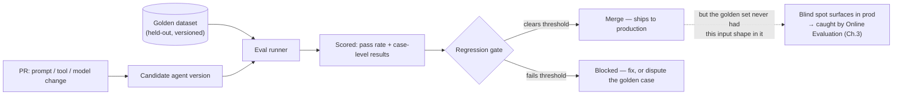
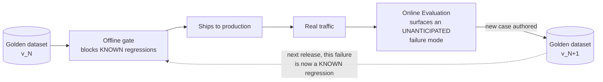

## Offline Evaluation

> Chapter of [[building-agentic-systems/readme#02 — Evaluation|Evaluation]], part of
> [[building-agentic-systems/readme|Building & Evaluating Agents]].

## What you will understand at the end

- Why offline evaluation is a release gate, not a benchmark — one candidate change scored against a
  fixed, held-out golden dataset before it reaches a real user, wired into CI as a merge decision
- Where golden dataset examples actually come from, and why a dataset that never absorbs new cases
  from production is a dataset that quietly stops earning its keep
- Why the golden dataset needs its own version history, independent of the agent's, and what breaks
  in your regression math the moment you forget that
- The real tradeoff between a hard pass/fail threshold and a regression-from-baseline check, and the
  statistical significance problem that regression-from-baseline can't skip
- Why a golden dataset can only ever test what someone thought to put in it — and why that specific,
  structural blind spot is what makes [[03-online-evaluation|Online Evaluation]] a necessary
  complement, not a redundant second check on the same thing

---

## The mental model

Keep this chapter's altitude distinct from its siblings in this Part.
[[01-ai-evaluation-frameworks|AI Evaluation Frameworks]] defines the metrics vocabulary (success
rate, cost, groundedness) without prescribing a run structure. [[02-benchmarks|Benchmarks]] is about
the **standing suite as an asset** — composition, staleness, and the cadence that separates
provider-caused drift from your own regressions across models and time. This chapter is narrower and
more mechanical: given a candidate change — a prompt edit, a new tool, a model swap — and a golden
dataset, decide pass or fail for _this one change_, before it merges. It's Chapter 2's cell B (model
held fixed, candidate varied) turned into an actual CI gate with a real pass/fail decision at the
end of it.



The dotted line matters as much as the solid ones. A gate that passes cleanly answered exactly the
question it was built to answer — it says nothing about the input shapes it was never given. Section
4 makes that limit precise; keep it in view while reading Sections 1–3, because it's the reason none
of the mechanics below are a substitute for [[03-online-evaluation|Online Evaluation]], only a
precondition for shipping responsibly ahead of it.

---

## 1. The CI regression gate, mechanically

Mechanically, offline evaluation answers one question per candidate: does this specific change make
the agent worse against a fixed, known set of cases? That's a narrower question than "is the agent
good" — it's closer to a unit-test suite than a product review, and it should be run with the same
discipline: on every PR, fast enough that nobody routes around it, and blocking by default rather
than advisory.

```python
def evaluate_candidate(candidate: AgentVersion, golden_set: GoldenDataset) -> GateDecision:
    results = eval_runner.run(candidate, golden_set)            # score every case

    if results.pass_rate < HARD_FLOOR:
        return GateDecision.BLOCK                                # never ship below the absolute bar

    baseline = golden_set.recorded_baseline(candidate.parent_version)
    regression = baseline.pass_rate - results.pass_rate
    if regression > REGRESSION_THRESHOLD and results.is_significant(baseline):
        return GateDecision.BLOCK                                # worse than yesterday, and it isn't noise

    return GateDecision.MERGE
```

Three things in that function are load-bearing, and each reappears in Sections 2 and 3:

- **`candidate.parent_version`** is the same kind of pointer as `promoted_from` in
  [[production-agent-systems/02-reliability-security-and-governance/12-rollback-strategies/12-rollback-strategies|Rollback Strategies]]
  — the gate doesn't need judgment about which earlier version is the right comparison point,
  because every candidate already carries a pointer to the version it's proposing to replace.
- **`golden_set.recorded_baseline(...)`** assumes the baseline score was recorded against the _same
  dataset version_ the candidate is now being scored against. Section 2 is entirely about what
  happens when that assumption silently breaks.
- **`results.is_significant(baseline)`** is not decoration. Section 3 works through why a raw
  percentage-point delta isn't enough to call something a regression.

**Wiring it into CI** is the same primitive
[[production-agent-systems/02-reliability-security-and-governance/12-rollback-strategies/12-rollback-strategies|Rollback Strategies]]
leans on for config-only agent changes that have no live traffic-splitting mechanism to gate
against: a required status check that runs this function against the PR's diff, made mandatory
through branch protection rather than left as an advisory check anyone can merge past. The gate has
to be _pre-merge_ here specifically because, unlike a canary rollout, many agent-definition changes
(a markdown system prompt, a tool registration) ship the instant the PR merges, with no
traffic-split step in between to catch a bad change after the fact.

**Keep this gate cheap on purpose.** The golden set used here should be the golden-answer-heavy,
small N, fast subset from [[02-benchmarks|Benchmarks]] §5's per-PR row — not the full nightly suite
with its rubric-scored, judge-noisy tasks. Putting the expensive layer on the per-PR path doesn't
make the gate more thorough, it makes it slower and noisier at the exact moment someone is deciding
whether to respect it, which is precisely how a gate gets disabled the first time it blocks a
release someone needed out the door.

---

## 2. Golden dataset construction and maintenance

### Where the examples come from

A golden set that's entirely hand-authored at project kickoff and never touched again is measuring
an increasingly outdated idea of what the agent's real failure surface looks like. In practice it's
built from four sources, and none of them is optional if the set is going to stay useful:

| Source                                                                  | What it catches                                                                                                      | Why it's necessary                                                                                                                                                              |
| ----------------------------------------------------------------------- | -------------------------------------------------------------------------------------------------------------------- | ------------------------------------------------------------------------------------------------------------------------------------------------------------------------------- |
| Hand-authored spec cases                                                | The behavior the agent was explicitly designed to have, before it existed                                            | Acceptance criteria you can't verify are acceptance criteria in name only                                                                                                       |
| Confirmed production bugs, made permanent                               | The exact input that broke the agent once, fixed and locked in as a case that must never regress                     | The same discipline as a regression test in ordinary software — "we fixed this" only means something if it can't silently come back                                             |
| Curated production traces                                               | Real input phrasing, real messy context, real tool-response shapes — not what an engineer imagined a user would type | Hand-authored cases skew toward what's easy to imagine, not what's actually common                                                                                              |
| Cases sourced from [[03-online-evaluation\|Online Evaluation]] findings | A failure mode live traffic surfaced that nothing in the current golden set exercises                                | This is the loop [[02-benchmarks\|Benchmarks]] §4 already names for the standing suite — it applies identically here, and Section 4 below is why it never stops being necessary |

The last row is the one teams skip under deadline pressure, and it's the one that keeps the dataset
from calcifying. Every incident review, every "how did this ship" retro, should end with a concrete
question: does the golden set now have a case for this? If the answer is no and nobody writes one,
the exact same failure ships again the next time someone touches a nearby prompt.

### Keeping it from going stale

[[02-benchmarks|Benchmarks]] §4 already names the two staleness mechanisms — ceiling saturation and
answer-key drift — for the standing suite, and the same two apply to a release-gate's golden set.
But they don't apply with equal weight here, and it's worth being precise about which one bites
harder in this specific context.

Ceiling saturation matters less for a per-PR gate than for the standing suite: a fast tripwire
subset doesn't need to discriminate between the top few candidate models the way a suite comparing
model providers does — it just needs to catch the loud, obvious break. Answer-key drift matters
_more_ here, for a reason specific to what a CI gate actually does when it fires: it blocks a real
merge, on someone's real deadline, for a reason the author can't fix by writing better code. A stale
golden answer that fails a genuinely correct candidate doesn't just under-report quality like it
would in a dashboard trend line — it trains the team to distrust the gate itself, which is the
fastest path to someone quietly widening the threshold or adding a `skip-eval` label to route around
it "just this once." Treat a disputed golden case with the same urgency as a flaky test: a fast,
reviewable path to fix the fixture (a PR against the dataset, reviewed, merged) has to exist, or the
alternative — silent threshold erosion — happens by default.

### The dataset needs its own version history

This is the part of golden-set maintenance that's easy to under-build, because it doesn't fail
loudly until it does. The mechanism to borrow is exactly the one [[02-benchmarks|Benchmarks]] §2
already established for models — you cannot ask "did the candidate get worse" without knowing
whether the **yardstick itself moved**, and a golden dataset is a yardstick with an answer key that
goes stale for reasons that have nothing to do with the agent: a return policy changes, a supported
region gets added, a library's current API surface shifts. The correct answer to a golden case can
become wrong while the agent that would have answered it correctly a month ago hasn't changed at
all.

The fix is the same 2×2 isolation logic, with the two axes swapped:

| Cell | Candidate          | Dataset version | What it isolates                                                                  |
| ---- | ------------------ | --------------- | --------------------------------------------------------------------------------- |
| A    | Current (baseline) | Old (`v_N`)     | The recorded baseline everyone's regression math currently assumes                |
| B    | New (candidate)    | Old (`v_N`)     | Isolates the candidate's own change — dataset held fixed                          |
| C    | Current (baseline) | New (`v_N+1`)   | Isolates the dataset's own change — the fresh baseline, once the answer key moves |
| D    | New (candidate)    | New (`v_N+1`)   | What actually ships, scored against what actually ships as the yardstick          |

Cell C is the one that's easy to skip, and skipping it is the single most common way a regression
gate becomes untrustworthy without anyone changing the eval logic at all. The practical rule: treat
the golden dataset as a versioned, reviewed artifact — a changelog entry and a PR of its own, not a
spreadsheet someone edits silently — and the moment that version bumps, re-run the current
production baseline against the new version _before_ trusting any regression-from-baseline
comparison against it. Skip that step and a candidate's 88% on `dataset_v18` gets compared against a
baseline of 92% recorded on `dataset_v17` — two different exams, read as one continuous score.

---

## 3. What "pass" means: hard threshold vs. regression-from-baseline

| Dimension                          | Hard threshold                                                                                                                           | Regression-from-baseline                                                                                                                                |
| ---------------------------------- | ---------------------------------------------------------------------------------------------------------------------------------------- | ------------------------------------------------------------------------------------------------------------------------------------------------------- |
| The question it answers            | "Is this candidate good enough, absolutely?"                                                                                             | "Is this candidate worse than what's running now?"                                                                                                      |
| Right default when                 | An absolute bar exists independent of history — a safety/compliance classification set that must never fall below X                      | No natural absolute bar exists, or the dataset's own difficulty shifts over time in a way an absolute number can't track without constant recalibration |
| What it structurally misses        | A slow decline across many small changes, each clearing the floor comfortably — the number never fires until it finally crosses the line | A baseline that was already mediocre: a candidate that matches a bad baseline shows zero regression, and passes                                         |
| What it requires to be trustworthy | Confidence that N is large enough for the observed pass rate to mean something at all                                                    | A dataset version pinned to the baseline it's compared against (Section 2), plus a real answer to the statistical significance question below           |

Neither option is strictly better — they catch different failure shapes, which is why many
production pipelines run both: a hard floor that blocks regardless of history ("never merge below X%
no matter what the trend line says"), and a regression check on top of it ("also block if this
dropped more than Y points from yesterday, even if it's still comfortably above the floor"). The
floor catches an agent that was always borderline and just got catastrophically worse in one change.
The regression check catches an agent that's still "good enough" by the floor's standard but
meaningfully worse than it was — the kind of erosion a fixed floor is structurally blind to until
it's too late to say which of the last ten PRs caused it.

### The statistical significance problem regression-from-baseline can't skip

Suppose the per-PR golden set — deliberately kept small for speed, per [[02-benchmarks|Benchmarks]]
§5 — has 50 golden-answer, exact-match cases. The recorded baseline for this candidate's parent
version is 46/50 (92%). The candidate scores 44/50 (88%) — a 4-point drop. Is that a real
regression?

The honest answer requires knowing something you don't get from the two numbers alone: how much
would the score move if you re-ran the _identical, unchanged_ baseline candidate against the
_identical_ dataset a second time, with no code change at all? Even exact-match scoring against a
fixed dataset doesn't guarantee a fixed score, because the model generating the agent's output has
its own sampling variance — the same non-determinism
[[01-ai-evaluation-frameworks|AI Evaluation Frameworks]] notes persists in LLM-as-judge scoring
"even at temperature 0 in practice," and it applies just as much to the agent under test as to a
judge scoring it. Flipping 2 of 50 cases from a re-run with zero actual change is not a hypothetical
edge case at that sample size — it's the kind of swing you'd expect to see periodically from
sampling noise alone, before you've added any judge-scoring noise on top for cases that aren't
exact-match.

The practical fix, and it's a measurement exercise rather than a formula to memorize: re-run the
unchanged baseline candidate against the same dataset version several times with no change at all,
and observe how much the pass rate moves on its own. That observed spread is the gate's **noise
floor** — its minimum detectable effect size. A `REGRESSION_THRESHOLD` set below that floor doesn't
make the gate more sensitive; it makes it fire on noise as often as it fires on real regressions,
which is exactly the false-positive fatigue [[02-benchmarks|Benchmarks]] §1 describes for the
standing suite, now relocated to a merge gate instead of a dashboard. This is also the concrete
argument for keeping the per-PR set golden-answer-heavy rather than rubric-scored: exact-match
scoring removes judge noise from the equation entirely, leaving only the agent's own sampling
variance as the noise floor — the one source a small, fast gate can actually afford to characterize
and reason about.

---

## 4. The fundamental limit: coverage, not correctness

Everything above — the gate mechanics, the dataset discipline, the significance threshold — makes
offline evaluation a rigorous way to answer one specific question: did this candidate get worse
against the set of scenarios someone already thought to test. That question has a hard ceiling built
into its own definition, and no amount of statistical or versioning discipline raises it: a golden
dataset only ever tests inputs someone put in it. It cannot catch a failure mode nobody anticipated,
because "anticipated" is the precondition for a case existing in the dataset at all.

Concretely: a support agent's golden set has 200 curated cases spanning the product's 12 known
ticket categories. It clears every regression gate cleanly for months. Then the product ships a new
subscription tier, and "cancel my subscription" now routes through a proration-calculation tool that
didn't exist when the dataset was last revised. The golden set has zero cases exercising that tool —
not because anyone was careless, but because the tool didn't exist yet. The gate reports a clean
pass on the next candidate. It isn't wrong. It's answering exactly the question it was built to
answer, on exactly the inputs it was given. It has nothing to say about the one input shape that
actually matters, because that shape isn't in it.

This is the structural reason [[03-online-evaluation|Online Evaluation]] isn't a redundant second
look at the same metrics from a different angle — it's the only mechanism that sees the
**open-world** tail offline evaluation is structurally closed against. Offline evaluation is a
closed-world regression check: known inputs, known correct answers, checked before a single real
request touches the change. Online evaluation has no equivalent closed set to check against — it
scores whatever traffic actually shows up, using implicit feedback and live judge sampling
specifically because there is no golden answer to compare against in advance for an input nobody
enumerated. Neither one substitutes for the other; they're covering two different definitions of
"wrong" — the known-and- already-seen versus the not-yet-imagined.



The loop closes, but it never closes for good: the dataset's coverage only grows by importing
lessons online evaluation already paid for in production, one incident at a time. That's not a
design flaw to engineer away — it's the honest shape of the problem. I won't assert a dataset size
or case count at which this blind spot becomes negligible; it depends entirely on how concentrated
or long-tailed your actual production input distribution is, and no fixed N converges to full
coverage of an open-world distribution that keeps shifting under you regardless. The realistic goal
isn't a golden set that eventually covers everything — it's a golden set whose known-failure surface
keeps shrinking, fed by the one channel that can see past it.

---

## Concept check

| Question                                                                               | Answer hint                                                                                                                                                                                                                                                |
| -------------------------------------------------------------------------------------- | ---------------------------------------------------------------------------------------------------------------------------------------------------------------------------------------------------------------------------------------------------------- |
| Why is offline evaluation described as a closed-world check?                           | It scores a candidate only against cases someone already put in the dataset — it structurally cannot catch a failure mode no one anticipated                                                                                                               |
| What's the difference in scope between this chapter and [[02-benchmarks\|Benchmarks]]? | Benchmarks is the standing suite across models and time, isolating provider drift from self-inflicted regression; this chapter is the CI-gate mechanics for one candidate change against one held-out set                                                  |
| Why does the golden dataset need its own version history, separate from the agent's?   | Correct answers drift independently of agent quality (answer-key drift) — a score delta could mean the candidate changed, the answer key changed, or both, and you can't tell which without pinning the dataset version the way you'd pin a model snapshot |
| What has to happen the instant a golden dataset version bumps?                         | Re-run the current production baseline against the new version to get a fresh baseline score before trusting any regression-from-baseline math against it                                                                                                  |
| What does a hard threshold miss that regression-from-baseline catches, and vice versa? | A hard floor misses slow decline across many small changes that each clear it comfortably; regression-from-baseline misses a baseline that was already mediocre — matching it shows no regression                                                          |
| Why can't a small, fast per-PR golden set skip the statistical significance question?  | Even exact-match scoring against a fixed dataset has sampling noise from the model itself — a small swing can be indistinguishable from re-running the same unchanged candidate twice                                                                      |
| Why is Online Evaluation a necessary complement rather than a redundant check?         | Offline evaluation only tests known scenarios; production traffic contains input shapes nobody wrote a golden case for, and online evaluation is the only mechanism that sees those                                                                        |

---

## Vocabulary glossary

| Term                                    | Definition                                                                                                                                            |
| --------------------------------------- | ----------------------------------------------------------------------------------------------------------------------------------------------------- |
| Golden dataset                          | A curated, versioned, held-out set of cases with known-correct answers, used to gate a candidate change before it ships                               |
| Regression gate                         | The CI check that runs a candidate against the golden dataset and blocks the merge if it scores worse than an agreed bar                              |
| Hard threshold                          | A fixed, absolute pass bar (e.g. minimum pass rate) applied regardless of what the previous version scored                                            |
| Regression-from-baseline                | A relative pass bar — block if the candidate scores meaningfully worse than the last known-good version, not against a fixed floor                    |
| Answer-key drift                        | A golden case whose correct answer was accurate when authored but is now stale because the real-world fact it encodes changed                         |
| Dataset version / revision              | An immutable, changelog-tracked snapshot of the golden dataset — the precondition for attributing a score delta to the right cause                    |
| Noise floor / minimum detectable effect | The smallest score change a gate can distinguish from re-running the identical, unchanged candidate — measured, not assumed                           |
| Closed-world / open-world gap           | The structural limit that a fixed golden dataset (closed-world) cannot anticipate every input shape live production traffic (open-world) will contain |

## Metadata

|        |                          |
| ------ | ------------------------ |
| Author | Amit Singh               |
| Scope  | building-agentic-systems |
