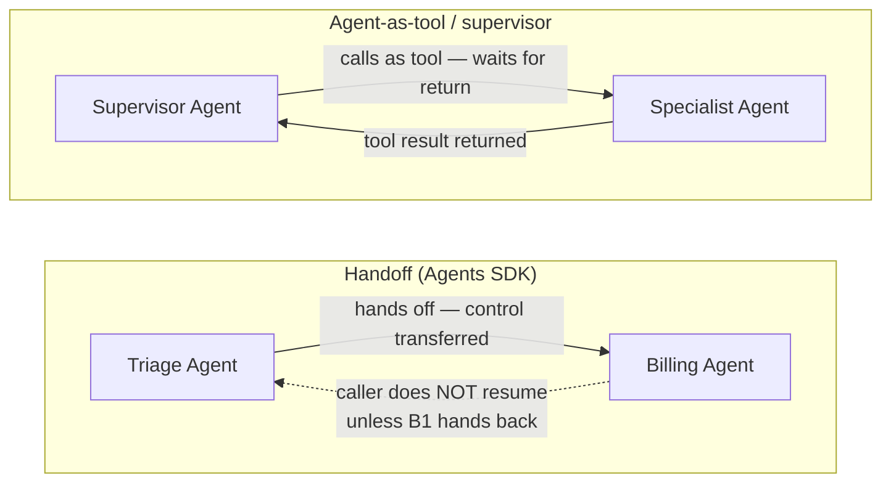

## OpenAI Agents SDK

> Chapter of [[building-agentic-systems/readme#03 — Agent Frameworks|Agent Frameworks]], part of
> [[building-agentic-systems/readme|Building & Evaluating Agents]].

## What it actually is

The Agents SDK is OpenAI's production successor to Swarm, its earlier experimental multi-agent
framework — same core idea (lightweight, minimal abstraction, Python-native), now with a supported
runtime, built-in tracing, and a stable primitive set. It is deliberately thin: four concepts —
**Agent**, **handoff**, **guardrail**, **session** — plus a `Runner` that drives the execution loop.
If you've read
[[building-agentic-systems/00-building-single-agent-systems/01-agent-architecture/01-agent-architecture|Agent Architecture]]
(Part 00), you already know what an `Agent` object wraps: an LLM, a system prompt, a tool list, and
a stop condition. The SDK doesn't introduce a new mental model of what an agent is — it gives you a
typed, batteries-included implementation of the execution loop you'd otherwise hand-roll, plus one
genuinely new primitive that single-agent frameworks don't need: the handoff.

## The four primitives

| Primitive     | What it is                                                                          | Maps to                                                                                                                                                                                                                                              |
| ------------- | ----------------------------------------------------------------------------------- | ---------------------------------------------------------------------------------------------------------------------------------------------------------------------------------------------------------------------------------------------------- |
| **Agent**     | LLM + instructions + tools + (optionally) a list of other agents it can hand off to | The runtime object from [[building-agentic-systems/00-building-single-agent-systems/01-agent-architecture/01-agent-architecture\|Agent Architecture]] — LLM, Tools, and Planning collapsed into one config object                                    |
| **Handoff**   | A special tool the model can call to transfer the active run to a different agent   | The delegation edge from [[building-agentic-systems/01-multi-agent-systems/01-why-multi-agent-systems/01-why-multi-agent-systems\|Why Multi-Agent Systems]] (Part 01), implemented as a first-class SDK object instead of something you wire by hand |
| **Guardrail** | A function that runs alongside the model call and can raise a tripwire to halt it   | Input-edge and output-edge validation from [[production-agent-systems/02-reliability-security-and-governance/01-guardrails/01-guardrails\|Guardrails]] (Part 02 of Production Agent Systems), given SDK-level hooks instead of ad hoc middleware     |
| **Session**   | An object that persists conversation history across `Runner.run()` calls            | A conversation-state abstraction — see the gotcha below for what it is _not_                                                                                                                                                                         |

`Runner.run()` is the execution loop itself: read context, call the model, execute any tool call
(including a handoff, which is just a tool call with special runtime handling), append the result,
repeat until the model returns a final message with no further tool calls. It's the same loop as
every other agent framework — the SDK's value is that you don't write it, and you get tracing spans
for each step for free.

## The orchestration model: handoff is a transfer, not a call

This is the detail that actually differentiates the SDK from a supervisor pattern, and it's worth
being precise about because the two look similar from a distance and behave very differently under
load.

**Handoff** transfers ownership of the run. Agent A calls the handoff tool, and from that point the
target agent — Agent B — owns the conversation: it sees the history, decides the next action, and
the `Runner` loop is now driven by B's instructions and B's tool list. A does not get control back
unless B itself hands off again (possibly back to A). This is closer to a state-machine transition
than a function call.

**Agent-as-tool** (the pattern
[[building-agentic-systems/01-multi-agent-systems/09-supervisor-architectures/09-supervisor-architectures|Supervisor Architectures]]
in Part 01 describes) keeps the calling agent in the loop: the supervisor invokes a specialist as an
ordinary tool call, gets a return value, and stays responsible for what happens next — aggregating
multiple specialists' outputs, resolving conflicts between them, deciding whether to call another
specialist. The SDK supports this pattern too (an agent can be exposed as a tool to another agent),
but it's a different orchestration shape from a handoff, and the choice isn't cosmetic:

|                                 | Handoff                                                                                              | Agent-as-tool                                                                                       |
| ------------------------------- | ---------------------------------------------------------------------------------------------------- | --------------------------------------------------------------------------------------------------- |
| Who owns the run after the call | The target agent                                                                                     | The caller                                                                                          |
| Natural fit                     | Peer-to-peer routing — triage, escalation, specialist chains where each agent fully owns its segment | Fan-out/aggregate work — a supervisor that needs to combine or arbitrate between specialist outputs |
| Failure visibility              | Harder — if B never hands back, the run's "owner" changed mid-trace                                  | Easier — the supervisor always sees every specialist's result and can react to a bad one            |

Pick handoff when the right mental model is "this conversation now belongs to a different
specialist." Pick agent-as-tool when the right mental model is "I need this specialist's answer
before I decide what happens next." Conflating the two — building a supervisor's aggregation logic
on top of handoffs — means writing your own tracking for "did the agent I handed off to ever come
back," which the SDK does not do for you.

## Where it sits versus building your own orchestration layer

What you get for free: the execution loop, a typed handoff mechanism instead of a bespoke routing
`if`/`elif` chain, guardrail scaffolding with a standard tripwire signal, and tracing spans per step
without instrumenting anything yourself. For a workload that's genuinely a small set of cooperating
agents — a triage agent routing to two or three specialists, each with its own tool list — that's a
real head start over hand-rolling the loop.

What you don't get: durable execution. A `Session` persists the _message history_ across
`Runner.run()` calls — it is the conversation-state posture
[[building-agentic-systems/03-agent-frameworks/01-evaluation-criteria/01-evaluation-criteria|Evaluation Criteria]]
calls "framework provides the shape, you provide the store": the SDK gives you the abstraction, but
wiring a session backend that survives a process crash mid-run is your job, and even once you've
done that, a session gives you _what was said_, not the step-by-step, side-effect-aware checkpoint
that
[[production-agent-systems/02-reliability-security-and-governance/11-failure-recovery/11-failure-recovery|Failure Recovery]]
(Part 02 of Production Agent Systems) requires for safe mid-run resumption. You also don't get a
graph-based state machine with explicit cycles and branches — handoffs are agent-to-agent edges, not
the arbitrary control-flow graph
[[building-agentic-systems/03-agent-frameworks/03-langgraph/03-langgraph|LangGraph]] models
natively. If your orchestration is a small number of peer agents handing a conversation between
them, the SDK's model fits with little friction. If it's a workload with real branching, retries,
and cyclical re-planning, you're going to build that control flow yourself on top of the SDK's loop
either way — at which point it's worth asking, per
[[production-agent-systems/04-ai-platform-engineering/02-agent-sdks/02-agent-sdks|Agent SDKs]] (Part
04 of Production Agent Systems), whether the thin layer you're adding on top still earns its keep
over a framework built for that shape from the start.

## The gotcha: handoffs carry the full conversation by default

The SDK's default handoff behavior passes the _entire_ conversation history to the target agent —
not just the piece of context relevant to what it's being asked to do. This is convenient in a demo
(the billing agent "just knows" everything the triage agent already discussed) and becomes a real
production problem at the third or fourth specialist in a chain, for two separate reasons:

1. **Context and cost compound.** Each successive agent in a handoff chain inherits every prior
   agent's turns, not just the summary of what it needs. A five-hop triage→specialist→
   sub-specialist chain means the last agent in the chain is reasoning over, and paying token cost
   for, the entire history — including turns that were only ever relevant to an earlier hop.
2. **Guardrails don't automatically travel with the history.** Agent B's input guardrail was
   designed to validate what's addressed _to B_. Anything that slipped past Agent A's output
   guardrail — or wasn't checked by a guardrail at all, because A's guardrails only ever looked at
   A's own output — is now sitting in B's context as ordinary conversation history, and B's
   guardrails were never designed to re-screen someone else's already-generated turns.

The SDK does provide an `input_filter` hook on the handoff object specifically to trim or transform
what gets carried over — but it's opt-in per handoff. A team that adds a fourth specialist to an
already-working three-agent chain and forgets to add a filter to the new handoff edge silently
inherits full-history leakage into that edge, and it won't show up in testing unless your test cases
specifically exercise a long enough chain to make the leaked context visible in the output. Treat
"what does this handoff actually carry" as a required review question for every new edge you add to
a handoff graph, the same way you'd review a new label before it ships into a metrics pipeline.
