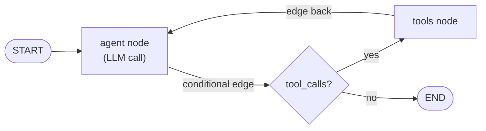

## LangGraph

> Chapter of [[building-agentic-systems/readme#03 — Agent Frameworks|Agent Frameworks]], part of
> [[building-agentic-systems/readme|Building & Evaluating Agents]].

LangGraph models an agent as a graph: **nodes** do work, **edges** connect them, and a **conditional
edge** routes to the next node based on current state. That's the whole primitive set. What earns it
a chapter is what a graph — as opposed to a DAG — buys for free: cycles, durable checkpointing, and
human-in-the-loop interrupts, all native graph mechanics instead of special-cased escape hatches
bolted onto a runtime that wasn't built for them.

## Nodes, edges, and the state that threads through them

- **Node** — a function that reads the graph's shared state and returns an update to it: call the
  LLM, run a tool, summarize history.
- **Edge** — a fixed A→B transition, or a **conditional edge**, where a router function inspects
  state and picks the next node at runtime. This is where planning logic — call a tool, answer
  directly, loop back for another pass — actually lives.
- **State** — a typed schema (`TypedDict` / Pydantic model) every node reads and writes. One shared,
  versioned object threads through the whole run instead of ad hoc arguments passed node to node.

That backward edge from `Tools` to `Agent` is the whole mechanism: an ordinary edge that happens to
point upstream. It's how LangGraph implements
[[agentic-ai-engineering/03-planning-and-reasoning-algorithms/02-react/02-react|ReAct]]-style
interleaved reasoning — reason, act, observe, reason again — with nothing beyond the three
primitives above.

## Why a graph, not a DAG

Airflow, Step Functions, and most CI pipelines are DAGs on purpose: acyclic means a scheduler can
compute the whole plan before running a single node. The
[[building-agentic-systems/00-building-single-agent-systems/01-agent-architecture/01-agent-architecture|Agent Architecture]]
loop — memory feeds the LLM, the LLM's decision drives a tool call, the result writes back to
memory, repeat until stop — is a cycle by construction. You don't know the iteration count ahead of
time; it's an output of running the loop, not an input to planning it. A DAG tool that wants this
has to fake it with retry re-triggers or external polling — workarounds for an acyclicity assumption
that doesn't hold for agents. LangGraph's graph allows cycles natively, with the router acting as
the guard (same concept as
[[agentic-ai-engineering/01-agent-cognition/08-agent-state-machines/08-agent-state-machines|Agent State Machines]]'
transitions-and-guards model) deciding at runtime whether to advance, loop back, or exit.

The tradeoff: nothing stops a cyclic graph from cycling forever. A **recursion limit** on the graph
run is the direct analog of the max-iterations stop condition from the execution loop — it exists
because the graph model gave up the DAG's built-in termination guarantee, and something has to put
it back.

## Checkpointing: state as data, not a call stack

A plain `while` loop keeps its state on the process's call stack. Kill the process mid-loop and it's
gone — nothing to resume, only a restart from scratch. LangGraph's checkpointer changes what the
state _is_: after every **super-step** (one full pass through whichever nodes ran), the graph
serializes its state and writes it to a durable store — SQLite, Postgres, Redis — keyed by a
`thread_id`. Which node runs next is derived from that saved state, not held anywhere else.

This is the same discipline
[[production-agent-systems/02-reliability-security-and-governance/11-failure-recovery/11-failure-recovery|Failure Recovery]]
argues for in the abstract — a checkpoint has to carry the plan-so-far and each completed step's
result, not just a step counter — implemented at the framework level instead of hand-rolled per
agent. It's also the specific mechanism
[[production-agent-systems/00-production-infrastructure/06-workflow-engines/06-workflow-engines|Workflow Engines]]
gestures at when it lists LangGraph's persistence layer alongside Temporal and Step Functions: same
category of durable-execution substrate, narrower scope. The payoff is the one Failure Recovery
frames as cost _and_ correctness — resuming means re-entering at the last completed super-step, not
replaying every LLM call and tool invocation that already succeeded, some of which may have had real
side effects a naive restart would re-trigger.

## Human-in-the-loop as a graph feature, not a bolt-on

Because state is already checkpointed after every super-step, "pause and wait for a human" doesn't
need a separate mechanism from crash recovery — it's the same primitive, used deliberately. Declare
an interrupt at a node boundary (the exact API — compile-time `interrupt_before`/`interrupt_after`
flags versus an in-node `interrupt()` call — has shifted across LangGraph versions; treat the
_capability_ as stable and verify the current call against the docs) and the graph simply stops
advancing. The checkpoint written at that boundary holds everything needed to resume — suspension
_is_ a checkpoint the graph hasn't been told to continue from yet.

That answers
[[building-agentic-systems/00-building-single-agent-systems/07-human-in-the-loop-systems/07-human-in-the-loop-systems|Human-in-the-Loop Systems]]'
core design question — how an agent resumes with full context, possibly days later — by
construction: resuming after a human clicks approve and resuming after a process restart are the
same operation, load checkpoint and continue. That's a different starting point than bolting an
approval-wait branch onto a runtime that was never built to persist mid-run state at all.

## Mapping onto the five-component agent loop

| Agent Architecture component | LangGraph primitive                                                            |
| ---------------------------- | ------------------------------------------------------------------------------ |
| LLM                          | A node that calls the model, returns its response as a state update            |
| Tools                        | A node (often a prebuilt `ToolNode`) that executes the requested calls         |
| Memory                       | The typed state object, persisted across super-steps by the checkpointer       |
| Planning                     | The router function on a conditional edge                                      |
| Execution loop               | The graph's own run loop — super-steps advancing until an edge points to `END` |

Same five components as
[[building-agentic-systems/00-building-single-agent-systems/01-agent-architecture/01-agent-architecture|Agent Architecture]],
expressed as a graph instead of a `while` loop — which is why the mapping is this clean.

## Where this shows up, and when it's too much

[[agentic-ai-projects-and-mastery/00-hands-on-engineering-projects/01-build-your-first-agent/01-3-building-agents-with-langgraph|Building Agents with LangGraph]]
(Part 00 of Agentic AI: Projects & Engineering Mastery, Ch 1.3) is where this book's hands-on build
uses LangGraph directly. But a single-shot tool call — classify this input, call one function,
return — gains nothing from a state schema, a compile step, and a checkpointer to configure. The
graph model earns its cost where cycles, durable resumability, or interrupt points are real
requirements; everywhere else, the hand-rolled loop from Agent Architecture's execution-loop section
is the right amount of machinery.

## Vocabulary glossary

| Term             | Definition                                                                         |
| ---------------- | ---------------------------------------------------------------------------------- |
| Node             | A function in the graph that reads state and returns a state update                |
| Conditional edge | An edge whose destination a router function decides at runtime — the graph's guard |
| Super-step       | One synchronized pass of the graph, checkpointed once it completes                 |
| Checkpointer     | Persists graph state after each super-step to a durable store, keyed by thread ID  |
| Recursion limit  | Hard cap on super-steps before a run is forced to stop                             |
| Interrupt        | A declared pause point resumed via the same checkpoint mechanism as crash recovery |
