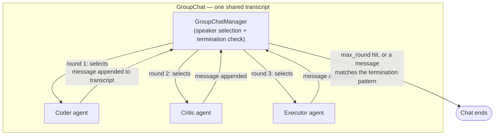

## AutoGen

> Chapter of [[building-agentic-systems/readme#03 — Agent Frameworks|Agent Frameworks]], part of
> [[building-agentic-systems/readme|Building & Evaluating Agents]].

AutoGen's core bet is the opposite of [[03-langgraph|LangGraph]]'s: instead of an explicit graph of
nodes and edges over typed state, a multi-agent run is a **chat room**. State is one growing list of
messages every agent can read. Coordination isn't "the router sends control to node B" — it's "an
agent reads the transcript so far and decides what to say next, to whom." Everything below is a
consequence of that one framing choice.

## The mental model: a shared transcript, not a state schema

The base primitive is `ConversableAgent` — generates a message, receives one. The smallest useful
instance is two of them talking: an `AssistantAgent` (LLM-backed, proposes answers or code) paired
with a `UserProxyAgent` (executes code in a sandbox, relays to a human, or auto-replies). Assistant
proposes, proxy executes and reports back, repeat until done — the whole conversational loop in
miniature, no shared state object or node graph, just two agents appending to one transcript.

**GroupChat** generalizes the pair to N agents. A **GroupChatManager** sits over the whole
conversation and, each round, decides who speaks next.

Notice what's missing versus a graph framework: no declared edge saying "Coder can only be followed
by Critic." Any agent can, in principle, follow any other. The GroupChatManager is the only thing
standing between that flexibility and total incoherence.

## Turn-taking and termination

The GroupChatManager's job, stated precisely: read the transcript, pick the next speaker, append
that speaker's message once it arrives, decide whether to stop. That's three of the five
[[building-agentic-systems/00-building-single-agent-systems/01-agent-architecture/01-agent-architecture|Agent Architecture]]
components — planning, memory, execution loop — collapsed into one component's responsibility. And
the manager is usually **just another LLM call** with a specific prompt, not special runtime logic —
so it inherits every LLM failure mode (misreading the transcript, picking a speaker whose turn makes
no sense, getting talked into looping by a persuasive agent) instead of being a safe, deterministic
dispatcher.

**Speaker-selection strategies**, in increasing order of flexibility and decreasing order of
predictability:

| Strategy      | How the next speaker is chosen                                                                                                                        | Determinism                      |
| ------------- | ----------------------------------------------------------------------------------------------------------------------------------------------------- | -------------------------------- |
| `round_robin` | Fixed cyclic order over the registered agents                                                                                                         | Fully deterministic              |
| `random`      | Uniform sample over the remaining agents                                                                                                              | Non-deterministic                |
| `manual`      | A human picks at each turn                                                                                                                            | Human-controlled                 |
| `auto`        | The manager itself is an LLM call, prompted with the transcript and each agent's role description, and picks whichever agent seems contextually right | Least predictable, most adaptive |

**Termination conditions** — a GroupChat needs at least one, or it runs until the token bill
notices:

- **`max_round`** — a hard cap on turns. The direct analog of LangGraph's `recursion_limit` or the
  plain execution loop's max-iterations guard.
- **Termination-message match** — an `is_termination_msg` callable inspects each new message; the
  classic convention is checking for a literal `"TERMINATE"` string the assistant is prompted to
  emit once it believes the task is done. This makes termination a **content-based** decision made
  by whichever agent happens to speak, not a structural property of the conversation's shape.
- **`human_input_mode`** on the proxy agent (`ALWAYS` / `TERMINATE` / `NEVER`) — AutoGen's
  human-in-the-loop primitive. It's a per-agent config flag that gates whether a human has to
  approve before the loop is allowed to continue, not a graph-level interrupt tied to a checkpoint
  the way LangGraph's `interrupt()` is. There is no framework-native equivalent of "resume this
  exact suspended state days later from durable storage" — you're responsible for persisting and
  replaying the transcript yourself if that's a requirement.

## Where it shines, and where it struggles

Loosely structured, open-ended collaboration is the sweet spot: a Coder/Critic/Executor trio
iterating on a fix until tests pass, a brainstorm-and-critique loop with no fixed round count,
adversarial red-team/blue-team probing, research passes where the "right" number of back-and-forths
isn't known ahead of time. That's the same role split
[[02-collaboration-models|Collaboration Models]] (Part 01) names as tool isolation and prompt
specialization — except AutoGen hands you the GroupChat container to run that split, instead of
hand-building the dispatch and aggregation logic a
[[09-supervisor-architectures|Supervisor Architectures]] design would otherwise require.

Tightly controlled, deterministic pipelines are the wrong fit — structurally, not as a tuning
problem. If step 3 can only run after steps 1 and 2 both complete, with a specific data shape
between them, `auto` speaker selection is answering a question — "who should talk next?" — the
pipeline never needed to ask. You already know the answer; routing that decision through an LLM call
anyway buys nothing and adds a non-deterministic point of failure exactly where you wanted a
guarantee.

| Dimension                    | AutoGen (conversational)                                                                           | LangGraph (graph-based)                                                                                         |
| ---------------------------- | -------------------------------------------------------------------------------------------------- | --------------------------------------------------------------------------------------------------------------- |
| Control-flow representation  | Shared message transcript + a speaker-selection policy                                             | Explicit nodes, edges, and conditional edges over typed state                                                   |
| Who decides "what next"      | GroupChatManager — often itself an LLM call reading the transcript                                 | A router function you write, inspecting the state object                                                        |
| Ordering guarantees          | Weak with `auto`; strong with `round_robin`                                                        | Strong — routing is code you control and can unit-test                                                          |
| Checkpointing / resume       | No native per-turn checkpointer; persist/replay the transcript yourself                            | Native, per super-step, keyed by `thread_id`                                                                    |
| Best fit                     | Open-ended collaboration, unclear step count, critique loops                                       | Pipelines with real conditional branches or cycles you must reason about precisely                              |
| Failure mode when misapplied | A well-specified pipeline gets "negotiated" turn by turn — slower and harder to test than a router | An open-ended brainstorm gets forced into rigid nodes/edges — awkward to model "keep going until it feels done" |

## Where consensus and communication protocols fit in

A GroupChat with several agents proposing conflicting conclusions runs straight into the aggregation
problem [[06-consensus-mechanisms|Consensus Mechanisms]] (Part 01) formalizes — and AutoGen ships no
voting or quorum layer to solve it. Resolution is either whatever the GroupChatManager's own (LLM)
judgment does when picking the next speaker, or something you build outside the framework using that
chapter's mechanisms directly. The trap worth flagging: a chat that ends because `max_round` was hit
can _look_ like agreement — there's a final message, the chat stopped — when the agents never
actually converged. Nothing distinguishes "we agreed" from "we ran out of turns." The
message-passing substrate underneath — addressing, broadcast vs. direct message, what happens when
one participant fails mid-conversation — is the general problem
[[03-communication-protocols|Communication Protocols]] (Part 01) covers; GroupChat is one
opinionated implementation of it, not a substitute for thinking through those failure modes.

**A naming note worth flagging:** in late 2024 the original AutoGen research team forked into a
separately governed project (`AG2`) over a roadmap disagreement with Microsoft, while Microsoft
continued AutoGen with a rearchitected event-driven core (the 0.4 line). Both trace back to the same
group-chat model described here — verify which project and version a given team actually adopted
before assuming API compatibility with anything above.

## Vocabulary glossary

| Term                  | Definition                                                                                                   |
| --------------------- | ------------------------------------------------------------------------------------------------------------ |
| `ConversableAgent`    | AutoGen's base agent class — generates and receives chat messages                                            |
| `AssistantAgent`      | An LLM-backed role that proposes answers or code into the conversation                                       |
| `UserProxyAgent`      | A role that can execute code, relay to a human, or auto-reply — the human-in-the-loop and execution boundary |
| `GroupChat`           | The shared transcript plus the set of agents participating in it                                             |
| `GroupChatManager`    | Selects the next speaker each round and evaluates whether the chat should terminate                          |
| Speaker selection     | The policy — `round_robin`, `random`, `manual`, or `auto` — deciding which agent speaks next                 |
| Termination condition | The rule (`max_round`, a matched termination message, `human_input_mode`) that ends a `GroupChat`            |
| AG2                   | The community-governed fork of the original AutoGen codebase, maintained separately from Microsoft's line    |
