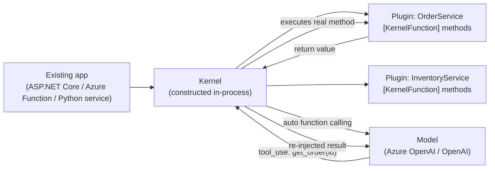

## Semantic Kernel

> Chapter of [[building-agentic-systems/readme#03 — Agent Frameworks|Agent Frameworks]], part of
> [[building-agentic-systems/readme|Building & Evaluating Agents]].

Every other framework in this Part starts from the same premise: you're building a new thing called
an agent, and the framework gives you a runtime to build it in — a graph (LangGraph), a crew
(CrewAI), a group chat (AutoGen). Semantic Kernel starts from a different premise: you already have
a thing, a running ASP.NET Core service, an Azure Function, a Python data pipeline with years of
business logic in it, and you want to add tool-calling and planning to it without rewriting it as an
agent. That difference in starting point is the whole chapter — the primitives (Kernel, Plugin,
Planner) exist specifically to let AI capability plug into code that already has its own
architecture, dependency injection container, and deployment pipeline.

## The three primitives

- **Kernel** — a lightweight orchestrator object, not a heavyweight runtime process. You instantiate
  it inside your existing app — often per-request, registered in the same DI container that already
  wires up your controllers and repositories — and it holds the model connector (Azure OpenAI,
  OpenAI, or a local model), the registered plugins, and optional memory/vector-store connectors.
  There's no separate service to stand up; the Kernel is a class you `new` (or construct in Python)
  inside code you already own.
- **Plugin** — a group of **KernelFunctions**: existing methods annotated with `[KernelFunction]`
  (C#) or `@kernel_function` (Python), each carrying a description and per-parameter annotations. SK
  reads those annotations and generates the JSON Schema tool definition every LLM API expects. The
  business logic doesn't change — a method that already looked up an order or queried inventory
  becomes callable by the model by adding an attribute, not by reimplementing it against a new tool
  base class.
- **Planner / automatic function calling** — the mechanism that decides which plugin function to
  call, and in what order, given a goal. Early SK versions shipped bespoke planners (Sequential,
  Action, Stepwise) with their own DSL for chaining plugin calls. Once every major model provider
  shipped native function calling, SK converged on **automatic function calling**: the Kernel just
  hands the registered plugins to the model as tools and runs the same request → tool call → execute
  → re-inject loop as any other framework. Treat the bespoke-planner era as legacy and automatic
  function calling as current — but verify against SK's current release notes before citing either
  as _the_ planning model in an interview answer; this is an area the SDK has visibly iterated on.

## Mapping onto the tool-calling model

This is not a new mechanism layered on top of
[[agentic-ai-engineering/04-tools-and-environment-interaction/01-tool-calling-architecture/01-tool-calling-architecture|Tool Calling Architecture]]
— it's the same request/response contract, wearing C#/Python ergonomics. A `[KernelFunction]`'s
`[Description]` attributes compile to exactly the `name` + `description` + JSON Schema triple that
chapter describes; the Kernel's chat completion service performs the identical loop — model emits a
structured call, your code executes the real function, the result gets re-injected as context for
the next turn. The mapping is clean for the same reason LangGraph's five-component mapping is clean:
Semantic Kernel isn't inventing a different agent model, it's giving an existing codebase a
convenient surface for the one tool-calling model every provider already implements.

| Tool Calling Architecture concept     | Semantic Kernel equivalent                                                                             |
| ------------------------------------- | ------------------------------------------------------------------------------------------------------ |
| Tool name + description + JSON Schema | `[KernelFunction]` + `[Description]` on an existing method, auto-converted                             |
| Harness executes the real function    | The Kernel invokes the annotated C#/Python method directly, in-process                                 |
| Result re-injection                   | Handled by the Kernel's chat completion service, same as any provider SDK's loop                       |
| Max-iteration / stop condition        | `FunctionChoiceBehavior` / auto-invoke settings capping how many rounds the Kernel will run unattended |

## Why this is the enterprise .NET/C# answer, not a general-purpose one

Three things line up specifically for a shop that already has a .NET estate, and don't generalize as
cleanly to a team starting from zero:

| Factor                        | What it looks like in practice                                                                                                                                                                                                                                                                                  |
| ----------------------------- | --------------------------------------------------------------------------------------------------------------------------------------------------------------------------------------------------------------------------------------------------------------------------------------------------------------- | ---------------------------------------------------------------------------------------------------------------------------------------------------------------------------------------------------------------------- |
| **Zero new object model**     | A plugin _is_ a C# class with attributes on its methods — not a new `BaseTool` interface, not a new object hierarchy to learn. Teams that already write ASP.NET Core services recognize the shape immediately.                                                                                                  |
| **DI-native adoption**        | The Kernel registers into `IServiceCollection` like everything else in an ASP.NET Core app. Adding agentic behavior is a package reference and a registration, not a new deployable service with its own lifecycle.                                                                                             |
| **Governance alignment**      | Ships from Microsoft, integrates with Azure OpenAI, Azure AI Search, and Entra ID auth patterns most enterprise .NET shops already have security review sign-off on. This is the single-vendor governance tradeoff [[building-agentic-systems/03-agent-frameworks/01-evaluation-criteria/01-evaluation-criteria | Evaluation Criteria]] flags directly — you give up the multi-maintainer, public-RFC governance model of something like LangGraph, and get in exchange a procurement and compliance story that's often already cleared. |
| **Incremental, not big-bang** | You wrap two or three existing methods as a plugin and get a tool-calling endpoint inside an app that already runs. Contrast with a greenfield framework, which effectively asks you to model the whole workflow as a graph or crew before you ship anything.                                                   |

The tradeoff side of that ledger, stated plainly: automatic function calling and OpenAPI-plugin
import cover the common cases well, but Semantic Kernel's answer to genuinely novel orchestration
shapes — deep cyclic replanning, multi-agent negotiation — is thinner than a framework built
agent-first for exactly that problem. If your workload's control flow is the hard part, evaluate SK
against LangGraph's graph model or AutoGen's conversational model on that axis specifically, not on
how well it fits your existing app.

## The plugin-ecosystem parallel

SK's plugin registration problem — how does a team add a callable capability without a platform team
rewriting the Kernel setup — shows up in miniature, at single-app scale, in two concrete mechanisms:

- **OpenAPI import.** Point SK at an existing internal service's `swagger.json` and it generates a
  plugin automatically — every operation becomes a KernelFunction, schema and all, with no
  hand-written annotations. For an enterprise that already documents internal APIs with OpenAPI
  (most do), this is a tool-per-endpoint for free.
- **MCP as a plugin source.** More recent Semantic Kernel releases added the ability to register an
  MCP server as a plugin source directly, so a
  [[agentic-ai-engineering/04-tools-and-environment-interaction/09-model-context-protocol-mcp/09-model-context-protocol-mcp|Model Context Protocol]]
  server's tools show up as KernelFunctions without a bespoke adapter. I'm confident in the
  direction — SK converging toward MCP as an interop layer rather than a competing tool-registration
  format — but not in a specific version number; verify against current SK release notes before
  citing one.

Both are the same registration/capability-declaration problem
[[production-agent-systems/04-ai-platform-engineering/04-plugin-ecosystems/04-plugin-ecosystems|Plugin Ecosystems]]
covers at platform scale — letting a tool be added without a code change to the thing that calls it.
SK solves it once, per application, with an attribute or an OpenAPI pointer. Part 04 of Production
Agent Systems's version of the same problem is what it looks like solved once for an entire
platform, with a manifest format, sandboxed execution, and a registry other teams' agents discover
tools through instead of a single app's Kernel holding the whole list.

## A genuine open question, flagged rather than guessed

Microsoft has signaled a convergence between AutoGen and Semantic Kernel into a unified "Agent
Framework" positioning — Semantic Kernel continuing to own the enterprise plugin/tool layer, AutoGen
contributing multi-agent orchestration patterns, under one product story. That direction is publicly
stated intent as of my knowledge; the concrete API surface, timeline, and how much of what's in this
chapter survives unchanged are not things I'll assert with confidence here. If you're making a
build-vs-adopt call today, treat the plugin-and-planner model above as the stable part and verify
the current product boundary between Semantic Kernel and AutoGen before betting an architecture on
where the line sits.

## Vocabulary glossary

| Term                          | Definition                                                                                                                                                        |
| ----------------------------- | ----------------------------------------------------------------------------------------------------------------------------------------------------------------- |
| Kernel                        | The in-process orchestrator object: holds the model connector, registered plugins, and memory config — constructed inside an existing app, not a separate service |
| Plugin                        | A named group of KernelFunctions exposed to the model as callable tools                                                                                           |
| KernelFunction                | An existing method annotated with `[KernelFunction]`/`@kernel_function`, auto-converted into a JSON Schema tool definition                                        |
| Automatic function calling    | SK's current planning model: hand plugins to the model as tools and run the native tool-calling loop, superseding the earlier bespoke planner DSLs                |
| Stepwise / Sequential planner | Legacy SK planners that chained plugin calls via a framework-specific plan DSL, largely superseded once providers shipped native function calling                 |
| OpenAPI plugin import         | Generating a plugin's KernelFunctions directly from an existing service's OpenAPI spec, with no hand-written annotations                                          |
