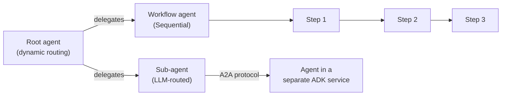

## Google ADK

> Chapter of [[building-agentic-systems/readme#03 — Agent Frameworks|Agent Frameworks]], part of
> [[building-agentic-systems/readme|Building & Evaluating Agents]].

Every framework so far in this Part hands you a control-flow primitive:
[[building-agentic-systems/03-agent-frameworks/03-langgraph/03-langgraph|LangGraph]] gives you a
graph, CrewAI gives you a crew,
[[building-agentic-systems/03-agent-frameworks/06-semantic-kernel/06-semantic-kernel|Semantic Kernel]]
gives you a plugin shim for code you already own. Google's Agent Development Kit gives you all three
composition shapes at once, plus a first-party evaluation harness — and ships from the same
organization that operates the cloud you'd deploy it to. That combination is the whole reason this
chapter matters at the Principal/Staff level: the framework code itself is open source and portable,
but the deploy story is where the vendor coupling actually shows up, and conflating "is ADK
portable" with "is deploying an ADK agent on Vertex AI portable" is the wrong question to walk into
a build-vs-adopt review with. This chapter stays at the composition/deployment altitude; class
names, constructor signatures, and language-specific syntax live in
[[google-adk|the Google ADK reference note]].

## Composition model: two control shapes, meant to be mixed

ADK doesn't force a single orchestration style. It gives you deterministic **workflow agents**
(Sequential, Parallel, Loop — fixed pipeline steps you order in code) and **dynamic routing**, where
a root agent delegates to sub-agents and the model decides the order at runtime. Most real ADK
systems use both: a workflow agent for the parts of a task that are always the same three steps in
the same order, wrapping or wrapped around dynamically-routed sub-agents for the parts that
genuinely need judgment.



The delegation edge to a sub-agent in a **different service** is the detail worth noticing: ADK's
cross-agent communication runs over Google's own **A2A (Agent-to-Agent) protocol**, not just an
in-process function call the way a LangGraph conditional edge routes to another node in the same
graph. That makes multi-agent composition closer to CrewAI's crew-of-agents model conceptually, but
tied to Google's runtime and context-management primitives rather than being framework-agnostic. A
v2.0 addition — graph-based workflows blending deterministic steps and adaptive LLM reasoning into
one execution graph — sits between the two poles above; confident in the direction, not in citing
version-level behavior, so verify against current release notes before asserting exact semantics.

## Native tool-integration story

Tool calls in ADK are the same request → tool call → execute → re-inject loop
[[agentic-ai-engineering/04-tools-and-environment-interaction/01-tool-calling-architecture/01-tool-calling-architecture|Tool Calling Architecture]]
describes for every provider — ADK isn't inventing a new contract, it's adding a distribution
advantage on top of it. Because ADK and Google's own tool surface (Search grounding, a
code-execution sandbox, Vertex AI Search/RAG connectors) are built by the same organization, wiring
one of those in is zero-adapter: no schema translation layer, no wrapper class, because the tool was
designed against the exact interface ADK expects. That is a genuinely different starting point from
a framework wrapping a third party's API and hoping the docs are accurate.

The same integration story extends to MCP: an MCP server's tools register with ADK directly, and
database access in particular gets a first-class **MCP Toolbox** integration rather than a
hand-wrapped REST client.

| Tool source                                                             | Integration effort                               |
| ----------------------------------------------------------------------- | ------------------------------------------------ |
| Google first-party (Search grounding, code execution, Vertex AI Search) | Zero-adapter — built against ADK's own interface |
| MCP server (via MCP Toolbox, or a generic MCP client)                   | First-class import, no bespoke adapter           |
| Arbitrary third-party REST API                                          | Wrap manually, same as any other framework       |

The other differentiator is what ADK does with the assembled context before it reaches the model:
session state, memory, tool outputs, and artifacts get filtered, summarized, and lazy-loaded against
a tracked token budget, instead of concatenated as strings until the window overflows — the same
"every token earns its place" discipline
[[agentic-ai-engineering/06-context-engineering/04-prompt-budgets/04-prompt-budgets|Prompt Budgets]]
covers generically, supplied here as a framework primitive instead of something you build yourself.

## Deployment path: where the coupling actually lives

`adk deploy` targets Vertex AI Agent Engine, Cloud Run, GKE, or any container runtime you already
operate — the composition code above runs anywhere containers run, full stop. What's specific to
Vertex AI is the **managed runtime** underneath the deploy command: session state, a long-term
**Memory Bank** (GA in 2026), and governance controls — tool allow-listing, audit trail, access
policy — bundled as one metered service. See [[vertex-ai|Vertex AI]] for the runtime mechanics and
2026 pricing shape this chapter doesn't repeat.

```
adk deploy ──▶ Vertex AI Agent Engine   (managed: session state, Memory Bank, governance — GCP-only)
          ├──▶ Cloud Run                (portable: your container, your infra choice)
          ├──▶ GKE                      (portable)
          └──▶ any Kubernetes / container runtime   (portable)
```

Delete Agent Engine and you keep 100% of the agent's decision logic — prompts, tool schemas, the
workflow/routing wiring are all just code. What you lose is the production memory and governance
layer wired specifically to that managed runtime: resume-from-checkpoint session state, Memory
Bank's long-term store, and the audit/allow-listing surface an enterprise security review actually
asks about. That split — portable composition code, non-portable managed-runtime state and
governance — is a concrete instance of the lock-in-risk axis
[[building-agentic-systems/03-agent-frameworks/01-evaluation-criteria/01-evaluation-criteria|Evaluation Criteria]]
names generically: the framework import isn't the risk here, the runtime dependency is.

| Dimension                    | ADK + Vertex AI Agent Engine                                      | Framework-agnostic stack (e.g. LangGraph + your own infra)                                                                                                    |
| ---------------------------- | ----------------------------------------------------------------- | ------------------------------------------------------------------------------------------------------------------------------------------------------------- | --------------- |
| Composition code portability | High — open source, multi-language, runs on any container runtime | High — same property, different framework                                                                                                                     |
| Managed runtime              | First-party, metered compute (vCPU/GB-hour)                       | None bundled — you choose Temporal, Step Functions, or hand-roll on [[production-agent-systems/00-production-infrastructure/01-agent-runtime/01-agent-runtime | Agent Runtime]] |
| Session + long-term memory   | Bundled (Memory Bank)                                             | Bring your own store                                                                                                                                          |
| Governance / audit           | Bundled (tool allow-listing, access policy, audit)                | Build or buy separately                                                                                                                                       |
| Cloud target                 | Google Cloud only for the managed path                            | Any cloud, on-prem, wherever you run containers                                                                                                               |
| Language support             | Python, TypeScript/JS, Go, Java, Kotlin                           | Mostly Python-only ecosystem (LangGraph, CrewAI, AutoGen)                                                                                                     |

## When the coupling is worth it

This is the same trade
[[building-agentic-systems/03-agent-frameworks/06-semantic-kernel/06-semantic-kernel|Semantic Kernel]]
makes for an enterprise .NET estate, aimed at a different axis: a team already standardized on
Google Cloud, with security review sign-off already cleared for Vertex AI, gets a governance and
managed-memory story it doesn't have to build, in exchange for the managed runtime being GCP-only.
The multi-language support is the other real differentiator — a Go collector and a Python reasoning
layer talking to each other as ADK agents over A2A isn't something a Python-only framework offers at
all.

It's the wrong fit when the team isn't on GCP, or when the workload's hard problem is genuinely
novel control flow — deep cyclic replanning, adversarial multi-agent negotiation — where a framework
built agent-first for exactly that (LangGraph's graph model, specifically) beats ADK's two
composition primitives stretched to cover it. Evaluate on orchestration-model fit first, per
Evaluation Criteria's own ordering, and let the Vertex AI question follow from that rather than lead
it.

## Vocabulary glossary

| Term              | Definition                                                                                                         |
| ----------------- | ------------------------------------------------------------------------------------------------------------------ |
| Workflow agent    | ADK's deterministic composition primitive — Sequential, Parallel, or Loop pipeline of sub-agents                   |
| Dynamic routing   | LLM-driven delegation between agents; the model decides call order at runtime                                      |
| A2A protocol      | Agent-to-Agent — Google's protocol for cross-agent communication, including agents in separate services            |
| MCP Toolbox       | ADK's first-class database-tool integration path via the Model Context Protocol                                    |
| Context assembler | ADK's token-budgeted context construction — filters, summarizes, and lazy-loads instead of concatenating           |
| Agent Engine      | Vertex AI's managed runtime for deployed agents — session state, Memory Bank, governance controls, metered compute |
| Memory Bank       | Agent Engine's long-term memory store, GA in 2026                                                                  |
