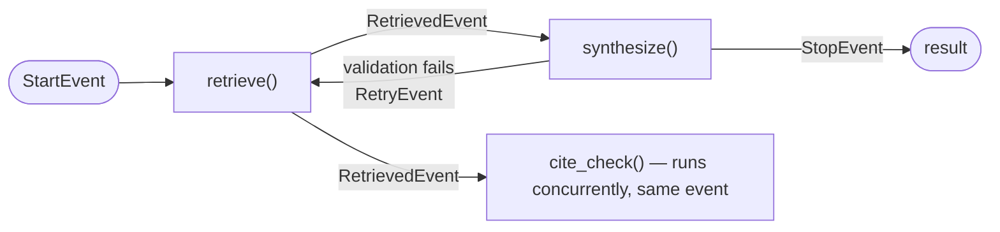

## LlamaIndex Workflows

> Chapter of [[building-agentic-systems/readme#03 — Agent Frameworks|Agent Frameworks]], part of
> [[building-agentic-systems/readme|Building & Evaluating Agents]].

[[03-langgraph|LangGraph]] makes you draw the state machine before anything runs. LlamaIndex
Workflows makes you declare a set of typed events and the steps that react to them, and lets the
control flow — including cycles and fan-out — fall out of that wiring at runtime. There is no
`add_edge` call anywhere in a Workflow. If you've built anything on a message bus or a Kafka
consumer group, this will feel closer to that than to a graph diagram.

## The mechanism: steps subscribe to event types, not to each other

A Workflow is a set of `@step`-decorated functions. Each step declares, via its type signature,
which `Event` subclass it accepts as input and which it emits as output:

```python
class RetrievedEvent(Event):
    nodes: list[NodeWithScore]

class MyWorkflow(Workflow):
    @step
    async def retrieve(self, ctx: Context, ev: StartEvent) -> RetrievedEvent:
        nodes = await retriever.aretrieve(ev.query)
        return RetrievedEvent(nodes=nodes)

    @step
    async def synthesize(self, ctx: Context, ev: RetrievedEvent) -> StopEvent:
        response = await synthesizer.asynthesize(ev.nodes)
        return StopEvent(result=response)
```

Nothing in this code says "`retrieve` runs before `synthesize`." That ordering is a _consequence_ of
`retrieve` emitting a `RetrievedEvent` and `synthesize` being the only step whose signature accepts
one — a runtime dispatcher matches emitted events to subscribed steps and calls whichever step is
listening. `StartEvent` and `StopEvent` are just the two reserved event types that mark entry and
exit. Add a third step that also accepts `RetrievedEvent` and it runs concurrently with
`synthesize`, no explicit fan-out primitive required — concurrency is a byproduct of "more than one
step subscribes to this event type," not a separate feature you opt into.

This is the same underlying execution loop as
[[building-agentic-systems/00-building-single-agent-systems/01-agent-architecture/01-agent-architecture|Agent Architecture]]
— read state, decide the next action, act, write state back, repeat — but the "decide the next
action" step is implicit in the type system instead of an explicit router function on a conditional
edge. A retry loop (synthesis fails validation, re-retrieve with a rewritten query) needs no cyclic
edge either: a step just emits a `RetryEvent` that `retrieve` also happens to accept. The graph a
tool like `draw_all_possible_flows` shows you afterward is _derived_ from these type contracts —
useful for debugging, but never the thing you authored.



## Why this framework specifically leans retrieval-heavy

LlamaIndex didn't start as an agent framework — it started as GPT Index, a data framework for RAG:
document loaders, indices (vector, list, tree, keyword), retrievers, and query engines sitting on
top of them. Workflows arrived later, as the orchestration layer needed once single-shot RAG stopped
being enough — decomposing a query into sub-queries, re-retrieving when the first pass came back
thin, running a citation-check step before returning an answer. That heritage shows up structurally,
not just in the docs' example gallery: LlamaIndex's own higher-level agent abstractions
(`FunctionAgent`, and `AgentWorkflow` for multi-agent handoff) are themselves built as Workflows
internally in current versions — the event-driven model isn't a bolt-on feature sitting next to the
RAG stack, it's the substrate the whole framework's agent layer now runs on, with years of indexing
and retrieval primitives already sitting underneath it. That's why this is the natural home for the
[[agentic-ai-engineering/readme#05 — Retrieval & Knowledge Systems|Retrieval & Knowledge Systems]]
chapters in Part 05 of Agentic AI Engineering — especially
[[agentic-ai-engineering/05-retrieval-and-knowledge-systems/07-agentic-rag/07-agentic-rag|Agentic RAG]],
where "the agent decides when and what to retrieve" is close to a literal description of a retrieve
→ evaluate → re-retrieve Workflow — and
[[agentic-ai-engineering/05-retrieval-and-knowledge-systems/09-multi-stage-retrieval/09-multi-stage-retrieval|Multi-Stage Retrieval]],
where each retrieval stage is naturally one step reacting to the previous stage's event. You _can_
build a general-purpose infra-automation agent in Workflows; you're swimming with the current when
you build a multi-step retrieval agent in it, because every adjacent primitive in the library —
loaders, indices, query engines, rerankers — was designed for exactly that job.

## Workflows vs. LangGraph: two different default questions

Both frameworks answer "how do I orchestrate more than one LLM call with real control flow," but
they lead with a different question, and that difference is more than notation:

| Axis                              | LlamaIndex Workflows                                                                                                                                                            | LangGraph                                                                                               |
| --------------------------------- | ------------------------------------------------------------------------------------------------------------------------------------------------------------------------------- | ------------------------------------------------------------------------------------------------------- | ----------- |
| Default question                  | "What events exist, and who reacts to them?"                                                                                                                                    | "What is the state machine?"                                                                            |
| Core primitive                    | Typed `Event` classes + `@step` functions                                                                                                                                       | Nodes + edges + a typed shared state object                                                             |
| Where control flow lives          | Implicit — derived from which steps' signatures accept which event types                                                                                                        | Explicit — you author every edge, including conditional and cyclic ones                                 |
| Cycles                            | Free — a step just emits an event an earlier step also accepts                                                                                                                  | Free — a conditional edge pointing upstream, same mechanism as any other edge                           |
| Fan-out / concurrency             | Near first-class — multiple steps subscribing to one event type run concurrently by default                                                                                     | Requires explicit parallel-branch wiring in the graph                                                   |
| State model                       | A `Context` object passed to every step; ad hoc key/value plus event payloads                                                                                                   | One versioned typed schema every node reads and writes                                                  |
| Durable checkpoint/resume         | `Context` serialization exists for persisting/resuming a run; a newer, thinner mechanism — verify current guarantees against the docs before treating it as production-hardened | Mature per-super-step checkpointing to SQLite/Postgres/Redis, keyed by `thread_id` — see [[03-langgraph | LangGraph]] |
| Origin story that shapes defaults | RAG framework (indices, query engines) that grew an orchestration layer                                                                                                         | Orchestration framework (LangChain) that grew a graph runtime                                           |

The practical decision rule: if the workload is fundamentally "retrieve, evaluate, maybe retrieve
again, synthesize" — the shape of most production RAG and research agents — Workflows' event model
maps onto that loop with almost no translation cost, and you inherit LlamaIndex's retrieval
primitives for free. If the workload's control flow is the hard part and durable resumability across
process restarts is a hard requirement — a long-running infra-remediation agent that has to survive
a redeploy mid-run — LangGraph's explicit graph and mature checkpointer, the same discipline
[[production-agent-systems/02-reliability-security-and-governance/11-failure-recovery/11-failure-recovery|Failure Recovery]]
argues for in the abstract, is the safer default. Neither ordering is a mistake; they're optimizing
for different failure modes.

## Concept check

| Question                                                                            | Answer hint                                                                                                                                                  |
| ----------------------------------------------------------------------------------- | ------------------------------------------------------------------------------------------------------------------------------------------------------------ |
| What decides which step runs next in a Workflow?                                    | The runtime dispatcher, matching the event type a step just emitted to whichever step(s) declare that event type as their input — not an edge you authored   |
| How does a Workflow implement a retry loop without a cyclic-edge primitive?         | A step emits an event type that an earlier step also happens to accept — cycles are a consequence of shared event types, not a special construct             |
| Why does concurrency come close to "free" in Workflows?                             | If more than one step's signature accepts the same emitted event type, the dispatcher can run them concurrently — no separate fan-out primitive needed       |
| Why is this specific framework the natural fit for agentic RAG?                     | Workflows sits on top of a decade of LlamaIndex's indexing/retrieval primitives, and the framework's own agent classes are now built on Workflows internally |
| What's the one-line difference between Workflows' and LangGraph's default question? | Workflows asks "what events exist and who reacts to them"; LangGraph asks "what is the state machine"                                                        |
| Where does LangGraph still have a clearer production edge?                          | Durable, mature checkpoint/resume across process restarts — Workflows' `Context` serialization is newer and thinner by comparison                            |

## Vocabulary glossary

| Term                   | Definition                                                                                                                                    |
| ---------------------- | --------------------------------------------------------------------------------------------------------------------------------------------- |
| Step                   | An `@step`-decorated function whose type signature declares the `Event` type(s) it consumes and produces                                      |
| Event                  | A typed message class carrying step output; the unit the dispatcher routes on                                                                 |
| StartEvent / StopEvent | The two reserved event types marking a Workflow's entry point and terminal result                                                             |
| Context                | The object passed to every step for shared state, streaming, and (newer) run serialization                                                    |
| Dispatcher             | The runtime component matching emitted events to subscribed steps — the implicit router this framework relies on instead of an authored graph |
