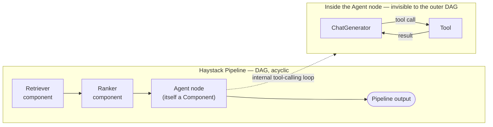

## Haystack Agents

> Chapter of [[building-agentic-systems/readme#03 — Agent Frameworks|Agent Frameworks]], part of
> [[building-agentic-systems/readme|Building & Evaluating Agents]].

Haystack didn't add agents to a general-purpose orchestration framework — it added them to a
document-processing framework that already had retrievers, embedders, rankers, and generators wired
into production search stacks for years before "agent" was the word anyone used. That's why the
question a Haystack shop asks isn't "which agent framework should we adopt," it's "can we get
agentic behavior out of the pipeline we already run in production, without replacing it."

## The pipeline abstraction, extended

Haystack's two primitives haven't changed since before agents existed:

- **Component** — a unit of work with typed input/output sockets: a retriever, an embedder, a
  reranker, a generator, or now, an agent.
- **Pipeline** — a DAG of components wired socket-to-socket. Largely acyclic by construction, the
  same posture
  [[building-agentic-systems/03-agent-frameworks/01-evaluation-criteria/01-evaluation-criteria|Evaluation Criteria]]
  puts Haystack in when it contrasts pipeline/workflow frameworks against LangGraph's graph model.

What earns Haystack a chapter here: its `Agent` primitive is **itself a Component**, with the same
`run()` contract as every retriever or generator in the graph — drop it into an existing pipeline as
one more node, not a separate runtime bolted onto the side:

Everything left of `Agent` in the diagram is the retrieval stack most Haystack teams already have in
production. The agentic behavior is additive — one new node, not a new pipeline.

## Why this is the low-friction path for an existing Haystack shop

The payoff isn't "Haystack's agent abstraction is more elegant than LangGraph's" — it's narrower and
more mundane: **the components your team already tuned and evaluated in production become the
agent's tools with no re-integration work.** A `Tool` is a thin wrapper around any callable — name,
description, a JSON-schema parameter set, a function to invoke. Wrapping an existing retriever
pipeline's `run()` as that callable means the "search the knowledge base" tool is the exact chunking
policy, embedding model, and reranker already validated in production — not a reimplementation
against a new framework's document-store client.

Contrast that with adopting LangGraph or CrewAI for the agentic layer while keeping Haystack for
retrieval: two frameworks now own two halves of one request, each with its own state model and
tracing format, and every retrieval-side change re-exposes across that seam. Haystack's pitch is
there's no seam — one vocabulary, one tracing surface, one serialization format for the whole graph.
This is an **incremental-adoption** argument, not a best-abstraction-in-a-vacuum one — a team
starting from zero, with no existing search infrastructure, gets nothing from it.

## Where the cycle actually lives

[[building-agentic-systems/03-agent-frameworks/01-evaluation-criteria/01-evaluation-criteria|Evaluation Criteria]]
names the failure mode pipeline frameworks run into: a DAG assumes acyclic control flow, and bolting
[[agentic-ai-engineering/03-planning-and-reasoning-algorithms/02-react/02-react|ReAct]]-style
unbounded iteration onto one means hand-rolling a loop _around_ the pipeline, outside its own
primitives. Haystack sidesteps that by internalizing the loop: the tool-calling iteration happens
entirely inside the Agent node's own `run()`. To the outer pipeline it's one synchronous call in,
one out; the cycle is real but scoped to a single component instead of surfacing as a
backward-pointing edge the way it does in
[[building-agentic-systems/03-agent-frameworks/03-langgraph/03-langgraph|LangGraph]]'s `StateGraph`
— a real tradeoff, not a free lunch:

|                                                      | Haystack (loop inside the component)         | LangGraph (loop as a graph edge)                                                                                       |
| ---------------------------------------------------- | -------------------------------------------- | ---------------------------------------------------------------------------------------------------------------------- | ------------------ |
| Outer-graph visibility into iterations               | None — one opaque node                       | Full — each iteration is a traceable super-step                                                                        |
| Cost to add one agentic step to an existing pipeline | Low — drop in one component                  | N/A — the whole graph _is_ the agent runtime                                                                           |
| Mid-loop checkpoint/resume across a process restart  | Not a pipeline primitive — build it yourself | Native — see [[production-agent-systems/02-reliability-security-and-governance/11-failure-recovery/11-failure-recovery | Failure Recovery]] |

## Mapping onto the five-component agent loop

| [[building-agentic-systems/00-building-single-agent-systems/01-agent-architecture/01-agent-architecture | Agent Architecture]] component                                                                                                                                  | Haystack primitive |
| ------------------------------------------------------------------------------------------------------- | --------------------------------------------------------------------------------------------------------------------------------------------------------------- | ------------------ |
| LLM                                                                                                     | The `ChatGenerator` the `Agent` component wraps                                                                                                                 |
| Tools                                                                                                   | `Tool` objects — thin wrappers around any callable, including an existing pipeline's `run()`                                                                    |
| Memory                                                                                                  | Chat message state threaded through the Agent's internal loop; anything durable is still your job — Haystack doesn't ship a checkpointer the way LangGraph does |
| Planning                                                                                                | The tool-calling loop inside the Agent component — ReAct-shaped, not a separate planner abstraction                                                             |
| Execution loop                                                                                          | The Agent component's own `run()`, iterating until its exit condition fires — invisible to the outer pipeline                                                   |

Same five components, same shape as every other framework in this Part — what changes is that the
loop is scoped to _one node_ in a larger, otherwise-acyclic graph instead of _being_ the graph.

## Production search and RAG are the point, not a use case

This isn't a framework for a general-purpose autonomous agent that happens to have a search tool.
Production retrieval is the reason Haystack's component graph exists, and every design choice in the
Agent primitive assumes you're layering agentic behavior on top of a
[[01-retrieval-augmented-generation-rag|RAG]] pipeline already doing real retrieval — indexing,
chunking, embedding, generation. Where a single dense-vector lookup isn't enough — candidate
generation, a filter pass, then heavier reranking — that's the coarse-to-fine shape
[[09-multi-stage-retrieval|Multi-Stage Retrieval]] describes, and the kind of pipeline a Haystack
`Agent` node's tools wrap directly, stage by stage, rather than reimplement.

## When this fit breaks down

- **No existing Haystack investment.** The pitch is "reuse what you've already tuned" — a greenfield
  project inherits the vocabulary for no reason; LangGraph or a plain hand-rolled loop are less
  encumbered starting points.
- **Control flow that's cyclic above the single-tool-loop level.** Looping back across multiple
  _pipeline_ stages, not just tool calls inside one agent step, fights the outer DAG.
- **Durable, crash-surviving checkpoints mid-run.** The loop lives in process memory for one
  `run()`; surviving a restart, or pausing for a human for hours, needs the checkpoint discipline
  [[production-agent-systems/02-reliability-security-and-governance/11-failure-recovery/11-failure-recovery|Failure Recovery]]
  describes — native to LangGraph's checkpointer, not Haystack's pipeline model.

## Vocabulary glossary

| Term              | Definition                                                                                                                |
| ----------------- | ------------------------------------------------------------------------------------------------------------------------- |
| Component         | Haystack's unit of work — typed input/output sockets, a `run()` method                                                    |
| Pipeline          | A DAG of components wired socket-to-socket; largely acyclic by construction                                               |
| Agent (component) | A Component that internally runs a tool-calling loop against a `ChatGenerator`, exposed to the outer pipeline as one node |
| Tool              | A wrapper around any callable — name, description, parameter schema — that an Agent's `ChatGenerator` can invoke          |
| Exit condition    | The rule that stops the Agent's internal loop and returns control to the outer pipeline                                   |
