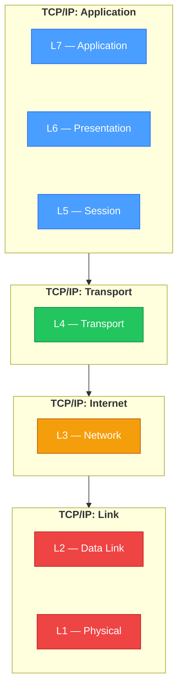

> **Appears in:** [[03-2-protocol-inventory|Protocol Inventory]] §General reference (the "L7
> gateway" terminology used there refers to this model, not the pipeline's own Layer 1/2/3
> architecture labels).

The OSI model is a 7-layer reference for what happens to data as it moves across a network. Most of
it is trivia; two layers — L4 and L7 — are the ones that actually show up as load-bearing vocabulary
in system design interviews.

---

## The seven layers

| Layer | Name         | What it deals with                                            | Example protocols                                                              |
| ----- | ------------ | ------------------------------------------------------------- | ------------------------------------------------------------------------------ |
| L7    | Application  | The actual message/request semantics an app cares about       | HTTP, gRPC, DNS, SMTP, MQTT, SIP                                               |
| L6    | Presentation | Data format/encoding — encryption, compression, serialization | TLS (often drawn here), JSON/protobuf encoding                                 |
| L5    | Session      | Session establishment, checkpointing, recovery                | Mostly folded into L7 in practice — the TCP/IP model doesn't separate this out |
| L4    | Transport    | End-to-end delivery, ports, reliability                       | TCP, UDP, QUIC (transport part)                                                |
| L3    | Network      | Routing between networks, addressing                          | IP, ICMP                                                                       |
| L2    | Data Link    | Node-to-node framing on the same physical segment             | Ethernet, Wi-Fi (802.11), ARP                                                  |
| L1    | Physical     | Bits on the wire/air                                          | Cabling, radio signaling, voltage levels                                       |

L1–L3 is "how do bytes get from one machine to another." L4 is "how do we make that delivery
reliable and multiplex by port." L7 is "what do these bytes actually mean" — every protocol in
[[03-2-protocol-inventory|Protocol Inventory]] lives at L7.

## OSI (7 layers) vs. TCP/IP model (4 layers)

The 7-layer OSI model is the textbook reference; real-world networking stacks (and most engineers'
mental model) collapse it to four layers:

Same-color nodes are the ones that collapse into each other: OSI's Application/Presentation/Session
(blue) all fold into TCP/IP's single Application layer; Data Link/Physical (red) fold into Link. No
connecting lines between the two stacks — color is the mapping, so each model still reads as its own
clean, complete stack instead of getting fragmented across the other model's boxes.

This is why L5 (Session) rarely comes up on its own in interviews — in the model most systems
actually implement, it doesn't exist as a distinct layer.

## Why L4 vs. L7 is the distinction that matters

An **L4 load balancer** (e.g. AWS NLB, a raw TCP/UDP proxy) forwards packets based on IP + port
only. It never looks inside the payload — can't parse HTTP headers, can't route by path, can't
terminate TLS. It's fast and protocol-agnostic, but blind.

An **L7 load balancer / gateway** ([[envoy|Envoy]], NGINX, AWS ALB, the ingestion gateway in the
main design) terminates the connection and actually parses the protocol — which means it can route
by path or header, retry a failed request, terminate TLS, or reject a malformed payload before it
reaches a backend. The cost is that it has to understand the protocol it's terminating.

That's the exact fault line behind the "Can be terminated?" column in
[[03-2-protocol-inventory#General reference: what an L7 gateway can terminate|Protocol Inventory]]:
HTTP/gRPC/WebSocket share one L7 implementation (any modern proxy speaks all three), but
Kafka/Postgres/MongoDB wire protocols each need a _protocol-specific_ L7 proxy — a generic gateway
can accept the TCP connection (L4) but can't make sense of the payload (L7) without purpose-built
support.

## The terminology collision to watch for

The main pipeline design uses **"Layer 1 — Ingestion Frontier," "Layer 2 — Durable Buffer," "Layer 3
— Processing/Enrichment"** as its own architecture labels. That numbering is specific to this
pipeline's diagram — it has nothing to do with OSI. When the design says "protocol termination
happens at Layer 1," it means the ingestion frontier component, not the OSI physical layer. When
[[03-2-protocol-inventory|Protocol Inventory]] says "L7 gateway," it means the OSI application
layer. Same word, two unrelated numbering schemes — worth saying out loud if it ever comes up in an
interview, because conflating them is an easy way to look confused about a term you actually
understand.

---

## Related

- [[03-2-protocol-inventory|Protocol Inventory]] — the "Can be terminated?" table this note explains
- [[05-01-telemetry-ingestion-pipeline|Telemetry Ingestion Pipeline (full design)]] — uses its own
  unrelated Layer 1/2/3 architecture numbering
- [[02-tls-offload|TLS Offload]] — TLS termination, often drawn at L6 but implemented at the L7
  gateway in practice
