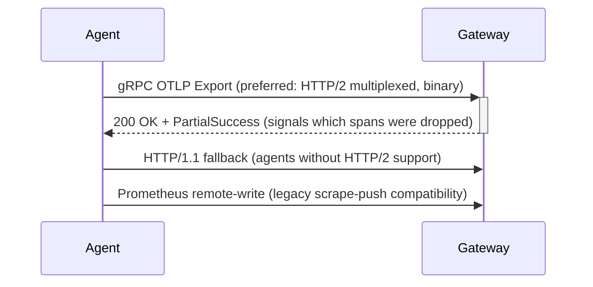

> **Appears in:** > [[05-01-telemetry-ingestion-pipeline|Telemetry Ingestion Pipeline]] §3.1
> (ingestion frontier — protocol termination and negotiation).

The ingestion gateway has to terminate whichever protocol an agent speaks. Understanding why the
design prefers HTTP/2 (and therefore gRPC/OTLP) over HTTP/1.1 comes down to what happens at the
connection level when 100K+ agents are all talking to the same gateway fleet.

---

## The core difference: one connection vs. many

```
HTTP/1.1                              HTTP/2
─────────────────────────             ─────────────────────────
Agent ──conn 1──▶ req 1               Agent ──single conn──▶ stream 1 (req A)
Agent ──conn 2──▶ req 2                                  ├──▶ stream 2 (req B)
Agent ──conn 3──▶ req 3                                  └──▶ stream 3 (req C)
(or: conn 1 serialized: req1, req2, req3)
```

HTTP/1.1 handles one request per connection at a time (pipelining exists in the spec but is
essentially unused in practice due to head-of-line blocking and broken proxy support). To send
requests concurrently, a client opens multiple TCP connections — browsers famously cap this at 6 per
host. HTTP/2 introduces **streams**: many logical requests multiplexed over a single TCP connection,
each independently framed and interleaved.

## Why this matters at the gateway

| Concern                        | HTTP/1.1                                                                                 | HTTP/2                                                                                                |
| ------------------------------ | ---------------------------------------------------------------------------------------- | ----------------------------------------------------------------------------------------------------- |
| Connections per agent          | Multiple, to get concurrency                                                             | One, reused for all concurrent requests                                                               |
| Connection establishment cost  | Paid repeatedly (TCP + TLS handshake per connection)                                     | Paid once, amortized over the agent's lifetime                                                        |
| Gateway fleet connection count | N agents × M connections each                                                            | N agents × 1 connection each — far lower fan-in pressure                                              |
| Head-of-line blocking          | At the connection level (one slow request blocks the queue behind it on that connection) | Solved at the HTTP layer (streams are independent) — though still present at the underlying TCP layer |
| Header overhead                | Plaintext headers repeated on every request                                              | HPACK compression — headers sent as a diff against previous ones                                      |

At 100K–10M agents, connection count is the resource that actually runs out first — file
descriptors, ephemeral ports, load balancer connection tables. HTTP/2's one-connection-many-streams
model is why gRPC (built on HTTP/2) scales to that fan-in without the gateway fleet drowning in idle
TCP connections.

## Binary framing

HTTP/1.1 is a text protocol — request lines and headers are ASCII, parsed by scanning for
delimiters. HTTP/2 frames everything in a compact binary format. This is faster to parse and,
combined with HPACK header compression, meaningfully reduces the bytes-on-wire for high-frequency,
small-payload traffic — exactly the shape of telemetry export calls (frequent, small-to-medium
batches, mostly repeated headers like tenant ID and content-type).

## Where this shows up in the ingestion design



The gateway has to support the HTTP/1.1 fallback path regardless — not every agent, proxy, or legacy
exporter in a brownfield environment supports HTTP/2 (some corporate proxies and older load
balancers strip or mishandle it). But the design explicitly treats HTTP/1.1 as a **compatibility
shim, not the primary path**: OTLP over gRPC (HTTP/2) is the default for anything new, and the main
design's
[§5 protocol trade-off](../../../system-design/08-observability/05-telemetry-ingestion-pipeline/05-01-telemetry-ingestion-pipeline.md#otlp-grpc-vs-prometheus-remote-write)
is explicit that you should "never negotiate down to HTTP/1.1 + JSON for high-volume paths — the
serialization overhead is prohibitive."

## The one caveat worth naming in an interview

HTTP/2 solves head-of-line blocking _at the application layer_ — independent streams on the same
connection don't block each other logically. But the streams still share one underlying TCP
connection, and TCP itself delivers bytes in order: a single lost packet stalls _all_ streams on
that connection until it's retransmitted (TCP-level HOL blocking). HTTP/3 (over QUIC, UDP-based)
fixes this by giving each stream independent loss recovery — worth a one-line mention if asked "is
HTTP/2 the final answer," but out of scope for most telemetry pipelines today since gRPC-over-QUIC
support is still immature relative to HTTP/2.

---

## Related

- [[05-01-telemetry-ingestion-pipeline|Telemetry Ingestion Pipeline (full design)]] — §3.1 (protocol
  termination), §5 (OTLP gRPC vs. Prometheus remote-write)
- [[02-tls-offload|TLS Offload]] — the other protocol-termination responsibility handled at the same
  layer
- [[02-tail-latency]] — connection-level head-of-line blocking is one of the "network jitter" causes
  listed there
