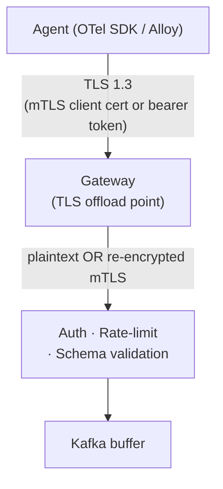

> **Appears in:** > [[05-01-telemetry-ingestion-pipeline|Telemetry Ingestion Pipeline]] §3.1
> (ingestion frontier responsibilities).

TLS offload (also called TLS termination) means the encrypted connection from the client ends at one
specific point in the architecture — the load balancer, gateway, or sidecar — rather than being
decrypted inside every backend process that ultimately handles the request.

---

## Why offload at all

TLS isn't free. Every connection pays for a handshake (asymmetric crypto — expensive) and then
per-record symmetric encryption/decryption for the life of the connection. At the fan-in scale this
pipeline is designed for — 100K to 10M agents — that cost adds up:

```
Without offload:                     With offload:
Agent → TLS → App pod                Agent → TLS → Gateway (offload) → plaintext/mTLS → App pod
        (every pod pays               (offload point pays the handshake cost once
         handshake + cipher cost)      per connection; app pods do zero crypto work)
```

Concentrating TLS termination at the ingestion frontier means:

- **One place to hold certificates and private keys** — not distributed across every replica of
  every backend service. Rotation is a single operational surface, not N surfaces.
- **One place to enforce TLS version/cipher policy** — reject weak ciphers or old TLS versions at
  the edge instead of auditing every service's TLS config independently.
- **CPU offload from application pods** — crypto work is often handled by dedicated,
  hardware-accelerated termination points (cloud load balancers, or a proxy like Envoy compiled with
  AES-NI support), freeing application CPU for actual request processing.

## Where it sits in the ingestion frontier



This is listed as one of the ingestion frontier's core responsibilities in the main design alongside
protocol termination and authentication — all three happen at the same hop because they're all
"figure out who this is and whether to trust them" work that should happen exactly once, as early as
possible, before anything reaches the durable buffer.

## The trade-off: offload vs. defense-in-depth

Terminating TLS at the edge means the hop _after_ the gateway can be plaintext — which is fine
inside a tightly controlled network segment, but is a real security regression in a multi-tenant or
compliance-sensitive environment where "assume the internal network is hostile" is the operating
model (zero-trust).

| Model                        | What travels internally                               | When it's the right call                                                                              |
| ---------------------------- | ----------------------------------------------------- | ----------------------------------------------------------------------------------------------------- |
| Terminate, forward plaintext | Unencrypted, inside the trust boundary                | Single-tenant, tightly network-isolated (e.g. one VPC, no compliance mandate for internal encryption) |
| Terminate, re-encrypt (mTLS) | Re-encrypted between gateway and every downstream hop | Multi-tenant SaaS, regulated data, zero-trust network posture — the norm in a service mesh            |

Re-encryption is exactly what a service mesh sidecar does: the mesh's Envoy proxies terminate the
inbound mTLS connection, and the app talks to its own sidecar in plaintext over `localhost` — but
the sidecar re-establishes mTLS for the _outbound_ hop to the next service's sidecar. See [[envoy]]
for how this sidecar pattern works end-to-end. At the multi-tenant scale this pipeline targets,
re-encryption to at least the auth/rate-limit layer (not full plaintext) is the safer default.

## Passthrough as the third option

There's a third mode worth naming: **TLS passthrough**, where the load balancer routes based on SNI
(the hostname in the TLS ClientHello, sent unencrypted) without ever decrypting the payload — the
actual termination happens further downstream. This trades away the LB's ability to do L7 routing
(path-based, header-based) since it can't see inside the encrypted payload, but keeps end-to-end
encryption intact all the way to the real termination point. Relevant when the compliance
requirement is "no intermediate hop may ever see plaintext," even the load balancer.

---

## Related

- [[02-http1-vs-http2|HTTP/2 vs HTTP/1.1]] — the other protocol-termination responsibility at the
  same Layer 1 hop
- [[05-01-telemetry-ingestion-pipeline|Telemetry Ingestion Pipeline (full design)]] — §3.1
  (ingestion frontier), §3.6 (multi-tenancy isolation layers)
- [[envoy]] — the sidecar proxy that implements mTLS re-encryption in a service mesh
