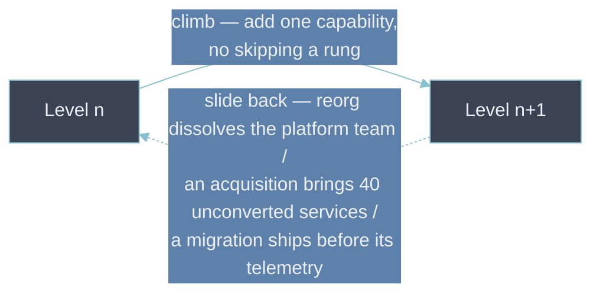

# 4 — Observability Maturity Model

- "Maturity" here isn't a badge — it's a description of which question an organization is actually
  equipped to ask.
- [[01-what-observability-means|What Observability Actually Means]] draws the line between
  monitoring known unknowns and observability covering unknown unknowns.
- The levels below trace how an organization moves from neither to both, and then past both into
  treating observability as a governance discipline rather than a platform feature.

---

## The six levels

- Each rung is defined by the question it lets you answer _routinely_ — not by which tools are
  installed.

```mermaid
%%{init: {'theme':'base','themeVariables':{'primaryColor':'#3b4252','primaryTextColor':'#eceff4','primaryBorderColor':'#88c0d0','lineColor':'#88c0d0','secondaryColor':'#5e81ac','tertiaryColor':'#2e3440'}}}%%
flowchart LR
    L0["L0 — Reactive\nwhat just happened?"] --> L1["L1 — Monitoring\ncan we see it?"]
    L1 --> L2["L2 — Observability\nwhy did it fail?"]
    L2 --> L3["L3 — Standardized\nhow does this service\ncompare to that one?"]
    L3 --> L4["L4 — Policy\nis it allowed into\nproduction?"]
    L4 --> L5["L5 — Governance\nwhat should we\nfund or stop next?"]

    style L0 fill:#bf616a,stroke:#88c0d0,color:#eceff4
    style L1 fill:#bf616a,stroke:#88c0d0,color:#eceff4
    style L2 fill:#5e81ac,stroke:#88c0d0,color:#eceff4
    style L3 fill:#5e81ac,stroke:#88c0d0,color:#eceff4
    style L4 fill:#3b4252,stroke:#88c0d0,color:#eceff4
    style L5 fill:#3b4252,stroke:#88c0d0,color:#eceff4
```

| Level                | What now exists                                                                                                                           | Question it answers routinely                | Trigger to climb                                           |
| -------------------- | ----------------------------------------------------------------------------------------------------------------------------------------- | -------------------------------------------- | ---------------------------------------------------------- |
| **L0 Reactive**      | Nothing deliberate — logs if you're lucky, guesswork if not                                                                               | "Is it down?" — once a user tells you        | The first incident bad enough to get budget                |
| **L1 Monitoring**    | Metrics, dashboards, alerts, for what someone remembered to add                                                                           | "Has a threshold been crossed?"              | A major incident where the dashboards stayed green         |
| **L2 Observability** | Metrics, logs, traces together, correlated by shared IDs — [[02-the-signals]], [[03-cross-signal-correlation]]                            | "Why did this specific request fail?"        | Two teams' telemetry can't be joined mid-incident          |
| **L3 Standardized**  | Shared semantic conventions, label schema, metadata, SLO practice — [[06-semantic-conventions]], [[05-label-schema-design]]               | "How does this service compare to that one?" | A standards violation reaches production and bites         |
| **L4 Policy**        | The standard is a stated, tiered requirement, enforced automatically and measured — [[08-observability-as-policy]], [[09-policy-as-code]] | "Is this workload allowed into production?"  | Telemetry cost or an SLO miss becomes a board-level number |
| **L5 Governance**    | Policy + error budgets + cost governance as one planning loop — [[03-observability-error-budgets]], [[07-finops-for-observability]]       | "What should we fund or stop next?"          | —                                                          |

---

## Reading the ladder: the five transitions

- The levels matter less than the moves between them.
- Each transition adds one capability and exposes the limit that motivates the next.

| Transition                       | The move                                                                                                                                                                                                                                        | The limit it then hits                                                                                                                                                |
| -------------------------------- | ----------------------------------------------------------------------------------------------------------------------------------------------------------------------------------------------------------------------------------------------- | --------------------------------------------------------------------------------------------------------------------------------------------------------------------- |
| **L0 → L1** — make it visible    | "Investigate every incident from scratch" → "something is watching." Almost always triggered by pain, not planning.                                                                                                                             | Alerts fire on internal causes (CPU, disk, queue depth), not user-visible symptoms ([[01-alerting-and-routing]]) — pages are often noise and "why" is still guesswork |
| **L1 → L2** — add the "why"      | Metrics answer "how much" but carry no per-request identity. Logs and traces, tied by a shared `trace_id`, turn an unknown unknown from opaque into debuggable.                                                                                 | Every team instruments differently — telemetry can't be compared or rolled up across services                                                                         |
| **L2 → L3** — make it comparable | Common instrumentation, attribute names, resource metadata, and SLO practice replace each team's private conventions. `http.server.request.duration` means the same everywhere.                                                                 | The standard is followed by convention — new services drift and nothing stops a regression from shipping                                                              |
| **L3 → L4** — make it required   | The standard becomes a tiered, stated requirement, enforced in the deployment path and measured with a compliance score. Coverage is guaranteed rather than hoped for.                                                                          | The platform is still reacting — it learns of runaway spend or an eroding error budget after the fact                                                                 |
| **L4 → L5** — close the loop     | Policy, continuous compliance, error budgets, and cost governance feed one reliability-and-spend signal into planning: a burn freezes risky work, a per-team budget shapes what's collected, the estate becomes an input to business decisions. | The remaining hard problems are organizational, not technical                                                                                                         |

---

## You climb one rung at a time

- **You can't skip.** A Level-4 policy document on a Level-1 platform is theatre: it references
  SLOs, traces, and ownership metadata that don't exist yet, so the "gate" either passes everything
  or blocks everything. Standardization (L3) is the precondition for policy (L4) because a policy
  can only require what there is a shared vocabulary to describe.
- **You can slide back down.** A reorg that dissolves the platform team, an acquisition that brings
  40 services with their own conventions, a migration that ships before its telemetry — each drops
  the effective level even if the wiki still says L4. Maturity is a property of current practice,
  not a historical high-water mark.
- **An organization is not "at" one level.** A payments team can operate at L4 while an
  internal-tools team sits at L1, in the same company, on the same platform. The model grades a
  capability for a given scope — a service, a team, a domain. "What level are we at" is the wrong
  question; "what level is this workload at, and what's the next rung" is the useful one.

---

## Maturity is organizational before it is technical

- The first two rungs can be bought — stand up a metrics stack, wire dashboards, add alerts.
- Everything from L3 up is an agreement rather than a purchase: shared conventions only hold if
  teams adopt them, which needs a platform team that owns the paved road
  ([[01-building-a-platform-team]]) and a real adoption effort ([[02-driving-adoption]]), not a
  mandate email.
- Organizations that try to spend past L2 — buying a more expensive platform and expecting it to
  deliver standardization — stall, because the missing ingredient was never a tool.
- This is the observability-specific view of a more general pattern:
  - The [[maturity-model|Platform & Cloud Maturity Model]] (Ad Hoc → Optimized) grades a whole
    platform the same way.
  - [[08-case-study-reactive-resilient-autonomous|Reactive → Resilient → Autonomous]] walks one
    composite organization up the rungs act by act — showing why the disciplined middle (L3) is what
    actually earns the reliability the top of the ladder promises.

---

## Locating yourself honestly

Four probes place a platform faster than any tool inventory:

- **Can two teams' telemetry be joined during a shared incident** without someone hand-translating
  label names? Below L3, no.
- **Is there a check that blocks a release for missing instrumentation**, or is the gap found in the
  post-mortem? A real pre-deployment gate is L4; a review checklist someone can skip under deadline
  is L3 trying.
- **Is there one number for "how observable is the estate"** — a compliance score across services —
  or only per-service anecdote? A measured score is L4.
- **Does an SLO breach change what a team is allowed to ship next sprint?** If error budget is an
  input to planning, that's L5; if it's a dashboard nobody acts on, it isn't.

- The common self-assessment error is grading by tools owned rather than questions answerable.
- "We have Grafana, Tempo, and an OTel Collector" is a shopping list, not a level — a platform with
  all three where every team names the same attribute differently is at L2, not L3.

---

## Bad → better: declaring a level from a document

- **Bad.** A platform team writes an observability policy, tiers services on paper, and reports the
  organization as "Level 4" in a quarterly review.
- **Why it's bad.**
  - Nothing enforces the policy and nothing measures adherence, so the services that most need it —
    the legacy ones with no owner and no SLO — are exactly the ones still non-compliant.
  - The label creates a sense of coverage that lasts until the next incident in one of them.
- **Better.**
  - Measure the estate against the policy first ([[08-observability-as-policy]]'s compliance score).
  - Publish the number even when it's embarrassing.
  - Wire the checks into the deployment path for new services ([[09-policy-as-code]]).
  - Report the _trajectory_ of the score. The level is an output of the measurement, not a claim you
    get to make.

---

## Why this matters for an Observability Architect

- The levels are a diagnostic, not a slide to present.
- Asking "which of these six questions can we answer today, for this workload" locates a platform
  far more precisely than "do we have Grafana".
- The gap between the level a platform _operates_ at and the level its documents _claim_ is exactly
  the roadmap — usually one rung, occasionally two, and almost always more about standards and
  ownership than about the next tool.

## Metadata

| Dimension | Detail        |
| --------- | ------------- |
| Author    | Amit Singh    |
| Scope     | observability |
