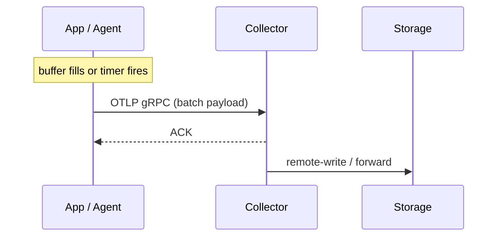
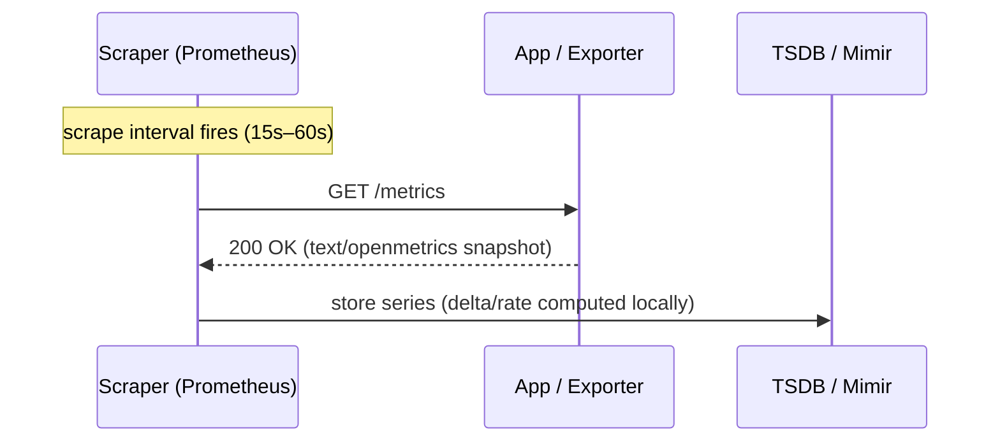
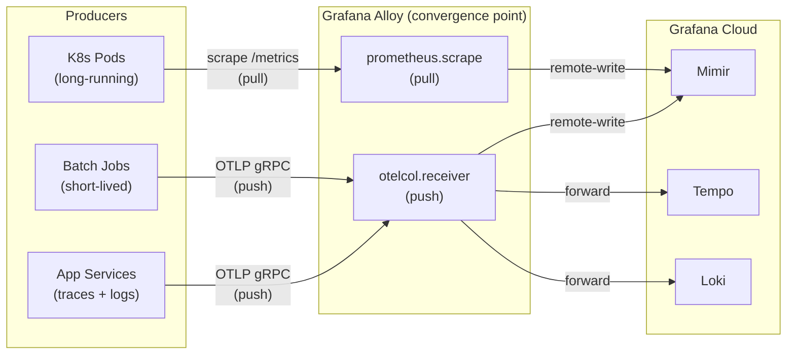

# 3 — Push-Based vs Pull-Based Ingestion

> **Interview level:** Principal / Staff Engineer (L6/L7 bar) **Appears in:** Telemetry pipeline
> design, stream processing, event-driven architectures, service mesh instrumentation, metrics
> collection.

---

## The Core Distinction

|                                            | Push                                              | Pull                                               |
| ------------------------------------------ | ------------------------------------------------- | -------------------------------------------------- |
| **Who initiates?**                         | Producer sends data to the collector              | Collector scrapes data from the producer           |
| **Data flow direction**                    | Producer → Collector                              | Collector → Producer                               |
| **Canonical example**                      | OTel SDK emitting spans to a collector            | Prometheus scraping `/metrics`                     |
| **Latency profile**                        | Low — producer decides when to flush              | Bounded by scrape interval                         |
| **[[04-1-fan-out-fan-in\|Fan-out model]]** | Producer is oblivious to how many consumers exist | Collector is oblivious to how many producers exist |

---

## Push-Based Ingestion

The producer owns the emission schedule. When an event happens, or a buffer fills, or a timer fires,
the producer initiates a connection and ships data.

### How it works

1. Producer accumulates data (spans, log records, metric points) in a local buffer.
2. A flush trigger fires — either a size threshold, a time interval, or an explicit export call.
3. Producer opens a connection (or reuses a persistent one) and streams the payload.
4. Collector acknowledges receipt; producer clears the buffer.

### Canonical protocols

- **OTLP** (gRPC or HTTP/JSON) — OTel SDK to collector
- **Prometheus remote-write** — Prometheus pushing to Mimir/Thanos
- **Fluent Forward** — Fluent Bit/Fluentd log forwarding
- **StatsD** (UDP) — fire-and-forget metric emission
- **Kafka producer API** — application events to a broker

### Strengths

- **Real-time awareness.** The producer knows the moment an event occurs. Spans and log records are
  emitted as they are generated, not on a fixed scrape cycle.
- **Short-lived workloads.** A batch job that runs for 30 seconds and exits cannot be scraped — it
  is gone before the next scrape interval fires. Push is the only viable model here.
- **Firewall-friendly.** The producer reaches out; the collector does not need network access back
  into the producer's environment. Works well across NAT, VPCs, and airgapped segments.
- **Serverless and ephemeral compute.** Lambda functions, Cloud Run containers, spot instances —
  none of them have stable IPs for a scraper to target.
- **Trace and log signals.** These are event-driven by nature. Waiting for a scrape cycle to deliver
  a trace span breaks causality and inflates tail latency for alerting.

### Weaknesses

- **No centralized discovery.** The collector must accept data from any IP. There is no global view
  of which producers are alive — a producer can silently die and the collector sees nothing.
- **Back-pressure is harder.** If the collector is overloaded, the producer needs retry logic,
  backoff, and local queuing to avoid dropping data. Each SDK or agent must implement this
  independently.
- **[[cardinality|Cardinality]] explosion risk.** Producers decide what labels to attach. Without a
  centralized schema gate, a runaway producer can emit millions of series before anyone notices.
- **Security surface.** The collector must expose an inbound endpoint reachable by all producers.
  TLS + auth (e.g., OTLP Bearer tokens) are non-optional at scale.
- **Duplicate delivery.** At-least-once delivery requires idempotency at the storage layer.
  Exactly-once is expensive — buffer-and-ack patterns add latency.

### Real-world example (ShipSolid / Alloy)

Grafana Alloy in push mode receives OTLP from OTel-instrumented services and forwards to Mimir
(metrics), Loki (logs), and Tempo (traces). The SDK flushes on a 5-second timer or when the batch
reaches 512 spans — whichever comes first. Alloy adds tenant headers and applies relabeling before
the remote write. The producer (SDK) never knows Alloy exists; it just pushes to a configured
endpoint.

---

## Pull-Based Ingestion

The collector owns the emission schedule. It periodically reaches into producers and fetches the
current state.

### How it works

1. Prometheus (or any scraper) maintains a list of targets — static config or service-discovery.
2. At each scrape interval (default 15s–60s), it opens an HTTP connection to `<target>/metrics`.
3. The target exposes its current state as a snapshot in Prometheus text format or OpenMetrics.
4. Prometheus parses the snapshot, computes delta/rate on its side, and stores the series.

### Canonical protocols

- **Prometheus HTTP scrape** — the dominant pull protocol in the CNCF ecosystem
- **SNMP polling** — network device metrics
- **JMX polling** — JVM MBean metrics via JMX exporters
- **Database polling** — SQL queries against `pg_stat_activity`, `information_schema`, etc.
- **Cloud provider APIs** — AWS CloudWatch `GetMetricStatistics`, Azure Monitor REST

### Strengths

- **Operational simplicity for metrics.** The scraper has a complete, authoritative list of what it
  is monitoring. If a target disappears, you know immediately — the scrape fails and an alert fires.
  You cannot miss a producer going dark.
- **Centralized access control.** The scraper holds credentials; producers expose read-only
  endpoints. There is no need to distribute push credentials to every workload.
- **Natural rate limiting.** The scraper controls the ingest rate. A producer cannot overwhelm the
  system by emitting faster than the storage can absorb.
- **Schema enforcement at the scrape layer.** Relabeling rules (Prometheus `metric_relabel_configs`)
  can drop or rewrite labels before they enter storage — a centralized cardinality gate.
- **Debuggability.** You can `curl <target>/metrics` from anywhere and see exactly what the scraper
  sees. No agent config needed.
- **Idempotency by default.** Scraping the same `/metrics` endpoint twice in the same interval is
  safe — it is a read operation. No duplicate-delivery concern.

### Weaknesses

- **Scrape interval is the floor on latency.** A 15-second scrape interval means you are always up
  to 15 seconds behind. For fast-burning SLOs, this matters.
- **Network access required.** The scraper must be able to reach every producer. This breaks across
  NAT boundaries, between VPCs, and in airgapped environments without a push-gateway workaround.
- **Not event-driven.** Pull is a polling model. Logs and traces do not fit — you cannot expose a
  `/traces` endpoint that Prometheus scrapes. Pull is fundamentally a metrics pattern.
- **Short-lived processes.** If a batch job completes between scrape intervals, its metrics are
  never collected. The Prometheus Pushgateway exists to paper over this, but it introduces state
  (metrics accumulate until manually deleted) and is widely considered an anti-pattern for anything
  other than batch jobs.
- **Service discovery at scale.** At 100K+ targets, Kubernetes SD, DNS SD, and Consul SD become
  critical infrastructure. Scrape-interval math (targets × scrape duration × concurrency) must be
  carefully tuned to avoid a scraper bottleneck.
- **Stateful exporters.** Some exporters accumulate state between scrapes (e.g., cumulative
  counters). If the exporter restarts, you get a counter reset that clients must handle with
  `increase()` or `resets()` functions.

---

## When to Use Which

| Scenario                            | Recommendation                         | Reason                                                                       |
| ----------------------------------- | -------------------------------------- | ---------------------------------------------------------------------------- |
| Metrics from long-running services  | **Pull**                               | Operational visibility, liveness detection, schema control                   |
| Traces and spans                    | **Push**                               | Event-driven; causality breaks with polling                                  |
| Log records                         | **Push**                               | Event-driven; volume makes polling impractical                               |
| Serverless / ephemeral compute      | **Push**                               | No stable endpoint to scrape                                                 |
| Batch jobs                          | **Push** (via OTLP) or **Pushgateway** | Job exits before next scrape                                                 |
| Cross-network / NAT / airgapped     | **Push**                               | Scraper cannot reach producers                                               |
| Multi-tenant SaaS                   | **Push**                               | Tenants push to a shared ingestion endpoint; you do not manage their network |
| Network devices (routers, switches) | **Pull** (SNMP)                        | Devices cannot run push agents                                               |
| Cloud provider resource metrics     | **Pull** (Cloud API)                   | Provider exposes a polling API                                               |
| High-cardinality event streams      | **Push** → Kafka                       | Buffer, fan-out, and replay via a broker                                     |

---

## Hybrid Architectures

Real systems almost always use both. The pattern at ShipSolid / most CNCF stacks:

Alloy acts as the **convergence point**: it pulls what it can (Prometheus scrape), accepts push for
everything else, and remote-writes a unified telemetry stream to the Grafana Cloud data plane.

---

## Interview Trade-off Framing

When asked "should this system push or pull?" at L6/L7 bar, the examiner wants to hear:

1. **Signal type first.** Metrics → pull is the default. Events (logs, traces) → push always.
2. **Network topology.** Can the collector reach the producer? If not, push.
3. **Workload lifetime.** Ephemeral → push. Long-running → pull is viable.
4. **Operational model.** Who owns the emission schedule? Pull centralizes control; push distributes
   it. Which matches the team's operational posture?
5. **Scale math.** At 1M targets, scrape intervals and concurrency limits matter. At 10M series
   inbound, back-pressure and queue depth matter.

State a recommendation, name the one trade-off you are accepting, and move on. Do not hedge.

---

## Related Concepts

- [[05-01-telemetry-ingestion-pipeline|Telemetry Ingestion Pipeline]]
- Prometheus remote-write (push over HTTP — hybrid of both models)
- Pushgateway anti-pattern
- OTLP protocol design
- Kafka as a push buffer with pull consumers (the broker decouples the two models)

## Metadata

| Dimension | Detail        |
| --------- | ------------- |
| Author    | Amit Singh    |
| Scope     | observability |
