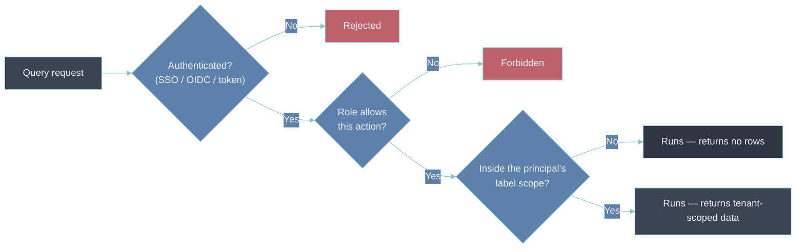

# 1 — RBAC

- A role answers **what can this person do** — create a dashboard, edit an alert rule, invite a
  user.
- It says nothing about **whose data they can see**.
- On a single-team platform the two questions collapse into one.
- On a shared platform they are completely separate. A platform that answers only the first has no
  access control worth the name over the second.

---

## Authentication, authorization, and data scope are three layers

- Three checks sit between a query request and the rows it returns. They fail independently:
  - **Authentication** — establishes identity. SSO / OIDC / an API token maps a request to a
    principal. _Who is this._
  - **Authorization (RBAC)** — maps that principal, through role membership, to permitted
    **actions**: view a folder, edit a rule, manage users, call an admin API. _What may they do._
  - **Data scope** — constrains **which telemetry** a permitted action runs against: which tenants,
    which label selectors, which namespaces. _What may they see._

- A correctly authenticated user with the right role can still be scoped to the wrong tenant's data
  — an isolation failure surfaced through the access layer, which is what [[02-multi-tenancy]]
  covers.
- RBAC with no data-scope layer beneath it is the most common form of that gap.

---

## A role is an action grant, not a data grant

- Grafana's built-in model is the canonical example: **Viewer**, **Editor**, **Admin**, refined by
  folder- and team-level permissions.
- Those tiers decide whether you can _open_ a dashboard, _change_ it, or _administer_ the instance.
  They do not decide which time series the panels return.
- An Editor pointed at a broadly-permissioned data source can query every series in it — the folder
  permission never enters the query path.
- That is why [[05-security-and-compliance]] introduces **label-based access control (LBAC)** as a
  separate layer:
  - the role says "may run queries"
  - the LBAC rule says "…but only where `deployment_environment` matches this team's selector"
- See [[lbac|Label-Based Access Control]] for an enforced implementation — data-source permissions
  as an allowlist, then a per-team label selector evaluated on every query.

Both layers are required, and answer different questions:

| Layer      | Mechanism                       | Controls                                  | Failure if missing                            |
| ---------- | ------------------------------- | ----------------------------------------- | --------------------------------------------- |
| RBAC       | Role + folder/team permissions  | Which _actions_, which dashboards/folders | Anyone edits anything; no admin separation    |
| Data scope | LBAC / tenant filter / selector | Which _series_ a permitted query returns  | Any authorized user reads every tenant's data |

---

## Coarse roles plus data scope beat a sprawl of fine-grained roles

- The instinct when RBAC feels too blunt is to add roles: `payments-dashboard-viewer`,
  `payments-alert-editor`, `payments-oncall-admin`, then the same three for every other team.
- That scales as roles × teams and collapses under its own weight — nobody can answer "who can see
  production?" because the answer is spread across forty role definitions and their membership
  lists.
- The maintainable shape:
  - a _small_ fixed set of roles (viewer / editor / admin, plus one or two if a genuinely new action
    class appears) carrying the **action** dimension
  - a data-scope layer carrying the **precision**
- A payments engineer gets the same `Editor` everyone gets, plus an LBAC selector scoped to the
  payments environments. Onboarding a team adds one selector, not a new role family.
- Same move [[05-label-schema-design]] makes for labels: keep the fixed vocabulary small, push the
  variability into a dimension designed to hold it.
- Trade-off: a small role set makes each role a blunter instrument — an `Editor` can edit _any_
  dashboard in a folder they can see, not only "their" dashboards.
  - Teams that genuinely need per-object write control use folder-level permissions for that case
    specifically, rather than minting object-scoped roles across the board.
  - Add a role for a new **action** class; never to express a new **data** boundary.

---

## Non-human principals are RBAC subjects too

- Most queries against a mature platform come from service accounts, not people — dashboard
  provisioning, Terraform, alerting integrations, CI checks, an autonomous remediation agent.
- Each is a principal with a token and a role, and each earns the same least-privilege treatment:
  - **One token per purpose**, not a shared token behind every automation — so revoking a leaked
    credential doesn't take down six unrelated systems.
  - **Scoped to the minimum role.** A dashboard-provisioning token needs dashboard write, not user
    administration. A read-only export job needs `Viewer`.
  - **Short-lived where the platform allows it**, so a leak has a bounded lifetime.
- [[07-secret-management]] covers where these tokens live and how they rotate — the access-policy vs
  service-account token distinction there is the concrete form of "scope the token to what it does".
- A write token that can also read every tenant's data is over-granted twice: wrong action set,
  wrong scope.

---

## Break-glass is elevated access with a receipt

- Some work legitimately needs broad, cross-tenant reads — a security investigation, a platform-wide
  incident, a data-subject request spanning services.
- The wrong answer is a standing `Admin` role on a few people "just in case": a permanent, unaudited
  hole sized for a rare event.
- The right shape is **break-glass**:
  - a request to elevate
  - time-boxed, so the grant expires on its own
  - emitted as a distinct event a human reviews afterward
- The elevation itself becomes a signal — a spike in break-glass grants is worth a question, and
  [[06-audit-logging]] is where that signal lives.
- Day-to-day work never needs the elevated grant, so the grant sitting unused is the expected state
  — which is what keeps the normal role set honest.

---

## Bad → better: "everyone's an Editor"

- **Bad.** To stop fielding access tickets, every engineer joins one team with `Editor` on a shared
  folder and a data source with no LBAC rules.
- **Why it's bad.**
  - No data boundary at all — every engineer can query every tenant's metrics and logs, regulated
    environments included, with no need-to-know.
  - Nothing in [[06-audit-logging]] can separate legitimate access from a browsing employee, because
    _all_ access is nominally legitimate.
  - The blast radius of one compromised SSO account is the whole estate.
- **Better.**
  - Keep the three-role set.
  - Put every team on the shared `Editor` role, bound to a per-team LBAC selector ([[lbac]]).
  - Reserve `Admin` for the platform team.
  - Route cross-tenant reads through time-boxed break-glass.
  - Access tickets drop anyway — onboarding a team is now one selector in a config file, not a
    bespoke role.

---

## Why this matters for an Observability Architect

- Reviewing an access model means asking the two questions separately:
  - _what actions does this principal have_
  - _what data does a permitted action return_
- A design with an answer only to the first — however well-structured its roles — hands every
  authenticated user the whole dataset the moment they run a query.
- The role sprawl teams reach for to fix that is the symptom of a missing second layer.
- The fix is a small role set plus label-based scope, not a hundredth role.

## Metadata

| Dimension | Detail        |
| --------- | ------------- |
| Author    | Amit Singh    |
| Scope     | observability |
