# 2 — Multi Tenancy

- "Multi-tenant" names two guarantees — [[07-multi-tenancy|isolation and fairness]]. Part 1 covers
  both from the platform-architecture angle.
- This section is the **isolation half only**, and only as a security property: tenant A can never
  read tenant B's telemetry, no matter what A sends, asks for, or exploits.

---

## The tenant ID is a trust boundary

- Every isolation decision downstream keys off one value — the tenant identifier attached to a write
  or a read.
- Where that value comes from decides whether isolation exists at all.

```mermaid
%%{init: {'theme':'base','themeVariables':{'primaryColor':'#3b4252','primaryTextColor':'#eceff4','primaryBorderColor':'#88c0d0','lineColor':'#88c0d0','secondaryColor':'#5e81ac','tertiaryColor':'#2e3440'}}}%%
flowchart TB
    subgraph U["Untrusted — no isolation"]
        UC["Client sets\nX-Scope-OrgID: B"] --> UP["Pipeline trusts\nthe header as-is"] --> UR["Any tenant's\ndata reachable"]
    end
    subgraph T["Enforced — isolation holds"]
        TC["Client presents a\ncredential (token / mTLS)"] --> TG["Gateway authenticates,\nstrips the client header"]
        TG --> TS["Stamps tenant ID\nfrom the credential"] --> TR["Reads and writes\nbound to that tenant"]
    end

    style U fill:#2e3440,stroke:#bf616a,color:#eceff4
    style T fill:#2e3440,stroke:#88c0d0,color:#eceff4
    style UC fill:#3b4252,stroke:#88c0d0,color:#eceff4
    style UP fill:#3b4252,stroke:#88c0d0,color:#eceff4
    style UR fill:#bf616a,stroke:#88c0d0,color:#eceff4
    style TC fill:#3b4252,stroke:#88c0d0,color:#eceff4
    style TG fill:#5e81ac,stroke:#88c0d0,color:#eceff4
    style TS fill:#5e81ac,stroke:#88c0d0,color:#eceff4
    style TR fill:#3b4252,stroke:#88c0d0,color:#eceff4
```

- **Not a boundary:** a tenant ID the client supplies and the platform trusts — a raw
  `X-Scope-OrgID` header accepted as-is. Any caller can set any value.
- **A boundary:** a tenant ID an authenticating gateway derives from the credential (the token's
  bound tenant, the mTLS certificate subject, the SSO identity's org) and stamps _after_ discarding
  whatever the client sent.
- [[07-multi-tenancy]] calls this "stamped as early as possible"; the security framing adds "and
  never from a field the client controls".

---

## Every read carries an enforced tenant filter

- Write-path isolation (data lands in the right tenant's storage) is necessary but not sufficient.
- The read path has to constrain every query to the caller's tenant, and that constraint has to be
  injected _below_ the query API — not supplied by the calling application, which could omit or
  widen it.
- Native multi-tenant backends ([[07-multi-tenancy|Mimir, Loki, Tempo]]) do this at the core: the
  tenant header selects a hard partition and there is no query syntax to cross it.
- The leaks happen in the machinery _around_ the backend, wherever a query runs without going
  through that per-tenant path:

| Surface                        | How the leak happens                                                                               | Control                                                        |
| ------------------------------ | -------------------------------------------------------------------------------------------------- | -------------------------------------------------------------- |
| Global recording / alert rules | A rule group evaluated once across all tenants writes into one tenant or a shared namespace        | Evaluate rules per tenant; no cross-tenant aggregate rule      |
| Shared Alertmanager            | One routing tree sees every tenant's alerts; a mis-scoped receiver leaks alert labels (data) out   | Per-tenant routing config, or tenant as a hard routing key     |
| Dashboard template variables   | A `label_values()` variable with no tenant filter enumerates every tenant's series into a dropdown | Bind the variable to the viewer's LBAC scope                   |
| Platform "overview" dashboards | A `sum by (tenant)` panel on a god-mode data source shows every tenant's volumes to any viewer     | Admin-only folder; it's a platform metric, not a tenant one    |
| Query-result cache             | A cache keyed on the query string but not the tenant serves A's cached result to B                 | Tenant ID in every cache key                                   |
| Backups and exports            | A nightly job bundles all tenants into one archive under one set of access controls                | Per-tenant export scope; encrypt and access-control per tenant |

---

## Logical vs physical isolation is a security decision, not only a cost one

- [[07-multi-tenancy]] frames the choice as a spectrum with a cost axis. The security lens adds a
  second axis — what the guarantee _depends on_:
  - **Logical isolation** — one shared binary, tenants separated by the tenant ID as a partition
    key. The guarantee is only as strong as the partitioning logic is bug-free; a defect there is a
    cross-tenant data leak, not a slow query.
  - **Physical isolation** — dedicated infrastructure per tenant, or per regulated tenant class. The
    guarantee no longer rests on code correctness, because there is no shared process to leak
    across.
- Most platforms run logical isolation as the default and reserve physical isolation for tenants
  whose compliance obligations — data residency, regulated-industry controls, contractual separation
  — make "trust the partition key" an unacceptable single point of failure regardless of test
  coverage.
- That decision belongs in the [[08-observability-as-policy|policy]], not in an engineer's judgment
  at provisioning time.

---

## Isolation is proven by negative tests, not by the absence of incidents

- "We've never seen a cross-tenant leak" is the absence of evidence, not evidence of isolation.
- Isolation is a property asserted with tests that _try_ to break it and fail:
  - Authenticate as tenant A, query tenant B's series by label, assert an empty result or `403` —
    run on **every** read path: query API, Explore, alerting, the export job.
  - Submit a write for tenant A with a spoofed `X-Scope-OrgID: B` header; assert it lands in A's
    storage (the client header was ignored) or is rejected.
  - Render a shared dashboard as a scoped viewer; assert no panel returns another tenant's data.
- These run in CI against a real deployment — the same way [[07-multi-tenancy]]'s fairness
  properties need an actual noisy-neighbour load test rather than an assumption that isolation
  implies fairness.

---

## Why this matters for an Observability Architect

- Reviewing tenancy for isolation means tracing one value — the tenant identifier — from the point
  it is _asserted_ to the point it is _enforced_, and confirming nothing in between trusts a
  client-supplied version of it.
- Then confirm a negative test exists for every read path, not just the primary query API.
- A platform that tested "can tenant A read tenant B via PromQL — no" but never tested the alerting
  path, the template variables, or the nightly export has an isolation gap that stays invisible
  until a real tenant finds it.

## Metadata

| Dimension | Detail        |
| --------- | ------------- |
| Author    | Amit Singh    |
| Scope     | observability |
