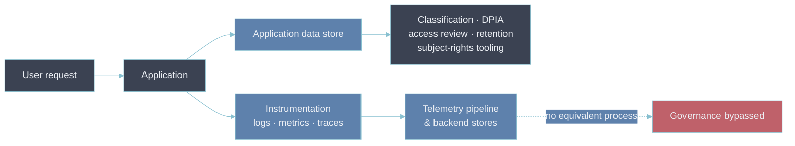

# 3 — Data Privacy

- The application's user table went through a data-classification review before it shipped.
- The log line that copies three of its columns into a debug message did not.
- Telemetry is a second copy of the same personal data, produced by a pipeline no privacy process
  was ever pointed at — which makes it a privacy problem distinct from the one the underlying
  application already has under control.

---

## Telemetry is a shadow copy of personal data

- The application's data path runs through a governance process.
- The telemetry path forks off at instrumentation and inherits none of it:

What counts as personal data in telemetry — even when a team believes it is "anonymized":

- **Direct identifiers** — user IDs, email, account numbers interpolated into a log message or a
  span attribute.
- **Online identifiers** — IP address, device ID, cookie or session ID, `User-Agent` fingerprints.
  Pseudonymous personal data under GDPR-style regimes, not anonymous.
- **Location** — precise geo, or coarse geo that re-identifies once combined with other fields.
- **Behavioral** — a trace that ties a sequence of actions to one session is a profile even with the
  user ID stripped.

The test is not "did we include the name" — it is "can this row, alone or joined with another, be
tied back to a person".

---

## The rights that are hard to honor in telemetry

- Privacy regimes grant data subjects rights that assume a system built to act on them.
- Telemetry stores are built for the opposite — high write throughput, immutable, append-only:

| Right                     | Why telemetry makes it hard                                                            | Practical mitigation                                                               |
| ------------------------- | -------------------------------------------------------------------------------------- | ---------------------------------------------------------------------------------- |
| Erasure                   | No `DELETE FROM prometheus`; TSDB and log stores rewrite at compaction, not per-record | Don't collect the identifier; treat short retention as erasure; tokenize at source |
| Access / portability      | One person's data is scattered across three stores with no person index                | Minimize what's stored; keep a documented map of where identifiers can appear      |
| Rectification             | Immutable by design — a stored log line can't be corrected                             | Moot if retention is short; otherwise a documented reason it doesn't apply         |
| Restriction of processing | No per-record processing flag in a TSDB                                                | Scope at the tenant or stream level, not the record                                |

- The mitigations column says the same thing every time: the cheapest way to honor a right over data
  you didn't need is to not have the data.
- [[04-pii-redaction]] is the mechanism for not having it.
- [[04-retention-policies]] and [[06-log-retention]] are the other half — retention short enough
  that the practical answer to "erase my data" is "it already aged out".

---

## Purpose limitation: collected for one reason, used for another

- Telemetry is gathered under a reliability rationale — debug production, meet an SLO, run an
  incident.
- Re-pointing it at a different goal is a new purpose that may need its own justification and its
  own notice:
  - **Product analytics** off the back of request logs — feature usage, funnels, cohort behavior.
  - **Individual performance measurement** — using deploy logs or commit-linked traces to rank
    engineers.
  - **Security monitoring / UEBA** — legitimate, but usually a different lawful basis and a
    different retention and access model than operational telemetry.
- None of these are automatically wrong. They are decisions that belong in
  [[08-observability-as-policy]] with the purpose written down, not defaults that accrete because
  the data happened to be there.

---

## Data residency and the processor boundary

Two constraints a SaaS observability backend makes concrete:

- **Residency.** If a regulation or a customer contract requires EU personal data to stay in the EU,
  telemetry derived from it inherits that constraint: the metrics, logs, and traces for an EU
  workload land in an EU region, and cross-region query federation doesn't quietly move them.
- **Controller vs processor.** Running the platform makes you the controller. Sending telemetry to a
  vendor makes that vendor a **processor** acting on your instructions — which needs a data
  processing agreement, a defined sub-processor list, and region pinning. See
  [[security-access-compliance|the platform's security & compliance notes]] and
  [[retention-policy|retention policy]] for where those specifics are recorded here.

---

## Trade-off: debuggability vs data minimization

- Every identifier stripped from telemetry is a triage question that gets harder to answer.
- "Which user hit this error" is a fast path; remove the user ID and you trade it for a slower one —
  reproduce from the error shape, correlate by time.
- That trade is usually worth making, because the fast path also makes every log line a standing
  liability.
- The resolution is not "collect nothing". It is:
  - collect the minimum that answers a _real_ operational question
  - put the high-cardinality identifier where it costs less to hold — a trace
    [[03-cross-signal-correlation|exemplar]] or a sampled, short-retention log stream rather than a
    metric label or a long-retention index
- [[04-pii-redaction]] is where that decision gets enforced instead of remembered.

---

## Why this matters for an Observability Architect

- Reviewing a new service's telemetry for privacy means asking the classification question nobody
  asked when the instrumentation was written: what personal data can appear in these logs, spans,
  and labels, and can any of it be tied back to a person.
- Then check the answer against how the store actually works — an immutable, append-only system
  cannot honor an erasure request after the fact, so the design has to make erasure unnecessary by
  not holding the identifier, or not holding it long.

## Metadata

| Dimension | Detail        |
| --------- | ------------- |
| Author    | Amit Singh    |
| Scope     | observability |
