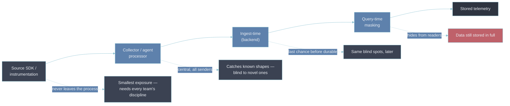

# 4 — PII Redaction

- [[03-data-privacy]] argues for not holding the identifier at all.
- [[05-security-and-compliance]] adds that the pipeline scrubber is a backstop, not the fix.
- This section is that backstop built properly — where it can sit, what each placement actually
  catches, and why "add a regex list to the collector" is the version that fails without telling
  anyone.

---

## Where PII enters telemetry

A scrubber has to be written against concrete shapes, so start from where the data gets in:

- **Free-text log messages** — `logger.debug("processing %s", request)` where `request` stringifies
  to a full body with an email in it.
- **Log and span attributes** — an `authorization` header captured as an attribute, `enduser.id`, a
  `query` attribute holding `?token=…`, a custom attribute recording a request parameter.
- **High-cardinality labels** — a user or session ID promoted to a metric label. The same values
  [[05-label-schema-design]]'s trap list says to keep off metrics, now also a privacy exposure.
- **URLs and query strings** — `GET /users/12345/orders?email=…` captured raw as the request URL.
- **Exception payloads** — stack frames with local variables, an error message interpolating a user
  object.
- **Captured bodies** — an SDK or proxy configured to record request/response bodies for debugging.

---

## The redaction-stage funnel

- Redaction can happen at four points.
- The earlier it happens the smaller the exposure — but the earlier stages depend most on
  discipline:



| Stage                       | What it catches                                                 | What it still misses                                            |
| --------------------------- | --------------------------------------------------------------- | --------------------------------------------------------------- |
| At the source               | Everything, before it transits or lands anywhere                | A field the developer didn't think to handle                    |
| Collector / agent processor | Known-shaped fields and known patterns, for all senders at once | Novel free-text shapes; a value in a field the rules don't name |
| Ingest-time (backend)       | A last chance before the write is durable                       | The same blind spots as the processor, later                    |
| Query-time masking          | Hides values from readers who lack a role                       | Nothing is reduced — full data is still stored and in backups   |

- A mature setup does source-level allowlisting **and** a collector backstop.
- This is [[05-security-and-compliance]]'s point exactly: pipeline scrubbing "catches the mistakes
  discipline missed; it doesn't substitute for not logging PII in the first place."

---

## Techniques, and what each one actually guarantees

| Technique            | Effect                                          | Still useful for                             | Caveat                                                                                                                |
| -------------------- | ----------------------------------------------- | -------------------------------------------- | --------------------------------------------------------------------------------------------------------------------- |
| Drop                 | Field removed entirely                          | Nothing — it's gone                          | Safest; use when the field has no operational value                                                                   |
| Redact / mask        | Replace with `***` or a partial (`****1234`)    | Confirming a value was present; last-4 match | The unmasked value still existed upstream of the mask point                                                           |
| Hash                 | Deterministic digest                            | Joining records by the same identifier       | Reversible for low-entropy inputs — a ten-million-entry user-ID space is brute-forced in seconds; still personal data |
| Tokenize             | Random token; mapping held in a separate vault  | Re-identification by an authorized process   | Needs the vault and its own access model; the token is meaningless without it                                         |
| Allowlist attributes | Keep only named-safe keys; drop everything else | Predictable, low-risk attribute sets         | Requires knowing the safe set up front                                                                                |

**Allowlist over blocklist.**

- A blocklist of patterns is default-allow — it protects against the leaks you already know about
  and passes everything else through.
- An allowlist of attribute keys is default-deny — a new attribute is dropped until someone decides
  it is safe.
- Default-deny is the posture [[01-rbac]] argues for on access, and the same logic applies here.

---

## Config example — the collector backstop

Vendor-neutral OpenTelemetry Collector `redaction` processor doing both jobs at once: default-deny
on attribute keys, then a pattern scan on the values that survive.

```yaml
processors:
  redaction/pii:
    allow_all_keys: false            # any attribute key not listed below is deleted
    allowed_keys:
      - http.request.method
      - http.route
      - http.response.status_code
      - server.address
      - service.name
    blocked_values:                  # values of surviving keys matching these are masked
      - '[\w.+-]+@[\w-]+\.[\w.-]+'    # email address
      - '(?i)bearer\s+[a-z0-9._-]+'   # bearer token
      - '\b(?:\d[ -]?){13,16}\b'      # card-number-shaped digit run
    summary: debug                   # emit a redaction summary attribute for rule auditing

service:
  pipelines:
    traces:
      processors: [redaction/pii, batch]
    logs:
      processors: [redaction/pii, batch]
```

- This covers _attributes_. A free-text log **message body** is not an attribute, so it needs a
  separate `transform` / OTTL step (or source-side handling) — which is precisely why the processor
  can't be the whole answer.
- Grafana **Alloy** is the implementation here: the same processor as an
  `otelcol.processor.redaction` block; see [[11-processors]] and [[09-otel-collector-pipeline]] for
  pipeline placement.
- Validate before shipping — `otelcol validate --config config.yaml`, or `alloy fmt` for the Alloy
  form.

---

## Bad → better: the regex list called "PII-safe"

- **Bad.** A `redaction` processor with a dozen patterns — email, national ID, a few token formats —
  is added to the collector, and the service is signed off as "PII-safe".
- **Why it's bad.**
  - It is default-allow. It catches the shapes on the list and nothing else: a customer's name in a
    free-text sentence, an internal ID format nobody wrote a pattern for, a new attribute a later
    commit introduces.
  - The "PII-safe" label then discourages the source-level discipline that would catch those,
    because the problem looks solved.
- **Better.**
  - Allowlist attribute keys at the source so unknown fields are never emitted.
  - Keep the collector `redaction` processor as a backstop for the free-text body.
  - Run a periodic sampled scan of what actually landed in the backend, so the blind spots surface
    as findings instead of as a breach.

---

## Why this matters for an Observability Architect

- Assume a full object _will_ be logged under incident pressure, by someone debugging at 3 a.m. who
  didn't stop to think about what was in it.
- The review question is not "did we list every sensitive field" — a list is always incomplete.
- It is "is the default deny, and is there a detector for what gets past it".
- A pipeline protected only by a pattern list is protected exactly against the leaks it already knew
  about.

## Metadata

| Dimension | Detail        |
| --------- | ------------- |
| Author    | Amit Singh    |
| Scope     | observability |
